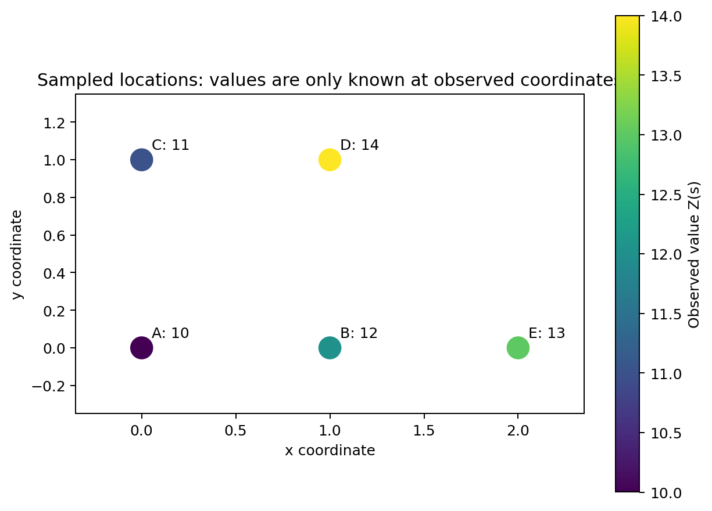
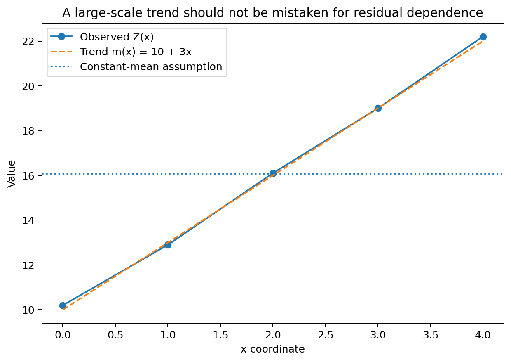
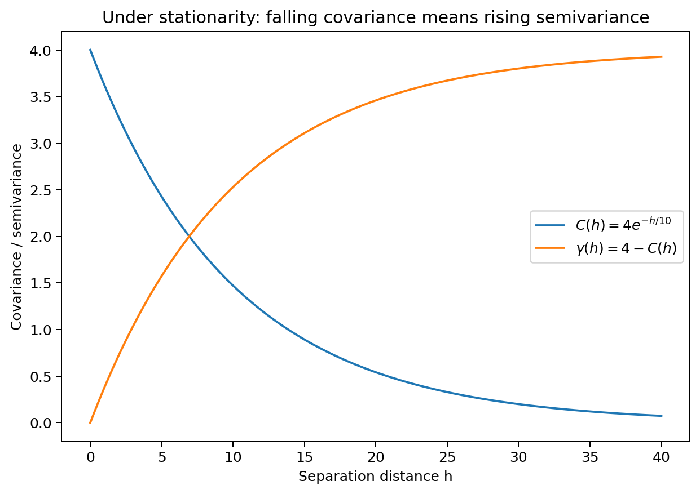
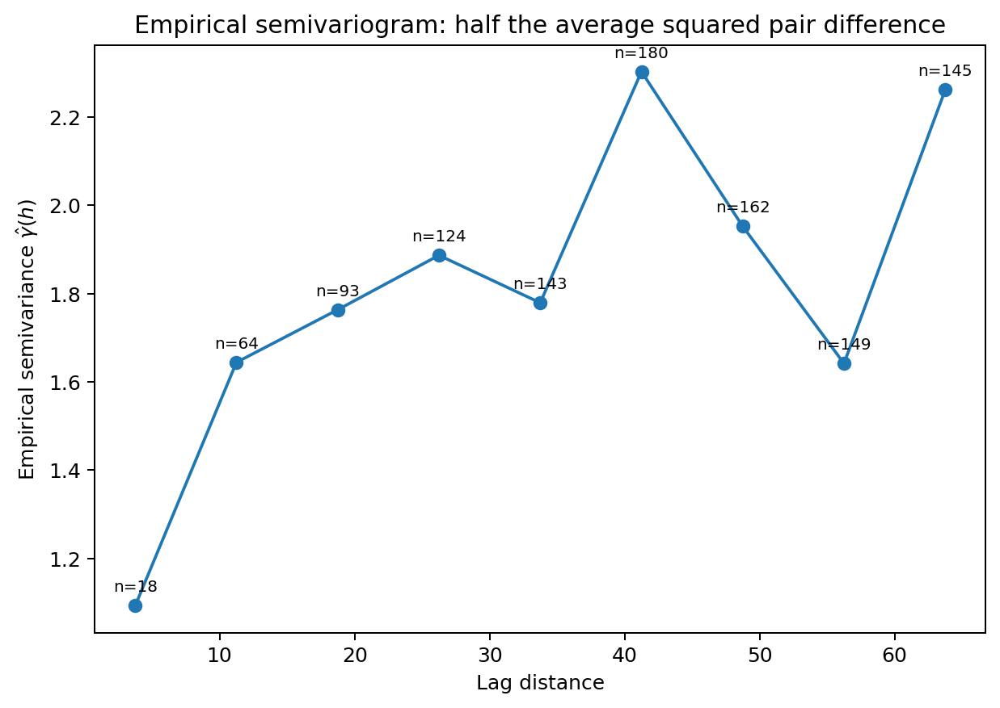
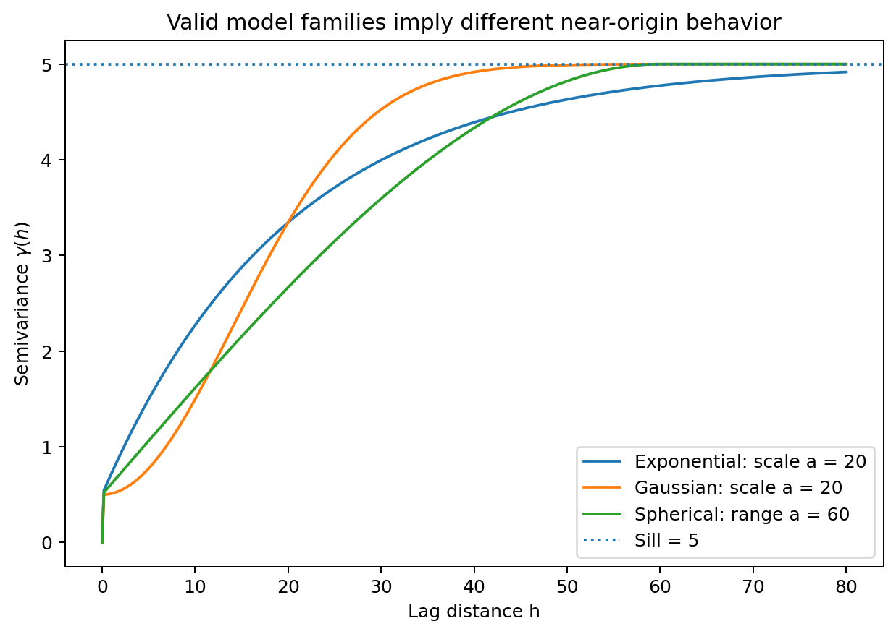
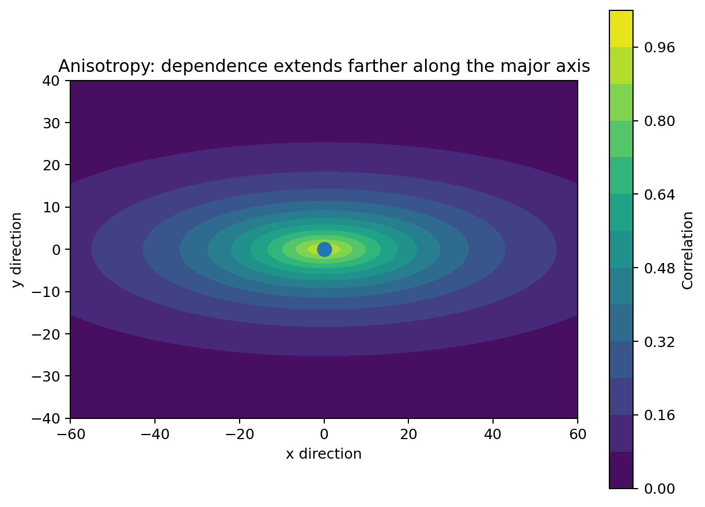
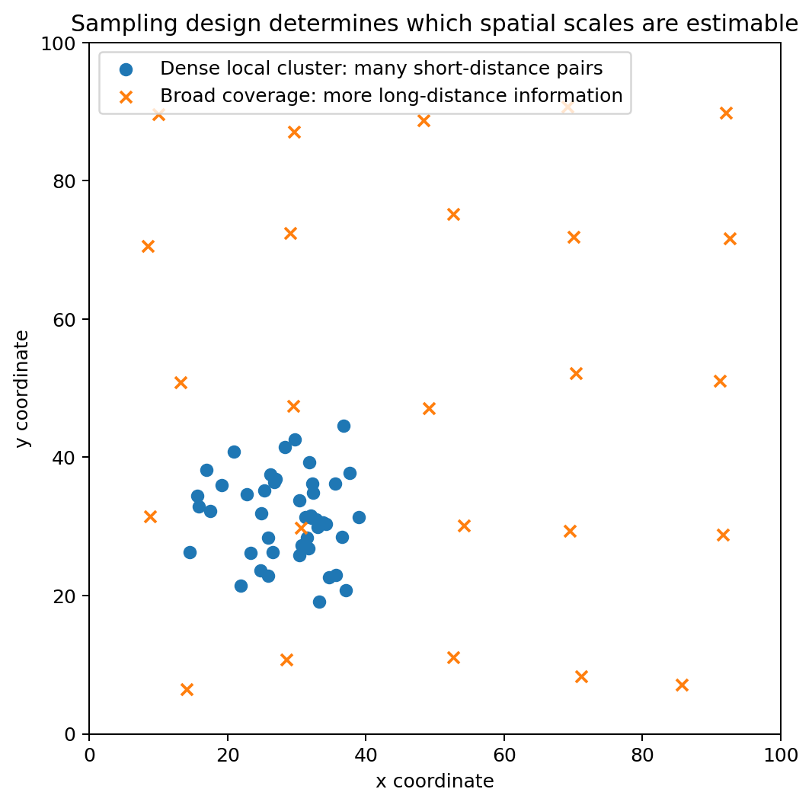

# Geostatistics: A Student Guide to Spatial Dependence and the Semivariogram

Geostatistics is used when observations are tied to locations and nearby values may be more similar than distant values.

Typical examples are:

- soil nutrient concentration measured at sampling points;
- groundwater elevation measured in wells;
- rainfall measured at weather stations;
- temperature measured across a region;
- pollutant concentration measured at monitoring sites.

The central problem is that we usually observe a variable at only a limited set of coordinates, yet we want to understand the spatial process between them.

This chapter develops the ideas needed before kriging. The goal is to understand what spatial dependence means, how the semivariogram measures it, why its parameters matter, and what can go wrong when the assumptions do not fit the data.
## Learning objectives

After working through this chapter, you should be able to:

1. explain what a spatial random field represents;
2. separate a large-scale trend from local spatial variation;
3. explain second-order stationarity and intrinsic stationarity;
4. calculate an empirical semivariogram value by hand;
5. interpret nugget, partial sill, sill, and range/scale;
6. compare exponential, Gaussian, and spherical variogram models;
7. explain isotropy and anisotropy;
8. explain why the sampling design affects the empirical variogram;
9. describe how a variogram model is used later in kriging;
10. recognize common diagnostic problems.
## The spatial random field

A geostatistical variable is written as

$$
\{Z(s): s\in D\},
$$

where:

- $s$ is a spatial location;
- $D$ is the spatial study region;
- $Z(s)$ is the value of the variable at location $s$.

If locations are two-dimensional, we can write

$$
s=(x,y).
$$

For example,

$$
Z(3,7)=18.4
$$

might mean that the measured nitrate concentration at coordinate $(3,7)$ is $18.4$ mg/L.

### What is being modeled?

The notation $Z(s)$ does not mean that the observed map is random in the everyday sense.

Instead, it represents uncertainty about possible values, including values at locations we did not sample. The observed dataset is treated as one realization of an underlying spatial process.

Suppose five observations are:

| Point | $x$ | $y$ | Observed value $Z(s)$ |
|---|---:|---:|---:|
| A | 0 | 0 | 10 |
| B | 1 | 0 | 12 |
| C | 0 | 1 | 11 |
| D | 1 | 1 | 14 |
| E | 2 | 0 | 13 |

The data give the field value at five locations, but not at an unsampled location such as $(0.7,0.4)$.

Geostatistics uses the observed spatial pattern to quantify dependence and make predictions at unsampled locations.

#### Why this matters

Many non-spatial methods assume observations are independent. Spatial data often violate that assumption.

If two groundwater wells are only 20 m apart, their measurements may contain overlapping information. If two wells are 100 km apart, their measurements may be much less related.

Geostatistics makes that dependence explicit.
## Large-scale mean and small-scale residual variation

A useful decomposition is

$$
Z(s)=m(s)+\varepsilon(s),
$$

where

- $m(s)$ is the large-scale mean or trend;
- $\varepsilon(s)$ is the residual spatial variation around that trend.

This separation is fundamental in geostatistics.

### What is being calculated?

We are separating the observed value into two pieces:

$$
\text{observed value}
=
\text{systematic spatial pattern}
+
\text{remaining local variation}.
$$

The residual is therefore

$$
\varepsilon(s)=Z(s)-m(s).
$$

### Why calculate residuals?

A trend can make distant locations appear spatially dependent even when little dependence remains after the trend is removed.

Consider three observations along a straight line:

| $x$ | Observed $Z(x)$ |
|---:|---:|
| 0 | 10 |
| 1 | 13 |
| 2 | 16 |

The observations increase by 3 units for each 1-unit increase in $x$.

If we incorrectly assume a constant mean, the sample mean is

$$
\bar Z=\frac{10+13+16}{3}=13.
$$

The deviations from that constant mean are

$$
10-13=-3,\qquad 13-13=0,\qquad 16-13=3.
$$

These deviations have a strong spatial pattern: low on the left and high on the right.

But suppose the actual mean trend is

$$
m(x)=10+3x.
$$

Then

$$
m(0)=10,\qquad m(1)=13,\qquad m(2)=16,
$$

so the residuals are

$$
\varepsilon(0)=10-10=0,
$$

$$
\varepsilon(1)=13-13=0,
$$

$$
\varepsilon(2)=16-16=0.
$$

In this example, the apparent spatial structure is entirely explained by the mean trend.

#### Main lesson

Before interpreting a variogram, ask whether a trend should first be modeled.

Otherwise, the variogram may mix two different sources of variation:

1. large-scale change in the mean;
2. local spatial dependence around the mean.

That often produces an inflated apparent range or sill.
## Second-order stationarity

A common geostatistical assumption is **second-order stationarity**.

It requires two things.

First, the expected value is constant:

$$
E[Z(s)]=\mu.
$$

Second, covariance depends only on the separation between locations:

$$
\mathrm{Cov}[Z(s),Z(s+h)] = C(h).
$$

Here $h$ is a spatial lag vector.

If

$$
s_1=(2,4)
$$

and

$$
s_2=(5,8),
$$

then

$$
h=s_2-s_1=(3,4).
$$

Its Euclidean distance is

$$
\|h\|
=
\sqrt{3^2+4^2}
=
5.
$$

### What is covariance calculating?

Covariance measures how two values vary together relative to their mean.

Positive covariance means that when one location is above the mean, the other also tends to be above the mean.

A typical spatial covariance function decreases with distance.

For example, suppose

$$
C(h)=4e^{-\|h\|/10}.
$$

At zero separation,

$$
C(0)=4e^0=4.
$$

At a distance of 10 units,

$$
C(10)
=
4e^{-1}
\approx 1.472.
$$

At a distance of 30 units,

$$
C(30)
=
4e^{-3}
\approx 0.199.
$$

So the model says that locations 30 units apart share much less spatial dependence than locations 10 units apart.

### Why stationarity matters

Stationarity allows us to combine information from many pairs of locations.

If two pairs of observations have the same separation, a stationary model assigns them the same covariance structure even when they occur in different parts of the map.

For example, under stationarity:

- a pair 5 km apart in the west of the study area;
- a pair 5 km apart in the east of the study area;

are assumed to have the same covariance, provided their lag direction is also treated the same way.

This assumption makes estimation possible from a limited number of samples.

#### Important warning

Stationarity is a modeling assumption, not a universal property of nature.

Strong trends, boundaries, land-use changes, coastlines, geological contacts, or different ecological zones can violate it.
## Isotropy

A stationary spatial model is **isotropic** if dependence depends only on distance, not direction.

Then

$$
C(h)=C(\|h\|).
$$

For an isotropic model, a pair of points 10 km apart east-west has the same covariance as a pair 10 km apart north-south.

This assumption is convenient, but it may be unrealistic.

Examples where direction may matter include:

- wind-driven air pollution;
- groundwater flow;
- river-valley systems;
- geological strata;
- ocean currents.

We return to directional dependence in the anisotropy section.
## Intrinsic stationarity and the semivariogram

Geostatistics often uses a weaker assumption called **intrinsic stationarity**.

Instead of requiring a covariance function for the field itself, intrinsic stationarity focuses on increments:

$$
Z(s+h)-Z(s).
$$

The semivariogram is defined as

$$
\gamma(h)
=
\frac{1}{2}
\mathrm{Var}[Z(s+h)-Z(s)].
$$

### What is the semivariogram calculating?

The semivariogram measures how dissimilar two observations tend to be as their separation changes.

A small semivariogram value means:

> points separated by this distance tend to have similar values.

A large semivariogram value means:

> points separated by this distance tend to have more different values.

The factor $1/2$ is part of the standard definition and gives the semivariogram a direct relationship with covariance.

Under second-order stationarity,

$$
\gamma(h)=C(0)-C(h).
$$

Because $C(0)$ is the variance at a location, the relationship says:

> semivariance increases when covariance decreases.

### Numerical covariance-to-variogram example

Using

$$
C(h)=4e^{-\|h\|/10},
$$

we have

$$
C(0)=4.
$$

At distance 10,

$$
C(10)\approx1.472.
$$

Therefore

$$
\gamma(10)
=
C(0)-C(10)
=
4-1.472
=
2.528.
$$

At distance 30,

$$
C(30)\approx0.199,
$$

so

$$
\gamma(30)
=
4-0.199
=
3.801.
$$

The greater separation has a larger semivariance because the values are less strongly related.

## The empirical semivariogram

With real data, the true semivariogram is unknown, so we estimate it from observed pairs.

For a lag bin around distance $h$,

$$
\hat{\gamma}(h)
=
\frac{1}{2N(h)}
\sum_{(i,j)\in N(h)}
\left[Z(s_i)-Z(s_j)\right]^2,
$$

where

- $N(h)$ is the set of observation pairs assigned to the lag bin;
- $N(h)$ also denotes the number of pairs in that bin;
- $Z(s_i)-Z(s_j)$ is the difference between the two observed values.

### What is being calculated?

For every pair in a distance bin:

1. subtract the two observed values;
2. square the difference;
3. add all squared differences;
4. divide by the number of pairs;
5. divide by 2.

The empirical semivariogram is therefore half the average squared difference between observations separated by approximately the same distance.
## Fully worked empirical semivariogram example

Use the five-point dataset:

| Point | Coordinate | Value |
|---|---|---:|
| A | $(0,0)$ | 10 |
| B | $(1,0)$ | 12 |
| C | $(0,1)$ | 11 |
| D | $(1,1)$ | 14 |
| E | $(2,0)$ | 13 |

We will calculate the empirical semivariance for pairs exactly 1 unit apart.

### Find pairs separated by distance 1

The relevant pairs are:

- A-B
- A-C
- B-D
- B-E
- C-D

Therefore

$$
N(1)=5.
$$

### Calculate each value difference and square it

#### Pair A-B

$$
Z(A)-Z(B)=10-12=-2.
$$

Squared difference:

$$
(-2)^2=4.
$$

#### Pair A-C

$$
10-11=-1,
$$

so

$$
(-1)^2=1.
$$

#### Pair B-D

$$
12-14=-2,
$$

so

$$
(-2)^2=4.
$$

#### Pair B-E

$$
12-13=-1,
$$

so

$$
(-1)^2=1.
$$

#### Pair C-D

$$
11-14=-3,
$$

so

$$
(-3)^2=9.
$$

### Add the squared differences

$$
4+1+4+1+9=19.
$$

### Divide by $2N(h)$

Because

$$
N(1)=5,
$$

we obtain

$$
\hat{\gamma}(1)
=
\frac{19}{2(5)}
=
\frac{19}{10}
=
1.9.
$$

So the empirical semivariance at distance 1 is

$$
\boxed{\hat{\gamma}(1)=1.9}.
$$

### What does 1.9 mean?

It is not a distance and it is not a correlation.

It is half the mean squared difference for pairs approximately 1 unit apart.

The mean squared difference is

$$
\frac{19}{5}=3.8,
$$

and half of that is

$$
\frac{3.8}{2}=1.9.
$$

If a later distance bin had a semivariance of 6, that would indicate substantially greater dissimilarity at that larger separation.
## Why lag bins are needed

In a real dataset, very few pairs have exactly the same distance.

For example, observed pair distances might be

$$
4.8,\ 5.1,\ 5.3,\ 9.7,\ 10.2,\ 10.5,\ldots
$$

Instead of estimating a separate semivariance for each exact distance, we group similar distances into bins.

One possible set of bins is:

- 0 to 5 m;
- 5 to 10 m;
- 10 to 15 m;
- 15 to 20 m.

Each point on an empirical variogram summarizes all pairs in one bin.

### Why pair count matters

A lag bin based on 150 pairs is generally more stable than one based on 3 pairs.

For that reason, pair counts should be shown or inspected when evaluating an empirical variogram.

A noisy high-distance bin may simply have very few available pairs.

### Why empirical variogram points are not ordinary independent data

A sampled observation can appear in many pairs.

For example, observation A may contribute to A-B, A-C, A-D, and A-E.

As a result, variogram points are not independent observations in the sense assumed by ordinary least squares.

They also do not generally have equal sampling variance.

For teaching examples, weighted least squares based on pair counts is common and intuitive. More advanced fitting can use likelihood-based methods or specialized variogram-weighting schemes.
## Nugget, partial sill, and sill

A widely used exponential semivariogram model is

$$
\gamma(h)
=
c_0
+
c\left(1-e^{-\|h\|/a}\right),
\qquad \|h\|>0,
$$

with

$$
\gamma(0)=0.
$$

The parameters are:

- $c_0$: nugget;
- $c$: partial sill;
- $c_0+c$: sill;
- $a$: spatial scale parameter.

Suppose

$$
c_0=0.5,\qquad c=4.5,\qquad a=20.
$$

Then the asymptotic sill is

$$
c_0+c=0.5+4.5=5.
$$

### Nugget

The nugget is the discontinuity immediately to the right of the origin.

Here,

$$
c_0=0.5.
$$

It can represent:

- measurement error;
- spatial variation occurring at scales smaller than the sampling resolution;
- both of the above.

#### Why is $\gamma(0)=0$ even when there is a nugget?

At exactly the same location,

$$
Z(s)-Z(s)=0,
$$

so the semivariance is zero by definition.

With a nugget model, the theoretical variogram is 0 at exactly $h=0$ and approaches $c_0$ as the separation becomes arbitrarily small but positive.

This discontinuity represents unresolved variability or measurement noise.
### Partial sill

The partial sill is the portion of variance represented as spatially structured by the model.

Here,

$$
c=4.5.
$$

The structured part begins near zero separation and grows toward 4.5 as distance increases.
### Sill

The sill is

$$
c_0+c.
$$

With the chosen values,

$$
c_0+c=5.0.
$$

At sufficiently large distances, the modeled spatial covariance approaches zero, so the semivariogram approaches the total variance level represented by the model.
### Scale parameter and practical range

For the exponential model, $a$ is a scale parameter, not a hard cutoff distance.

The model approaches its sill asymptotically.

Using

$$
a=20,
$$

at distance

$$
h=20,
$$

the semivariogram is

$$
\gamma(20)
=
0.5
+
4.5(1-e^{-20/20}).
$$

Because

$$
e^{-1}\approx0.3679,
$$

we get

$$
\gamma(20)
=
0.5+4.5(1-0.3679)
$$

$$
=
0.5+4.5(0.6321)
$$

$$
\approx0.5+2.8445
$$

$$
\approx3.3445.
$$

This is still below the sill of 5.

At approximately

$$
h=3a=60,
$$

the structured component has reached about 95% of its asymptotic value because

$$
1-e^{-3}\approx0.9502.
$$

Thus, the exponential model's **practical range** is often taken as approximately

$$
3a.
$$

With $a=20$,

$$
\text{practical range}\approx60.
$$
## Comparing common valid variogram models

Several valid variogram model families are widely used.

They differ mainly in how quickly spatial dependence changes near the origin and whether the sill is reached at a finite distance.

### Exponential model

$$
\gamma(h)
=
c_0+c\left(1-e^{-\|h\|/a}\right).
$$

Characteristics:

- rises relatively sharply near the origin;
- approaches the sill gradually;
- has no finite exact range;
- useful for spatial processes that are not extremely smooth.
### Gaussian model

$$
\gamma(h)
=
c_0+c\left(1-e^{-(\|h\|/a)^2}\right).
$$

Characteristics:

- very flat near the origin;
- implies a smoother spatial process than the exponential model;
- approaches the sill asymptotically.

A very flat variogram near the origin implies that process values at very close locations are highly similar.
### Spherical model

For

$$
0<\|h\|\le a,
$$

$$
\gamma(h)
=
c_0+c
\left[
\frac{3}{2}\frac{\|h\|}{a}
-
\frac{1}{2}\left(\frac{\|h\|}{a}\right)^3
\right].
$$

For

$$
\|h\|>a,
$$

$$
\gamma(h)=c_0+c.
$$

Characteristics:

- rises with distance;
- reaches the sill exactly at $h=a$;
- has a finite range.

If a spherical model has

$$
a=20,
$$

locations farther than 20 units apart have zero modeled spatial covariance for the structured component.
## Parameter names are not perfectly comparable across model families

A common mistake is to assume that a parameter called $a$ represents the same physical range in every model.

It does not.

For example:

- in the spherical model, $a$ is the exact finite range;
- in the exponential model, $a$ is a scale parameter and the practical range is about $3a$;
- in the Gaussian model, the practical range is related to $a$ differently.

Compare models using their implied curves or a consistently defined practical range rather than the raw parameter symbol alone.
## A covariance interpretation of the sill

Under second-order stationarity,

$$
\gamma(h)=C(0)-C(h).
$$

Suppose the total variance is

$$
C(0)=5.
$$

At a distance where

$$
C(h)=3.5,
$$

the semivariogram is

$$
\gamma(h)=5-3.5=1.5.
$$

At a much larger distance where

$$
C(h)\approx0,
$$

the semivariogram is approximately

$$
\gamma(h)\approx5.
$$

This is why a bounded semivariogram often levels off near the process variance.
## Isotropy versus anisotropy

An isotropic model assumes that dependence depends only on distance.

An anisotropic model allows spatial dependence to vary with direction.

### Example

Suppose contamination is transported by groundwater flow from west to east.

Two monitoring wells 20 m apart along the flow direction may be strongly related.

Two wells also 20 m apart but perpendicular to the flow may be much less related.

Their Euclidean distance is identical, but their spatial dependence is different.

### A simple numerical anisotropy calculation

Suppose an anisotropic exponential correlation model uses a major-axis scale of 30 units and a minor-axis scale of 10 units.

Consider two pairs, each physically 10 units apart.

#### Along the major axis

Scaled separation:

$$
r_\text{major}=\frac{10}{30}=0.333.
$$

Using

$$
\rho=e^{-r},
$$

the correlation is approximately

$$
\rho_\text{major}
=
e^{-0.333}
\approx0.717.
$$

#### Along the minor axis

Scaled separation:

$$
r_\text{minor}=\frac{10}{10}=1.
$$

Therefore

$$
\rho_\text{minor}
=
e^{-1}
\approx0.368.
$$

Thus, the same physical distance can imply very different correlations depending on direction.

### How anisotropy is diagnosed

A common diagnostic is to calculate **directional empirical variograms**.

For example, estimate one variogram using pairs approximately east-west and another using pairs approximately north-south.

If the ranges or sills differ systematically by direction, anisotropy may be present.
## Sampling design controls what the variogram can learn

The empirical variogram can only reflect distances and directions represented by the sampled point pairs.

This has important practical consequences.

### Estimating the nugget requires short-distance pairs

Suppose the closest two samples are 500 m apart.

Then the data contain little direct evidence about spatial behavior below 500 m.

The nugget and short-range behavior will therefore be weakly constrained by the data.

Dense local sampling is valuable when estimating near-origin behavior.
### Estimating long-range structure requires broad spatial coverage

If every sample lies inside a 1 km area, the data cannot strongly identify dependence at 10 km.

To estimate long-range structure, the study design must contain long-distance pairs.
### Clustered sampling creates unequal information

Imagine 80 samples in one small corner and only 10 samples across the rest of the study area.

The empirical variogram may then be dominated by pairs from the dense cluster.

This does not invalidate the analysis, but it changes which parts of the sampling design contribute most strongly to the empirical variogram.
### Large holes increase prediction uncertainty

If an unsampled region lies far from every observation, kriging relies more heavily on the fitted covariance or variogram model and on the estimated trend.

Predictions in that region are usually less certain.

## Trend models and universal kriging

If the mean changes with location or covariates, write

$$
m(s)=x(s)^\top\beta.
$$

Here $x(s)$ can contain:

- an intercept;
- coordinates such as $x$ and $y$;
- elevation;
- distance to a river;
- land-use class;
- other explanatory variables.

For example,

$$
m(s)=\beta_0+\beta_1x+\beta_2y.
$$

Suppose

$$
\beta_0=10,\qquad \beta_1=0.8,\qquad \beta_2=-0.3.
$$

At location

$$
s=(5,2),
$$

the mean is

$$
m(5,2)
=
10+0.8(5)-0.3(2).
$$

Therefore

$$
m(5,2)
=
10+4-0.6
=
13.4.
$$

If the observed value is

$$
Z(5,2)=14.1,
$$

the residual is

$$
\varepsilon(5,2)
=
14.1-13.4
=
0.7.
$$

The variogram should then describe dependence among these residuals rather than reproduce the broad trend itself.

Methods that combine a spatially varying mean with spatially dependent residuals include:

- universal kriging;
- regression kriging;
- spatial regression models.
## Why the variogram matters for kriging

Kriging predicts at an unsampled location using a weighted combination of observed values.

Conceptually,

$$
\hat Z(s_0)
=
\sum_{i=1}^n \lambda_i Z(s_i),
$$

where

- $s_0$ is the prediction location;
- $\lambda_i$ are kriging weights;
- $Z(s_i)$ are observed values.

The weights are not determined by distance alone.

They depend on the full spatial dependence structure.

Two observations that are both close to the prediction point but highly redundant should not have the same combined influence as two equally close observations that provide less redundant information.

The covariance or variogram model is what allows kriging to account for this redundancy.

Variogram modeling is therefore more than curve fitting: it defines the dependence structure used to calculate prediction weights and uncertainty.
## Interpreting a fitted empirical variogram

When interpreting a fitted variogram, consider the following questions.

### Near the origin

Does the empirical variogram jump sharply above zero?

Possible explanations include:

- measurement error;
- microscale variation;
- outliers;
- a model that misses an important short-range process.

### At intermediate distances

Does semivariance increase smoothly?

This part of the curve often provides the clearest information about spatial range or scale.

### At long distances

Does the empirical variogram level off?

If yes, a stationary model with a sill may be plausible.

If it continues rising, possible explanations include:

- unmodeled trend;
- nonstationarity;
- insufficient spatial extent to observe the sill;
- a process whose model does not have a sill in the observed range.
## Diagnostics: what should be checked before trusting the model?

A geostatistical workflow should involve more than calculating a variogram, fitting a curve, and kriging.

At minimum, inspect the following.

### Map the raw observations

Look for:

- broad gradients;
- clusters;
- gaps;
- boundaries;
- isolated extreme values.

A variogram plot alone cannot show where the problematic observations are located.

### Examine possible trend

Plot the response against:

- $x$ coordinate;
- $y$ coordinate;
- important covariates.

If a trend is present, model it before interpreting residual dependence.

### Inspect directional dependence

Compare directional variograms.

A single omnidirectional variogram can hide anisotropy.

### Check pair counts

A striking point based on 4 pairs should not be given the same weight in interpretation as one based on 400 pairs.

### Investigate outliers

Because the empirical semivariogram uses squared differences,

$$
[Z(s_i)-Z(s_j)]^2,
$$

a single extreme observation can affect many pairs and inflate several lag bins.

### Check sensitivity to binning

Changing lag width changes which pairs are grouped together.

If conclusions change substantially under reasonable bin choices, the empirical spatial structure may be weak.

### Check sensitivity to the model family

If exponential, Gaussian, and spherical models produce very different predictions, model choice matters and should be reported.

### Validate predictions

Use cross-validation or held-out observations to examine:

- prediction errors;
- bias;
- standardized errors;
- whether uncertainty estimates are realistic.
## Common mistakes

### Treating the empirical variogram as the true variogram

The empirical variogram is a noisy estimate from finite data.

It should not be over-interpreted point by point.

### Fitting the variogram before removing a strong trend

This can cause the fitted dependence structure to absorb deterministic large-scale change.

### Calling the exponential parameter $a$ the exact range

For the exponential model, $a$ is a scale parameter. A commonly used practical range is approximately $3a$.

### Ignoring anisotropy

A good omnidirectional fit can still hide strong directional differences.

### Ignoring the sampling design

The variogram cannot reliably characterize distances that are poorly represented by the sampling design.

### Assuming a smooth-looking curve must be mathematically valid

A covariance or variogram function must satisfy mathematical validity conditions so that it corresponds to a legitimate random field.

Not every visually appealing curve is allowed.

### Confusing measurement error with process variation

A nugget may contain measurement error, microscale spatial variation, or both.

That distinction affects whether the goal is to predict:

- the latent underlying process; or
- a future noisy observation.
## A compact worked example from data to interpretation

Suppose an empirical variogram suggests:

- a jump near the origin of about 0.4;
- increasing semivariance until roughly 40-60 m;
- a plateau near 3.0.

A reasonable initial interpretation is:

#### Nugget

$$
c_0\approx0.4.
$$

This suggests some unresolved microscale variation, measurement error, or both.

#### Sill

$$
c_0+c\approx3.0.
$$

The overall variance level represented by the stationary model is about 3.

#### Partial sill

$$
c\approx3.0-0.4=2.6.
$$

About 2.6 variance units are therefore associated with spatially structured variation.

#### Practical range

If an exponential model appears appropriate and dependence is effectively small by about 60 m, then

$$
3a\approx60,
$$

so

$$
a\approx20.
$$

A candidate model is therefore

$$
\gamma(h)
=
0.4
+
2.6\left(1-e^{-\|h\|/20}\right).
$$

This is not a final model. It is an interpretable starting point that should be checked against the empirical variogram, directional behavior, trend, and predictive validation.
## Concept map

The logic of introductory geostatistics is:

$$
\text{spatial observations}
$$

$$
\downarrow
$$

$$
\text{inspect map and trend}
$$

$$
\downarrow
$$

$$
\text{model or remove large-scale mean}
$$

$$
\downarrow
$$

$$
\text{calculate residual pair differences}
$$

$$
\downarrow
$$

$$
\text{empirical semivariogram}
$$

$$
\downarrow
$$

$$
\text{fit a valid variogram/covariance model}
$$

$$
\downarrow
$$

$$
\text{diagnose anisotropy, instability, and model sensitivity}
$$

$$
\downarrow
$$

$$
\text{use the fitted dependence model in kriging}
$$

The essential idea is simple:

> Spatial dependence tells us how much information one location provides about another.

The semivariogram measures that dependence through squared differences, while a fitted variogram model summarizes it in a form that can be used in spatial prediction.
## Questions students should be able to answer

1. Why can a large-scale trend create an apparently long-range variogram?
2. What does a small semivariogram value mean physically?
3. Why is the squared difference divided by 2 in the semivariogram definition?
4. What is the difference between nugget, partial sill, and sill?
5. Why is the exponential scale parameter not an exact range?
6. Why might a Gaussian variogram be appropriate for a smoother field?
7. How can two pairs at the same distance have different dependence under anisotropy?
8. Why are short-distance sample pairs important for estimating the nugget?
9. Why are empirical variogram points not ordinary independent regression observations?
10. Why does kriging need the complete covariance or variogram structure rather than only the distance to the prediction point?
