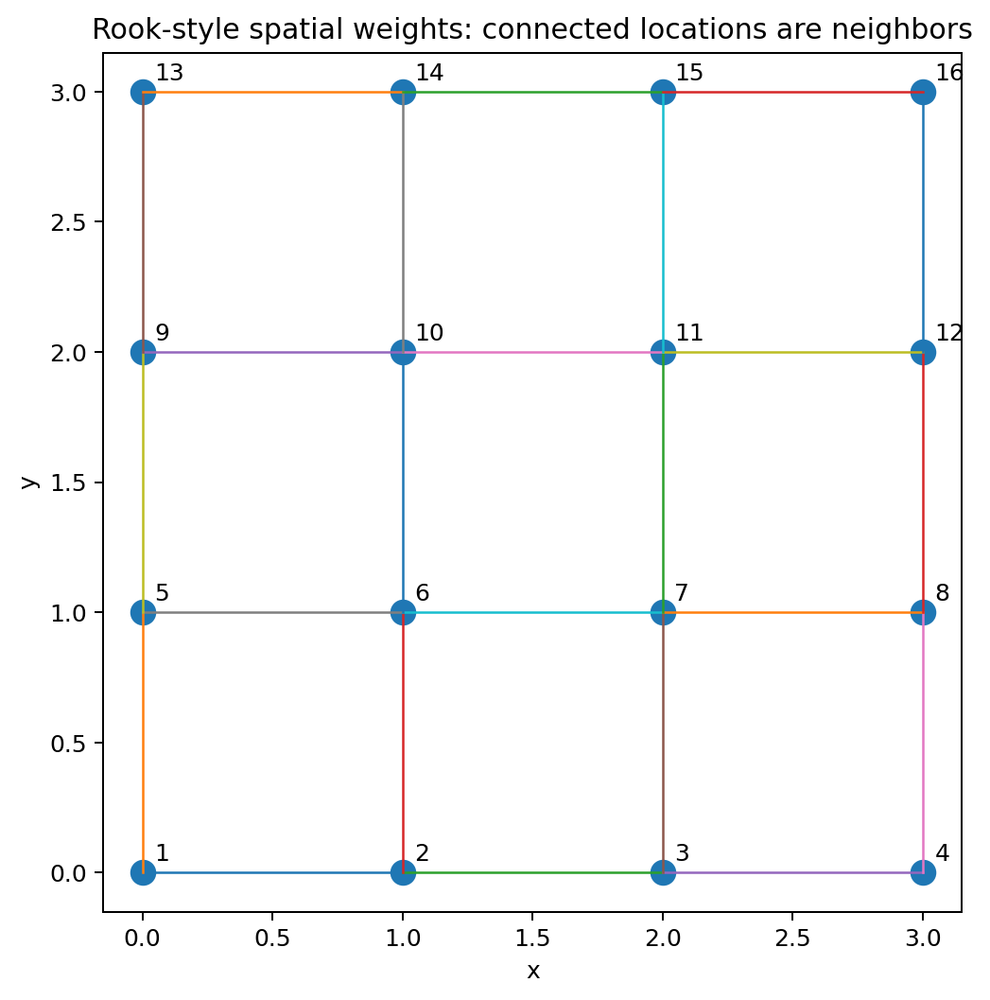
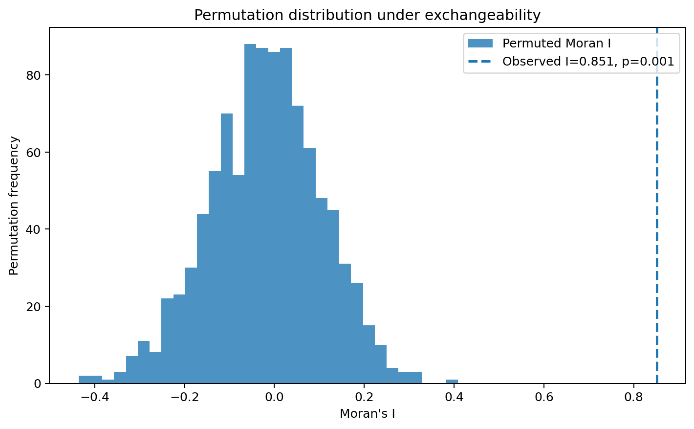
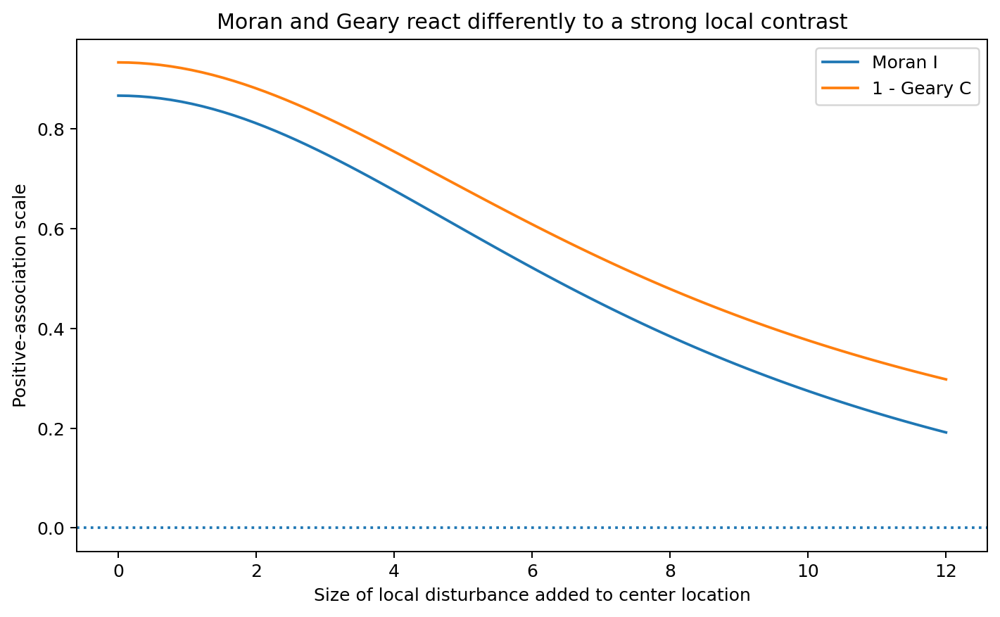
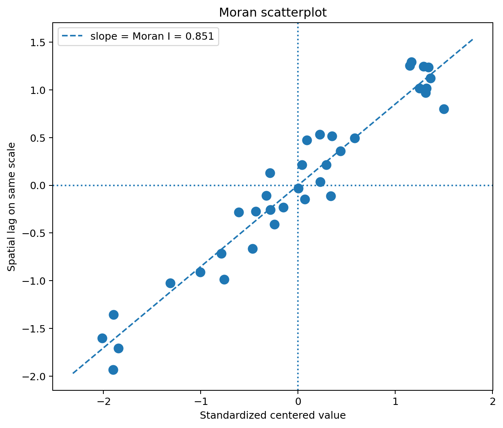
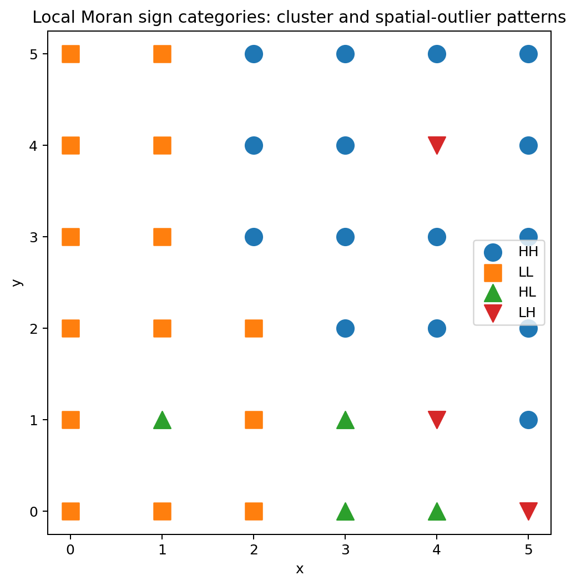
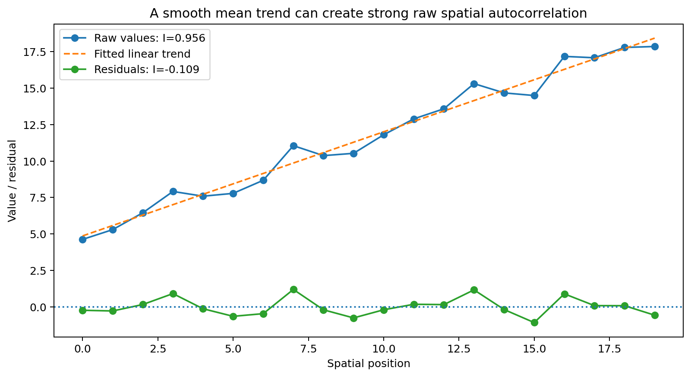
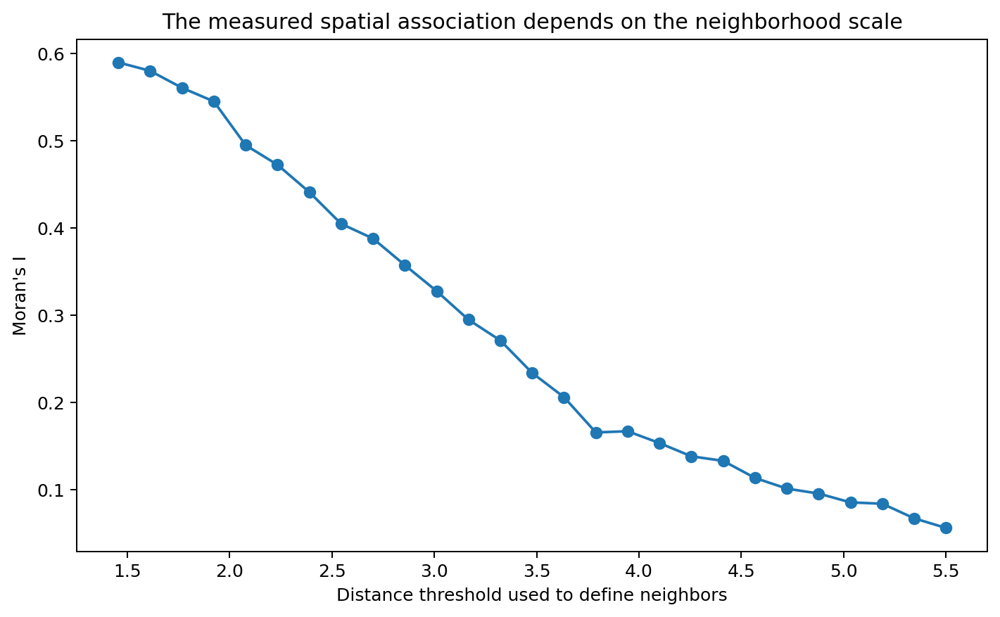

# Spatial Autocorrelation

Spatial autocorrelation asks whether values attached to locations show a systematic spatial pattern.

The idea is:

> Are neighboring locations more similar, or more dissimilar, than we would expect under a stated reference mechanism?

Examples include:

- neighboring districts with similar unemployment rates;
- nearby counties with similar disease incidence;
- adjacent raster cells with similar temperature;
- neighboring census tracts with similar house prices;
- nearby monitoring sites with similar pollution levels.

Spatial autocorrelation is not a property of the values alone. Its interpretation depends on:

1. the observed values;
2. the spatial weights matrix $W$;
3. the null/reference mechanism used for inference.

The same dataset can produce different results when “neighbor” is defined differently.

## Learning objectives

After this chapter, you should be able to:

1. explain what spatial autocorrelation means;
2. construct and interpret a spatial weights matrix;
3. calculate global Moran's $I$ by hand;
4. explain why Moran's $I$ is not simply an ordinary correlation coefficient;
5. explain the finite-sample null expectation $E[I]=-1/(n-1)$;
6. perform a permutation test conceptually and computationally;
7. calculate and interpret Geary's $C$;
8. calculate local Moran statistics and identify HH, LL, HL, and LH locations;
9. explain the multiple-testing problem in local maps;
10. explain how a trend can produce apparent spatial autocorrelation;
11. interpret a Moran scatterplot;
12. state clearly what Moran's $I$ does and does not establish.

## What is spatial autocorrelation?

Suppose a variable $x_i$ is observed at each of $n$ spatial locations.

For example:

| Location | Value |
|---|---:|
| A | 2 |
| B | 3 |
| C | 4 |
| D | 8 |
| E | 9 |

If nearby locations tend to have similar values, this is called **positive spatial autocorrelation**.

Examples:

- high values beside high values;
- low values beside low values.

If nearby locations tend to have contrasting values, this is called **negative spatial autocorrelation**.

Examples:

- high values beside low values;
- low values beside high values.

If the observed arrangement is not distinguishable from the chosen null mechanism, there is little evidence of spatial autocorrelation under that null.

## Spatial autocorrelation requires a definition of neighborhood

Before calculating Moran's $I$, Geary's $C$, or a local statistic, we must define which locations are spatially connected.

These connections are encoded in the **spatial weights matrix**

$$
W=(w_{ij}).
$$

The entry

$$
w_{ij}
$$

describes how strongly location $j$ contributes to the neighborhood of location $i$.

A common binary definition is

$$
w_{ij} =
\begin{cases}
1, & \text{if }i\text{ and }j\text{ are neighbors},\\
0, & \text{otherwise}.
\end{cases}
$$

Usually,

$$
w_{ii}=0,
$$

because a location is not treated as its own neighbor.

## Common ways to define spatial weights

There is no universally correct $W$.

Common choices include:

- adjacency: regions sharing a border are neighbors;
- distance threshold: locations within a chosen distance are neighbors;
- $k$-nearest neighbors: every location is linked to its $k$ closest observations;
- inverse distance: closer observations receive larger weights;
- network-based distance: connection follows roads, rivers, or another network.

The scientific interpretation changes with the choice of weights.

For example, “neighbor” could mean:

- adjacent county;
- within 5 km;
- five nearest monitoring sites;
- connected along a river channel.

The weights matrix is therefore part of the model specification, not a technical afterthought.

## Row-standardization

A common transformation makes every non-isolated row of $W$ sum to 1.

If location $i$ has $k_i$ equally weighted neighbors, then each receives weight

$$
\frac{1}{k_i}.
$$

For example, if a location has two neighbors,

$$
w_{ij}=\frac12
$$

for each neighbor.

The row-standardized spatial lag

$$
(Wz)_i =
\sum_j w_{ij}z_j
$$

then becomes the weighted average of neighboring centered values.

### Why row-standardize?

It gives a simple interpretation:

> the spatial lag is the average centered value in the neighborhood.

Row-standardization is a modeling choice; other normalizations are possible.

## Global Moran's I

Define centered observations

$$
z_i=x_i-\bar x,
$$

where

$$
\bar x =
\frac1n\sum_i x_i.
$$

Also define

$$
S_0 =
\sum_i\sum_jw_{ij}.
$$

Global Moran's $I$ is

$$
\boxed{
I =
\frac{n}{S_0}
\frac{
\sum_i\sum_jw_{ij}z_i z_j
}{
\sum_i z_i^2
}
}.
$$

### What is being calculated?

The numerator

$$
\sum_i\sum_jw_{ij}z_i z_j
$$

adds weighted products of centered values for spatially connected observations.

If neighboring values have the same sign:

$$
(+)(+)>0
$$

or

$$
(-)(-)>0,
$$

they add positive contributions.

If neighboring values have opposite signs:

$$
(+)(-)<0,
$$

they add negative contributions.

Moran's $I$ therefore compares neighboring similarity with the overall variation in the data.

## Fully worked Moran's I example

Consider five locations arranged in a line:

$$
A-B-C-D-E.
$$

The observed values are

$$
x=
\begin{bmatrix}
2\\
3\\
4\\
8\\
9
\end{bmatrix}.
$$

We use row-standardized first-order neighbors.

Thus:

- A has neighbor B;
- B has neighbors A and C;
- C has neighbors B and D;
- D has neighbors C and E;
- E has neighbor D.

The weights matrix is

$$
W=
\begin{bmatrix}
0 & 1 & 0 & 0 & 0\\
1/2 & 0 & 1/2 & 0 & 0\\
0 & 1/2 & 0 & 1/2 & 0\\
0 & 0 & 1/2 & 0 & 1/2\\
0 & 0 & 0 & 1 & 0
\end{bmatrix}.
$$

Because every row sums to 1,

$$
S_0=5.
$$

## calculate the mean

$$
\bar x =
\frac{2+3+4+8+9}{5} =
\frac{26}{5} =
5.2.
$$

## center the values

$$
z_i=x_i-\bar x.
$$

Therefore

$$
z=
\begin{bmatrix}
2-5.2\\
3-5.2\\
4-5.2\\
8-5.2\\
9-5.2
\end{bmatrix} =
\begin{bmatrix}
-3.2\\
-2.2\\
-1.2\\
2.8\\
3.8
\end{bmatrix}.
$$

Low-valued locations have negative deviations, while high-valued locations have positive deviations.

## calculate the denominator

The denominator is

$$
\sum_i z_i^2.
$$

Substitute:

$$
(-3.2)^2+(-2.2)^2+(-1.2)^2+(2.8)^2+(3.8)^2.
$$

Calculate each square:

$$
10.24+4.84+1.44+7.84+14.44.
$$

Therefore

$$
\sum_i z_i^2 =
38.80.
$$

## calculate the spatial lag $Wz$

For A:

$$
(Wz)_A=z_B=-2.2.
$$

For B:

$$
(Wz)_B =
\frac12z_A+\frac12z_C =
\frac12(-3.2)+\frac12(-1.2) =-2.2.
$$

For C:

$$
(Wz)_C =
\frac12z_B+\frac12z_D =
\frac12(-2.2)+\frac12(2.8) =0.3.
$$

For D:

$$
(Wz)_D =
\frac12z_C+\frac12z_E =
\frac12(-1.2)+\frac12(3.8) =1.3.
$$

For E:

$$
(Wz)_E=z_D=2.8.
$$

Thus

$$
Wz =
\begin{bmatrix}
-2.2\\
-2.2\\
0.3\\
1.3\\
2.8
\end{bmatrix}.
$$

## calculate the Moran numerator

For row-standardized $W$,

$$
\sum_i\sum_jw_{ij}z_i z_j =
z^\top Wz.
$$

Calculate

$$
z^\top Wz =
(-3.2)(-2.2)
+
(-2.2)(-2.2)
+
(-1.2)(0.3)
+
(2.8)(1.3)
+
(3.8)(2.8).
$$

The terms are

$$
7.04+4.84-0.36+3.64+10.64.
$$

Therefore

$$
z^\top Wz =
25.80.
$$

## calculate Moran's I

The formula is

$$
I =
\frac{n}{S_0}
\frac{z^\top Wz}{z^\top z}.
$$

Here

$$
n=5,\qquad S_0=5,
$$

so

$$
\frac{n}{S_0}=1.
$$

Therefore

$$
I =
\frac{25.80}{38.80}
$$

$$
\boxed{
I\approx0.665
}.
$$

### Interpretation

The statistic is positive because connected locations tend to have deviations with the same sign.

The sequence

$$
2,3,4,8,9
$$

places relatively low values beside low values and relatively high values beside high values.

For this weights matrix, the arrangement produces positive spatial autocorrelation.

## Moran's I is not an ordinary Pearson correlation

It is tempting to think:

$$
-1\le I\le1.
$$

That is not generally true.

The attainable range of Moran's $I$ depends on the spatial weights structure.

Moran's $I$ is a spatial quadratic-form statistic, not an ordinary Pearson correlation between two independent variables.

Therefore values should be interpreted relative to:

- the chosen $W$;
- the null distribution;
- permutation or analytic reference values.

## The finite-sample null expectation

Under the common randomization null in which the observed values are exchangeable over the fixed locations,

$$
\boxed{
E[I] =
-\frac{1}{n-1}
}.
$$

For

$$
n=5,
$$

the expected value is

$$
E[I] =
-\frac{1}{4} =
-0.25.
$$

Under this finite-sample null, the expected value under “no spatial association” is therefore not exactly zero.

For large $n$,

$$
-\frac{1}{n-1}
$$

approaches zero.

## What is the randomization null?

The randomization null says:

> Keep the locations and spatial weights matrix fixed, but imagine that the observed values could have been assigned to those locations in any exchangeable ordering.

For the five values

$$
2,3,4,8,9,
$$

one possible permutation is

$$
8,2,9,3,4.
$$

Another is

$$
4,9,2,8,3.
$$

For every permutation, calculate Moran's $I$.

The collection of permuted statistics forms the reference distribution under exchangeability.

## Monte Carlo permutation inference

If every possible permutation is impractical, draw $M$ random permutations.

For a positive-autocorrelation alternative, let $R$ be the number of permuted statistics at least as large as the observed statistic.

Then a common Monte Carlo pseudo-$p$ value is

$$
\boxed{
p =
\frac{R+1}{M+1}
}.
$$

### Numerical example

Suppose

$$
M=999
$$

permutations are performed.

Assume only

$$
R=8
$$

permuted statistics are at least as large as the observed statistic.

Then

$$
p =
\frac{8+1}{999+1} =
\frac9{1000}
$$

$$
\boxed{
p=0.009
}.
$$

This provides evidence against the chosen exchangeability null in the positive-autocorrelation direction.

It does not establish a causal spatial mechanism.

## Why add 1 to numerator and denominator?

The correction

$$
\frac{R+1}{M+1}
$$

includes the observed arrangement as one member of the reference set.

It also prevents reporting a Monte Carlo $p$-value of exactly zero merely because none of a finite number of simulations was more extreme.

With

$$
M=999,
$$

the smallest possible pseudo-$p$ value is

$$
\frac1{1000}=0.001.
$$

## One-sided versus two-sided alternatives

The meaning of “at least as extreme” must be defined before inference.

Possible alternatives include:

#### Positive spatial autocorrelation

Count permuted values satisfying

$$
I_{\text{perm}}\ge I_{\text{obs}}.
$$

#### Negative spatial autocorrelation

Count

$$
I_{\text{perm}}\le I_{\text{obs}}.
$$

#### Two-sided departure

Use a clearly stated two-sided extremeness rule, usually relative to the null center.

Do not calculate a one-sided test and then describe it as two-sided.

## Geary's C

Geary's $C$ emphasizes squared differences between neighboring observations.

A common form is

$$
\boxed{
C =
\frac{n-1}{2S_0}
\frac{
\sum_i\sum_jw_{ij}(x_i-x_j)^2
}{
\sum_i(x_i-\bar x)^2
}
}.
$$

Under a common null reference:

- $C\approx1$: little spatial autocorrelation;
- $C<1$: positive spatial autocorrelation;
- $C>1$: negative spatial autocorrelation.

Note that this direction is opposite to the usual interpretation of Moran's $I$.

For Moran:

- larger positive values suggest positive association.

For Geary:

- values below 1 suggest positive association.

## Worked Geary's C example

Use the same five observations and row-standardized weights.

We already calculated

$$
\sum_i(x_i-\bar x)^2=38.8.
$$

For the chosen $W$,

$$
\sum_i\sum_jw_{ij}(x_i-x_j)^2 =
20.0.
$$

Also,

$$
n=5,
\qquad
S_0=5.
$$

Therefore

$$
C =
\frac{5-1}{2(5)}
\frac{20.0}{38.8}.
$$

First,

$$
\frac4{10}=0.4.
$$

Then

$$
\frac{20}{38.8}
\approx0.5155.
$$

Thus

$$
C
\approx
0.4(0.5155)
$$

$$
\boxed{
C\approx0.206
}.
$$

Because this is well below 1, it indicates positive spatial autocorrelation for this example.

## Moran and Geary measure related but different features

Moran's $I$ uses cross-products:

$$
z_i z_j.
$$

Geary's $C$ uses squared differences:

$$
(x_i-x_j)^2.
$$

Therefore they respond differently to local contrasts and extreme values.

Moran's $I$ is often interpreted as a broad global association measure.

Geary's $C$ can be more sensitive to local neighbor-to-neighbor differences.

Neither statistic is universally better.

## The spatial lag

For centered values,

$$
(Wz)_i =
\sum_jw_{ij}z_j
$$

is called the **spatial lag**.

With row-standardized weights, it is a weighted neighborhood average.

A positive spatial lag means the neighborhood tends to be above the global mean.

A negative spatial lag means the neighborhood tends to be below the global mean.

This interpretation leads naturally to the Moran scatterplot.

## Moran scatterplot

A Moran scatterplot places

$$
z_i
$$

on the horizontal axis and

$$
(Wz)_i
$$

on the vertical axis.

The four quadrants have standard interpretations.

### High-high

$$
z_i>0,
\qquad
(Wz)_i>0.
$$

A high-valued location is surrounded by high-valued neighbors.

### Low-low

$$
z_i<0,
\qquad
(Wz)_i<0.
$$

A low-valued location is surrounded by low-valued neighbors.

### High-low

$$
z_i>0,
\qquad
(Wz)_i<0.
$$

A high-valued location is surrounded by low-valued neighbors.

### Low-high

$$
z_i<0,
\qquad
(Wz)_i>0.
$$

A low-valued location is surrounded by high-valued neighbors.

With row-standardized $W$ and compatible standardization, the slope through the origin is closely related to global Moran's $I$.

The scatterplot is a diagnostic display, not a substitute for formal inference.

## Local Moran statistics

A global statistic can hide important local patterns.

One common local Moran form is

$$
I_i =
\frac{z_i}{m_2}
\sum_jw_{ij}z_j,
$$

where

$$
m_2 =
\frac1n\sum_i z_i^2.
$$

Equivalently,

$$
I_i =
\frac{z_i(Wz)_i}{m_2}.
$$

### What is being calculated?

The statistic multiplies:

1. the centered value at location $i$;
2. the average centered value in its neighborhood.

If both have the same sign, $I_i$ tends to be positive.

If they have opposite signs, $I_i$ tends to be negative.

## Worked local Moran example

From the five-location example,

$$
\sum_i z_i^2=38.8.
$$

Therefore

$$
m_2 =
\frac{38.8}{5} =
7.76.
$$

For location A,

$$
z_A=-3.2
$$

and

$$
(Wz)_A=-2.2.
$$

Therefore

$$
I_A =
\frac{(-3.2)(-2.2)}{7.76} =
\frac{7.04}{7.76}
$$

$$
\boxed{
I_A\approx0.907
}.
$$

Both terms are negative, so A is a **low-low** location.

For location D,

$$
z_D=2.8
$$

and

$$
(Wz)_D=1.3.
$$

Therefore

$$
I_D =
\frac{(2.8)(1.3)}{7.76}
$$

$$
\approx0.469.
$$

Both are positive, so D is a **high-high** location.

## A local category is not automatically significant

A location can fall in an HH quadrant without being statistically unusual under the chosen null.

The category only describes the signs of:

$$
z_i
$$

and

$$
(Wz)_i.
$$

Statistical significance requires a reference distribution for the local statistic.

A common approach uses conditional or unconditional permutations, depending on the local statistic and software implementation.

Always document the exact inferential procedure.

## Local Moran maps

A local map can display categories such as:

- HH: high surrounded by high;
- LL: low surrounded by low;
- HL: high surrounded by low;
- LH: low surrounded by high.

HH and LL are often called local clusters.

HL and LH are often called spatial outliers.

These labels describe spatial configuration; they do not establish a physical mechanism.

## Multiple testing

If a local statistic is tested at every location, many hypothesis tests are being performed.

Suppose there are

$$
m=100
$$

locations and every null hypothesis is true.

If each is tested at

$$
\alpha=0.05,
$$

then under an idealized independent-testing calculation, the expected number of false positives is

$$
100(0.05)=5.
$$

Spatial tests are generally dependent, so the exact behavior is more complicated. The core problem remains:

> a map of unadjusted $p<0.05$ locations will usually contain false discoveries.

## Responses to multiple testing

Possible strategies include:

- false-discovery-rate control;
- family-wise error adjustments;
- simulation-based global procedures;
- treating local maps as exploratory rather than confirmatory.

One widely used method is the Benjamini-Hochberg false-discovery-rate procedure.

This goal differs from Bonferroni-style family-wise error control.

FDR procedures tolerate some false discoveries while controlling their expected proportion under specified assumptions.

## First-order trend can mimic spatial dependence

Suppose

$$
X(s) =
m(s)+\varepsilon(s),
$$

where $m(s)$ changes smoothly over space.

Nearby locations will often have similar $m(s)$.

Therefore the raw observations can show positive Moran's $I$ even if

$$
\varepsilon(s)
$$

is spatially independent.

This is analogous to trend confounding in geostatistics.

## Numerical trend example

Suppose observations lie along a line at

$$
x=0,1,2,3,4.
$$

Let

$$
X(x)=5+2x+\varepsilon(x),
$$

with small independent residuals.

Ignoring the trend produces values that increase smoothly across space.

Neighbors therefore look similar.

If we fit the mean

$$
m(x)=5+2x
$$

and define residuals

$$
e(x)=X(x)-m(x),
$$

the residual Moran statistic may be near its null reference.

In this example, the spatial association in the raw values is primarily first-order structure rather than residual dependence.

## Why detrending changes the scientific question

A Moran statistic on raw values asks:

> Are the observed values spatially arranged?

A Moran statistic on regression residuals asks:

> After accounting for the modeled covariates or trend, does spatial pattern remain?

These are different scientific questions.

Neither is automatically preferable; the appropriate choice depends on the scientific objective.

## Sensitivity to the spatial weights matrix

Suppose a dataset contains a cluster at a spatial scale of about 2 km.

A weights matrix connecting only observations within 500 m may miss much of that structure.

A weights matrix connecting everything within 10 km may dilute it.

Moran's $I$ is therefore partly scale-dependent through $W$.

A good analysis should justify the spatial scale scientifically or examine sensitivity across plausible choices.

Do not search many weight matrices and report only the one producing the smallest $p$-value without acknowledging that model-selection step.

## Isolated observations

Some weights definitions can produce locations with no neighbors.

These are sometimes called **islands**.

For a row-standardized matrix, a row with no neighbors cannot be standardized in the ordinary way.

Possible responses include:

- increase the distance threshold;
- use $k$-nearest neighbors;
- define a special rule for islands;
- remove them only with strong justification.

How islands are handled can affect both global and local statistics.

## Permutation inference does not prove stationarity

A significant permutation test tells us that the observed arrangement is unusual under the stated exchangeability null.

It does not show that:

- the process is stationary;
- the weights matrix is scientifically correct;
- the effect is causal;
- the residual distribution is Gaussian;
- a spatial regression model is correctly specified.

Inference is always relative to the stated reference mechanism.

## What Moran's I does not tell you

A significant Moran statistic does not identify:

- the physical mechanism generating the pattern;
- the correct spatial scale;
- whether a covariate effect is causal;
- whether a geostatistical covariance model is valid;
- whether a point pattern is clustered;
- whether spatial prediction will be accurate.

These require separate models and diagnostics.

## Spatial autocorrelation versus point-process clustering

These concepts are distinct but easy to confuse.

### Spatial autocorrelation

Values are attached to known locations.

Example:

$$
\text{county}\rightarrow\text{unemployment rate}.
$$

Question:

> Are neighboring values similar?

### Point-process clustering

The event locations themselves are random.

Example:

$$
\text{locations of burglaries}.
$$

Question:

> Are events arranged more densely or regularly than expected?

Moran's $I$ is not a generic test of point-pattern clustering.

## A complete workflow

A practical spatial-autocorrelation analysis can follow this sequence.

### map the observations

Look for:

- trend;
- regional differences;
- outliers;
- missing areas;
- boundaries.

### define the scientific neighborhood

Construct $W$ from:

- adjacency;
- distance;
- nearest neighbors;
- a network;
- another justified relationship.

### inspect the weights

Check:

- number of neighbors per location;
- islands;
- symmetry/asymmetry;
- row-standardization.

### calculate a global statistic

For example:

- Moran's $I$;
- Geary's $C$.

### define the null hypothesis

State exactly what is being randomized or assumed.

### perform inference

Use:

- permutation inference;
- an appropriate analytic reference distribution;
- another justified procedure.

### investigate first-order structure

Ask whether:

- trend;
- omitted covariates;
- regional means

explain the apparent dependence.

### inspect local structure if scientifically useful

Calculate local statistics and correct or qualify for multiple testing.

### perform sensitivity analysis

Check whether conclusions depend strongly on plausible choices of $W$.

### move to a model if needed

Significant spatial autocorrelation is often a diagnostic that a spatial regression, geostatistical, or other explicit spatial model may be needed.

## Common mistakes

### interpreting Moran's I without stating the weights

The statistic has no complete meaning without $W$.

### treating Moran's I as an ordinary correlation bounded by $[-1,1]$

Its attainable range depends on the weights structure.

### assuming the null expectation is exactly zero

Under common randomization,

$$
E[I]=-\frac1{n-1}.
$$

### interpreting a significant test as proof of causality

It only rejects or challenges the stated reference mechanism.

### ignoring a large-scale trend

A trend can create strong raw spatial autocorrelation.

### treating HH and LL labels as automatically significant

Quadrant membership is descriptive.

### mapping many unadjusted local tests

This creates a multiple-testing problem.

### trying many weights matrices and reporting only the strongest result

That introduces unreported model-selection uncertainty.

### using Moran's I to answer a point-process question

Point-pattern clustering requires point-process methods.

## Compact worked interpretation

Suppose a study has

$$
n=50
$$

regions.

A row-standardized adjacency matrix is used.

The observed statistic is

$$
I=0.31.
$$

Under randomization,

$$
E[I] =
-\frac1{49}
\approx-0.0204.
$$

A permutation test using

$$
999
$$

permutations gives

$$
p=0.004
$$

for the positive-autocorrelation alternative.

A careful interpretation is:

> Values in neighboring regions are more similar than expected under the specified exchangeability/randomization null for this adjacency matrix.

A careless interpretation would be:

> Geography causes the outcome.

The second statement is not established by Moran's $I$.

## Concept map

The logic is

$$
\text{values attached to locations}
$$

$$
\downarrow
$$

$$
\text{define spatial weights }W
$$

$$
\downarrow
$$

$$
\text{center values and compute spatial lag}
$$

$$
\downarrow
$$

$$
\text{global Moran / Geary statistic}
$$

$$
\downarrow
$$

$$
\text{define null/reference mechanism}
$$

$$
\downarrow
$$

$$
\text{permutation or analytic inference}
$$

$$
\downarrow
$$

$$
\text{check trend and covariates}
$$

$$
\downarrow
$$

$$
\text{local analysis + multiple-testing control if needed}
$$

$$
\downarrow
$$

$$
\text{move to an explicit spatial model when the scientific question requires it}.
$$

The essential idea is:

> Spatial autocorrelation statistics summarize how values align with a chosen neighborhood structure; their meaning comes from both the weights matrix and the reference model.

## Questions students should be able to answer

1. Why must a spatial weights matrix be defined before Moran's $I$ can be interpreted?
2. What does row-standardization do?
3. What does the product $z_i z_j$ tell us for two neighbors?
4. Why do same-sign deviations contribute positively to Moran's numerator?
5. Why is Moran's $I$ not generally bounded by $-1$ and $1$?
6. Under the randomization null, what is $E[I]$?
7. What exactly is permuted in a Moran permutation test?
8. Why is $(R+1)/(M+1)$ used?
9. How does Geary's $C$ differ mathematically from Moran's $I$?
10. What do HH, LL, HL, and LH mean?
11. Why is a local quadrant label not automatically statistically significant?
12. Why do many local tests create a multiple-testing problem?
13. How can a smooth mean trend generate positive raw Moran's $I$?
14. Why can the result change when $W$ changes?
15. What can a significant Moran statistic not establish?

## Practice

Use the companion [spatial autocorrelation exercises](../../exercises/spatial_statistics/spatial_autocorrelation.md).
