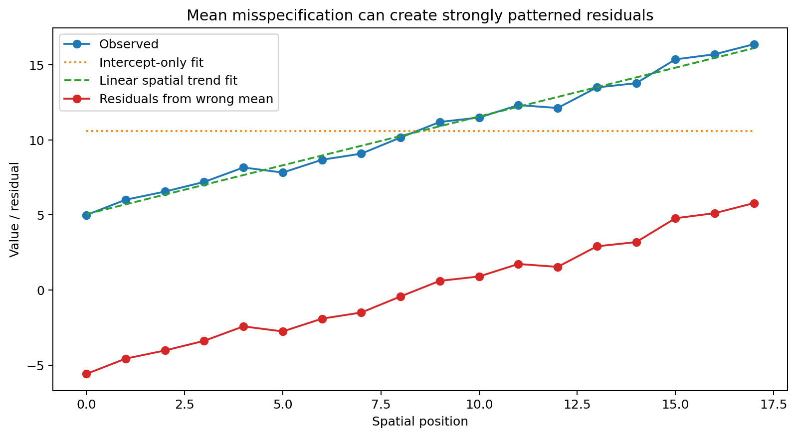
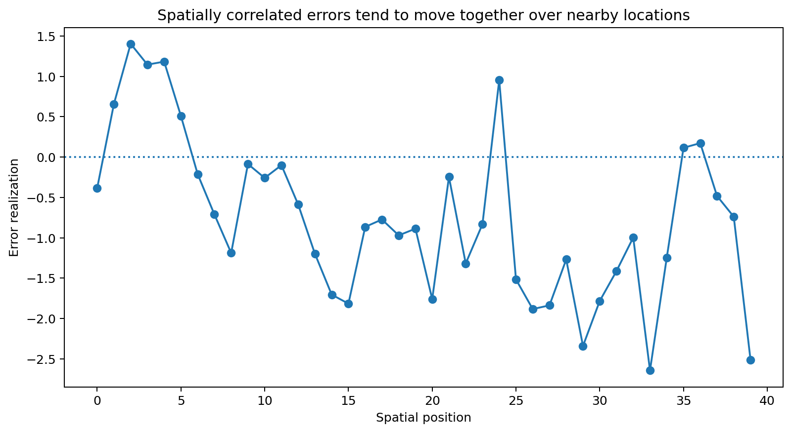
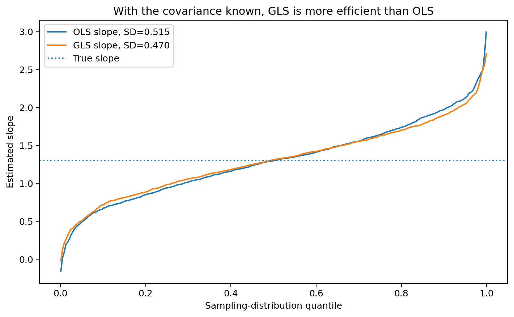
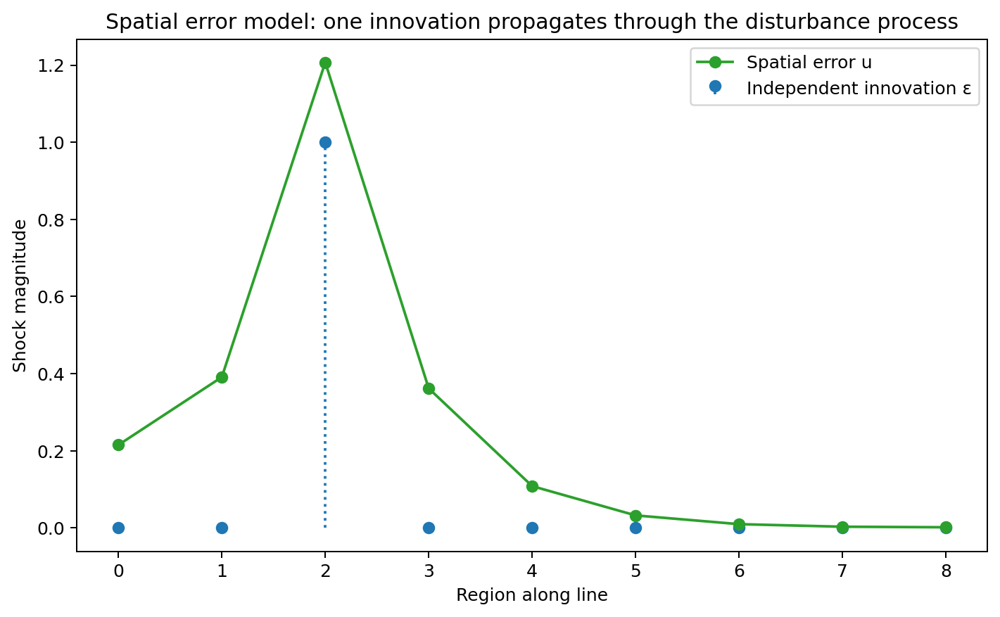
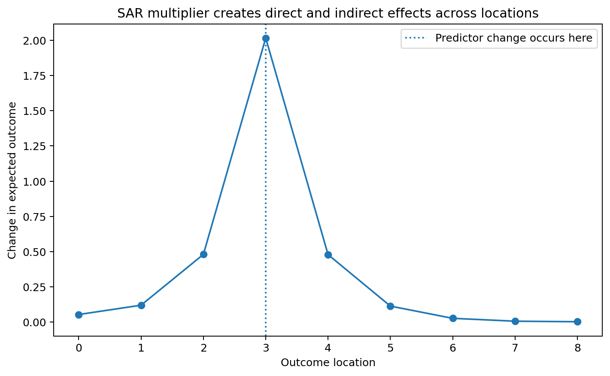
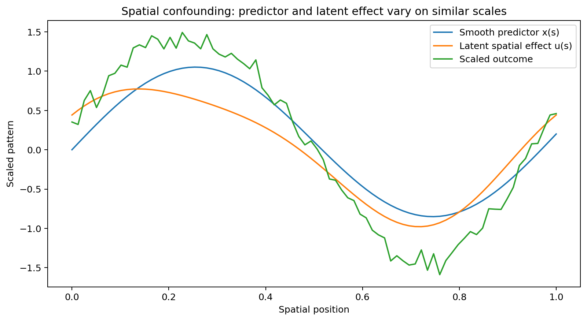
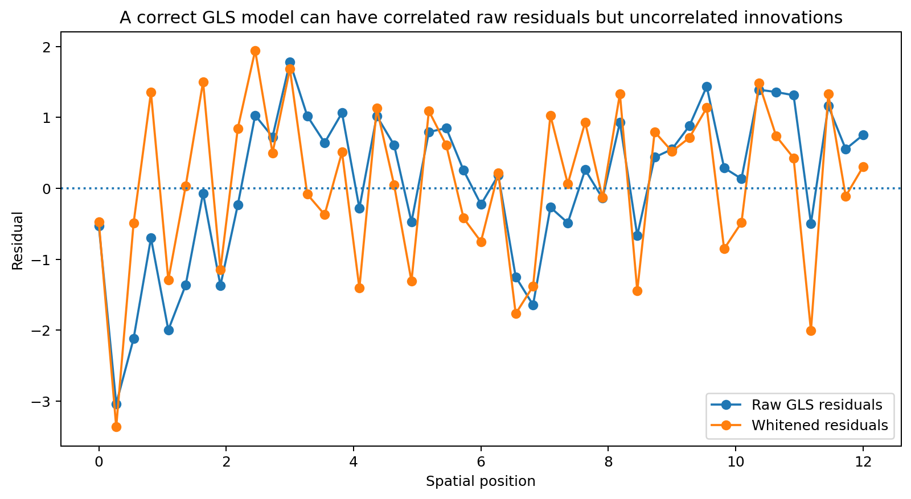
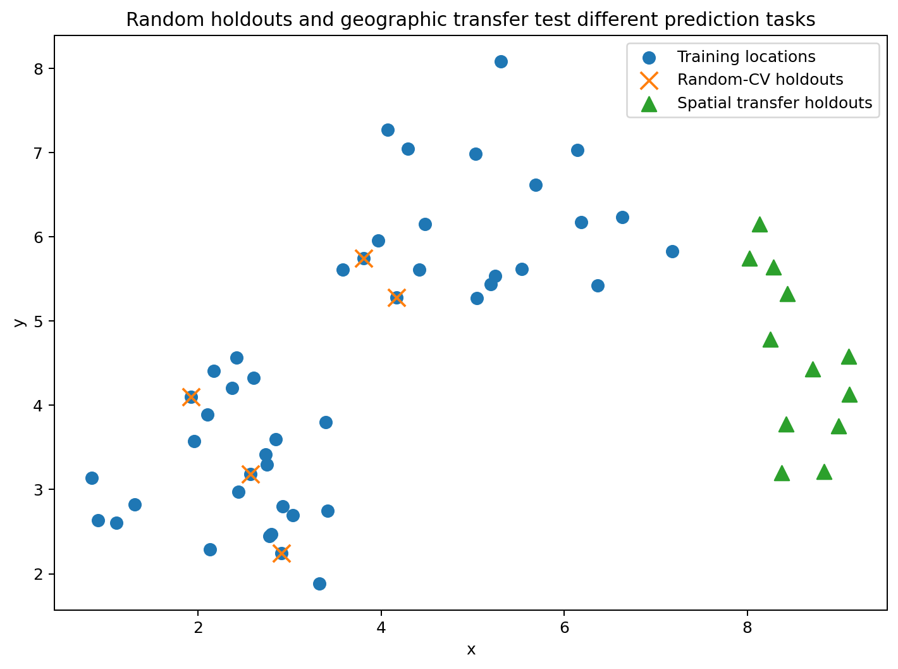

# Spatial Regression

Regression models the mean relationship between an outcome and its predictors.

A basic linear model is

$$
y=X\beta+\varepsilon,
$$

with

$$
E[\varepsilon]=0.
$$

In ordinary introductory regression, errors are often treated as independent with common variance:

$$
\mathrm{Cov}(\varepsilon) =
\sigma^2 I.
$$

Spatial data often violate that assumption because nearby observations can have correlated unexplained variation.

A more general model is

$$
\boxed{
y=X\beta+\varepsilon,
\qquad
\mathrm{Cov}(\varepsilon)=\Sigma
}.
$$

Spatial regression becomes important when spatial structure remains after the mean relationship has been modeled.

## Learning objectives

After this chapter, you should be able to:

1. explain what spatial regression is trying to model;
2. distinguish mean misspecification from residual spatial dependence;
3. explain what correlated errors do and do not imply for OLS;
4. calculate OLS and GLS estimates in a small numerical example;
5. explain why GLS uses $\Sigma^{-1}$;
6. interpret a spatial error model;
7. interpret a spatial lag/SAR model;
8. explain why $Wy$ is endogenous in a simultaneous SAR model;
9. calculate simple direct and indirect SAR effects;
10. explain spatial confounding;
11. distinguish raw residuals from whitened/innovation residuals;
12. separate prediction performance from coefficient interpretation.

## Start with the mean model

Suppose

$$
y_i
$$

is an outcome observed at spatial location $s_i$, and

$$
x_i
$$

is a predictor.

A linear mean model is

$$
E[y_i\mid X] =
\beta_0+\beta_1x_i.
$$

In matrix notation,

$$
E[y\mid X] =
X\beta.
$$

The residual is

$$
e_i =
y_i-\hat y_i.
$$

Spatial regression is useful when independent errors do not adequately represent the residual structure.

## Why the mean must be diagnosed first

Residual spatial autocorrelation can appear when the mean model is missing systematic spatial structure.

Possible causes include:

- an omitted spatially varying predictor;
- an omitted regional effect;
- a nonlinear relationship modeled as linear;
- an unmodeled spatial trend;
- genuine residual spatial dependence.

These mechanisms have different scientific interpretations.

If the mean model is misspecified, a spatial covariance term can absorb variation that should have been explained by the predictors.

## Numerical example: omitted spatial trend

Suppose observations lie at positions

$$
s=0,1,2,3,4.
$$

The true mean is

$$
m(s)=5+2s.
$$

Suppose the observed values are

$$
y=
\begin{bmatrix}
5.2\\
7.1\\
9.0\\
11.2\\
12.9
\end{bmatrix}.
$$

If we incorrectly fit only an intercept, the fitted mean is

$$
\bar y =
\frac{5.2+7.1+9.0+11.2+12.9}{5}.
$$

The sum is

$$
45.4,
$$

so

$$
\bar y=9.08.
$$

The residuals are

$$
-3.88,\ -1.98,\ -0.08,\ 2.12,\ 3.82.
$$

These residuals are strongly spatially patterned.

But if we fit the spatial trend

$$
5+2s,
$$

the residuals become approximately

$$
0.2,\ 0.1,\ 0.0,\ 0.2,\ -0.1.
$$

Most of the apparent spatial dependence disappears once the mean structure is modeled correctly.

## OLS with spatially correlated errors

The OLS estimator is

$$
\boxed{
\hat\beta_{\text{OLS}} =
(X^\top X)^{-1}X^\top y
}.
$$

A common misunderstanding is:

> Spatially correlated errors automatically make OLS coefficients biased.

That is not generally true.

If

$$
E[\varepsilon\mid X]=0
$$

and the mean model is correctly specified, OLS can still be unbiased for $\beta$.

However, when the error covariance is non-spherical:

$$
\mathrm{Cov}(\varepsilon)=\Sigma\neq\sigma^2I,
$$

OLS is generally:

- inefficient compared with GLS;
- accompanied by incorrect **usual** standard errors if independence is falsely assumed.

## The correct covariance of the OLS estimator

Under

$$
y=X\beta+\varepsilon
$$

with

$$
\mathrm{Cov}(\varepsilon)=\Sigma,
$$

the OLS estimator still has

$$
E[\hat\beta_{\text{OLS}}]=\beta
$$

under exogeneity.

Its covariance is

$$
\boxed{
\mathrm{Cov}(\hat\beta_{\text{OLS}}) =
(X^\top X)^{-1}
X^\top\Sigma X
(X^\top X)^{-1}
}.
$$

The familiar formula

$$
\sigma^2(X^\top X)^{-1}
$$

is only correct under the much simpler covariance assumption

$$
\Sigma=\sigma^2I.
$$

This distinction is fundamental.

## What spatial correlation does to information

Suppose two nearby observations are extremely similar because their errors are strongly correlated.

They do not contain as much independent information as two equally precise observations whose errors are independent.

Ignoring this redundancy often makes the estimated uncertainty too small.

This parallels the logic of kriging: nearby observations can be informative about the same local process, but they can also be redundant.

## A structured covariance model

For point-referenced spatial regression, one common covariance model is

$$
\Sigma_{ij} =
\sigma_s^2
\exp\left(
-\frac{d_{ij}}{a}
\right)
+
\sigma_n^2 I(i=j),
$$

where

- $d_{ij}$ is distance between locations;
- $\sigma_s^2$ is spatially structured variance;
- $a$ is a spatial scale;
- $\sigma_n^2$ is nugget or independent noise variance.

For nearby locations, $d_{ij}$ is small, so the spatial covariance is large.

As distance increases, the spatial covariance decreases.

## Numerical covariance example

Suppose

$$
\sigma_s^2=4,
\qquad
a=2,
\qquad
\sigma_n^2=1.
$$

For two different locations 1 unit apart,

$$
\Sigma_{ij} =
4e^{-1/2}.
$$

Since

$$
e^{-1/2}\approx0.6065,
$$

$$
\Sigma_{ij}
\approx
4(0.6065) =
2.426.
$$

At the same location,

$$
\Sigma_{ii} =
4+1 =
5.
$$

Therefore the corresponding correlation at distance 1 is approximately

$$
\frac{2.426}{5} =
0.485.
$$

The errors therefore have substantial correlation at this distance.

## Generalized least squares

If the covariance matrix $\Sigma$ is known, generalized least squares is

$$
\boxed{
\hat\beta_{\text{GLS}} =
(X^\top\Sigma^{-1}X)^{-1}
X^\top\Sigma^{-1}y
}.
$$

If

$$
\Sigma=\sigma^2I,
$$

then

$$
\Sigma^{-1} =
\frac1{\sigma^2}I,
$$

and the constant factor cancels.

GLS therefore reduces to OLS in this special case.

## What GLS is calculating

OLS minimizes

$$
(y-X\beta)^\top(y-X\beta).
$$

This is the ordinary unweighted sum of squared residuals.

GLS minimizes

$$
\boxed{
(y-X\beta)^\top
\Sigma^{-1}
(y-X\beta)
}.
$$

The inverse covariance matrix adjusts the fitting criterion for:

- unequal uncertainty;
- correlation among observations.

Directions in the residual space with greater redundancy receive less effective weight.

## Whitening interpretation

Suppose $L$ satisfies

$$
LL^\top=\Sigma.
$$

For example, $L$ can be a Cholesky factor.

Define transformed data

$$
y^*=L^{-1}y
$$

and

$$
X^*=L^{-1}X.
$$

Then

$$
y^* =
X^*\beta+\varepsilon^*
$$

with

$$
\mathrm{Cov}(\varepsilon^*)=I.
$$

GLS is exactly OLS applied to the whitened data:

$$
\hat\beta_{\text{GLS}} =
(X^{*\top}X^*)^{-1}X^{*\top}y^*.
$$

This whitening view is often the clearest way to understand GLS.

## Fully worked OLS versus GLS example

Consider three observations.

The design matrix is

$$
X=
\begin{bmatrix}
1&0\\
1&1\\
1&2
\end{bmatrix}
$$

and the outcome is

$$
y=
\begin{bmatrix}
1\\
2\\
4
\end{bmatrix}.
$$

The first column is the intercept, and the second is the predictor.

## OLS calculation

First calculate

$$
X^\top X.
$$

We obtain

$$
X^\top X =
\begin{bmatrix}
3&3\\
3&5
\end{bmatrix}.
$$

Also,

$$
X^\top y =
\begin{bmatrix}
7\\
10
\end{bmatrix}.
$$

The inverse is

$$
(X^\top X)^{-1} =
\frac1{6}
\begin{bmatrix}
5&-3\\
-3&3
\end{bmatrix}.
$$

Therefore

$$
\hat\beta_{\text{OLS}} =
(X^\top X)^{-1}X^\top y.
$$

Substitute:

$$
\hat\beta_{\text{OLS}} =
\frac1{6}
\begin{bmatrix}
5&-3\\
-3&3
\end{bmatrix}
\begin{bmatrix}
7\\
10
\end{bmatrix}.
$$

The intercept is

$$
\frac{35-30}{6} =
\frac56
\approx0.833.
$$

The slope is

$$
\frac{-21+30}{6} =
\frac96 =
1.5.
$$

Thus

$$
\boxed{
\hat\beta_{\text{OLS}} =
\begin{bmatrix}
0.833\\
1.500
\end{bmatrix}
}.
$$

## GLS calculation with correlated errors

Suppose the covariance matrix is

$$
\Sigma =
\begin{bmatrix}
1 & 0.6 & 0.2\\
0.6 & 1 & 0.6\\
0.2 & 0.6 & 1
\end{bmatrix}.
$$

This is a positive-definite covariance matrix in which adjacent observations have strongly correlated errors.

Its inverse is approximately

$$
\Sigma^{-1} =
\begin{bmatrix}
1.6667 & -1.2500 & 0.4167\\
-1.2500 & 2.5000 & -1.2500\\
0.4167 & -1.2500 & 1.6667
\end{bmatrix}.
$$

Now calculate

$$
X^\top\Sigma^{-1}X
\approx
\begin{bmatrix}
1.6667 & 1.6667\\
1.6667 & 4.1667
\end{bmatrix}
$$

and

$$
X^\top\Sigma^{-1}y
\approx
\begin{bmatrix}
4.1667\\
7.9167
\end{bmatrix}.
$$

Therefore

$$
\hat\beta_{\text{GLS}} =
(X^\top\Sigma^{-1}X)^{-1}
X^\top\Sigma^{-1}y
$$

gives

$$
\boxed{
\hat\beta_{\text{GLS}} =
\begin{bmatrix}
1.000\\
1.500
\end{bmatrix}
}.
$$

In this example the slope happens to remain 1.5, while the intercept changes from the OLS estimate $0.833$ to $1.000$.

That is specific to this small example and should not be treated as a general result.

The key point is that GLS changes how observations are combined by accounting for error covariance.

## Efficiency: why GLS can estimate coefficients more precisely

Under the correctly specified covariance model, the GLS covariance is

$$
\boxed{
\mathrm{Cov}(\hat\beta_{\text{GLS}}) =
(X^\top\Sigma^{-1}X)^{-1}
}.
$$

Under the assumed covariance model, GLS is the efficient linear unbiased estimator.

In repeated samples, OLS and GLS may both be centered on the true coefficient, while GLS has smaller sampling variance.

## Feasible GLS

In real applications, $\Sigma$ is almost never known exactly.

Instead, its parameters must be estimated.

The workflow is then roughly:

1. specify a covariance family;
2. estimate covariance parameters;
3. construct $\hat\Sigma$;
4. replace $\Sigma$ with $\hat\Sigma$;
5. estimate $\beta$.

This is often called **feasible GLS**.

Uncertainty should ideally account for the fact that $\Sigma$ was estimated rather than known.

The companion simulation uses the true $\Sigma$ only as a teaching device.

## Spatial error models for areal data

For areal data, spatial dependence is often represented through a spatial weights matrix $W$.

A spatial error model can be written

$$
y=X\beta+u,
$$

with

$$
u=\lambda Wu+\varepsilon.
$$

Rearrange:

$$
(I-\lambda W)u=\varepsilon.
$$

Therefore

$$
\boxed{
u=(I-\lambda W)^{-1}\varepsilon
}.
$$

## What the spatial error parameter means

The parameter

$$
\lambda
$$

describes spatial dependence in the disturbance process.

A local shock in $\varepsilon$ can propagate through the disturbance process.

This can represent:

- omitted spatially correlated variables;
- shared measurement processes;
- latent regional influences.

It does not imply that neighboring observed outcomes directly cause one another.

## Numerical spatial-error example

Suppose three regions are arranged in a line:

$$
A-B-C.
$$

Use row-standardized weights

$$
W=
\begin{bmatrix}
0&1&0\\
1/2&0&1/2\\
0&1&0
\end{bmatrix}.
$$

Let

$$
\lambda=0.4.
$$

Suppose the independent innovations are

$$
\varepsilon=
\begin{bmatrix}
1\\
0\\
0
\end{bmatrix}.
$$

Then

$$
u =
(I-0.4W)^{-1}\varepsilon.
$$

Numerically,

$$
u
\approx
\begin{bmatrix}
1.095\\
0.238\\
0.095
\end{bmatrix}.
$$

A shock originating in region A creates correlated disturbance components in B and C.

The propagation occurs in the error process.

## Spatial lag / SAR outcome model

A spatial autoregressive outcome model is

$$
\boxed{
y=\rho Wy+X\beta+\varepsilon
}.
$$

The term

$$
Wy
$$

is the spatial lag of the outcome.

Rearrange:

$$
(I-\rho W)y =
X\beta+\varepsilon.
$$

Therefore

$$
\boxed{
y =
(I-\rho W)^{-1}
(X\beta+\varepsilon)
}.
$$

The matrix

$$
(I-\rho W)^{-1}
$$

is called the spatial multiplier.

## Why OLS on $y$ versus $Wy$ is generally inappropriate

In the SAR model,

$$
Wy
$$

contains neighboring outcomes.

But those neighboring outcomes are themselves determined simultaneously by:

$$
y=\rho Wy+X\beta+\varepsilon.
$$

Therefore $Wy$ is generally correlated with the disturbance term.

This creates an endogeneity problem.

Ordinary OLS applied directly to

$$
y=\rho Wy+X\beta+\varepsilon
$$

does not generally estimate $\rho$ consistently.

SAR models therefore require methods designed for the simultaneous spatial system, such as maximum likelihood or suitable instrumental-variable or GMM methods.

## SAR is not just regression with a neighbor average

It is tempting to interpret

$$
\rho Wy
$$

as if neighboring outcomes were an ordinary predictor.

But $Wy$ is endogenous because it is constructed from the same jointly determined outcome vector.

The model determines all locations simultaneously.

This changes both estimation and interpretation.

## Direct and indirect effects in SAR models

Suppose there is one predictor $x$:

$$
y =
\rho Wy+\beta x+\varepsilon.
$$

Then

$$
E[y\mid x] =
(I-\rho W)^{-1}\beta x.
$$

The derivative of expected outcomes with respect to $x$ is

$$
\boxed{
\frac{\partial E[y]}{\partial x^\top} =
(I-\rho W)^{-1}\beta
}.
$$

The result is a matrix.

Its diagonal entries describe effects on the same location.

Its off-diagonal entries describe spillover effects on other locations.

## Three-region SAR impact example

Again use

$$
A-B-C
$$

with

$$
W=
\begin{bmatrix}
0&1&0\\
1/2&0&1/2\\
0&1&0
\end{bmatrix}.
$$

Let

$$
\rho=0.4
$$

and

$$
\beta=2.
$$

Then

$$
S =
(I-0.4W)^{-1}.
$$

Numerically,

$$
S
\approx
\begin{bmatrix}
1.095 & 0.476 & 0.095\\
0.238 & 1.190 & 0.238\\
0.095 & 0.476 & 1.095
\end{bmatrix}.
$$

Multiply by

$$
\beta=2.
$$

The impact matrix is approximately

$$
2S =
\begin{bmatrix}
2.190 & 0.952 & 0.190\\
0.476 & 2.381 & 0.476\\
0.190 & 0.952 & 2.190
\end{bmatrix}.
$$

## Interpret one predictor change

Suppose $x_A$ increases by one unit.

The first column of the impact matrix gives the effect:

$$
\Delta E[y]
\approx
\begin{bmatrix}
2.190\\
0.476\\
0.190
\end{bmatrix}.
$$

So:

- outcome A increases by about 2.19;
- outcome B increases by about 0.48;
- outcome C increases by about 0.19.

The ordinary coefficient

$$
\beta=2
$$

is therefore not, by itself, the total effect at A or across the system.

## Mean structure, spatial error, or spatial lag?

A significant Moran statistic on OLS residuals indicates that spatial structure remains in the residuals.

It does not, by itself, identify which spatial model should be used.

Several explanations are possible.

### Missing mean structure

Maybe a spatially varying covariate was omitted.

### Spatial error dependence

Maybe unobserved disturbances are spatially correlated.

### Spatial lag dependence

Maybe the scientific mechanism genuinely implies simultaneous outcome spillovers.

### Continuous covariance

For point-referenced data, a distance-based covariance model may be more natural than a discrete $W$.

Model choice should follow the scientific mechanism and data support, not only the residual Moran statistic.

## A practical decision sequence

Before adding a spatial dependence term, ask:

1. Is the outcome modeled on the correct scale?
2. Are important covariates missing?
3. Is the functional form plausible?
4. Are regional fixed effects needed?
5. Is dependence naturally continuous in distance?
6. Is $W$ substantively meaningful?
7. Is there a credible outcome-spillover mechanism?
8. Is the goal prediction, description, or causal inference?

The answers help narrow the appropriate model class.

## Spatial confounding

Spatial predictors often vary smoothly over space.

Latent spatial effects also vary smoothly.

The two components can therefore explain similar spatial patterns in the outcome.

Suppose

$$
y(s) =
\beta x(s)
+
u(s)
+
\varepsilon(s),
$$

where

- $x(s)$ is a smooth spatial predictor;
- $u(s)$ is a flexible spatial random effect.

If $x(s)$ and $u(s)$ have similar spatial scales, the model may struggle to decide which component should explain a broad spatial pattern.

This is called **spatial confounding**.

## Why spatial confounding matters

A coefficient estimate can change when we change:

- covariance range;
- basis functions;
- smoothing penalty;
- priors;
- spatial resolution;
- included covariates.

This does not automatically mean that the spatial model is wrong.

It means that the predictor and latent spatial effect are competing to explain similar variation.

Coefficient interpretation should therefore be accompanied by sensitivity analysis.

## A coefficient is not made causal by adding a spatial effect

Suppose an observational study estimates

$$
y =
\beta x
+
\text{spatial random effect}
+
\varepsilon.
$$

Modeling spatial autocorrelation can improve:

- residual structure;
- standard errors;
- prediction.

But it does not automatically solve problems such as:

- unmeasured confounding;
- reverse causation;
- selection bias;
- measurement error;
- interference.

Causal interpretation requires a separate identification argument.

## Residual diagnostics after spatial modeling

After fitting a spatial model, the diagnostics should match the model structure.

For a standard OLS fit, inspect ordinary residuals.

For a GLS model,

$$
e=y-X\hat\beta_{\text{GLS}}
$$

can still be spatially correlated because the model explicitly says the errors have covariance $\Sigma$.

It is therefore often useful to inspect **whitened residuals**:

$$
e^* =
L^{-1}e,
\qquad
LL^\top=\Sigma.
$$

If the covariance model is adequate, $e^*$ should be much closer to uncorrelated noise.

## Residual Moran's I after GLS

An important point:

> A good GLS model does not necessarily make the raw residual map look spatially independent.

The raw residuals are estimates of a process that the model explicitly allows to be spatially correlated.

The more relevant question is whether the remaining unexplained structure, after accounting for the fitted covariance, is compatible with the model.

Whitened or innovation residuals provide one way to check this.

## Residual variograms

For point-referenced regression, another useful diagnostic is the residual variogram.

After fitting the mean model, calculate residuals

$$
e_i=y_i-\hat y_i.
$$

Then examine whether residual semivariance changes with distance.

If strong structure remains and was not included in the covariance model, the model may be incomplete.

## Heteroskedasticity

Spatial dependence and heteroskedasticity are separate features of the error structure.

A model can have:

- independent but unequal-variance errors;
- correlated equal-variance errors;
- both correlation and unequal variance.

Therefore residual diagnostics should inspect both:

- spatial structure;
- variance patterns.

## Influential locations

Spatial data can contain influential observations.

An observation may be influential because it has:

- an extreme predictor value;
- an unusual outcome;
- a strategically important spatial position;
- few nearby neighbors;
- high leverage in the mean model.

Influence diagnostics should therefore be interpreted together with the observation's spatial location.

## Prediction and coefficient inference are different goals

A model can predict well because location acts as a proxy for omitted processes.

That does not mean its regression coefficients have strong scientific interpretations.

For example, a flexible spatial effect may absorb most of the broad pattern and yield excellent prediction.

But the estimated coefficient for a smooth exposure may become unstable.

Prediction asks:

> Can we accurately estimate outcomes at new locations?

Parameter inference asks:

> What does $\beta$ tell us about the relationship between predictors and outcome?

These goals can conflict.

## Random cross-validation can be too optimistic

Suppose nearby locations are strongly correlated.

In ordinary random cross-validation, a held-out point may still have training observations only a short distance away.

A spatial model may predict it very well using nearby information.

But if the deployment task is to predict in a new geographic region, that validation result may be much too optimistic.

Use spatially blocked validation when geographic transfer is the actual prediction goal.

## Model comparison should use the right target

If the goal is coefficient inference, compare:

- coefficient stability;
- uncertainty calibration;
- residual structure;
- scientific plausibility.

If the goal is spatial prediction, compare:

- held-out prediction error;
- uncertainty calibration;
- transfer performance at relevant distances.

Do not choose a model only because it has the smallest in-sample residual sum of squares.

## A complete workflow

A practical spatial-regression analysis can proceed as follows.

### define the spatial support

Decide whether data are:

- areal;
- point-referenced;
- another structure.

### inspect the response and covariates spatially

Map:

- outcome;
- major predictors;
- exposure;
- missingness.

### fit and diagnose the mean structure

Check:

- linearity;
- interactions;
- omitted trend;
- regional effects.

### inspect residual spatial structure

Use:

- residual Moran's $I$ for areal data;
- residual variograms for point-referenced data;
- residual maps.

### choose a dependence model scientifically

Possibilities include:

- GLS with continuous covariance;
- spatial error model;
- SAR/lag model;
- spatial random effects;
- Gaussian-process regression.

### estimate the model using appropriate methods

Do not fit an endogenous SAR lag with ordinary OLS.

### inspect model-appropriate residuals

Use:

- raw residuals where appropriate;
- whitened residuals;
- innovation residuals;
- residual spatial summaries.

### evaluate coefficient sensitivity

Check sensitivity to:

- covariance family;
- neighborhood definition;
- spatial scale;
- included covariates.

### validate according to the prediction task

Use spatial validation when extrapolation across space matters.

## Common mistakes

### adding a spatial covariance before diagnosing the mean

The spatial term may absorb an omitted trend.

### saying correlated errors automatically bias OLS coefficients

Under correct mean specification and exogeneity, OLS can remain unbiased, although usual OLS standard errors are generally invalid and OLS is inefficient.

### interpreting $\lambda$ in a spatial error model as outcome spillover

It describes dependence in the disturbance process.

### fitting $y$ on $Wy$ using ordinary OLS in a SAR model

$Wy$ is generally endogenous.

### interpreting the SAR coefficient $\beta$ like an ordinary regression slope

Effects propagate through

$$
(I-\rho W)^{-1}.
$$

### expecting raw GLS residuals to be spatially independent

The fitted covariance model explicitly allows correlation in the raw residual process.

### assuming a spatial random effect makes a coefficient causal

Causal identification requires more than residual spatial adjustment.

### evaluating geographic transfer using only random cross-validation

Nearby training observations can make performance look unrealistically good.

## Compact worked comparison

Suppose the true data-generating model is

$$
y_i =
3+1.5x_i+\varepsilon_i
$$

with

$$
\mathrm{Cov}(\varepsilon_i,\varepsilon_j) =
2e^{-d_{ij}/5}.
$$

An OLS fit gives

$$
\hat\beta_1=1.47.
$$

The coefficient can be close to the true value because the mean model is correctly specified.

However, the naive OLS standard error assumes independent errors and reports

$$
SE_{\text{naive}}=0.08.
$$

A covariance-aware analysis gives

$$
SE=0.18.
$$

The main problem with the naive analysis is not necessarily the point estimate.

It is the claim of excessive precision.

## Concept map

The logic is

$$
\text{spatial outcome + predictors}
$$

$$
\downarrow
$$

$$
\text{specify mean }X\beta
$$

$$
\downarrow
$$

$$
\text{diagnose residual spatial structure}
$$

$$
\downarrow
$$

$$
\text{ask why dependence remains}
$$

$$
\downarrow
$$

$$
\begin{array}{ccc}
\text{continuous covariance}
&
\text{spatial error}
&
\text{SAR/lag}
\end{array}
$$

$$
\downarrow
$$

$$
\text{fit with an estimator appropriate to that structure}
$$

$$
\downarrow
$$

$$
\text{inspect model-appropriate residuals}
$$

$$
\downarrow
$$

$$
\text{separate coefficient inference from prediction}.
$$

The central lesson is:

> Spatial regression is not one model. It is a family of strategies for separating the mean relationship from spatially structured residual or outcome dependence.

## Questions students should be able to answer

1. Why should the mean model be checked before adding a spatial dependence term?
2. Can OLS remain unbiased with spatially correlated errors?
3. Why can the usual OLS standard errors be wrong under spatial dependence?
4. What does $\Sigma^{-1}$ do in GLS?
5. How is GLS related to whitening?
6. Why does GLS reduce to OLS when $\Sigma=\sigma^2I$?
7. What does $\lambda$ represent in a spatial error model?
8. What does $\rho$ represent in a SAR model?
9. Why is $Wy$ endogenous in a simultaneous SAR model?
10. Why is $\beta$ in a SAR model not the complete effect?
11. What are direct and indirect spatial effects?
12. What is spatial confounding?
13. Why can raw GLS residuals still be spatially correlated?
14. Why are spatially blocked validation and random validation answering different questions?
15. Why does spatial adjustment not automatically create causal identification?
