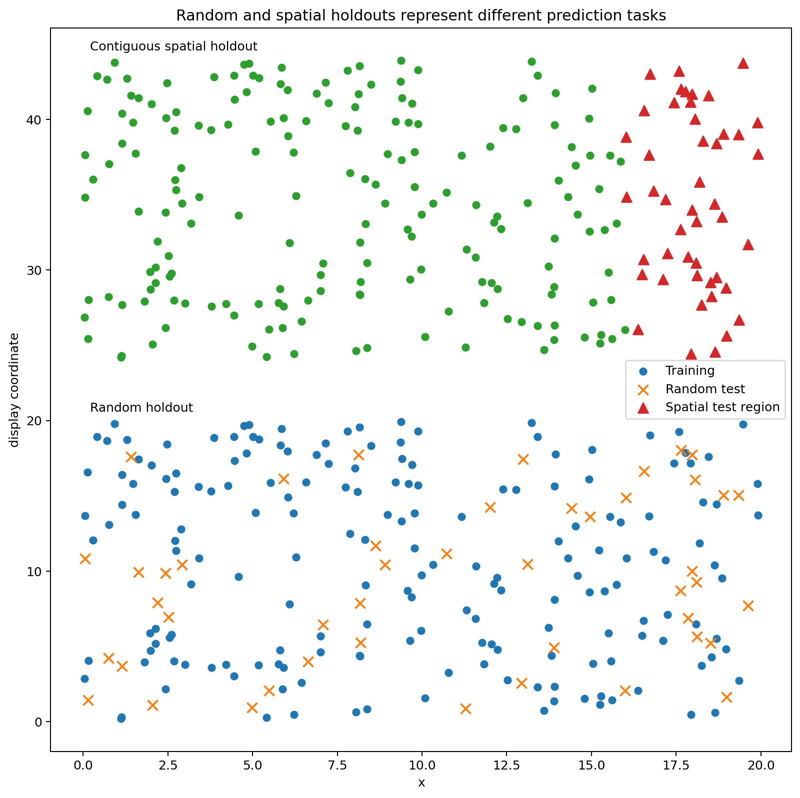
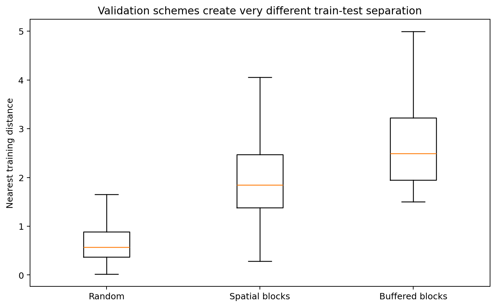
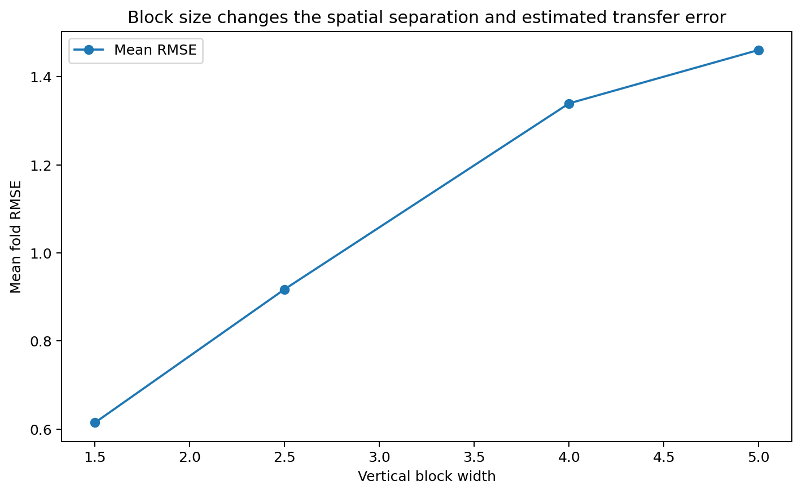
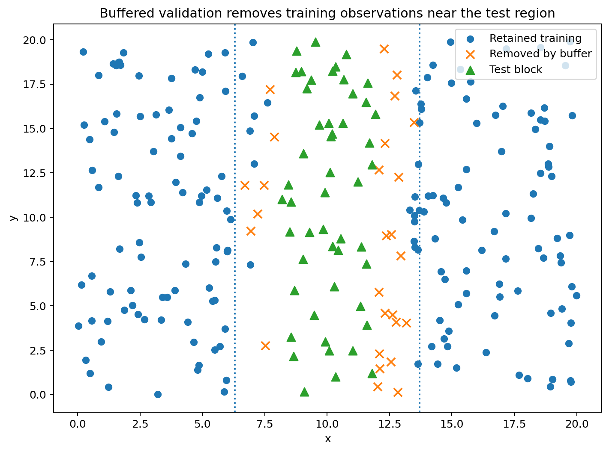
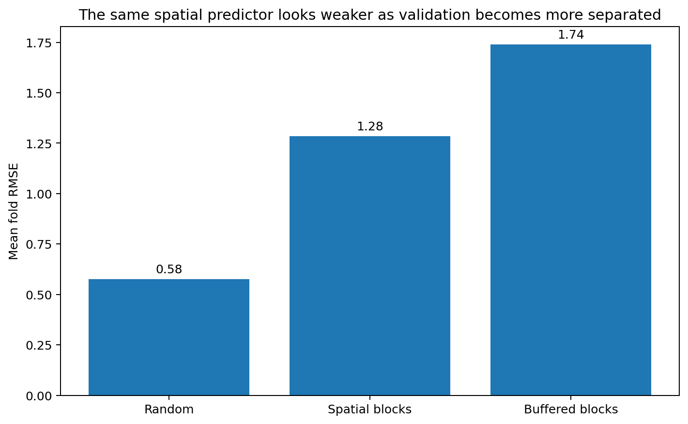
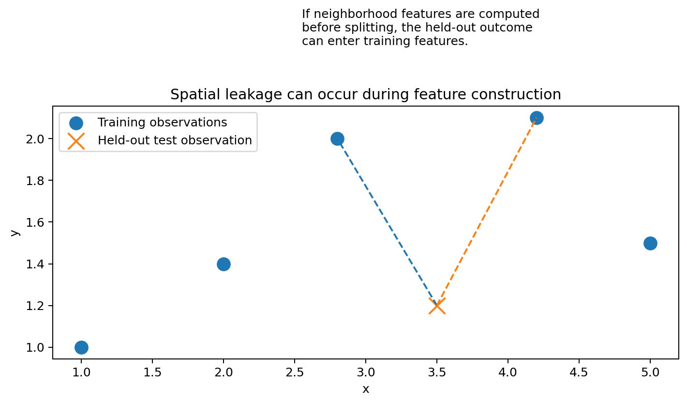
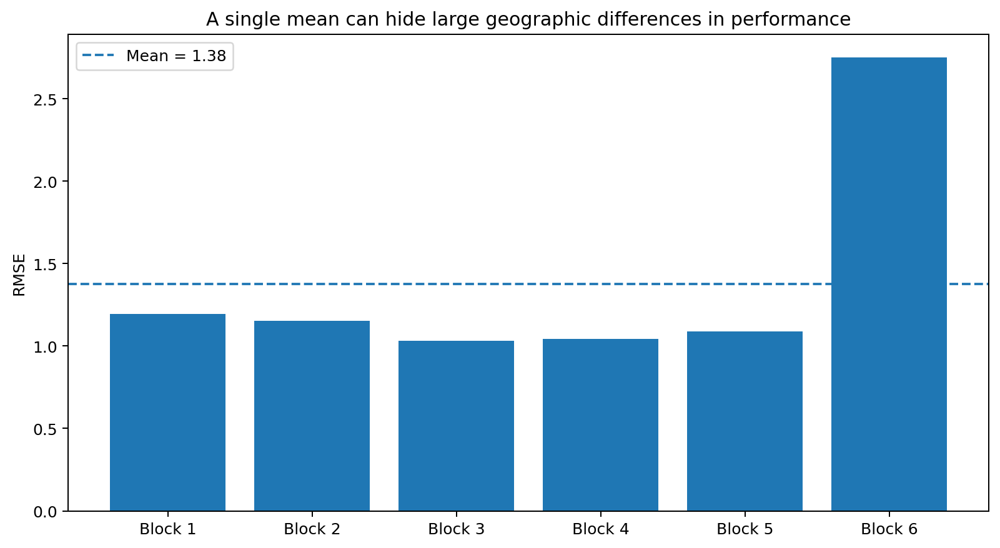

# Spatial Validation: A Student Guide to Random, Blocked, and Buffered Evaluation

Spatial model performance depends not only on **which observations are held out**, but also on **where the held-out observations are located relative to the training data**.

This makes spatial validation fundamentally different from ordinary random train/test splitting.

A random split often leaves test locations surrounded by nearby training observations. That evaluates an interpolation-like task.

A geographically separated holdout asks a harder question:

> Can the model predict where nearby observations are unavailable?

Neither design is universally correct. The correct validation design is the one that best reproduces the information conditions expected when the model is actually deployed.

The companion script [`spatial_validation_visualizations.py`](../../scripts/spatial_statistics/spatial_validation_visualizations.py) generates the figures and numerical examples in this chapter.

Run it with:

```bash
python scripts/spatial_statistics/spatial_validation_visualizations.py
```

The script creates a `assets/spatial_statistics/spatial_validation/` directory automatically.

---

## Learning objectives

After this chapter, you should be able to:

1. explain why random cross-validation can be optimistic for spatial prediction;
2. distinguish interpolation, spatial transfer, and extrapolation;
3. construct conceptual random, blocked, and buffered validation schemes;
4. explain why block size matters;
5. explain what a spatial buffer accomplishes;
6. calculate RMSE and compare fold-level performance;
7. diagnose validation difficulty using train-to-test distance;
8. identify spatial leakage in preprocessing;
9. explain why kriging variograms should sometimes be re-estimated inside folds;
10. distinguish average predictive performance from uncertainty in the performance estimate;
11. explain why unsupported extrapolation cannot be validated by resampling alone;
12. design a final geographic test set after model selection.

---

## 1. Validation is a question about future information

Suppose a model is trained on observations

\[
\{(s_i,y_i):i\in\mathcal T\}
\]

and tested on observations

\[
\{(s_j,y_j):j\in\mathcal V\}.
\]

A validation score depends on more than the values in \(\mathcal T\) and \(\mathcal V\).

It also depends on the geometry:

\[
d(s_j,\mathcal T)
=
\min_{i\in\mathcal T}
d(s_j,s_i).
\]

This is the distance from test location \(s_j\) to its nearest training observation.

For many spatial predictors, prediction is easier when this distance is small.

That means two validation designs with the same number of test observations can represent very different prediction tasks.

---

## 2. Three common deployment targets

Spatial validation should begin by defining the deployment target.

---

## 3. Interpolation

Interpolation means predicting **inside a region that is already well sampled**.

A typical target location has nearby training observations.

Examples include:

- filling gaps between monitoring stations;
- mapping soil properties inside an intensively sampled field;
- predicting missing raster cells inside an observed domain.

A random split may sometimes approximate this situation because held-out observations remain close to training data.



---

## 4. Spatial transfer

Spatial transfer means predicting in a geographically distinct region that was not used for training.

Examples include:

- training on northern districts and predicting southern districts;
- training on sampled forest stands and predicting a new stand;
- training in several watersheds and predicting another watershed.

A random split is usually too easy for this problem.

Blocked or leave-region-out validation is more appropriate.

---

## 5. Extrapolation beyond observed conditions

The most difficult case occurs when a new region differs not only geographically but also in predictor values or data-generating process.

Examples include:

- predicting into a hotter climate regime than observed in training;
- predicting a species into an elevation range absent from training;
- applying an urban model to rural areas;
- transferring a disease model to a population with different demographics.

This is **extrapolation**.

No resampling method can create evidence for conditions absent from the original dataset.

Validation can only estimate extrapolation performance if genuinely representative extrapolation regions exist in the data.

---

## 6. Random train/test splitting

In a random split, observations are shuffled and assigned to folds without using geography.

This is familiar from ordinary machine learning.

For independent observations, random splitting can be appropriate.

For spatially dependent observations, it can place training and test locations extremely close together.

That can create an easier task than deployment.

---

## 7. Why random splits can be optimistic

Suppose a test location is only

\[
50\text{ m}
\]

from a training observation.

If the spatial correlation range is

\[
2\text{ km},
\]

the training observation contains substantial information about the held-out test value.

Now suppose real deployment occurs

\[
10\text{ km}
\]

from the nearest observation.

The validation and deployment problems are not comparable.

The random split estimates:

> performance when nearby training information is usually available.

The deployment task asks:

> performance when nearby information is unavailable.

---

## 8. A simple distance diagnostic

For each test observation \(j\), calculate

\[
d_j
=
\min_{i\in\mathcal T}
d(s_j,s_i).
\]

Then summarize:

- median nearest-training distance;
- 90th percentile;
- maximum distance.

A validation design is more transfer-like when these distances resemble deployment distances.



---

## 9. Numerical distance example

Suppose five test locations have nearest-training distances

\[
0.2,\ 0.3,\ 0.4,\ 0.5,\ 0.6
\]

km under random CV.

The mean distance is

\[
\frac{0.2+0.3+0.4+0.5+0.6}{5}
=
\frac{2.0}{5}
=
0.4\text{ km}.
\]

Under blocked CV, suppose the distances are

\[
2.1,\ 2.5,\ 2.7,\ 3.0,\ 3.2.
\]

The mean is

\[
\frac{13.5}{5}
=
2.7\text{ km}.
\]

These two schemes are evaluating very different spatial separation.

---

## 10. Spatial blocks

A common approach is to partition the study area into geographic blocks and hold out one or more complete blocks.

For example, divide a rectangular region into:

- vertical strips;
- horizontal strips;
- square tiles;
- ecological regions;
- watersheds;
- administrative regions.

The blocks should reflect the deployment question.

---

## 11. Leave-one-block-out validation

Suppose the region is divided into five spatial blocks.

For fold \(k\):

1. block \(k\) is the test set;
2. all other blocks are training data;
3. fit the entire modeling pipeline on training data;
4. predict the held-out block;
5. calculate performance.

Repeat for all five blocks.

This creates five geographically distinct validation tasks.

---

## 12. Block size matters

Tiny spatial blocks can leave test observations almost adjacent to training observations.

That defeats the purpose of geographic separation.

Very large blocks create a harder transfer task, but may leave too little training data.

The block size should reflect:

- the spatial dependence range;
- the expected deployment distance;
- the spatial support of predictions;
- practical sample-size constraints.



---

## 13. Relationship to correlation range

Suppose residual correlation becomes weak after approximately

\[
5\text{ km}.
\]

If validation blocks are only

\[
500\text{ m}
\]

wide, test observations near a block edge can still have strongly correlated training observations immediately outside the block.

The validation task remains close to interpolation.

Using blocks several kilometers wide may better assess geographic transfer.

There is no universal rule such as:

> block size must equal exactly one variogram range.

The dependence range is one useful input, not an automatic answer.

---

## 14. Buffered validation

A buffered split goes one step further.

After selecting a test region, remove training observations within distance

\[
b
\]

of the test region.

The parameter \(b\) is the buffer width.



---

## 15. What the buffer is doing

Suppose a held-out test block is surrounded by training observations immediately outside its boundary.

Even though the test block itself is excluded, the task can remain easy.

A buffer imposes explicit minimum separation.

If

\[
b=3\text{ km},
\]

training observations within 3 km of the test block are removed for that fold.

This asks:

> How well can the model predict when nearby training information is unavailable?

---

## 16. Numerical buffer example

Suppose a test site has a training observation

\[
0.4\text{ km}
\]

away.

With no buffer, that observation remains available.

With

\[
b=1\text{ km},
\]

it is removed.

Suppose the next nearest training observation is

\[
2.3\text{ km}
\]

away.

The effective test-to-training separation changes from

\[
0.4
\]

to

\[
2.3\text{ km}.
\]

The validation task becomes much more difficult.

---

## 17. Buffers reduce training data

A larger buffer generally increases train-test separation but decreases the training sample size.

This creates a tradeoff.

A very large buffer can produce unrealistic training sets with:

- too few observations;
- poor geographic coverage;
- missing predictor ranges.

Therefore buffer width should reflect deployment conditions rather than being maximized mechanically.

---

## 18. Comparing performance with RMSE

A common prediction metric is root mean squared error:

\[
\boxed{
\operatorname{RMSE}
=
\sqrt{
\frac1m
\sum_{j=1}^m
(y_j-\hat y_j)^2
}
}.
\]

Smaller RMSE indicates more accurate predictions on the response scale.

---

## 19. Worked RMSE example

Suppose four test observations are

\[
y=
\begin{bmatrix}
10\\
12\\
14\\
16
\end{bmatrix}
\]

and predictions are

\[
\hat y=
\begin{bmatrix}
11\\
11\\
13\\
18
\end{bmatrix}.
\]

The errors are

\[
-1,\ 1,\ 1,\ -2.
\]

Squared errors are

\[
1,\ 1,\ 1,\ 4.
\]

Their mean is

\[
\frac{7}{4}
=
1.75.
\]

Therefore

\[
\operatorname{RMSE}
=
\sqrt{1.75}
\]

\[
\boxed{
\operatorname{RMSE}\approx1.323
}.
\]

---

## 20. Validation design can change the RMSE substantially

A spatial predictor can achieve:

\[
\operatorname{RMSE}_{\text{random}}
=
0.7,
\]

\[
\operatorname{RMSE}_{\text{block}}
=
1.8,
\]

and

\[
\operatorname{RMSE}_{\text{buffered}}
=
2.4.
\]

These are not contradictory results.

They describe different prediction tasks.

The correct question is not:

> Which RMSE is the true one?

It is:

> Which validation geometry resembles deployment?



---

## 21. A toy spatial predictor

The companion Python script uses inverse-distance weighting only to demonstrate validation geometry.

For a target \(s_0\), the predictor is

\[
\hat y(s_0)
=
\frac{
\sum_{i\in\mathcal N_k(s_0)}
w_i y_i
}{
\sum_{i\in\mathcal N_k(s_0)}w_i
},
\]

with

\[
w_i
=
\frac1{d(s_i,s_0)^p+\epsilon}.
\]

Nearby training observations receive larger weight.

This is intentionally simple.

The purpose is not to recommend inverse-distance weighting as the best spatial model.

The purpose is to make the consequence of train-test distance easy to see.

---

## 22. Why nearby training data make spatial prediction easier

Suppose a spatial process is smooth.

Then

\[
y(s)
\approx y(s+h)
\]

for small \(h\).

If random CV leaves a training site only a small distance from the test location, the model may almost directly recover the test value from local information.

A blocked split removes that advantage.

This is why random CV often estimates interpolation skill rather than transfer skill.

---

## 23. Leakage can be spatial

Validation can be optimistic even when the split itself is geographically correct.

Leakage occurs whenever information from held-out observations enters the training pipeline.

Examples include:

- calculating neighborhood features using test observations;
- interpolating a covariate with the full dataset before splitting;
- estimating a variogram once using all observations;
- tuning bandwidth using held-out outcomes;
- normalizing variables using test data;
- imputing missing values using the complete dataset;
- defining a regional aggregate that includes the target observation.

All data-dependent operations should be performed inside the training fold.

---

## 24. Leakage example: neighborhood mean

Suppose the feature for location \(i\) is

\[
x_i^{\text{nbr}}
=
\frac1{k}
\sum_{j\in N_k(i)}y_j.
\]

This feature directly uses neighboring outcomes.

If the neighborhood calculation is performed before splitting, a training row can contain information from a held-out test outcome.

The model has indirectly seen the answer.

The correct procedure is:

1. split the data;
2. construct the neighborhood feature using training observations only;
3. fit the model;
4. calculate test features using only information that would be available at deployment.



---

## 25. Preprocessing must be fold-specific

The same rule applies to ordinary preprocessing.

If a transformation is estimated from data, it belongs inside the resampling loop.

Examples include:

- feature scaling;
- PCA;
- imputation;
- bandwidth selection;
- feature selection;
- spatial basis construction;
- variogram fitting;
- covariance-family selection.

This is ordinary machine-learning leakage with an additional spatial dimension.

---

## 26. Cross-validation for kriging

Leave-one-out kriging removes one sampled site and predicts it from all remaining sites.

This often leaves nearby observations in the training data.

Therefore it mainly assesses local interpolation.

That may be exactly the right target for a densely sampled mapping problem.

It is not necessarily appropriate for transfer into a new geographic region.

---

## 27. Kriging example

Suppose a monitoring site is omitted.

Its two nearest remaining sites are only

\[
150\text{ m}
\]

and

\[
220\text{ m}
\]

away.

Leave-one-out kriging can perform very well.

But suppose the intended prediction area is

\[
8\text{ km}
\]

from the nearest monitor.

Leave-one-out accuracy does not directly estimate that deployment performance.

A blocked or buffered holdout is more relevant.

---

## 28. Refit the variogram inside each fold

Suppose the workflow is:

1. estimate an empirical variogram;
2. select a covariance family;
3. fit covariance parameters;
4. krige;
5. evaluate test error.

If steps 1–3 use the full dataset, the held-out observations influence the model structure before prediction.

That is leakage.

For a clean estimate of the entire modeling procedure, fit the variogram and covariance parameters using the training observations in each fold.

---

## 29. When full-data covariance fitting may still be useful

Sometimes the goal is not to estimate the full model-selection pipeline.

For example, an analyst may want to compare prediction formulas conditional on a covariance model fixed externally from previous studies.

Then keeping that covariance model fixed can be scientifically justified.

The validation design should state clearly what is considered fixed and what is re-estimated.

---

## 30. Hyperparameter tuning and nested spatial validation

Suppose block size, model type, or hyperparameters are chosen by cross-validation.

If the same folds are then used to report final performance, the estimate can be optimistic because those folds influenced model selection.

A stronger design is:

1. inner spatial CV for model selection;
2. outer spatial CV or final geographic test set for evaluation.

This is the spatial version of nested validation.

---

## 31. Final geographic test region

If the dataset is large enough, reserve a final geographic region that is never used for:

- feature engineering;
- hyperparameter tuning;
- covariance-family selection;
- block-size tuning;
- model comparison.

Use it only once for the final performance estimate.

This most closely approximates a future geographic deployment.

---

## 32. Unsupported extrapolation cannot be validated away

Suppose training temperature values lie between

\[
10^\circ C
\]

and

\[
25^\circ C.
\]

Deployment will occur in a region with temperatures

\[
35^\circ C
\]

to

\[
40^\circ C.
\]

Random or blocked resampling of the original data cannot evaluate model behavior at 40°C because such conditions are absent.

The data simply do not contain empirical evidence for that regime.

This is a support problem, not a clever-cross-validation problem.

---

## 33. Covariate overlap

Spatial transfer should therefore inspect not only geographic separation but also predictor overlap.

For each test region, ask:

- Are predictor values represented in training?
- Are combinations of predictors represented?
- Is the land-cover or climate regime new?
- Are measurement systems comparable?

A geographically separated test set can still be interpolation in covariate space.

Conversely, a geographically nearby test site can be extrapolative if its predictor values are novel.

---

## 34. Fold-level performance matters

Suppose five spatial blocks have RMSE:

\[
1.0,\ 1.1,\ 1.3,\ 2.8,\ 3.1.
\]

The mean is

\[
\frac{1.0+1.1+1.3+2.8+3.1}{5}
=
1.86.
\]

Reporting only

\[
\text{mean RMSE}=1.86
\]

hides large geographic heterogeneity.

Two regions are much harder than the others.



---

## 35. Why spatial folds are not independent replicates

Adjacent or ecologically related blocks can share:

- climate;
- geology;
- measurement practices;
- unmeasured regional processes.

Therefore five folds are not equivalent to five independent experiments.

A standard error calculated as though the folds were iid replicates can give a false sense of precision.

Report:

- fold-level metrics;
- geographic maps;
- ranges or quantiles;
- the number and geometry of folds.

---

## 36. Mean performance versus deployment risk

Suppose average RMSE is acceptable but one important region performs very poorly.

If deployment includes that region, the average may be insufficient.

Validation should examine the distribution of errors across:

- geography;
- environmental conditions;
- distance from training;
- population groups or operational strata when relevant.

The metric should support the actual decision.

---

## 37. Block orientation can matter

Suppose a process changes mainly east-to-west.

Vertical holdout strips may create stronger extrapolation than horizontal strips.

If transport follows a river or prevailing wind, directional blocking may be scientifically meaningful.

Spatial validation geometry should follow the expected deployment mechanism whenever possible.

---

## 38. Leave-region-out validation

Natural regions can sometimes be better folds than arbitrary squares.

Examples include:

- watersheds;
- hospitals;
- cities;
- farms;
- ecological reserves;
- administrative districts.

Leave-one-region-out validation asks:

> Can the model transfer to a genuinely new region of the same type?

This is often easier to interpret scientifically than arbitrary geometric blocking.

---

## 39. Repeated spatial validation

A single blocking scheme can depend on arbitrary boundary placement.

One response is to repeat spatial blocking with different:

- origins;
- orientations;
- region selections.

This reveals sensitivity to the validation geometry.

However, repeated folds are still not independent experiments.

The purpose is robustness analysis, not artificial inflation of sample size.

---

## 40. Buffer width as a sensitivity parameter

Instead of choosing a single buffer width, compare several plausible values:

\[
b=0,\ 1,\ 2,\ 4\text{ km}.
\]

If performance degrades sharply as \(b\) increases, the model relies strongly on very local training information.

That can be scientifically informative.

It answers:

> How quickly does predictive skill decay as we remove nearby observations?

---

## 41. Block-size sensitivity as a diagnostic

Similarly, evaluate several block sizes.

Small blocks may approximate interpolation.

Larger blocks approximate increasingly difficult transfer.

The resulting curve is not merely a tuning exercise.

It reveals how prediction performance changes with spatial separation.

This can be more informative than a single cross-validation score.

---

## 42. Comparing validation schemes

A useful report might include:

| Scheme | Deployment interpretation |
|---|---|
| Random CV | interpolation among sampled locations |
| Small blocks | local transfer |
| Large blocks | regional transfer |
| Buffered blocks | prediction with explicit minimum separation |
| Leave-region-out | transfer to a new natural region |
| Final geographic test | closest approximation to final deployment |

The designs answer different questions.

Do not rank them by difficulty and assume the hardest is automatically the most correct.

---

## 43. A complete spatial-validation workflow

### Step 1: define deployment

Write down:

- where predictions will be made;
- expected distance to training data;
- whether new regions are expected;
- whether predictor conditions may be novel.

### Step 2: map the data

Inspect:

- sampling density;
- clusters;
- gaps;
- boundaries;
- regional differences.

### Step 3: estimate dependence scale

Use:

- residual variograms;
- Moran diagnostics;
- domain knowledge.

This helps inform block and buffer sizes.

### Step 4: choose validation geometry

Select:

- random;
- blocked;
- buffered;
- leave-region-out;
- multiple schemes.

### Step 5: put all preprocessing inside folds

Prevent spatial and ordinary leakage.

### Step 6: refit model components inside folds

When estimating the full modeling procedure, refit:

- feature engineering;
- covariance parameters;
- hyperparameters.

### Step 7: record train-test separation

Summarize nearest-training distances.

### Step 8: report fold-level metrics

Do not report only the overall mean.

### Step 9: inspect covariate support

Check whether held-out conditions are represented in training.

### Step 10: reserve final geographic testing if possible

Separate model selection from final evaluation.

---

## 44. Common mistakes

### Mistake 1: using random CV for a regional-transfer claim

Random CV usually leaves nearby training observations available.

### Mistake 2: choosing blocks that are too small

Test observations can remain almost adjacent to training data.

### Mistake 3: choosing a huge buffer without considering deployment

A buffer should mimic the real information gap, not maximize difficulty.

### Mistake 4: computing spatial features before splitting

This can leak held-out information into training.

### Mistake 5: fitting a variogram once on the full dataset during CV

The test fold influences covariance estimation.

### Mistake 6: reporting only mean RMSE across spatial folds

Regional variation may be large.

### Mistake 7: treating folds as independent experimental replicates

Spatial folds often share broad processes.

### Mistake 8: assuming blocked CV solves extrapolation

It does not create evidence for predictor conditions absent from the dataset.

### Mistake 9: tuning and evaluating on the same spatial folds

Model selection can make reported performance optimistic.

---

## 45. Compact worked comparison

Suppose a spatial model is evaluated three ways.

#### Random CV

Median test-to-training distance:

\[
0.3\text{ km}.
\]

RMSE:

\[
0.8.
\]

#### Blocked CV

Median distance:

\[
2.5\text{ km}.
\]

RMSE:

\[
1.6.
\]

#### Buffered blocked CV

Median distance:

\[
4.2\text{ km}.
\]

RMSE:

\[
2.1.
\]

A useful interpretation is:

> Predictive error increases as nearby training information is removed. The random-CV result describes local interpolation, while the buffered result is more representative of prediction several kilometers from sampled sites.

A poor interpretation is:

> Buffered CV proves the model is bad.

The model may be excellent for interpolation but weak for transfer.

---

## 46. Concept map

The logic of spatial validation is

\[
\text{deployment question}
\]

\[
\downarrow
\]

\[
\text{expected geographic separation}
\]

\[
\downarrow
\]

\[
\text{choose random / block / buffer / region holdout}
\]

\[
\downarrow
\]

\[
\text{fit all preprocessing using training only}
\]

\[
\downarrow
\]

\[
\text{predict held-out geography}
\]

\[
\downarrow
\]

\[
\text{calculate performance + train-test distance}
\]

\[
\downarrow
\]

\[
\text{inspect fold-level geographic variation}
\]

\[
\downarrow
\]

\[
\text{compare validation geometry with real deployment}.
\]

The central lesson is:

> **A spatial validation score is meaningful only when the train-test geometry resembles the prediction problem we actually care about.**

---

## 47. Questions students should be able to answer

1. Why can random cross-validation be optimistic for spatial prediction?
2. What is the difference between interpolation and spatial transfer?
3. Why can no resampling design validate unsupported extrapolation?
4. What does nearest train-to-test distance tell us?
5. Why does block size matter?
6. What does a buffer accomplish?
7. Why can a larger buffer increase RMSE?
8. Why should preprocessing occur inside each fold?
9. Why can a neighborhood feature leak test information?
10. Why should a variogram sometimes be re-estimated inside each training fold?
11. Why are five spatial folds not equivalent to five independent experiments?
12. Why should fold-level metrics be reported?
13. What is the purpose of a final geographic test region?
14. Why can block orientation matter?
15. When is leave-region-out validation more interpretable than square blocks?

## Practice

Use the companion [spatial validation exercises](../../exercises/spatial_statistics/spatial_validation.md).

---
