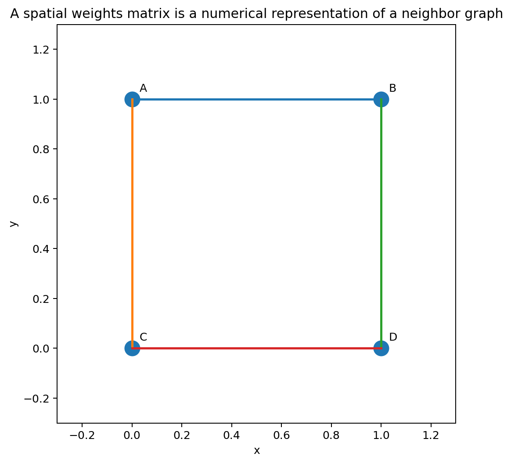
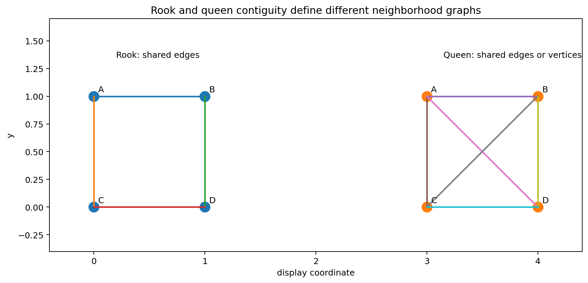
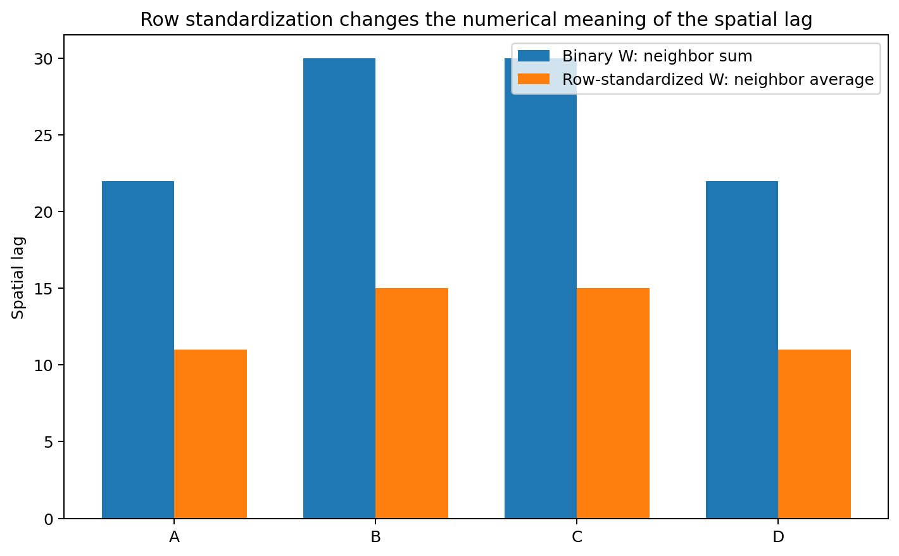
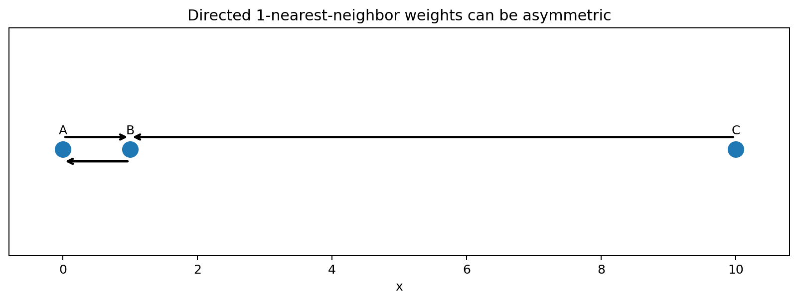
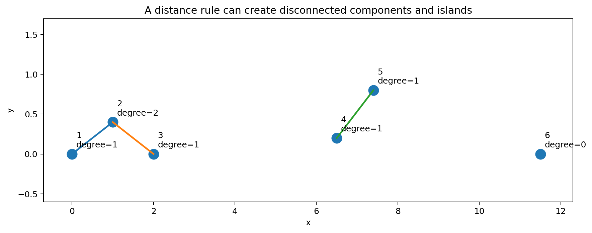
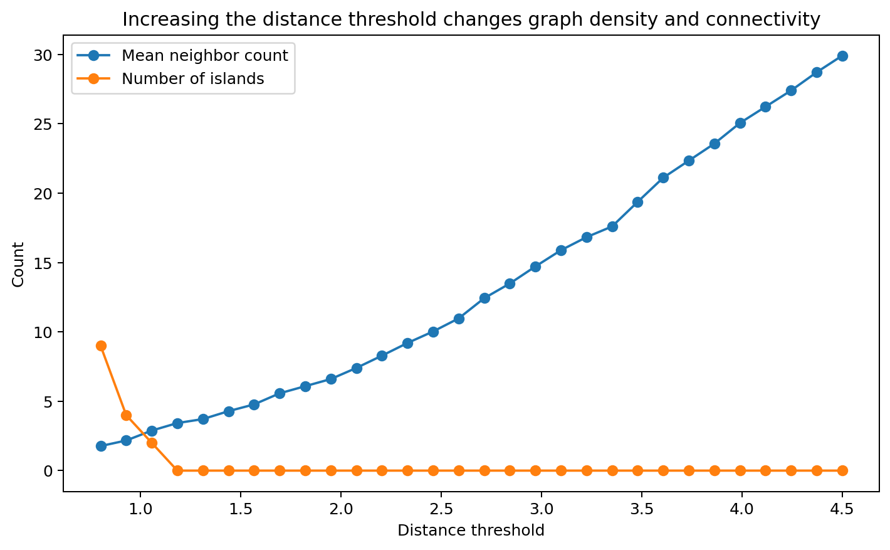
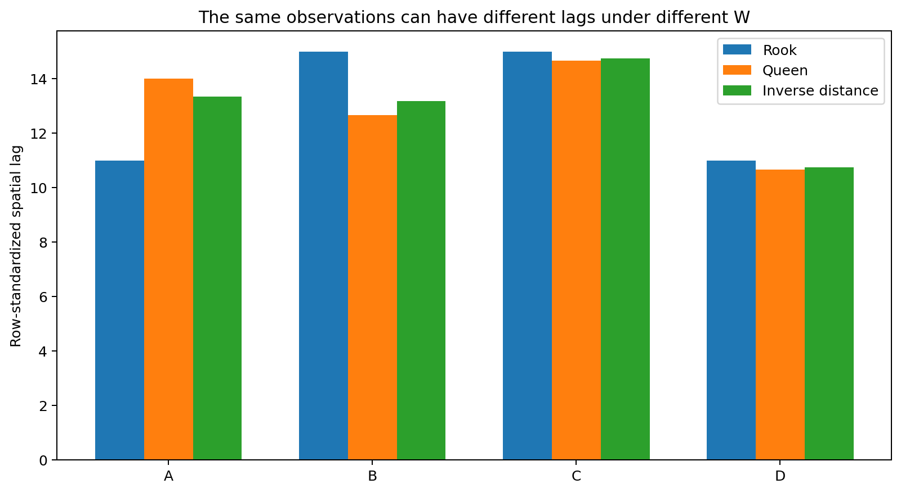

# Spatial Weights and Spatial Lags

A spatial weights matrix turns a qualitative statement such as

> “these locations are neighbors”

into a numerical object that can be used in spatial statistics and spatial regression.

For $n$ observations, define

$$
W=[w_{ij}],
$$

where $w_{ij}$ describes the connection from location $i$ to location $j$.

Usually,

$$
w_{ii}=0,
$$

so a location is not treated as its own neighbor.

The spatial weights matrix is not merely bookkeeping. It defines what the analysis means by spatial proximity or connection.

Changing $W$ can change:

- spatial lags;
- Moran's $I$;
- local cluster classifications;
- spatial regression coefficients;
- admissible SAR parameter values;
- the scientific interpretation of “neighbor.”

## Learning objectives

After this chapter, you should be able to:

1. explain what a spatial weights matrix represents;
2. construct rook and queen contiguity weights;
3. construct distance-band weights;
4. construct $k$-nearest-neighbor weights;
5. explain why directed $k$-NN weights can be asymmetric;
6. construct inverse-distance weights;
7. row-standardize a weights matrix;
8. calculate a spatial lag $Wx$ by hand;
9. explain the difference between a neighbor sum and a neighbor average;
10. identify islands and disconnected graph components;
11. explain why symmetry matters;
12. perform a sensitivity analysis over plausible weights definitions.

## What does a spatial weights matrix represent?

Suppose there are four spatial units:

$$
A,\ B,\ C,\ D.
$$

A binary weights matrix might be

$$
W=
\begin{bmatrix}
0&1&1&0\\
1&0&1&0\\
1&1&0&1\\
0&0&1&0
\end{bmatrix}.
$$

Read the first row as:

- A is not its own neighbor;
- A is connected to B;
- A is connected to C;
- A is not connected to D.

So

$$
w_{AB}=1,
\qquad
w_{AC}=1.
$$

The matrix is the numerical representation of the neighborhood graph.

## The diagonal is usually zero

The diagonal entry

$$
w_{ii}
$$

describes the relationship from a location to itself.

For many spatial statistics, the diagonal is set to zero:

$$
w_{ii}=0.
$$

Why?

Because the goal is usually to summarize information from other locations.

For example, a spatial lag should describe the neighborhood around location $i$, not reproduce $x_i$ itself.

There are specialized settings in which self-weights are meaningful, but a zero diagonal is the standard default for the methods in this chapter.

## Contiguity weights

For polygon data, neighborhood is often defined by shared boundaries.

Let

$$
A_i
$$

and

$$
A_j
$$

be two polygons.

A binary contiguity weight is

$$
w_{ij} =
\begin{cases}
1,& A_i\text{ and }A_j\text{ are neighbors},\\
0,& \text{otherwise}.
\end{cases}
$$

Two common definitions are **rook** and **queen** contiguity.

## Rook contiguity

Rook contiguity requires two polygons to share an edge of positive length.

Imagine four square cells:

$$
\begin{matrix}
A & B\\
C & D
\end{matrix}
$$

Under rook contiguity:

- A neighbors B;
- A neighbors C;
- A does not neighbor D;
- B neighbors D;
- C neighbors D.

The diagonal contact between A and D does not count.

The binary rook matrix is

$$
W_R=
\begin{bmatrix}
0&1&1&0\\
1&0&0&1\\
1&0&0&1\\
0&1&1&0
\end{bmatrix}.
$$

## Queen contiguity

Queen contiguity counts either:

- a shared edge;
- a shared vertex.

For the same $2\times2$ grid, every cell touches all three other cells either by an edge or a corner.

Therefore

$$
W_Q=
\begin{bmatrix}
0&1&1&1\\
1&0&1&1\\
1&1&0&1\\
1&1&1&0
\end{bmatrix}.
$$

### Why does this matter?

Rook and queen contiguity define different neighborhoods.

If a spatial statistic changes substantially between them, the result is sensitive to whether corner-touching regions are treated as connected.

## Worked rook spatial lag

Use the rook matrix

$$
W_R=
\begin{bmatrix}
0&1&1&0\\
1&0&0&1\\
1&0&0&1\\
0&1&1&0
\end{bmatrix}
$$

and observed values

$$
x=
\begin{bmatrix}
10\\
14\\
8\\
20
\end{bmatrix}.
$$

The unstandardized spatial lag is

$$
W_Rx.
$$

For A,

$$
(W_Rx)_A =
1(14)+1(8) =
22.
$$

For B,

$$
(W_Rx)_B =
1(10)+1(20) =
30.
$$

For C,

$$
(W_Rx)_C =
1(10)+1(20) =
30.
$$

For D,

$$
(W_Rx)_D =
1(14)+1(8) =
22.
$$

Thus

$$
\boxed{
W_Rx =
\begin{bmatrix}
22\\
30\\
30\\
22
\end{bmatrix}
}.
$$

These are neighbor sums, not neighbor averages.

## Row standardization

A common transformation divides each nonzero row by its row sum.

If

$$
s_i=\sum_jw_{ij},
$$

then

$$
\boxed{
w_{ij}^{(R)} =
\frac{w_{ij}}{s_i}
}.
$$

For a non-isolated location,

$$
\sum_jw_{ij}^{(R)}=1.
$$

This changes the numerical meaning of $W$.

It is a modeling choice, not merely a computational trick.

## Worked row-standardization example

In the rook matrix above, every cell has two neighbors.

The first row is

$$
[0,1,1,0].
$$

Its row sum is

$$
2.
$$

After row standardization,

$$
[0,1,1,0]
\longrightarrow
\left[
0,\frac12,\frac12,0
\right].
$$

Therefore

$$
W_R^{(R)} =
\begin{bmatrix}
0&1/2&1/2&0\\
1/2&0&0&1/2\\
1/2&0&0&1/2\\
0&1/2&1/2&0
\end{bmatrix}.
$$

## Row-standardized spatial lag

Now compute

$$
W_R^{(R)}x.
$$

For A,

$$
(W_R^{(R)}x)_A =
\frac12(14)
+
\frac12(8).
$$

So

$$
(W_R^{(R)}x)_A =
7+4 =
11.
$$

Thus, A's spatial lag is the mean of its two neighbors:

$$
\boxed{
11
}.
$$

Similarly,

$$
(W_R^{(R)}x)_B =
\frac12(10)+\frac12(20) =
15.
$$

The full spatial lag is

$$
\boxed{
W_R^{(R)}x =
\begin{bmatrix}
11\\
15\\
15\\
11
\end{bmatrix}
}.
$$

This is why row-standardized binary weights are often described as producing a neighbor average.

## Binary versus row-standardized weights

For binary weights,

$$
(Wx)_i
$$

grows partly with the number of neighbors.

A region with eight neighbors can receive a much larger raw lag than a region with two neighbors even when their neighboring values have similar magnitudes.

For row-standardized weights,

$$
(W^{(R)}x)_i
$$

is instead a weighted average.

These two forms encode different ideas.

Neither is automatically appropriate in every application.

## Distance-band weights

For point coordinates, define

$$
d_{ij}
$$

as the distance between locations $i$ and $j$.

A distance-band matrix can be defined as

$$
\boxed{ w_{ij} = \mathbf 1(0<d_{ij}\le d_0) }
$$

Locations are treated as neighbors when they lie within the threshold $d_0$.

## Worked distance-band example

Suppose four locations lie on a line:

$$
A=0,
\quad
B=1,
\quad
C=3,
\quad
D=7
$$

in kilometers.

Use threshold

$$
d_0=2.5\text{ km}.
$$

Distances include:

$$
d_{AB}=1,
$$

$$
d_{BC}=2,
$$

$$
d_{CD}=4,
$$

$$
d_{AC}=3.
$$

Therefore:

- A-B are neighbors;
- B-C are neighbors;
- A-C are not;
- C-D are not.

The binary weights are

$$
W=
\begin{bmatrix}
0&1&0&0\\
1&0&1&0\\
0&1&0&0\\
0&0&0&0
\end{bmatrix}.
$$

Location D has no neighbors.

D is an **island**.

## Threshold choice matters

If the threshold changes from

$$
2.5
$$

to

$$
4.5\text{ km},
$$

additional links appear:

- A-C becomes connected;
- C-D becomes connected.

The graph can change substantially after a modest change in the threshold.

Therefore a threshold should be based on:

- process scale;
- measurement geometry;
- domain knowledge;
- sensitivity analysis.

It should not be chosen simply because it produces a desired statistical result.

## $k$-nearest-neighbor weights

A $k$-nearest-neighbor rule connects each observation to its $k$ closest other observations.

For example, with

$$
k=2,
$$

every location sends connections to its two nearest neighbors.

This is useful when sampling density varies across space.

Unlike a fixed distance band, $k$-NN avoids islands as long as there are at least $k+1$ observations.

## Directed $k$-NN weights can be asymmetric

Suppose three points lie at

$$
A=0,
\qquad
B=1,
\qquad
C=10.
$$

With

$$
k=1,
$$

A's nearest neighbor is B.

B's nearest neighbor is A.

C's nearest neighbor is B.

Therefore:

$$
w_{CB}=1,
$$

but

$$
w_{BC}=0.
$$

So

$$
W\neq W^\top.
$$

This asymmetry is not an error.

It follows from the directed nearest-neighbor rule.

## Symmetrizing $k$-NN weights

A directed $k$-NN graph can be symmetrized in different ways.

### Union rule

Locations $i$ and $j$ are connected if either selects the other:

$$
w_{ij}^{(U)} =
1
\quad\text{if}\quad
w_{ij}=1
\text{ or }
w_{ji}=1.
$$

### Mutual rule

They are connected only if both select one another:

$$
w_{ij}^{(M)} =
1
\quad\text{if}\quad
w_{ij}=w_{ji}=1.
$$

These rules produce different graphs.

Always state which convention is used.

## Distance-decay weights

Instead of using a binary decision, distance can enter continuously.

A common form is

$$
\boxed{
w_{ij} =
d_{ij}^{-\alpha}
}
$$

for

$$
i\neq j.
$$

With

$$
\alpha=1,
$$

the weight is inverse distance.

With

$$
\alpha=2,
$$

weights decay faster.

## Worked inverse-distance example

Suppose location A has two neighbors at distances

$$
d_{AB}=1
$$

and

$$
d_{AC}=2.
$$

With

$$
\alpha=1,
$$

the raw weights are

$$
w_{AB}=1,
$$

$$
w_{AC}=\frac12.
$$

The row sum is

$$
1+\frac12 =
1.5.
$$

After row standardization,

$$
w_{AB}^{(R)} =
\frac{1}{1.5} =
\frac23,
$$

and

$$
w_{AC}^{(R)} =
\frac{0.5}{1.5} =
\frac13.
$$

If

$$
x_B=12,
\qquad
x_C=6,
$$

then A's spatial lag is

$$
(Wx)_A =
\frac23(12)+\frac13(6).
$$

Therefore

$$
(Wx)_A =
8+2 =
\boxed{
10
}.
$$

The closer neighbor therefore receives twice as much weight.

## Coincident points need a safeguard

For inverse-distance weights,

$$
w_{ij}=d_{ij}^{-\alpha},
$$

a zero distance would cause division by zero.

This can occur if:

- duplicate coordinates exist;
- several observations share a centroid;
- coordinates were rounded.

Possible responses include:

- investigate duplicate observations;
- aggregate coincident observations;
- use a small-distance floor;
- define special within-site relationships.

Do not allow infinite weights without explicitly addressing the cause.

## The spatial lag

For observed values

$$
x=
\begin{bmatrix}
x_1\\
\vdots\\
x_n
\end{bmatrix},
$$

the spatial lag is

$$
\boxed{
Wx
}.
$$

At location $i$,

$$
(Wx)_i =
\sum_jw_{ij}x_j.
$$

It is a weighted summary of values at connected locations.

## Spatial lag is not always a mean

The phrase “neighbor average” is correct only when the weights in a row sum to 1.

For binary unstandardized weights,

$$
(Wx)_i
$$

is a neighbor sum.

For inverse-distance weights without row standardization, it is a weighted sum.

For row-standardized weights, it is a weighted average.

This distinction matters when interpreting the resulting values.

## Centered spatial lag

For Moran's $I$, define centered observations

$$
z_i=x_i-\bar x.
$$

Then calculate

$$
Wz.
$$

A positive value

$$
(Wz)_i>0
$$

means that the neighborhood is above the global mean on average when row-standardized weights are used.

A negative value means the neighborhood is below the global mean.

This interpretation leads directly to the Moran scatterplot.

## Worked centered-lag example

Use

$$
x=
\begin{bmatrix}
10\\
14\\
8\\
20
\end{bmatrix}.
$$

The mean is

$$
\bar x =
\frac{10+14+8+20}{4} =
13.
$$

Therefore

$$
z=
\begin{bmatrix}
-3\\
1\\
-5\\
7
\end{bmatrix}.
$$

Using row-standardized rook weights,

$$
(Wz)_A =
\frac12(1)+\frac12(-5) =
-2.
$$

A is below the mean,

$$
z_A=-3,
$$

and its neighborhood is also below the mean,

$$
(Wz)_A=-2.
$$

A therefore falls in the low-low quadrant of a Moran scatterplot.

## Islands

An **island** is a location with no neighbors under the chosen weights definition.

Mathematically,

$$
\sum_jw_{ij}=0.
$$

For that row, ordinary row standardization would require division by zero.

An explicit convention is therefore needed.

Common options include:

- increase a distance threshold;
- use $k$-nearest neighbors;
- leave the row as all zeros;
- use a scientifically motivated special link;
- exclude the observation only with clear justification.

## What happens if an island row remains zero?

Suppose row $i$ is

$$
[0,0,\ldots,0].
$$

Then

$$
(Wx)_i=0.
$$

But zero here does not mean that the neighbors average to zero.

It means that the chosen weights definition provides no neighbor information for that location.

That distinction should be handled carefully in both plots and models.

## Disconnected components

A graph can contain several internally connected groups with no links between them.

For example,

$$
A-B-C
$$

and

$$
D-E-F
$$

may form two disconnected components.

This is not automatically a problem.

It may represent:

- separate islands;
- separate ecological systems;
- different transportation networks.

However, it changes the interpretation of global summaries because no spatial relationship is represented across components.

## Symmetry

A weights matrix is symmetric when

$$
w_{ij}=w_{ji}
$$

for every pair.

Binary rook contiguity is naturally symmetric:

> If A shares an edge with B, B shares an edge with A.

Euclidean distance-band weights are also symmetric.

Directed $k$-NN weights need not be symmetric.

## Why symmetry matters

Symmetry can affect:

- eigenvalues of $W$;
- analytical variance formulas;
- some spatial regression derivations;
- interpretation of neighborhood influence;
- the admissible parameter range in SAR models.

After row standardization, even a matrix that began symmetric may no longer be numerically symmetric when regions have different neighbor counts.

This distinction is important.

## Row standardization can destroy symmetry

Suppose the original binary matrix has

$$
w_{ij}=w_{ji}=1.
$$

If location $i$ has two neighbors, then after row standardization:

$$
w_{ij}^{(R)}=\frac12.
$$

If location $j$ has four neighbors,

$$
w_{ji}^{(R)}=\frac14.
$$

Therefore

$$
w_{ij}^{(R)}
\neq
w_{ji}^{(R)}.
$$

The binary graph is symmetric, but the standardized numerical matrix is not.

## Degree and neighbor count

For a binary graph, the degree of location $i$ is

$$
k_i =
\sum_jw_{ij}.
$$

It is the number of neighbors for that location.

Mapping or plotting degree is a useful diagnostic.

Very high degree can indicate:

- dense urban sampling;
- large polygons;
- an overly generous threshold.

Very low degree can indicate:

- edge locations;
- sparse sampling;
- disconnected regions.

## Distance thresholds and graph connectivity

As the threshold $d_0$ increases:

- the number of links grows;
- islands disappear;
- components merge;
- average degree increases.

At very large thresholds, nearly every observation may become connected to every other observation.

At that point, the weights matrix can lose much of its local spatial meaning.

The goal is not simply to maximize connectivity.

The graph should represent the scientifically relevant interaction scale.

## $k$-NN and variable physical scale

A $k$-NN rule fixes the number of neighbors but not the distance to them.

In a dense city, the fifth nearest neighbor might be

$$
200\text{ m}
$$

away.

In a sparse rural area, the fifth nearest neighbor might be

$$
20\text{ km}
$$

away.

Thus, $k$-NN fixes graph degree at the cost of allowing the physical scale to vary.

This tradeoff should be considered in light of the scientific process.

## Distance band and variable degree

A distance band makes the opposite tradeoff.

It fixes the physical scale but allows the number of neighbors to vary.

Dense regions may have many neighbors.

Sparse regions may have few or none.

This can be appropriate when the process has a meaningful interaction radius.

## Spatial weights are part of the model

Suppose Moran's $I$ is calculated with:

- rook adjacency;
- queen adjacency;
- $k=4$;
- $k=8$;
- 5 km threshold.

These are not repeated calculations of one universal statistic.

They answer related but different questions because each defines a different neighborhood structure.

Similarly, a SAR model using $W_1$ is not the same model as a SAR model using $W_2$.

## Sensitivity analysis

There is rarely a single uniquely correct $W$.

A strong analysis examines scientifically plausible alternatives.

For example:

$$
W_1=\text{rook adjacency},
$$

$$
W_2=\text{queen adjacency},
$$

$$
W_3=\text{4-nearest neighbors}.
$$

Then compare:

- Moran's $I$;
- residual diagnostics;
- model coefficients;
- predictions.

## Numerical sensitivity example

Suppose a location has value

$$
x_A=10.
$$

Under rook contiguity, its neighbors have values

$$
8,\ 12.
$$

The row-standardized lag is

$$
\frac{8+12}{2} =
10.
$$

Under queen contiguity, suppose an additional diagonal neighbor has value

$$
20.
$$

Then the lag becomes

$$
\frac{8+12+20}{3} =
\frac{40}{3}
\approx13.33.
$$

The same location can have a very different spatial lag when the neighborhood definition changes.

## A useful weights audit

Before using a spatial weights matrix, inspect:

1. matrix dimension;
2. diagonal entries;
3. number of neighbors per row;
4. minimum and maximum degree;
5. islands;
6. connected components;
7. symmetry;
8. row sums;
9. physical distance to linked neighbors;
10. sensitivity to alternative rules.

A weights matrix should be inspected like any other major model input.

## Common mistakes

### saying only “we used spatial weights”

Always state explicitly how $W$ was constructed.

### treating row standardization as harmless

It changes the interpretation from a raw neighbor sum to a relative weighting or average.

### assuming $k$-NN is symmetric

Directed nearest-neighbor relationships can be one-way.

### ignoring islands

Rows with zero neighbors require an explicit convention.

### using a huge distance threshold only to eliminate islands

This can create scientifically meaningless long-distance links.

### treating centroid distance as the only meaningful polygon relationship

Adjacency, road links, flow networks, or travel time may be more appropriate.

### forgetting that row standardization can destroy numerical symmetry

The underlying graph may be symmetric while the standardized weights are not.

### choosing $W$ only because it gives the strongest significance

Weights should be justified independently of the desired result.

## Connection to Moran's I

Global Moran's $I$ is

$$
I =
\frac{n}{S_0}
\frac{
z^\top Wz
}{
z^\top z
},
$$

where

$$
S_0=\sum_i\sum_jw_{ij}.
$$

The weights matrix enters directly into the numerator.

Changing $W$ therefore changes the statistic.

This is why Moran's $I$ cannot be interpreted without specifying the weights matrix.

## Connection to spatial regression

A spatial error model can contain

$$
u=\lambda Wu+\varepsilon.
$$

A SAR model can contain

$$
y=\rho Wy+X\beta+\varepsilon.
$$

The scientific meaning of $\lambda$ and $\rho$ therefore depends on what $W$ represents.

If $W$ means shared borders, the model propagates across shared borders.

If $W$ means nearest neighbors, it propagates through that graph.

The matrix defines the geometry through which spatial influence is represented.

## Complete worked example

Suppose four regions form a $2\times2$ grid:

$$
\begin{matrix}
A&B\\
C&D
\end{matrix}
$$

with values

$$
x=
\begin{bmatrix}
10\\
14\\
8\\
20
\end{bmatrix}.
$$

Using rook contiguity:

$$
W=
\begin{bmatrix}
0&1&1&0\\
1&0&0&1\\
1&0&0&1\\
0&1&1&0
\end{bmatrix}.
$$

Every row has sum 2.

So row standardization gives

$$
W^{(R)} =
\begin{bmatrix}
0&0.5&0.5&0\\
0.5&0&0&0.5\\
0.5&0&0&0.5\\
0&0.5&0.5&0
\end{bmatrix}.
$$

The spatial lag is

$$
W^{(R)}x =
\begin{bmatrix}
11\\
15\\
15\\
11
\end{bmatrix}.
$$

The global mean is

$$
\bar x=13.
$$

Centered values are

$$
z=
\begin{bmatrix}
-3\\
1\\
-5\\
7
\end{bmatrix}.
$$

The centered spatial lag is

$$
W^{(R)}z =
\begin{bmatrix}
-2\\
2\\
2\\
-2
\end{bmatrix}.
$$

This example contains the main logic needed for the next chapter on spatial autocorrelation.

## Concept map

The workflow is

$$
\text{spatial geometry}
$$

$$
\downarrow
$$

$$
\text{define scientific neighbor relation}
$$

$$
\downarrow
$$

$$
\text{construct }W
$$

$$
\downarrow
$$

$$
\text{inspect islands, degree, components, symmetry}
$$

$$
\downarrow
$$

$$
\text{choose raw or standardized weighting}
$$

$$
\downarrow
$$

$$
\text{calculate }Wx
$$

$$
\downarrow
$$

$$
\text{use }W\text{ in Moran, local statistics, or spatial models}
$$

$$
\downarrow
$$

$$
\text{check sensitivity to reasonable alternatives}.
$$

The central idea is:

> A spatial weights matrix is a mathematical statement about which locations can influence or summarize one another.

## Questions students should be able to answer

1. What does $w_{ij}$ represent?
2. Why is the diagonal usually zero?
3. What is the difference between rook and queen contiguity?
4. What does row standardization do?
5. When is $Wx$ a neighbor average rather than a sum?
6. How does a distance-band matrix depend on $d_0$?
7. Why can $k$-NN weights be asymmetric?
8. What is the difference between union and mutual symmetrization?
9. What does $\alpha$ control in inverse-distance weights?
10. What is an island?
11. What is a disconnected component?
12. Why can row standardization destroy matrix symmetry?
13. How do distance bands and $k$-NN rules differ in physical interpretation?
14. Why should conclusions be checked across plausible $W$ choices?
15. Why must the construction of $W$ be reported when presenting Moran's $I$?

