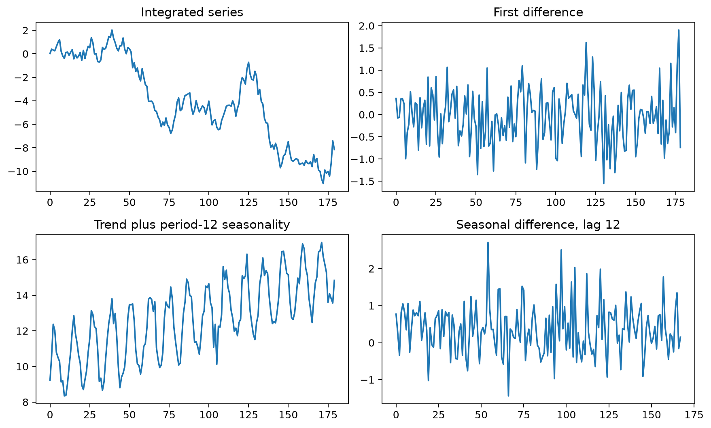
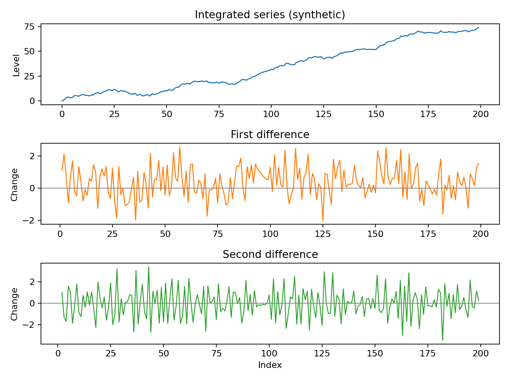
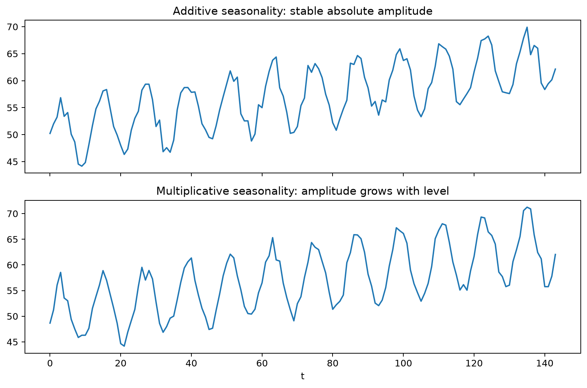
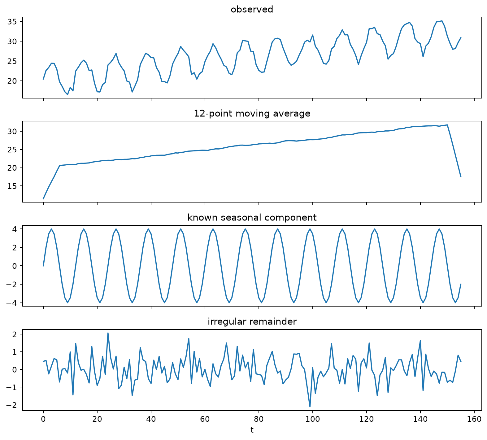
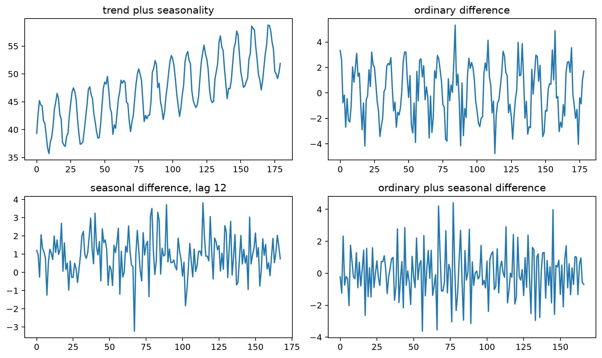
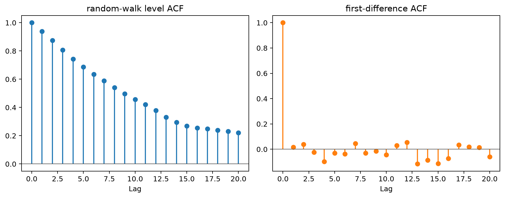
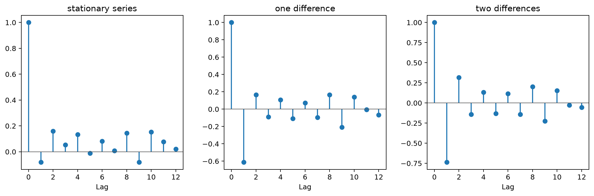
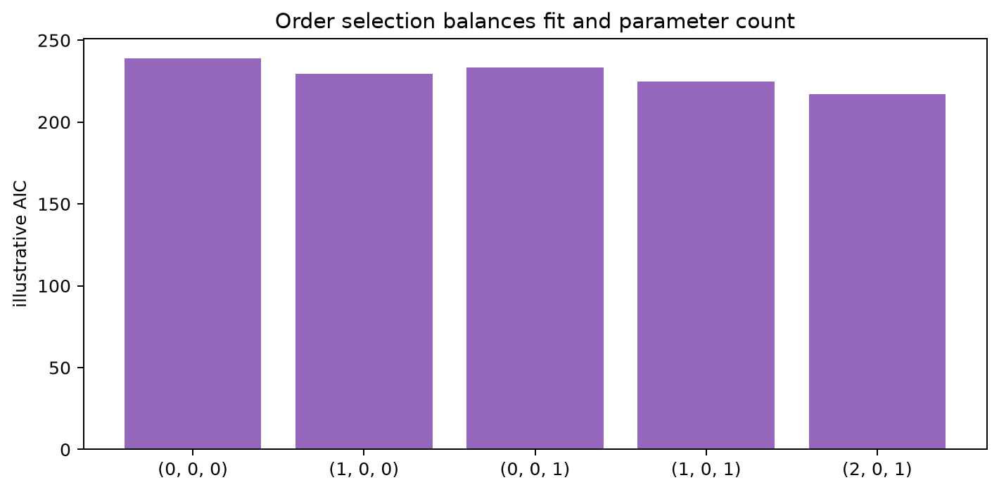
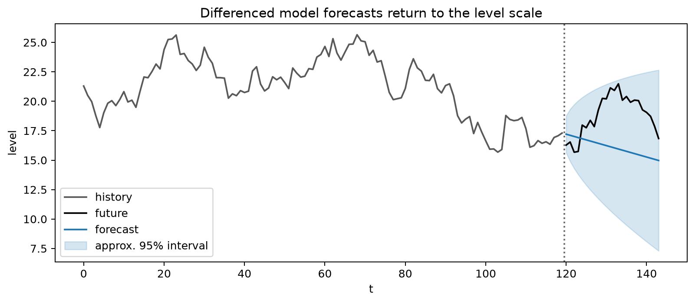
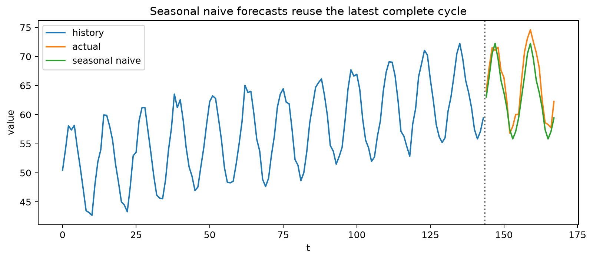

# ARMA, ARIMA and SARIMA Models

## Worked calculation: ordinary and seasonal differencing

For the short series

$$
120,\ 123,\ 126,\ 130,
$$

the first differences are

$$
3,\ 3,\ 4.
$$

A first difference measures the change from one observation to the next, so a model fitted to the differenced series describes changes rather than the original level. For monthly data with seasonal period $s=12$, the seasonal difference is

$$
\nabla_{12}y_t=y_t-y_{t-12}.
$$

For example, if January sales are 100 this year and 92 last year, the January seasonal difference is $100-92=8$. Ordinary and seasonal differencing can also be combined:

$$
(1-B)(1-B^{12})y_t.
$$

Use the smallest differencing order that makes the remaining series reasonably stable. Extra differencing can add unnecessary dependence rather than improve the model.

The following figure contrasts ordinary and seasonal differencing. The main point is that ordinary differencing compares adjacent observations, whereas seasonal differencing compares observations one full seasonal cycle apart.



This distinction is central to ARMA, ARIMA, and SARIMA models. ARMA (AutoRegressive Moving Average) combines dependence on past values with dependence on current and past innovations. ARIMA (AutoRegressive Integrated Moving Average) extends ARMA by differencing a non-stationary series before modeling its dependence structure. SARIMA (Seasonal ARIMA) adds seasonal differencing and seasonal AR and MA terms for repeating patterns. Together, these models provide a flexible framework for time series with serial dependence, stochastic trends, and seasonality.

### Autoregressive Moving Average (ARMA) Models

ARMA models combine autoregressive (AR) and moving average (MA) components. The AR part relates the current value to past values, while the MA part relates it to current and past innovations. This combination can represent short-term shocks together with longer-lasting serial dependence.

#### Mathematical Definition of ARMA Models

An ARMA($p, q$) model is defined by

$$
X_t=c+\sum_{i=1}^{p}\phi_iX_{t-i}+\epsilon_t+\sum_{j=1}^{q}\theta_j\epsilon_{t-j}.
$$

Using the backshift operator $B$, the same model can be written as

$$
\phi(B)X_t=c+\theta(B)\epsilon_t,
$$

where

- $\phi(B)=1-\phi_1B-\phi_2B^2-\dots-\phi_pB^p$;
- $\theta(B)=1+\theta_1B+\theta_2B^2+\dots+\theta_qB^q$.

These polynomials make the model structure compact and are also useful for stating stationarity, causality, and invertibility conditions.

#### Stationarity of AR Processes

An AR($p$) process is stationary when all roots of the characteristic equation $\phi(B)=0$ lie outside the unit circle in the complex plane. Under this condition, the process has a time-invariant mean and variance, and its autocovariance depends on the lag rather than on calendar time.

#### Invertibility of MA Processes

An MA($q$) process is invertible when all roots of $\theta(B)=0$ lie outside the unit circle. Invertibility makes the innovation sequence recoverable from current and past observations and gives the MA model a unique, stable infinite-AR representation.

#### Causality of ARMA Processes

An ARMA process is causal if it can be written as a convergent linear filter of current and past shocks:

$$
X_t=\sum_{j=0}^{\infty}\psi_j\epsilon_{t-j}.
$$

For an ARMA model without cancellation between the AR and MA polynomials, causality requires the AR polynomial to have no roots on or inside the unit circle. The current value then depends only on present and past innovations, not future shocks.

#### Infinite Order Representations

When the required convergence conditions hold, finite-order AR and MA models can be represented using infinite-order forms. An invertible MA process has an AR($\infty$) representation,

$$
X_t=\sum_{k=1}^{\infty}\pi_kX_{t-k}+\epsilon_t,
$$

while a causal AR process has an MA($\infty$) representation,

$$
X_t=\sum_{k=0}^{\infty}\psi_k\epsilon_{t-k}.
$$

These representations show that AR and MA behavior are closely related: one emphasizes dependence on past observations, while the other emphasizes how shocks propagate through time.

#### Example: ARMA(1,1) Process

Consider the ARMA(1,1) model

$$
X_t=\phi X_{t-1}+\epsilon_t+\theta\epsilon_{t-1}.
$$

Let $\phi=0.7$, $\theta=0.2$, and let $\epsilon_t$ be white noise.

For existence and causality, the AR coefficient determines how the recursive part behaves. Without an exact AR-MA cancellation, a stationary solution exists when $|\phi|\ne1$. If $|\phi|<1$, the stationary solution is causal and can be written as

$$
X_t=\epsilon_t+(\theta+\phi)\sum_{j=1}^{\infty}\phi^{j-1}\epsilon_{t-j}.
$$

If $|\phi|>1$, a stationary solution can still be written, but it is noncausal and depends on future shocks:

$$
X_t=-\theta\phi^{-1}\epsilon_t-(\theta+\phi)\sum_{j=1}^{\infty}\phi^{-j-1}\epsilon_{t+j}.
$$

When $\theta+\phi=0$, the AR and MA factors cancel and the model reduces to white noise.

Invertibility is controlled by the MA coefficient. If $|\theta|<1$, the model is invertible, so innovations can be recovered from present and past observations. If $|\theta|>1$, the usual past-dependent inverse is not stable. At $|\theta|=1$, the MA root lies on the unit circle, so the model is not invertible in the standard sense.

##### Simulation

A long simulated series can be used to compare sample behavior with the model's theoretical properties. For example, the following R code generates observations from the ARMA(1,1) process with the chosen parameters:

```r
set.seed(500)
data <- arima.sim(n = 1e6, list(ar = 0.7, ma = 0.2))
```

With a sufficiently long simulation, the sample autocorrelations should be close to the theoretical values derived below.

##### Converting ARMA to Infinite Order Processes

For the AR($\infty$) representation, start from

$$
(1-\phi B)X_t=(1+\theta B)\epsilon_t.
$$

If $|\theta|<1$, invert the MA polynomial:

$$
\epsilon_t=(1+\theta B)^{-1}(1-\phi B)X_t.
$$

Using $(1+\theta B)^{-1}=1-\theta B+\theta^2B^2-\dots$ gives

$$
\epsilon_t=X_t-(\phi+\theta)X_{t-1}+\theta(\phi+\theta)X_{t-2}-\theta^2(\phi+\theta)X_{t-3}+\dots.
$$

Rearranging expresses $X_t$ in terms of past observations and the current innovation:

$$
X_t=(\phi+\theta)X_{t-1}-\theta(\phi+\theta)X_{t-2}+\theta^2(\phi+\theta)X_{t-3}-\dots+\epsilon_t.
$$

For the MA($\infty$) representation, invert the AR polynomial. When $|\phi|<1$,

$$
X_t=(1-\phi B)^{-1}(1+\theta B)\epsilon_t,
$$

so

$$
X_t=[1+\phi B+\phi^2B^2+\dots](1+\theta B)\epsilon_t.
$$

Multiplying the series gives

$$
X_t=[1+(\phi+\theta)B+(\phi^2+\phi\theta)B^2+\dots]\epsilon_t.
$$

Thus $\psi_0=1$ and, for $k\ge1$,

$$
\psi_k=\phi^k+\theta\phi^{k-1}=\phi^{k-1}(\phi+\theta).
$$

##### Theoretical Autocorrelations

For the ARMA(1,1) model with the sign convention used here, the lag-1 autocorrelation is

$$
\rho_1=\frac{(\phi+\theta)(1+\phi\theta)}{1+2\phi\theta+\theta^2},
$$

and subsequent autocorrelations decay geometrically:

$$
\rho_k=\phi^{k-1}\rho_1,\qquad k\ge2.
$$

With $\phi=0.7$ and $\theta=0.2$,

$$
\rho_1=\frac{(0.7+0.2)(1+0.7\times0.2)}{1+2\times0.7\times0.2+0.2^2}\approx0.777.
$$

Therefore,

$$
\rho_2=0.7\rho_1\approx0.544,
$$

and

$$
\rho_3=0.7\rho_2\approx0.381.
$$

##### Results and Interpretation

The values show how the MA term mainly affects the short-lag relationship, while the AR coefficient controls the geometric decay that follows. In a long simulation, sample autocorrelations close to these values provide a useful check that the simulated process matches the intended ARMA(1,1) specification.

### Autoregressive Integrated Moving Average (ARIMA) Models

ARIMA models extend ARMA models by adding differencing. The differencing step is used when the original series is not stationary because of a stochastic trend or similar persistent level behavior; the ARMA structure is then fitted to the transformed series.

#### Mathematical Definition of ARIMA Models

An ARIMA($p, d, q$) model is defined by

$$
\phi(B)(1-B)^dX_t=c+\theta(B)\epsilon_t,
$$

where

- $\phi(B)$ is the autoregressive polynomial;
- $\theta(B)$ is the moving average polynomial;
- $d$ is the number of ordinary differences applied before fitting the ARMA component.

The aim is not to difference as much as possible, but to use the smallest $d$ that produces a series whose dependence can be modeled as approximately stationary.

#### Determining Differencing Order

Several pieces of evidence should be considered together:

- Unit-root tests such as the Augmented Dickey-Fuller (ADF) test can provide evidence about whether a stochastic trend is present.
- A time-series plot can reveal persistent level movement, trend, or changes in variance.
- A slowly decaying ACF can indicate non-stationary behavior.
- In the Box-Jenkins approach, differencing is increased only until the transformed series looks reasonably stable and its ACF and PACF resemble a short-memory process.

The following synthetic example shows the effect visually. Compare the original sequence with its differenced version: differencing removes persistent level movement so that the remaining changes are easier to model.



#### Fitting ARIMA Models: Numerical Example

Suppose a time series $X_t$ shows an upward stochastic trend. A simple ARIMA workflow moves from transformation to identification, estimation, diagnostics, and forecasting.

##### Differencing

Apply a first difference:

$$
Y_t=(1-B)X_t=X_t-X_{t-1}.
$$

The transformed series $Y_t$ now represents one-period changes. If it is approximately stationary, the AR and MA orders can be considered on this scale.

##### Model Identification

Inspect the ACF and PACF of $Y_t$ rather than those of the undifferenced level series. A cutoff in the ACF can suggest an MA component, while a cutoff in the PACF can suggest an AR component. These patterns are heuristics rather than exact rules in finite samples.

Assume the ACF suggests an MA(1) term and the PACF suggests an AR(1) term.

##### Parameter Estimation

A corresponding ARIMA(1,1,1) model is

$$
(1-\phi B)(1-B)X_t=c+(1+\theta B)\epsilon_t.
$$

The parameters $\phi$, $\theta$, and $c$ can then be estimated by maximum likelihood.

##### Model Diagnostics

After fitting, check whether the residuals behave like white noise. Useful diagnostics include

- residual plots for remaining structure, changing variance, or outliers;
- the Ljung-Box test for residual autocorrelation;
- AIC and BIC for comparing plausible models fitted to the same response and sample.

A model with a good information criterion but structured residuals is not adequate; the residual checks determine whether important dependence remains unexplained.

##### ACF/PACF Signatures for Model Identification

The sample ACF and PACF often show characteristic patterns that help narrow the candidate orders $p$ and $q$:

| Model | ACF pattern | PACF pattern |
|---|---|---|
| AR($p$) | Tails off, often exponentially or with damped oscillation | Cuts off after lag $p$ |
| MA($q$) | Cuts off after lag $q$ | Tails off, often exponentially or with damped oscillation |
| ARMA($p, q$) | Tails off | Tails off |

When both functions tail off gradually, an ARMA structure may be needed. If neither plot gives a clean cutoff, fit a small set of parsimonious $(p,q)$ candidates and compare their diagnostics and information criteria rather than choosing an order from a single spike.

##### Forecasting

For the ARIMA(1,1,1) example, forecasting is most clearly described on the differenced series $Y_t=(1-B)X_t$. Its one-step structure is

$$
\hat Y_{t+h}=c+\phi\hat Y_{t+h-1}+\theta\hat\epsilon_{t+h-1}.
$$

For point forecasts beyond the next step, future innovations have conditional expectation zero. The forecasted changes are then accumulated back to the level scale:

$$
\hat X_{t+h}=\hat X_{t+h-1}+\hat Y_{t+h}.
$$

This two-stage view makes the interpretation clear: ARIMA models the changes first and then reconstructs forecasts for the original series.

### Seasonal ARIMA Processes (SARIMA)

Seasonal ARIMA (SARIMA) extends ARIMA to series that contain both non-seasonal dependence and a repeating seasonal pattern. It combines ordinary and seasonal differencing with AR and MA terms at both ordinary and seasonal lags.

#### Mathematical Formulation

A SARIMA$(p,d,q)(P,D,Q)_s$ model is

$$
\Phi_P(B^s)\phi_p(B)(1-B^s)^D(1-B)^dX_t=\Theta_Q(B^s)\theta_q(B)\epsilon_t.
$$

The non-seasonal part contains three familiar terms:

- $\phi_p(B)$ is the non-seasonal AR polynomial and captures dependence on recent observations;
- $d$ is the ordinary differencing order;
- $\theta_q(B)$ is the non-seasonal MA polynomial and captures the effect of recent innovations.

The seasonal part applies the same ideas at lags tied to the seasonal period:

- $\Phi_P(B^s)$ is the seasonal AR polynomial;
- $D$ is the seasonal differencing order;
- $\Theta_Q(B^s)$ is the seasonal MA polynomial;
- $s$ is the seasonal period, such as $12$ for monthly data with annual seasonality.

The backshift operator links this notation to the underlying observations. For ordinary lags, $BX_t=X_{t-1}$; for seasonal lags, $B^sX_t=X_{t-s}$, which refers to the same position in the previous seasonal cycle.

#### Examples of SARIMA Models

##### Example: SARIMA(1, 0, 0)(1, 0, 0)$_{12}$

The model equation is

$$
(1-\phi_1B)(1-\Phi_1B^{12})X_t=\epsilon_t.
$$

It contains a non-seasonal AR(1) term and a seasonal AR(1) term with period 12. Expanding the product shows the interaction explicitly:

$$
X_t=\phi_1X_{t-1}+\Phi_1X_{t-12}-\phi_1\Phi_1X_{t-13}+\epsilon_t.
$$

Thus the current value depends on the previous observation, the observation 12 periods earlier, and an interaction at lag 13 created by multiplying the two AR factors.

##### Example: SARIMA(0, 1, 1)(0, 1, 1)$_{4}$

The model equation is

$$
(1-B)(1-B^4)X_t=(1+\theta_1B)(1+\Theta_1B^4)\epsilon_t.
$$

Here $(1-B)X_t$ is the first ordinary difference, $(1-B^4)X_t$ is the first seasonal difference for a period of four, $\theta_1B\epsilon_t$ is the non-seasonal MA(1) contribution, and $\Theta_1B^4\epsilon_t$ is the seasonal MA(1) contribution. The model therefore removes both ordinary and seasonal persistence before describing the remaining dependence through MA terms.

##### Simplification and Expansion

Ordinary differencing is

$$
(1-B)X_t=X_t-X_{t-1}.
$$

Seasonal differencing is

$$
(1-B^s)X_t=X_t-X_{t-s}.
$$

Applying both operators gives

$$
(1-B)(1-B^s)X_t=X_t-X_{t-1}-X_{t-s}+X_{t-s-1}.
$$

This expansion shows that combined differencing compares both adjacent observations and corresponding observations across seasonal cycles.

#### Stationarity and Invertibility Conditions

After the required differencing has been applied, the AR part is stationary when the roots of the combined non-seasonal and seasonal AR polynomial lie outside the unit circle. Likewise, the model is invertible when the roots of the combined non-seasonal and seasonal MA polynomial lie outside the unit circle. These conditions ensure stable AR dynamics and a stable past-dependent representation of the innovations.

#### Seasonal Differencing

Seasonal differencing removes persistent seasonal level behavior by comparing an observation with the corresponding observation from an earlier cycle. The first seasonal difference is

$$
\nabla_sX_t=X_t-X_{t-s}.
$$

A second seasonal difference is

$$
\nabla_s^2X_t=X_t-2X_{t-s}+X_{t-2s}.
$$

As with ordinary differencing, the smallest adequate seasonal order is preferred because unnecessary differencing can introduce extra dependence and reduce the effective sample size.

#### Autocorrelation Function (ACF) of SARIMA Processes

The ACF of a SARIMA model can contain both short-lag and seasonal patterns. Seasonal structure often appears at lags near multiples of $s$, while interactions between ordinary and seasonal terms can also create correlations at nearby lags such as $s-1$ or $s+1$.

##### Example: SARIMA(0, 0, 1)(0, 0, 1)$_{12}$

Consider

$$
X_t=\epsilon_t+\theta_1\epsilon_{t-1}+\Theta_1\epsilon_{t-12}+\theta_1\Theta_1\epsilon_{t-13},
$$

with $\theta_1=0.7$, $\Theta_1=0.6$, and white-noise errors $\epsilon_t$ having mean zero and variance $\sigma^2$.

##### Calculating Autocovariances

The variance is

$$
\gamma_0=\mathrm{Var}(X_t)=\sigma^2\left(1+\theta_1^2+\Theta_1^2+\theta_1^2\Theta_1^2\right).
$$

At lag 1, the overlapping innovation terms give

$$
\gamma_1=\mathrm{Cov}(X_t,X_{t-1})=\sigma^2\theta_1\left(1+\Theta_1^2\right).
$$

At the seasonal lag 12,

$$
\gamma_{12}=\sigma^2\Theta_1\left(1+\theta_1^2\right).
$$

At lag 13, only the lag-13 interaction term overlaps with the current innovation, so

$$
\gamma_{13}=\sigma^2\theta_1\Theta_1.
$$

These values illustrate how non-seasonal, seasonal, and interaction terms leave distinct signatures in the covariance structure.

##### Calculating Autocorrelations

For any lag $k$, the autocorrelation is obtained by normalizing the autocovariance:

$$
\rho_k=\frac{\gamma_k}{\gamma_0}.
$$

Large correlations at seasonal lags such as 12 can indicate seasonal dependence, while lower lags reflect non-seasonal structure. Interaction terms can also create neighboring seasonal spikes, so the full ACF pattern should be interpreted rather than checking only exact multiples of $s$.

#### Example: Monthly Airline Passenger Data

Consider monthly airline passenger data with an upward trend and a pattern that repeats every 12 months. The modeling task is to separate persistent level movement from recurring seasonal behavior, then fit a forecasting model to the remaining structure.

Decompose the series into trend, seasonal, and residual components. Classical decomposition or STL can help reveal how these components contribute to the observed data. The trend shows the long-term direction, the seasonal component shows the repeating within-year pattern, and the residual contains variation not explained by either component.

Next, stabilize the series if necessary. A logarithmic, square-root, or Box-Cox transformation can help when variability increases with the level. Differencing addresses persistence in the mean: ordinary differencing subtracts the previous observation from the current observation, while seasonal differencing subtracts the value from the same position in the previous cycle.

Then fit a model that reflects the observed structure. SARIMA uses ordinary and seasonal ARIMA terms, with $(p,d,q)$ describing the non-seasonal part and $(P,D,Q)_s$ the seasonal part. ETS provides another forecasting approach based on error, trend, and seasonal components and can represent additive or multiplicative seasonal behavior.

Finally, use the fitted model to forecast future values and report prediction intervals to show forecast uncertainty at each horizon.

The following figure brings these stages together. Read it from the original series and trend, through the seasonal and differenced views, to the final forecast comparison.


In the figure, the original data are shown in blue and the trend in orange, making the long-run movement visible. The seasonal component in green highlights the recurring pattern, while the purple differenced series shows how differencing removes persistent level movement. The forecast-versus-actual panel compares the original series in blue with forecasts in red; the shaded region represents forecast uncertainty. Together, the panels show the progression from identifying structure to transforming the series and evaluating the resulting forecast.

## Student guide: from an integrated series to an evaluated forecast

The previous sections define the individual ARMA, ARIMA, and SARIMA components. This guide brings those ideas into one modeling sequence, from deciding what to difference to evaluating forecasts on the original scale.

The letters in ARIMA$(p,d,q)$ describe three linked operations:

- $d$ differences address integration or stochastic trend;
- an AR($p$) structure models dependence in the transformed series;
- an MA($q$) structure models the effect of recent innovations.

The notation is compact, but the modeling decisions are not automatic. A low ACF at lag 1 after differencing is not enough to choose an order, and an information criterion is not a substitute for residual checks and out-of-sample forecast evaluation.

### The operator equation

For a non-seasonal ARIMA model,

$$
\phi(B)(1-B)^dy_t=c+\theta(B)\varepsilon_t.
$$

For example, an ARIMA$(1,1,1)$ can be written as

$$
(1-\phi B)(1-B)y_t=c+(1+\theta B)\varepsilon_t.
$$

If $y=(120,123,126,130)$, then

$$
(1-B)y=(3,3,4).
$$

The ARMA structure is therefore applied to these changes, not automatically to the original levels. Keeping that distinction clear prevents interpretation and forecasting errors later in the workflow.

### Seasonal extension

For seasonal period $s$,

$$
\Phi(B^s)\phi(B)(1-B)^d(1-B^s)^Dy_t=c+\Theta(B^s)\theta(B)\varepsilon_t.
$$

With $s=12$, one seasonal difference compares an observation with the same month in the previous year:

$$
(1-B^{12})y_t=y_t-y_{t-12}.
$$

Ordinary and seasonal differences can interact. Each difference also removes usable observations from a finite sample, so unnecessarily large values of $d$ and $D$ leave less information for estimation.

Seasonality can also behave differently depending on the scale of the series. The next figure contrasts additive seasonality, whose amplitude stays roughly constant, with multiplicative seasonality, whose amplitude grows or shrinks with the series level. This distinction can guide whether a transformation such as a logarithm is useful before fitting a seasonal model.



A decomposition view makes the same idea more concrete by separating an observed series into level or trend, seasonal structure, and remainder. The figure below is useful for seeing which features should be handled by transformation, differencing, or explicit seasonal terms rather than being left for the residual process.



### Choosing the differencing order

Use several kinds of evidence together:

1. a level plot and rolling mean or variance;
2. the level ACF;
3. domain knowledge about a trend or accumulation mechanism;
4. unit-root tests as supporting evidence;
5. the behavior of the differenced series;
6. residual diagnostics after fitting.

The purpose of differencing is to remove persistent stochastic level behavior, not simply to make the plot look flatter. The following figure compares different differencing orders and shows why the smallest adequate order is usually preferred.



Under-differencing often leaves a slowly decaying ACF and unstable long-horizon forecasts. After an appropriate difference, the ACF should usually look more like that of a short-memory process. The next figure shows this change directly by comparing the ACF before and after differencing.



Over-differencing creates a different problem: it can introduce a strong negative lag-1 correlation and make the series noisier than necessary. For a random walk,

$$
y_t=y_{t-1}+\varepsilon_t,
$$

one difference gives $\nabla y_t=\varepsilon_t$. Differencing again gives $\varepsilon_t-\varepsilon_{t-1}$, an MA(1)-like process with negative lag dependence. The figure below illustrates the visual and autocorrelation consequences of taking this extra, unnecessary difference.



This is why removing visible trend is not, by itself, evidence that additional differencing is better.

### Identification after differencing

Once the transformed series is reasonably stable, use the ACF and PACF to propose a small set of AR and MA orders:

- an AR($p$) process often has an ACF that tails off and a PACF that cuts off near $p$;
- an MA($q$) process often has an ACF that cuts off near $q$ and a PACF that tails off;
- an ARMA process usually has both functions tailing off.

These patterns are heuristics. Finite samples, seasonal terms, structural breaks, near-unit roots, and outliers can obscure them. The practical goal is therefore to build a short list of plausible models rather than mechanically reading a single order from one plot.

### Numerical candidate comparison

Suppose two models are fitted to the same transformed observations:

| model | log likelihood | parameters |
|---|---:|---:|
| ARIMA$(1,1,0)$ | $-120$ | 3 |
| ARIMA$(1,1,1)$ | $-116$ | 4 |

Then

$$
\mathrm{AIC}_1=240+6=246,\qquad \mathrm{AIC}_2=232+8=240.
$$

The ARIMA$(1,1,1)$ candidate has the lower AIC, so it is preferred by this criterion among these two models. That result is only one part of the decision: the model still needs residual checks and temporal forecast evaluation. If its residual ACF contains a seasonal spike, seasonality should be modeled rather than ignored because the AIC happens to be lower.

The following model-order figure illustrates this role of information criteria: they help compare a candidate set, but they do not replace the diagnostics used to determine whether the selected model has captured the relevant dependence.



### Forecasting from differences

When a model is fitted to differences, its forecasts must be transformed back to levels before they can be interpreted on the original scale. If the forecasted changes are $\hat d_{T+1}=1.2$ and $\hat d_{T+2}=0.8$ with $y_T=100$, then

$$
\hat y_{T+1}=101.2,\qquad \hat y_{T+2}=102.0.
$$

The second level forecast starts from the first forecasted level, so uncertainty accumulates as the horizon grows. Seasonal differencing requires the corresponding seasonal values to be restored as well.

The next figure shows this inverse transformation visually. The model works on a transformed series internally, but the reported forecast is reconstructed on the level scale so it can be compared directly with the observed data.



### Seasonal model diagnostics

For monthly data, inspect

- residual ACF values at 12, 24, and nearby lags;
- errors from a seasonal-naive benchmark;
- whether seasonal amplitude changes with the level;
- whether holiday or calendar effects are missing;
- forecast performance at horizons 1, 3, 6, and 12.

A seasonal-naive forecast is especially useful because it provides a simple benchmark: each forecast repeats the most recent observation from the same season. The figure below shows how that benchmark behaves, making it easier to judge whether a fitted seasonal model is adding genuine forecasting value.



An apparent seasonal AR or MA term can sometimes be a proxy for omitted deterministic calendar structure. When known calendar variables directly describe the mechanism, include them rather than forcing stochastic seasonal terms to absorb the effect.

### Common failure modes

- Differencing because a test p-value crosses a threshold without inspecting the series.
- Fitting a high-order model to compensate for a missing seasonal term.
- Comparing likelihood criteria across models fitted to different transformed responses.
- Using a future seasonal index or full-sample decomposition during backtesting.
- Reporting a level forecast without explaining how differenced forecasts were integrated.
- Treating an ARIMA label as a causal or structural model.

### Workflow

1. Plot levels, logs, and relevant seasonal views.
2. Decide whether the target is a level, change, growth rate, or log level.
3. Apply the smallest justified ordinary and seasonal differences.
4. Inspect the ACF and PACF and propose a small candidate set.
5. Estimate candidates using consistent initialization and data.
6. Check residual autocorrelation, variance, outliers, and seasonal structure.
7. Compare AIC, AICc, or BIC within the candidate set.
8. Backtest level forecasts against naive and seasonal-naive baselines.
9. Examine interval coverage and forecast errors by horizon.
10. Document all transformations and the inverse transformation used for reporting.

The workflow is iterative rather than strictly linear. A residual pattern or weak backtest result can send the analysis back to the transformation or model-identification stage, while a strong candidate should remain interpretable on the scale used for reporting.
