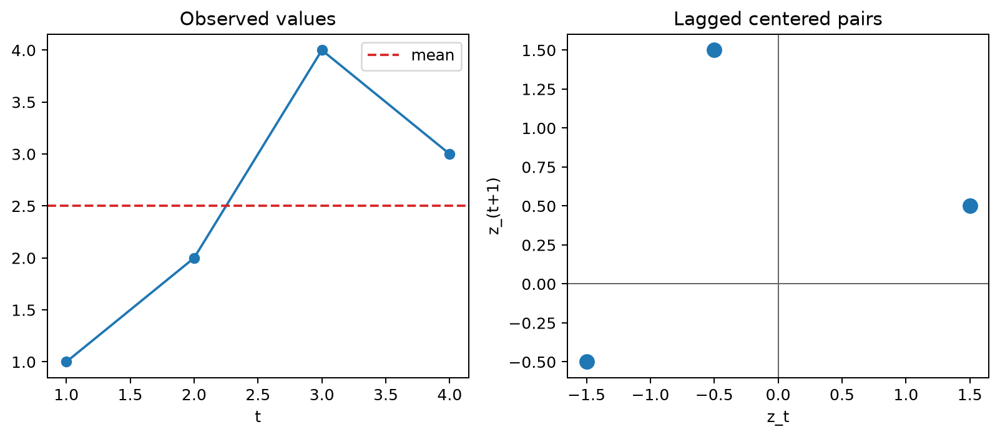
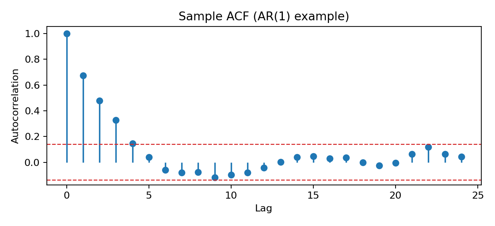
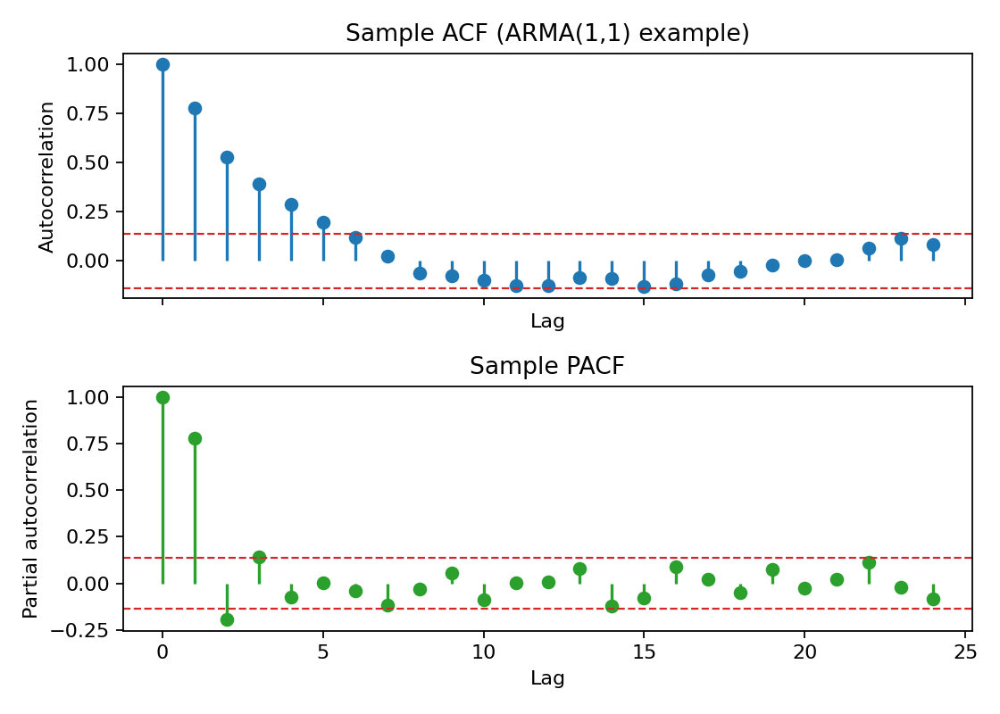
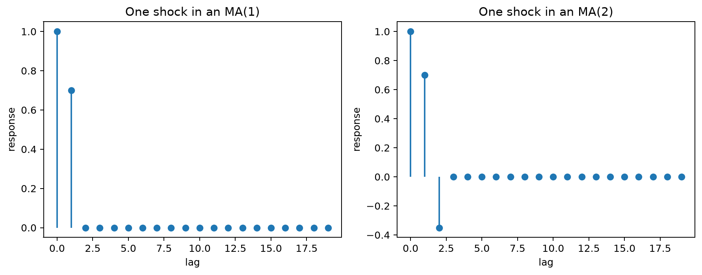
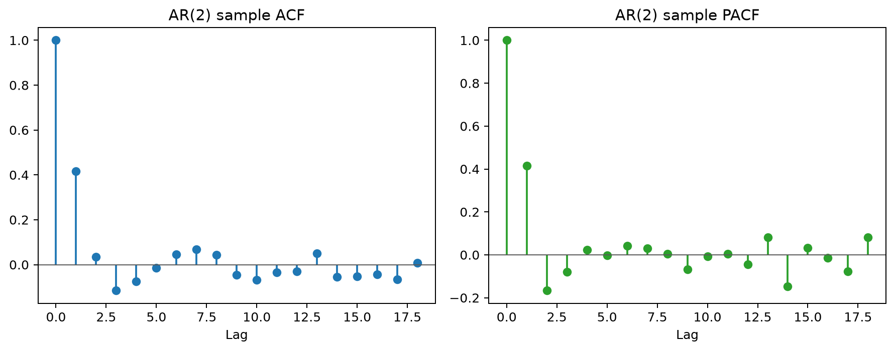

# Autocorrelation Function (ACF) and Partial Autocorrelation Function (PACF)

## Worked calculation: AR(1) dependence

For a stationary AR(1),

$$
X_t=0.7X_{t-1}+\varepsilon_t,
$$

the theoretical autocorrelation is

$$
\rho(h)=0.7^{|h|}.
$$

Therefore $\rho(1)=0.7$, $\rho(2)=0.49$, and $\rho(3)=0.343$. The ACF tails off geometrically rather than becoming exactly zero. The PACF is $0.7$ at lag 1 and zero at later lags in the population, which is the ideal identification pattern for an AR(1). Finite samples only approximate these values.

ACF and PACF summarize dependence across time lags and are useful for model identification and forecasting. They describe related but different aspects of that dependence:

- The ACF measures the correlation between observations separated by a given lag.
- The PACF isolates the direct linear relationship at a lag after accounting for the intermediate lags.

### Autocorrelation Function (ACF)

The Autocorrelation Function (ACF) measures the correlation between a time series and its lagged values. It summarizes how strongly observations separated by $k$ periods move together. Persistent or repeating ACF patterns can signal serial dependence, non-stationarity, or seasonality, although the ACF alone does not identify their cause. The autocorrelation at lag $k$, denoted $\rho_k$, is defined as:

$$
\rho_k = \frac{\gamma_k}{\gamma_0}
$$

where:

- $\gamma_k$ is the autocovariance at lag $k$;
- $\gamma_0$ is the variance of the series, or equivalently the autocovariance at lag 0.

#### Autocovariance Function

The autocovariance at lag $k$ measures how observations separated by $k$ periods vary together. For a weakly stationary series with mean $\mu$, it is:

$$
\gamma_k = \text{Cov}(X_t, X_{t+k}) = \mathbb{E}[(X_t - \mu)(X_{t+k} - \mu)]
$$

where $\mu$ is the constant mean of the series and $\mathbb{E}$ denotes expectation. The following figure gives a geometric view of how observations separated by a lag contribute to autocovariance.



#### Autocorrelation Coefficient

The autocorrelation coefficient at lag $k$ normalizes $\gamma_k$ by the variance $\gamma_0$. This makes it dimensionless and bounded between $-1$ and $1$, so values can be compared across lags and series:

$$
\rho_k = \frac{\gamma_k}{\gamma_0} = \frac{\mathbb{E}[(X_t - \mu)(X_{t+k} - \mu)]}{\mathbb{E}[(X_t - \mu)^2]}
$$

#### Sample Autocorrelation Function

In practice, the population ACF is unknown and is estimated from the observed series. One common sample autocorrelation coefficient at lag $k$ is:

$$
r_k = \frac{\sum_{t=1}^{N-k} (x_t - \bar{x})(x_{t+k} - \bar{x})}{\sum_{t=1}^{N} (x_t - \bar{x})^2}
$$

Where:

- $\bar{x}$ is the sample mean of the series.
- $N$ is the number of observations.
- $x_t$ is the observed value at time $t$.

The sample ACF can be computed for any series, but the standard interpretation of its lag pattern is most useful when the series is approximately stationary.

#### Sampling Properties (Large Samples)

For a weakly stationary series with mean $\mu$ and autocovariance $\gamma(h)$:

- $E(\bar{X}_n)=\mu$.
- The exact variance of the sample mean is

$$
\text{Var}(\bar{X}_n) =\frac{1}{n}\sum_{h=-(n-1)}^{n-1} \left(1-\frac{|h|}{n}\right)\gamma(h)
$$

- Under suitable weak-dependence conditions, $\bar{X}_n$ is approximately normal for large $n$.

A practical confidence interval therefore needs an estimate of the variance of $\bar X_n$. Using a truncated, weighted autocovariance estimate with bandwidth $m$ gives

$$
\hat v_n
=\frac{1}{n}
\left[
\hat\gamma(0)
+2\sum_{h=1}^{m}
\left(1-\frac{h}{m+1}\right)\hat\gamma(h)
\right],
$$

and an approximate $(1-\alpha)$ confidence interval is

$$
\bar X_n\pm z_{1-\alpha/2}\sqrt{\hat v_n}.
$$

For a fixed set of lags in a stationary linear process, the vector of sample autocorrelations also has an approximate large-sample normal distribution:

$$
\hat{\rho} =
(\hat{\rho}(1),\dots,\hat{\rho}(k))^\top
\approx
\mathcal{N}\left(\rho,\frac{W}{n}\right).
$$

A Bartlett-type expression for the entries of the asymptotic covariance matrix is

$$
W_{ij} =
\sum_{m=1}^{\infty}
\{\rho(m+i)+\rho(m-i)-2\rho(i)\rho(m)\}
\{\rho(m+j)+\rho(m-j)-2\rho(j)\rho(m)\}.
$$

The main practical point is that sampling errors are correlated across lags, so uncertainty should be interpreted as a joint pattern rather than as a collection of independent tests.

At large lags, fewer observation pairs contribute to each estimate, so the sample ACF becomes increasingly noisy. Rules such as limiting plots to roughly $n/4$ lags can be useful for display, but they are heuristics rather than requirements.

#### Plotting the ACF

An ACF plot, or correlogram, displays the sample autocorrelation at each lag. It helps reveal persistence, repeating seasonal structure, and cutoff patterns that may suggest candidate time-series models.

Useful questions include:

- Does the series resemble white noise, with most autocorrelations near zero?
- How quickly does dependence decay as the lag increases?
- Are there repeating spikes at seasonal lags?
- Does the ACF show a cutoff pattern consistent with a low-order MA model?

Key points for interpretation are:

1. A slow decay across many lags can indicate strong persistence or non-stationarity, including a trend, but it does not by itself establish the cause.
2. Repeated peaks at regular intervals can indicate seasonal dependence.
3. A sharp cutoff after lag $q$ is the ideal population pattern for an MA($q$) process, in which the current value depends on the current shock and a finite number of past shocks.

For a large white-noise sample, an approximate 95% reference band is:

$$
\pm \frac{1.96}{\sqrt{n}}
$$

Spikes outside these bounds are evidence against zero autocorrelation at an individual lag, but several lags are being inspected at once, so isolated crossings should be interpreted cautiously.

For some short-memory processes, Bartlett-type approximations give a larger sampling variance at later lags:

$$
\text{Var}(r_k) \approx \frac{1}{n} \left(1 + 2 \sum_{j=1}^{k-1} \rho_j^2\right)
$$

This approximation illustrates why uncertainty can widen when earlier lags are correlated. In model diagnostics, reference bands are best used together with the full residual pattern and formal checks rather than as a mechanical lag-by-lag decision rule.

The following synthetic AR(1) example shows the gradual ACF decay expected from autoregressive persistence.



For comparison, an ARMA(1,1) process usually has no clean cutoff in either function; both ACF and PACF tend to tail off.



#### Python Example

The following example generates three contrasting series—a random walk with drift, a seasonal signal, and an MA(1) process—and compares their ACFs. The purpose is to connect visible time-domain behavior with the corresponding lag-correlation pattern.

```python
import numpy as np
import matplotlib.pyplot as plt
from statsmodels.graphics.tsaplots import plot_acf

# code for simulating time series with trend and seasonality
np.random.seed(42)
N = 1000

# Example 1: Time Series with a stronger trend (Random Walk)
trend_series = np.cumsum(np.random.normal(1, 1, N))  # Random walk simulating a trend with positive drift

# Example 2: Time Series with clearer seasonality (less noise)
seasonal_series = np.sin(np.linspace(0, 20 * np.pi, N))  # A sine wave to emphasize seasonality

# Moving Average Process (MA(1))
noise = np.random.normal(0, 1, N)
ma_series = np.zeros(N)
ma_series[0] = noise[0]
for i in range(1, N):
    ma_series[i] = noise[i] + 0.5 * noise[i - 1]  # MA(1): current noise plus weighted previous noise

# Plotting the time series
plt.figure(figsize=(12, 8))
plt.subplot(3, 1, 1)
plt.plot(trend_series, label="Time Series with Trend")
plt.title('Time Series with Trend')
plt.grid(True)

plt.subplot(3, 1, 2)
plt.plot(seasonal_series, label="Time Series with Seasonality")
plt.title('Time Series with Seasonality')
plt.grid(True)

plt.subplot(3, 1, 3)
plt.plot(ma_series, label="Moving Average (MA(1)) Process")
plt.title('Moving Average (MA(1)) Process')
plt.grid(True)

plt.tight_layout()
plt.show()

# Plotting ACF for each time series
plt.figure(figsize=(12, 8))

# ACF for the time series with trend
plt.subplot(3, 1, 1)
plot_acf(trend_series, lags=50, ax=plt.gca())
plt.title('ACF of Time Series with Trend')

# ACF for the time series with seasonality
plt.subplot(3, 1, 2)
plot_acf(seasonal_series, lags=50, ax=plt.gca())
plt.title('ACF of Time Series with Seasonality')

# ACF for the MA(1) process
plt.subplot(3, 1, 3)
plot_acf(ma_series, lags=50, ax=plt.gca())
plt.title('ACF of Moving Average (MA(1)) Process')

plt.tight_layout()
plt.show()
```

The first figure shows the three generated series themselves, which provides the context needed before interpreting their ACFs.


The corresponding ACF plots make those structures visible in lag space.


The random walk has a slowly decaying ACF because it is non-stationary and highly persistent. The seasonal series produces a repeating correlation pattern, while the MA(1) series has the characteristic population cutoff after lag 1, subject to sampling noise in a finite sample.

### Partial Autocorrelation Function (PACF)

The Partial Autocorrelation Function (PACF) measures the linear relationship between observations $k$ periods apart after removing the linear effects of the intervening lags. It is especially useful for identifying autoregressive order.

The PACF at lag $k$, often denoted $\phi_{kk}$, is the coefficient on the $k$th lag when $X_t$ is linearly projected on $X_{t-1},\ldots,X_{t-k}$. Equivalently, it is the correlation between $X_t$ and $X_{t-k}$ after the intermediate lags have been accounted for.

#### Yule-Walker Equations

The Yule-Walker equations connect the autocovariances of a stationary AR($p$) process to its AR coefficients. If

$$
X_t=\phi_1X_{t-1}+\cdots+\phi_pX_{t-p}+\varepsilon_t,
$$

then

$$
\gamma_k=\sum_{j=1}^{p}\phi_j\gamma_{k-j},
$$

for positive lags $k$, with $\gamma_{-h}=\gamma_h$. Solving finite Yule-Walker systems of increasing order produces coefficients $\phi_{k1},\ldots,\phi_{kk}$; the final coefficient $\phi_{kk}$ is the PACF at lag $k$.

#### Recursive Calculation of PACF

The Durbin-Levinson recursion calculates these coefficients efficiently. It starts with $\phi_{11}=\rho_1$. For $k\geq2$,

$$
\phi_{kk} = \frac{\rho_k - \sum_{j=1}^{k-1} \phi_{k-1,j} \rho_{k-j}}{1 - \sum_{j=1}^{k-1} \phi_{k-1,j} \rho_j}
$$

and the intermediate coefficients $\phi_{kj}$ for $j<k$ are updated using

$$
\phi_{kj} = \phi_{k-1,j} - \phi_{kk} \phi_{k-1,k-j}
$$

#### Plotting the PACF

A PACF plot displays the estimated partial autocorrelation at each lag. Because it removes the linear contribution of intermediate lags, it is particularly useful for proposing the order of an autoregressive component.

For an ideal AR($p$) process, the population PACF is zero beyond lag $p$. In a finite sample, the estimated values do not become exactly zero, so the practical pattern is a set of notable early lags followed by values consistent with sampling variation. By contrast, MA and ARMA processes generally have PACFs that tail off rather than cut off cleanly.

As with the ACF, these patterns suggest candidate models; they do not prove a model order on their own.

#### Python Example

This example simulates AR, MA, and ARMA processes and compares their PACFs. Reading the time-series plots first makes it easier to connect each process with its lag-domain pattern.

```python
import numpy as np
import matplotlib.pyplot as plt
from statsmodels.tsa.arima_process import ArmaProcess
from statsmodels.graphics.tsaplots import plot_pacf

# Example 1: Simulating an AR(2) process
np.random.seed(42)
ar2 = np.array([1, -0.75, 0.25])  # AR(2) coefficients (X_t = 0.75*X_t-1 - 0.25*X_t-2 + noise)
ma0 = np.array([1])  # No MA component
AR_process = ArmaProcess(ar2, ma0)
ar_series = AR_process.generate_sample(nsample=1000)

# Example 2: Simulating a Moving Average (MA) process
ma1 = np.array([1, 0.5])  # MA(1) coefficients
MA_process = ArmaProcess([1], ma1)
ma_series = MA_process.generate_sample(nsample=1000)

# Example 3: Simulating an ARMA(1,1) process
ar1 = np.array([1, -0.5])  # AR(1): X_t = 0.5 X_{t-1} + noise
ma1 = np.array([1, 0.5])  # MA(1): current noise + 0.5 previous noise
ARMA_process = ArmaProcess(ar1, ma1)
arma_series = ARMA_process.generate_sample(nsample=1000)

# Plotting the time series
plt.figure(figsize=(12, 8))
plt.subplot(3, 1, 1)
plt.plot(ar_series, label="AR(2) Process")
plt.title('AR(2) Process')
plt.grid(True)

plt.subplot(3, 1, 2)
plt.plot(ma_series, label="MA(1) Process")
plt.title('MA(1) Process')
plt.grid(True)

plt.subplot(3, 1, 3)
plt.plot(arma_series, label="ARMA(1,1) Process")
plt.title('ARMA(1,1) Process')
plt.grid(True)

plt.tight_layout()
plt.show()

# Plotting PACF for each time series
plt.figure(figsize=(12, 8))

# PACF for the AR(2) process
plt.subplot(3, 1, 1)
plot_pacf(ar_series, lags=30, ax=plt.gca())
plt.title('PACF of AR(2) Process')

# PACF for the MA(1) process
plt.subplot(3, 1, 2)
plot_pacf(ma_series, lags=30, ax=plt.gca())
plt.title('PACF of MA(1) Process')

# PACF for the ARMA(1,1) process
plt.subplot(3, 1, 3)
plot_pacf(arma_series, lags=30, ax=plt.gca())
plt.title('PACF of ARMA(1,1) Process')

plt.tight_layout()
plt.show()
```

The generated series provide the time-domain context for the PACF comparison.


The PACF plots then show how the direct lag relationships differ across the three models.


For the AR(2) process, the population PACF cuts off after lag 2. The MA(1) and ARMA(1,1) processes instead have PACFs that tail off, although the exact finite-sample shapes depend on the parameters and simulated data.

### Comparing ACF and PACF

The ACF captures both direct and indirect linear dependence across lags, whereas the PACF removes the linear contribution of intermediate lags. This distinction leads to the familiar identification patterns:

- for an AR($p$) process, the ACF tails off while the PACF cuts off after lag $p$;
- for an MA($q$) process, the ACF cuts off after lag $q$ while the PACF tails off;
- for an ARMA process, both functions usually tail off.

The following figure summarizes these identification patterns visually.


### Example: ACF and PACF for AR(1) Process

Consider the autoregressive process of order 1, denoted AR(1):

$$
X_t = \phi X_{t-1} + \epsilon_t
$$

where $\epsilon_t$ is white noise.

#### ACF for AR(1)

The autocorrelation function for an AR(1) process is:

$$
\rho_k = \phi^k
$$

For $|\phi|<1$, the autocorrelation decays geometrically with the lag, producing a gradual tail-off in the ACF plot. If $\phi<0$, the signs alternate while the magnitude still decays.

#### PACF for AR(1)

For an AR(1) process, the population PACF equals $\phi$ at lag 1 and is zero at higher lags. Higher-order associations are mediated through the first lag, so they disappear after that lag is controlled for.

### Visualization of ACF and PACF

The following mock series illustrates short-term dependence consistent with an AR-type process. The point of the figure is the contrast between a gradually decaying ACF and a PACF that is concentrated at the first lag.


#### Left Plot: Autocorrelation Function (ACF)

- The ACF equals 1 at lag 0 because the series is perfectly correlated with itself.
- The ACF then decays gradually while remaining positive over several lags, which is consistent with autoregressive persistence.
- The shaded region is a reference band for sampling uncertainty. Spikes outside it indicate evidence of nonzero autocorrelation at those lags, but the overall decay pattern is more informative than any single crossing.

#### Right Plot: Partial Autocorrelation Function (PACF)

- The PACF shows a sharp drop after lag 1, which is the characteristic population pattern of an AR(1) process.
- Taken together with the tailing ACF, the dominant first-lag PACF suggests AR(1) as a candidate model to estimate and validate.

### Auto-Regressive (AR) and Moving Average (MA) Models with ACF and PACF

In time series analysis, **Auto-Regressive (AR)** and Moving Average (MA) models are widely used for modeling and forecasting. Identifying the correct order of these models relies on interpreting the Autocorrelation Function (ACF) and the Partial Autocorrelation Function (PACF).

#### Auto-Regressive (AR) Model
An AR($p$) model expresses the current value as a linear function of its own previous values plus a new innovation:

$$
y_t=c+\alpha_1y_{t-1}+\alpha_2y_{t-2}+\dots+\alpha_py_{t-p}+\varepsilon_t.
$$

The order $p$ is the number of lagged values included. In the ideal stationary population, the PACF is zero after lag $p$, while the ACF tails off. This makes the PACF especially useful for proposing an AR order, although estimation and diagnostics are still required.


#### Moving Average (MA) Model
An MA($q$) model expresses the current value in terms of the current innovation and a finite number of previous innovations:

$$
y_t=\mu+\varepsilon_t+\beta_1\varepsilon_{t-1}+\beta_2\varepsilon_{t-2}+\dots+\beta_q\varepsilon_{t-q}.
$$

The order $q$ is the number of past shocks retained in the model. In the ideal population, the ACF is zero after lag $q$, while the PACF tails off. The following figure illustrates that finite shock duration in the MA representation.




### Comparison

The following comparison places several common patterns side by side: AR(1), AR(2), MA(1), MA(2), a deterministic linear trend, a constant series, a noisy sine wave, and white noise.


Use the chart as a visual reference rather than a lookup rule. In particular, the ordinary ACF is not defined for an exactly constant series because its variance is zero, and non-stationary trend or seasonal examples should not be interpreted with stationary ARMA cutoff rules.

## Student guide: calculate and interpret ACF/PACF

The ACF and PACF are most informative after the mean structure of the series has been addressed. A trend, seasonal pattern, or structural break can produce slow ACF decay even when no stationary AR mechanism is present, so interpretation should begin with the series itself and then move to lag dependence.

### Sample ACF calculation

For observations $(1,2,4,3)$, the sample mean is $\bar x=2.5$, giving centered values

$$
z=(-1.5,-0.5,1.5,0.5).
$$

Using $n$ as the denominator for this autocovariance convention,

$$
\hat\gamma(0)=\frac{2.25+0.25+2.25+0.25}{4}=1.25,
$$

and

$$
\hat\gamma(1)=\frac{(-1.5)(-0.5)+(-0.5)(1.5)+(1.5)(0.5)}4
=0.1875.
$$

Thus

$$
\hat\rho(1)=\frac{0.1875}{1.25}=0.15.
$$

This gives a lag-1 sample autocorrelation of $0.15$, indicating only weak positive linear association in this small example. At larger lags, fewer observation pairs enter the numerator. Software may also use different finite-sample denominator conventions, so check the definition when reproducing reported values.

### AR(1) pattern

For

$$
X_t=0.7X_{t-1}+\varepsilon_t,
$$

the theoretical ACF is

$$
\rho(h)=0.7^{|h|}.
$$

The first values are $1$, $0.7$, $0.49$, $0.343$, and so on. The PACF is $0.7$ at lag 1 and zero at later lags in the population. The following figure shows how this persistence appears as a decaying lag pattern.


A finite sample will show nonzero later values, so use uncertainty bands and model checks rather than expecting an exact theoretical cutoff.

### PACF as a conditional relationship

The lag-2 PACF measures the relationship between $X_t$ and $X_{t-2}$ after linearly removing the contribution of the intermediate lag $X_{t-1}$. It is not an ordinary pairwise correlation.

For an AR(2),

$$
X_t=\phi_1X_{t-1}+\phi_2X_{t-2}+\varepsilon_t,
$$

the population PACF is zero after lag 2. The worked AR(2) figure below shows the contrast between a tailing ACF and a PACF whose direct dependence is concentrated in the first two lags.



For an MA process, the pattern is reversed: the ACF has a finite cutoff while the PACF generally tails off.

### Approximate significance bands

Under a white-noise approximation, an individual sample autocorrelation is often compared with

$$
\pm\frac{1.96}{\sqrt n}.
$$

With $n=100$, the approximate band is $\pm0.196$. These are reference bands, not simultaneous confidence intervals for the entire correlogram. They are also imperfect for fitted models, large lags, and strongly dependent processes, so a single crossing should not determine model choice.

### Identification is iterative

A practical identification loop is:

1. remove or model trend and seasonality;
2. calculate ACF/PACF of the transformed series;
3. propose a small ARMA candidate set;
4. estimate candidates;
5. inspect residual ACF/PACF and squared residuals;
6. backtest the candidates.

The cutoff rules are therefore a starting point rather than a proof. Near-unit roots, small samples, outliers, missing values, and structural changes can all mimic familiar patterns.

### Seasonal autocorrelation

For a seasonal period $s$, inspect lags $s,2s,3s$ and the neighboring lags. A spike at lag 12 in monthly data can arise from several different mechanisms:

- deterministic seasonal means;
- seasonal AR dependence;
- seasonal MA effects;
- calendar aggregation;
- an unmodeled annual predictor.

The appropriate treatment depends on the source of the dependence. Seasonal differencing is not automatically preferable to explicit seasonal terms, calendar predictors, or a seasonal-naive benchmark.

### Numerical identification table

| model | typical ACF | typical PACF |
|---|---|---|
| AR(1) | tails off | cuts off after 1 |
| AR(2) | tails off, possibly oscillates | cuts off after 2 |
| MA(1) | cuts off after 1 | tails off |
| MA(2) | cuts off after 2 | tails off |
| ARMA | tails off | tails off |

These patterns describe ideal population behavior. Use them to propose a small set of candidates, then confirm the choice through estimation, residual diagnostics, and forecast validation.
