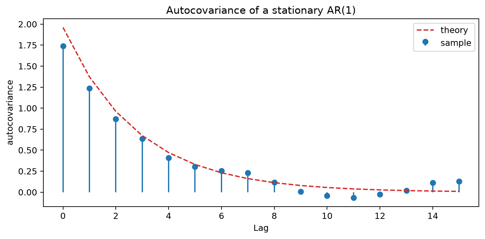

# Autocovariance functions and coefficients

Autocovariance measures how a time series varies jointly with lagged versions of itself. Lag 0 is the variance, while nonzero lags show the direction and scale of linear dependence between observations separated in time, expressed in the squared units of the original series.

For a weakly stationary process, autocovariance depends only on the lag rather than the absolute time. Normalizing it by the variance produces the unit-free autocorrelation function, while sample estimates require an explicit denominator convention and become noisier as fewer observation pairs remain at larger lags.

## Worked calculation: a lagged covariance

For $x=(1,2,4,3)$, the mean is $\bar x=2.5$, so the centered values are

$$
z=(-1.5,-0.5,1.5,0.5).
$$

Using the convention that divides by $n$, the lag-0 autocovariance is

$$
\hat\gamma(0)=\frac{1}{4}(2.25+0.25+2.25+0.25)=1.25.
$$

At lag 1,

$$
\hat\gamma(1)=\frac{1}{4}\{(-1.5)(-0.5)+(-0.5)(1.5)+(1.5)(0.5)\}=0.1875.
$$

Some software divides the lag-1 estimate by $n-1$ instead. Because different conventions produce different numerical values, state the denominator before comparing estimates. Autocovariance retains squared units, while autocorrelation divides by $\hat\gamma(0)$ and is therefore unit-free.

The figure shows how autocovariance changes with lag for a simulated autoregressive series. Autocovariance describes how values of a time series vary jointly with lagged values of the same series. It is useful for identifying dependence across time, but its magnitude depends on the scale of the data and should not be interpreted as a direct measure of causal influence. In autoregressive models, coefficients describe how past values enter the model, while the autocovariance function summarizes the dependence pattern implied by those coefficients.

### Random Variables (r.v.)

A random variable (r.v.) maps outcomes in a probability space to real numbers. Random variables may be discrete or continuous.

- A discrete random variable takes values from a countable set. For example, $X$ might take values in $\{45,36,27,\dots\}$.
- A continuous random variable can take any value in a continuous range. For example, $Y$ might take values in $(10,60)$.

A realization is a specific observed value of a random variable. For example, one realization might be $X=20$ and another $Y=30.29$.

### Covariance

The covariance between two random variables $X$ and $Y$ measures how they vary together linearly. It is defined as

$$
\text{Cov}(X,Y)=E\left[(X-\mu_X)(Y-\mu_Y)\right],
$$

where $\mu_X=E[X]$ is the mean of $X$, $\mu_Y=E[Y]$ is the mean of $Y$, and $E[\cdot]$ denotes expectation.

Covariance is symmetric:

$$
\text{Cov}(X,Y)=\text{Cov}(Y,X).
$$

Useful identities include:

- $\text{Var}(X)=\text{Cov}(X,X)$
- $\text{Cov}(X,Y)=E[XY]-E[X]E[Y]$
- $\text{Var}(X)=E[X^2]-(E[X])^2$
- $\text{Var}(a+bX)=b^2\text{Var}(X)$
- $\text{Cov}(aX+bY,cZ+dW)=ac\,\text{Cov}(X,Z)+ad\,\text{Cov}(X,W)+bc\,\text{Cov}(Y,Z)+bd\,\text{Cov}(Y,W)$
- $E\left(\sum_i X_i\right)=\sum_i E(X_i)$

The sign of covariance describes the direction of a linear relationship:

- If $\text{Cov}(X,Y)>0$, larger values of $X$ tend to occur with larger values of $Y$.
- If $\text{Cov}(X,Y)<0$, larger values of $X$ tend to occur with smaller values of $Y$.
- If $\text{Cov}(X,Y)=0$, there is no linear covariance between $X$ and $Y$, although a nonlinear relationship may still exist.

The following figure gives a geometric view of lagged covariance by showing how paired observations contribute positively or negatively depending on their positions relative to the mean.

#### Estimation of Covariance

For paired observations $(x_1,y_1),(x_2,y_2),\dots,(x_N,y_N)$, the usual sample covariance is

$$
s_{xy}=\frac{1}{N-1}\sum_{t=1}^{N}(x_t-\bar x)(y_t-\bar y),
$$

where

- $\bar x=\frac{1}{N}\sum_{t=1}^{N}x_t$ is the sample mean of $x$,
- $\bar y=\frac{1}{N}\sum_{t=1}^{N}y_t$ is the sample mean of $y$,
- $N$ is the number of paired observations.

This estimator concerns two variables observed in pairs. For a time series, the same idea is applied to values separated by a lag, which leads to autocovariance.

### Stochastic Processes

A stochastic process is a collection of random variables indexed by time or another ordered set:

$$
\{X_t:t\in T\}.
$$

Here, $T$ is the index set, often representing time. In general, the distribution, mean, and variance of $X_t$ may depend on $t$. Stationarity introduces conditions under which these properties remain stable over time.

A time series is one realization of a stochastic process. For example, the random variables

$$
X_1,X_2,X_3,\dots
$$

might be observed as

$$
30,29,57,\dots
$$

The distinction matters because theoretical quantities such as covariance and autocovariance describe the stochastic process, while sample estimates are calculated from the observed realization.

### Autocovariance Function

The autocovariance function measures the covariance between two values of the same stochastic process at times $s$ and $t$:

$$
\gamma(s,t)=\text{Cov}(X_s,X_t)=E\left[(X_s-\mu_s)(X_t-\mu_t)\right].
$$

Here, $\mu_s=E[X_s]$ and $\mu_t=E[X_t]$ are the means at the two time points.

Variance is a special case. When $s=t$,

$$
\gamma(t,t)=E\left[(X_t-\mu_t)^2\right]=\text{Var}(X_t)=\sigma_t^2.
$$

Thus, autocovariance extends the idea of variance from one time point to pairs of time points.

### Lagged Autocovariance

For a weakly stationary process, the covariance between $X_t$ and $X_{t+k}$ depends only on the lag $k$, not on the particular time $t$. The lag-$k$ autocovariance is therefore

$$
\gamma_k=\gamma(k)=\text{Cov}(X_t,X_{t+k})=E\left[(X_t-\mu)(X_{t+k}-\mu)\right].
$$

This lag-based form makes it possible to summarize dependence across time with one function. Positive values indicate that observations separated by $k$ periods tend to deviate from the mean in the same direction, while negative values indicate opposite deviations.

#### Autocovariance Coefficients

For a time series $\{X_t\}$, the population autocovariance at lag $k$ is

$$
\gamma_k=\text{Cov}(X_t,X_{t+k})=E\left[(X_t-\mu)(X_{t+k}-\mu)\right].
$$

For a weakly stationary process, $\mu$ is constant and $\gamma_k$ depends only on $k$.

A common sample estimator, denoted here by $c_k$, is

$$
c_k=\frac{1}{N}\sum_{t=1}^{N-k}(x_t-\bar x)(x_{t+k}-\bar x),
$$

where

$$
\bar x=\frac{1}{N}\sum_{t=1}^{N}x_t.
$$

The value $c_k$ estimates the population quantity $\gamma_k$. Because fewer observation pairs are available as $k$ increases, estimates at large lags are generally less stable.

#### Assumption of Weak Stationarity

A process is weakly stationary when its mean is constant, its variance is finite and constant, and its autocovariance depends only on the lag. Under these conditions,

$$
\gamma_k=E\left[(X_t-\mu)(X_{t+k}-\mu)\right]=\text{Cov}(X_t,X_{t+k}).
$$

The sample autocovariance can then be used to estimate this lag-based dependence:

$$
c_k=\frac{1}{N}\sum_{t=1}^{N-k}(x_t-\bar x)(x_{t+k}-\bar x).
$$

This estimate summarizes the direction and scale of linear dependence between observations separated by $k$ periods. To compare dependence across series with different units or variances, use autocorrelation instead.

## Student guide: units, lags, and finite samples

The autocovariance at lag $h$ is

$$
\gamma(h)=\text{Cov}(X_t,X_{t-h}).
$$

For a weakly stationary process, it depends on the lag rather than absolute time. Autocovariance has squared units: if temperature is measured in degrees Celsius, autocovariance is measured in degrees Celsius squared. Autocorrelation divides by the variance and is therefore dimensionless.

### Sample calculation

For $x=(1,2,4,3)$, $\bar x=2.5$, and $z=(-1.5,-0.5,1.5,0.5)$. Using denominator $n=4$ gives

$$
\hat\gamma(0)=1.25,\qquad \hat\gamma(1)=0.1875.
$$

The corresponding autocorrelation is

$$
\hat\rho(1)=\frac{0.1875}{1.25}=0.15.
$$

At larger lags, fewer observation pairs are available. One common convention divides by $n$ at every lag, while another divides by $n-h$. Neither should be treated as the unique sample autocovariance definition without stating the convention.

### AR(1) covariance recursion

For the stationary AR(1) process

$$
X_t=\phi X_{t-1}+\varepsilon_t,\qquad |\phi|<1,
$$

with innovation variance $\sigma_\varepsilon^2$, the process variance is

$$
\gamma(0)=\frac{\sigma_\varepsilon^2}{1-\phi^2}.
$$

Its autocovariance then follows the recursion

$$
\gamma(h)=\phi^h\gamma(0),\qquad h\ge 0.
$$

With $\phi=0.7$ and $\sigma_\varepsilon^2=1$,

$$
\gamma(0)=1.9608,\qquad \gamma(1)=1.3725,\qquad \gamma(2)=0.9608.
$$

The autocovariance therefore decays geometrically with lag, just like the ACF, but it retains the variance scale of the original series. The following figure illustrates that decay for a simulated AR(1) process.

### Cross-covariance caution

For two series, the cross-covariance $\gamma_{XY}(h)$ depends on which series is shifted and on the sign convention used for the lag. A peak at positive $h$ therefore does not, by itself, establish that $X$ causes $Y$. Common trends, seasonality, delayed measurement, and release timing can all create apparent lead-lag patterns.
