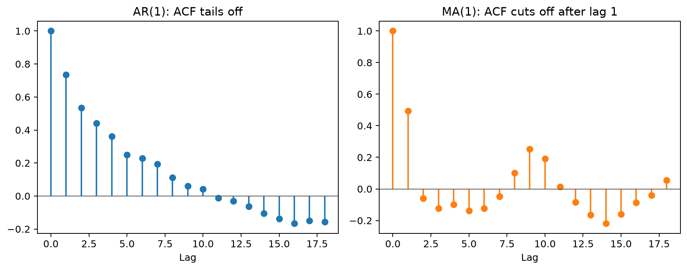
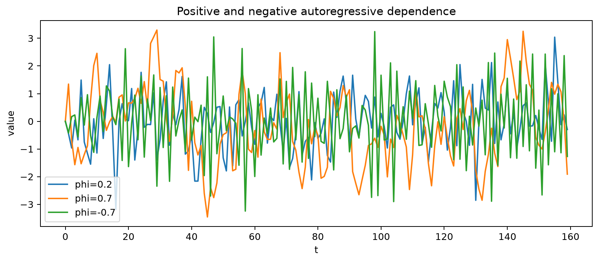
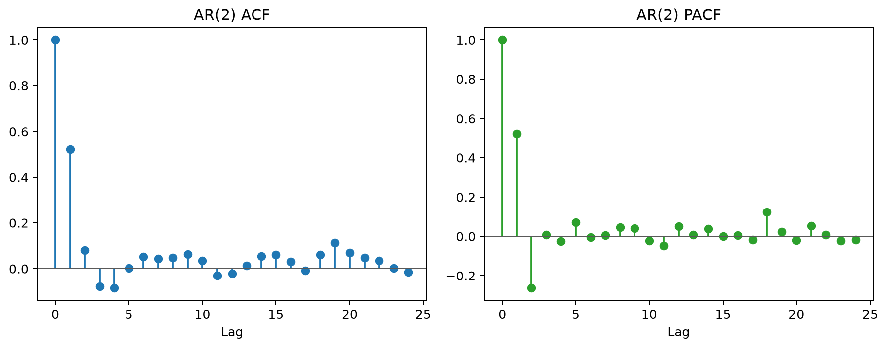
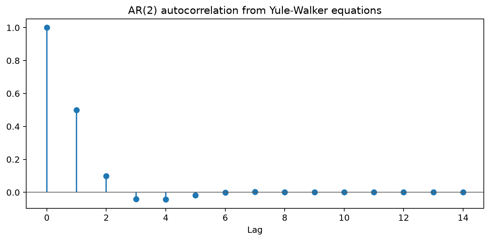

# Autoregressive (AR) Models in Time Series Analysis

## Worked calculation: one AR(2) update

Take

$$
X_t=0.4+0.6X_{t-1}-0.2X_{t-2}+\varepsilon_t.
$$

If $X_{t-1}=3$, $X_{t-2}=2$, and the new shock is $\varepsilon_t=0.5$, then

$$
X_t=0.4+0.6(3)-0.2(2)+0.5=2.3.
$$

The conditional mean, before observing the new shock, is $1.8$. The shock moves the realized value away from that mean. The AR polynomial is $1-0.6B+0.2B^2$; its roots determine whether the recursion is stationary.

Autoregressive (AR) models are fundamental tools in time series analysis, used to describe and forecast time-dependent data. An AR model predicts future values based on a linear combination of past observations. The order of an AR model, denoted as $p$, indicates how many lagged past values are used.

### Definition of Autoregressive Models

An **Autoregressive model of order $p$**, denoted as **AR($p$)**, is a type of stochastic process used for analyzing and forecasting time series data. The model expresses the current value of the series as a linear combination of its previous $p$ values plus a constant and a stochastic error term. Mathematically, it is defined by the equation:

$$X_t = c + \phi_1 X_{t-1} + \phi_2 X_{t-2} + \dots + \phi_p X_{t-p} + \epsilon_t$$

Alternatively, using summation notation:

$$X_t = c + \sum_{i=1}^{p} \phi_i X_{t-i} + \epsilon_t$$

### Components of the AR($p$) Model

- $X_t$ represents the observed value of the time series at a specific time $t$.  
- $c$ is the constant or intercept term in the model, which accounts for a baseline level in the data.  
- $\phi_i$ denotes the autoregressive coefficients associated with the $i$-th lag of the series.  
- $X_{t-i}$ refers to the value of the time series at lag $i$, which is the observation $i$ time steps prior to $t$.  
- $\epsilon_t$ is the error term for time $t$, assumed to be white noise under standard assumptions.  

**Properties of White Noise ($\epsilon_t$)** 

- Each $\epsilon_t$ is independently and identically distributed (i.i.d.), meaning it has no correlation with past or future errors and follows a consistent distribution.  
- The expected value of $\epsilon_t$ is zero, expressed as $\mathbb{E}[\epsilon_t] = 0$.  
- The variance of $\epsilon_t$ remains constant over time, denoted as $\text{Var}(\epsilon_t) = \sigma^2$.

**Autoregressive (AR) Models Overview**

- The autoregressive model expresses $X_t$ as a linear combination of its past values and an error term.  
- An AR model of order $p$ (AR($p$)) includes $p$ lags, meaning it incorporates $X_{t-1}, X_{t-2}, \ldots, X_{t-p}$.  
- Coefficients $\phi_1, \phi_2, \ldots, \phi_p$ measure the influence of these lagged values on $X_t$.  

### Order of an AR Model

The **order** of an autoregressive model, denoted as $p$ in AR($p$), specifies the number of lagged terms (previous values) used to predict the current value. 

**AR(1)**: 

A first-order autoregressive model uses the immediately preceding value.

$$X_t = c + \phi_1 X_{t-1} + \epsilon_t$$

**AR(2)**: 

A second-order autoregressive model uses the two preceding values.

$$X_t = c + \phi_1 X_{t-1} + \phi_2 X_{t-2} + \epsilon_t$$

**General AR($k$)**: 

A $k$-th order autoregressive model uses the previous $k$ values.

$$X_t = c + \sum_{i=1}^{k} \phi_i X_{t-i} + \epsilon_t$$

### Example: AR(2) Model in Practice

Suppose we aim to predict the current year's measurement $y_t$ using the measurements from the previous two years $y_{t-1}$ and $y_{t-2}$. The corresponding AR(2) model is:

$$y_t = B_0 + B_1 y_{t-1} + B_2 y_{t-2} + w_t$$

Where:

- $B_0$ represents the intercept term, which accounts for the baseline level of the series in the model.  
- $B_1$ and $B_2$ are the coefficients corresponding to the lagged values $y_{t-1}$ and $y_{t-2}$, respectively. These coefficients quantify the influence of these past observations on the current value.  
- $w_t$ is the white noise error term at time $t$, reflecting random fluctuations that are not explained by the lagged values in the model.  

This model captures the dependence of $y_t$ on its two immediate past values, allowing for more nuanced predictions compared to an AR(1) model.

### General Interpretation of AR($p$) Models

In a general AR($p$) model, the current value $X_t$ is modeled as a linear function of its past $p$ values. This setup is essentially a multiple linear regression where the predictors are the lagged terms of the time series itself. The model can be succinctly expressed as:

$$X_t = c + \phi_1 X_{t-1} + \phi_2 X_{t-2} + \dots + \phi_p X_{t-p} + \epsilon_t$$

### Estimation of Parameters

Methods for Estimating Parameters ($c$ and $\phi_i$):

**Least Squares Estimation**:  

- This method minimizes the sum of squared residuals, where residuals are the differences between observed and predicted values.  
- It provides a straightforward approach and is computationally efficient for AR models.  

**Yule-Walker Equations**:  

- These equations use the autocorrelations of the time series to estimate parameters.  
- The method solves a system of linear equations derived from the relationship between autocorrelations and the model parameters.  
- It assumes stationarity of the time series and is particularly useful for AR models of higher orders.  

**Maximum Likelihood Estimation (MLE)**:  

- This approach estimates parameters by maximizing the likelihood function of the observed data, assuming a specific probability distribution for the residuals.  
- MLE is statistically efficient and can handle more complex model structures but may require iterative numerical methods for computation.  

### Model Selection for Autoregressive (AR) Models

Selecting the appropriate order $p$ for an Autoregressive (AR) model is essential for accurate time series forecasting. The order $p$ determines how many lagged values of the series are used to predict the current value. This section outlines the methodologies and criteria used to determine the optimal order of an AR model.

#### Autocorrelation Function (ACF)

The **Autocorrelation Function (ACF)** measures the correlation between the time series and its lagged versions. For a given lag $k$, the ACF is defined as:

$$r_k = \frac{\sum_{i=1}^{n-k} (Y_i - \overline{Y})(Y_{i+k} - \overline{Y})}{\sum_{i=1}^{n} (Y_i - \overline{Y})^2}$$

where:

- $Y_1, Y_2, \ldots, Y_n$ are the observed values of the time series.
- $\overline{Y}$ is the mean of the series.
- $r_k$ is the autocorrelation at lag $k$.

In an **AR($p$)** process, the ACF typically shows a **gradual decay** as the lag increases.

For example, an AR(1) process with parameter $\phi = 0.8$ exhibits an exponential decay in the ACF.

#### Partial Autocorrelation Function (PACF)

The **Partial Autocorrelation Function (PACF)** measures the correlation between the time series and its lagged values **after removing the effects of intermediate lags**. Formally, the partial autocorrelation at lag $k$ is the correlation between $Y_t$ and $Y_{t-k}$ that is not explained by lags $1$ through $k-1$.

- In an **AR($p$)** process, the PACF will show significant spikes up to lag $p$ and drop to near zero for lags greater than $p$.
- For instance, an AR(2) process will have non-zero PACF values at lags 1 and 2, and PACF values close to zero for lags $3$ and beyond.

Below are ACF and PACF plots for AR(2) process:

#### Information Criteria for Model Selection

Beyond visual inspection, statistical criteria can quantitatively assess the optimal model order by balancing model fit and complexity.

##### Akaike Information Criterion (AIC)

The **Akaike Information Criterion (AIC)** evaluates the trade-off between the goodness of fit of the model and its complexity. It is defined as:

$$\text{AIC} = -2 \ln(L) + 2k$$

where:

- $L$ is the maximized value of the likelihood function for the model.
- $k$ is the number of estimated parameters in the model.

- **Lower AIC values** indicate a better model, as they signify a higher likelihood with fewer parameters.
- AIC penalizes models with more parameters to avoid overfitting.

#####  Bayesian Information Criterion (BIC)

The **Bayesian Information Criterion (BIC)** is similar to AIC but imposes a heavier penalty for models with more parameters, especially as the sample size $n$ increases. It is defined as:

$$\text{BIC} = -2 \ln(L) + k \ln(n)$$

where:

- $L$ is the maximized value of the likelihood function for the model.
- $k$ is the number of estimated parameters.
- $n$ is the number of observations.

- **Lower BIC values** suggest a better model.
- BIC is particularly useful when the sample size is large, as it more strongly discourages overfitting compared to AIC.

#### Steps for Selecting the Optimal AR Model Order

I. **Plot ACF and PACF:**

- Examine the ACF for patterns of decay and the PACF for the lag after which partial autocorrelations become insignificant.
- Identify potential candidate orders based on these visual cues.

II. **Estimate Models with Varying Orders:**

Fit AR models with different orders $p$ (e.g., AR(1), AR(2), AR(3), etc.).

III. **Compute AIC and BIC:**

Calculate the AIC and BIC for each fitted model.

IV. **Select the Model with the Lowest AIC/BIC:**

Choose the model order $p$ that minimizes the AIC or BIC, balancing fit and complexity.

**Example:**

Suppose you have time series data and after plotting the ACF and PACF, you observe:

- The ACF shows a slow decay, suggesting an AR process.
- The PACF cuts off sharply after lag 2.

You then fit AR models with $p = 1, 2, 3$ and compute their AIC and BIC values:

| Model | AIC | BIC |
|-------|-----|-----|
| AR(1) | 150 | 155 |
| AR(2) | 140 | 145 |
| AR(3) | 142 | 150 |

Both AIC and BIC are minimized at **AR(2)**, indicating that an AR(2) model is the most appropriate choice.

### Properties of AR Models

**Stationarity in AR Models**

- A time series is stationary when its statistical properties, such as mean and variance, remain constant over time.  
- An AR model is stationary if the roots of its characteristic equation lie outside the unit circle in the complex plane.  
- For an AR(1) model, stationarity is ensured if \( |\phi_1| < 1 \), meaning the absolute value of the autoregressive coefficient is less than one.  
- For AR(1), a **causal** (future‑independent) stationary solution exists only when \( |\phi_1| < 1 \).  
- If \( |\phi_1| > 1 \), a stationary solution can be written only in a **noncausal** form that depends on future shocks.  
- If \( \phi_1 = \pm 1 \), no stationary solution exists.  

**Autocorrelation Function (ACF)**

- The ACF measures the correlation between the time series and its lagged values over different time lags.  
- For an AR model, the ACF declines either exponentially or in a damped sinusoidal pattern, depending on the values of the autoregressive coefficients.  
- This behavior reflects the gradual weakening of correlation as the lag increases in stationary AR processes.  

**Partial Autocorrelation Function (PACF)**

- The PACF measures the direct correlation between the time series and its lagged values, removing the effects of intermediate lags.  
- For an AR(\( p \)) model, the PACF cuts off after lag \( p \), meaning it is nonzero only for the first \( p \) lags and zero thereafter.  
- This property of the PACF is useful for identifying the order \( p \) of an AR model.  

### Example: AR(2) Model in Time Series Forecasting

Consider an AR model of order 2, denoted as AR(2). This model assumes that the value at a particular time point is a linear function of the two preceding values, plus some error term.

#### AR(2) Model Equation

The AR(2) model is given by:

$$X_t = c + \phi_1 X_{t-1} + \phi_2 X_{t-2} + \epsilon_t$$

Suppose we have:

- $c = 3$
- $\phi_1 = 0.6$
- $\phi_2 = -0.2$
- Past observations: $X_{t-1} = 10$, $X_{t-2} = 5$

##### Calculation

Plugging the values into the AR(2) equation:

$$X_t = 3 + 0.6 \times 10 - 0.2 \times 5 + \epsilon_t$$

$$X_t = 3 + 6 - 1 + \epsilon_t$$

$$X_t = 8 + \epsilon_t$$

##### Interpretation

- The **deterministic component** of the time series ensures that the expected value of $X_t$, given all prior observations, equals 8.  
- The **stochastic component** of the model introduces variability through $\epsilon_t$, which represents white noise fluctuations.  
- The **predicted value** of $X_t$ at any time is equal to 8, with the randomness introduced by $\epsilon_t$ accounting for deviations.  

#### Visualization

- The blue line represents the original mock data generated to simulate a time series following an AR(2) process.
- The red dashed line shows the predictions made by the fitted AR(2) model.

This visualization illustrates how the AR(2) model captures the underlying pattern of the time series. The model uses the two most recent values to make predictions, adjusting to the trends and fluctuations in the data. 

### Limitations of AR Models

**Linearity Assumption**

- AR and ARIMA models rely on the assumption of linear relationships between variables and their lags.  
- This assumption can fail to capture nonlinear dynamics, which are common in real-world time series data.  
- As a result, such models may underperform when the underlying process has significant nonlinear patterns.  

**Stationarity Requirement**

- These models require the time series to be stationary, meaning that its statistical properties, like mean and variance, do not change over time.  
- Real-world data often exhibit nonstationarity due to trends, seasonality, or structural changes, necessitating transformations like differencing or detrending.  

**Sensitivity in Parameter Estimation**

- The accuracy of parameter estimates ($c, \phi_i$) can be sensitive to the presence of outliers, which may distort the model fit.  
- Incorrect model specification, such as choosing the wrong lag order or differencing level, can further bias parameter estimates.  

**Complexity in Model Selection**

- Determining the optimal values for $p$ (autoregressive order), $d$ (differencing), and $q$ (moving average order) requires careful analysis and often expert judgment.  
- Tools like ACF, PACF plots, and information criteria (e.g., AIC, BIC) aid in selection but are not foolproof.  
- Model selection can become challenging in cases with limited data or complex dependencies.  

**Risk of Overfitting**

- Overly complex models, with high $p$, $d$, or $q$, may fit the random noise rather than the true underlying process.  
- Overfitting leads to poor generalization, reducing the model's ability to make accurate predictions on new data.  
- Regularization techniques and cross-validation can help mitigate this risk but may increase computational requirements.

## Student guide: persistence, roots, and prediction

An AR model explains the current value using observed past values:

$$
y_t=c+\phi_1y_{t-1}+\cdots+\phi_py_{t-p}+\varepsilon_t.
$$

The observed lags are regressors, but stationarity still depends on the roots of the AR polynomial.

### AR(1) numbers

For

$$
y_t=1+0.8y_{t-1}+\varepsilon_t,
\qquad
\operatorname{Var}(\varepsilon_t)=1,
$$

the stationary mean is $5$ and the variance is $1/(1-0.8^2)=2.7778$. If the latest centered value is $y_T-\mu=2$, the conditional mean deviation is

$$
\hat y_{T+1|T}-\mu=0.8(2)=1.6,
$$

and the five-step deviation is

$$
\hat y_{T+5|T}-\mu=0.8^5(2)=0.6554.
$$

Persistence affects both the ACF and the rate at which forecasts return toward the mean.

### AR(2) roots

For

$$
y_t=0.6y_{t-1}-0.2y_{t-2}+\varepsilon_t,
$$

the characteristic equation is

$$
r^2-0.6r+0.2=0.
$$

Its discriminant is $0.36-0.8=-0.44$, so the roots are complex:

$$
r=\frac{0.6\pm i\sqrt{0.44}}2.
$$

Their modulus is $\sqrt{0.2}\approx0.447$, below 1. The impulse response therefore oscillates while decaying. Complex roots can produce alternating or cyclical ACF patterns without a deterministic seasonal component.

### Estimation and intercepts

For AR($p$), create a design matrix from rows $t=p+1,\ldots,T$:

$$
\mathbf y=
\begin{bmatrix}y_{p+1}\\ \vdots\\ y_T\end{bmatrix},
\qquad
\mathbf X=
\begin{bmatrix}
1&y_p&\cdots&y_1\\
\vdots&\vdots&&\vdots\\
1&y_{T-1}&\cdots&y_{T-p}
\end{bmatrix}.
$$

The conditional least-squares estimate is

$$
\hat\beta=(X^\top X)^{-1}X^\top y
$$

when the matrix has full rank. A trend, deterministic seasonal term, or strongly collinear lag columns can make this calculation unstable. Likelihood estimation accounts more carefully for initial observations and innovation variance.

The intercept $c$ is not the stationary mean. For AR(1), $\mu=c/(1-\phi)$. For AR($p$), $\mu=c/(1-\sum_j\phi_j)$ when the denominator is nonzero and the process is stationary.

### Forecast uncertainty

For a centered AR(1),

$$
\hat y_{T+h|T}=\phi^hy_T,
$$

and

$$
\operatorname{Var}(e_{T+h})
=\sigma^2\sum_{j=0}^{h-1}\phi^{2j}.
$$

The mean forecast converges to zero when $|\phi|<1$, but the interval converges toward the unconditional variance. Report both the point forecast and the uncertainty.

### Overfitting and stability

Increasing $p$ can reduce in-sample error while making estimates unstable. Check:

- root location;
- coefficient uncertainty;
- residual ACF;
- parameter stability over time;
- temporal forecast performance.

A model can be statistically stationary but practically persistent when a root is close to the unit circle. Forecast intervals and finite-sample estimates then deserve extra scrutiny.

### Visual companions

Run [dependence_visualizations.py](../../scripts/time_series/dependence_visualizations.py):

