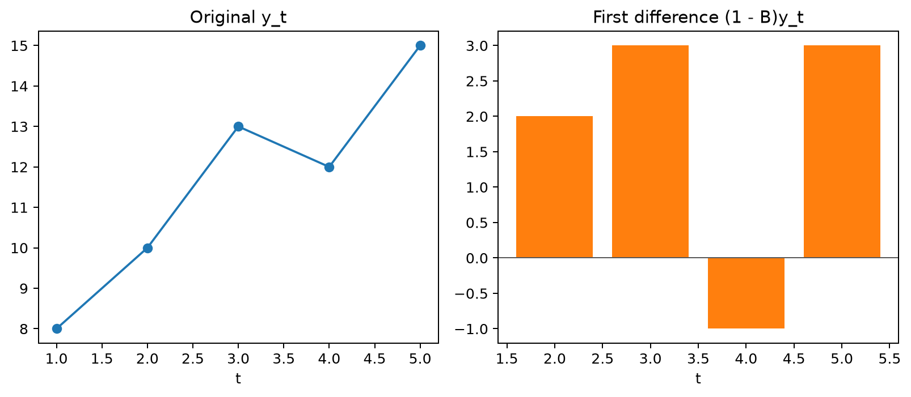
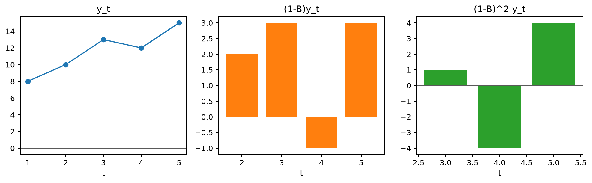

# Backward Shift Operator

The backward shift operator is a compact notation for referring to earlier observations in a time series. Instead of writing each lag separately, it lets lagged values, differences, and model equations be expressed as polynomials in a single operator.

This notation matters because the algebra of those polynomials mirrors the structure of AR, MA, ARIMA, and seasonal models. Expanding an operator always returns to ordinary lagged observations, while factoring and combining operators make stability, differencing, and model structure easier to see.

## Worked calculation: differencing with the lag operator

For

$$
y_1,\ldots,y_5=8,\ 10,\ 13,\ 12,\ 15,
$$

the backward shift gives $By_5=y_4=12$. Therefore,

$$
(1-B)y_5=y_5-y_4=15-12=3.
$$

Applying the difference operator twice gives

$$
(1-B)^2y_5=y_5-2y_4+y_3=15-24+13=4.
$$

The notation is compact, but the calculation is still ordinary subtraction. It becomes especially useful when ordinary and seasonal differences are combined in ARIMA models.

The **backward shift operator**, denoted by $B$, is a compact way to refer to earlier observations in a time series. It shifts the time index back by one period and simplifies the notation used in autoregressive, moving average, and mixed models.

For a time series $\{X_t\}$,

$$
BX_t=X_{t-1}.
$$

Higher powers represent repeated shifts:

$$
B^2X_t=B(BX_t)=BX_{t-1}=X_{t-2},
$$

and, more generally,

$$
B^kX_t=X_{t-k}.
$$

This simple rule lets lagged terms be collected into polynomials, making model equations easier to manipulate and interpret.

### Random Walk

Consider a simple **random walk**:

$$
X_t=X_{t-1}+Z_t,
$$

where $Z_t$ is white noise. Because $X_{t-1}=BX_t$, the model can be written as

$$
X_t=BX_t+Z_t.
$$

Rearranging gives

$$
(1-B)X_t=Z_t.
$$

If we define

$$
\phi(B)=1-B,
$$

then the random walk becomes

$$
\phi(B)X_t=Z_t.
$$

Here, $1-B$ is also the first-difference operator: applying it to $X_t$ converts the random-walk level into its one-period change.

### Moving Average (MA) Process

Consider a **moving average process of order 2, MA(2)**:

$$
X_t=Z_t+0.2Z_{t-1}+0.04Z_{t-2}.
$$

Using $BZ_t=Z_{t-1}$ and $B^2Z_t=Z_{t-2}$,

$$
X_t=Z_t+0.2BZ_t+0.04B^2Z_t.
$$

Factoring the noise sequence gives

$$
X_t=(1+0.2B+0.04B^2)Z_t.
$$

Define

$$
\beta(B)=1+0.2B+0.04B^2.
$$

Then the model is simply

$$
X_t=\beta(B)Z_t.
$$

The polynomial $\beta(B)$ therefore summarizes how the current and lagged shocks enter the MA(2) process.

### Autoregressive (AR) Process

Consider an **autoregressive process of order 2, AR(2)**:

$$
X_t=0.2X_{t-1}+0.3X_{t-2}+Z_t.
$$

Using the backward shift operator,

$$
X_t=0.2BX_t+0.3B^2X_t+Z_t.
$$

Collecting all terms involving $X_t$ on the left gives

$$
(1-0.2B-0.3B^2)X_t=Z_t.
$$

Define the AR polynomial as

$$
\phi(B)=1-0.2B-0.3B^2.
$$

The process can then be written as

$$
\phi(B)X_t=Z_t.
$$

This is the standard operator form of an AR model: the polynomial $\phi(B)$ collects the dependence on past values into a single expression.

### Moving Average (MA) Process with Drift

An **MA($q$)** process with a constant term can be written as

$$
X_t=\mu+\beta_0Z_t+\beta_1Z_{t-1}+\dots+\beta_qZ_{t-q}.
$$

Using the backward shift operator,

$$
X_t=\mu+\beta_0Z_t+\beta_1BZ_t+\dots+\beta_qB^qZ_t.
$$

Factoring the shock sequence gives

$$
X_t=\mu+\beta(B)Z_t,
$$

where

$$
\beta(B)=\beta_0+\beta_1B+\dots+\beta_qB^q.
$$

Equivalently,

$$
X_t-\mu=\beta(B)Z_t.
$$

In this stationary MA setting, $\mu$ is best interpreted as a constant mean term rather than a time trend. The operator polynomial $\beta(B)$ captures the effect of current and lagged shocks around that mean.

### Autoregressive (AR) Process of Order $p$

An **autoregressive process of order $p$, AR($p$)**, is

$$
X_t=\phi_1X_{t-1}+\phi_2X_{t-2}+\dots+\phi_pX_{t-p}+Z_t.
$$

Applying the backward shift notation,

$$
X_t=\phi_1BX_t+\phi_2B^2X_t+\dots+\phi_pB^pX_t+Z_t.
$$

Rearranging gives

$$
(1-\phi_1B-\phi_2B^2-\dots-\phi_pB^p)X_t=Z_t.
$$

With

$$
\phi(B)=1-\phi_1B-\phi_2B^2-\dots-\phi_pB^p,
$$

the model becomes

$$
\phi(B)X_t=Z_t.
$$

This compact form is useful because algebra on the polynomial $\phi(B)$ corresponds directly to algebra on the model's lag structure.

## Student guide: expand the operator before interpreting it

The backward shift operator is defined by

$$
BX_t=X_{t-1}.
$$

It is algebraic shorthand, not a new random variable. For example,

$$
(1-B)y_t=y_t-y_{t-1},
$$

and

$$
(1-B)^2y_t=y_t-2y_{t-1}+y_{t-2}.
$$

For $(y_3,y_4,y_5)=(13,12,15)$,

$$
(1-B)y_5=15-12=3,
$$

and

$$
(1-B)^2y_5=15-2(12)+13=4.
$$

The first expression measures a one-period change. The second measures the change in that change, so expanding the operator before interpreting it helps keep the calculation tied to the underlying observations.

### Polynomial multiplication

Ordinary and seasonal differences combine as

$$
(1-B)(1-B^s)=1-B-B^s+B^{s+1}.
$$

For $s=12$,

$$
(1-B)(1-B^{12})y_t=y_t-y_{t-1}-y_{t-12}+y_{t-13}.
$$

This four-term expression makes the two comparisons explicit and helps prevent indexing errors when implementing seasonal ARIMA models.

The figure shows the same idea geometrically: each operator selects lagged observations, and differencing combines those shifted values with positive and negative weights.

### AR and MA polynomials

An AR(2) polynomial is

$$
\phi(B)=1-\phi_1B-\phi_2B^2.
$$

An MA(2) polynomial under one common sign convention is

$$
\theta(B)=1+\theta_1B+\theta_2B^2.
$$

Sign conventions differ across texts and software, so inspect the model equation before comparing reported parameter values.

### Implementation check

For a vector $y$, calculate the operator directly with array shifts and compare it with a library's differencing output. Check the first and last valid indices explicitly. In practice, many mistakes are off-by-one errors at the sample boundary rather than errors in the operator algebra itself.
