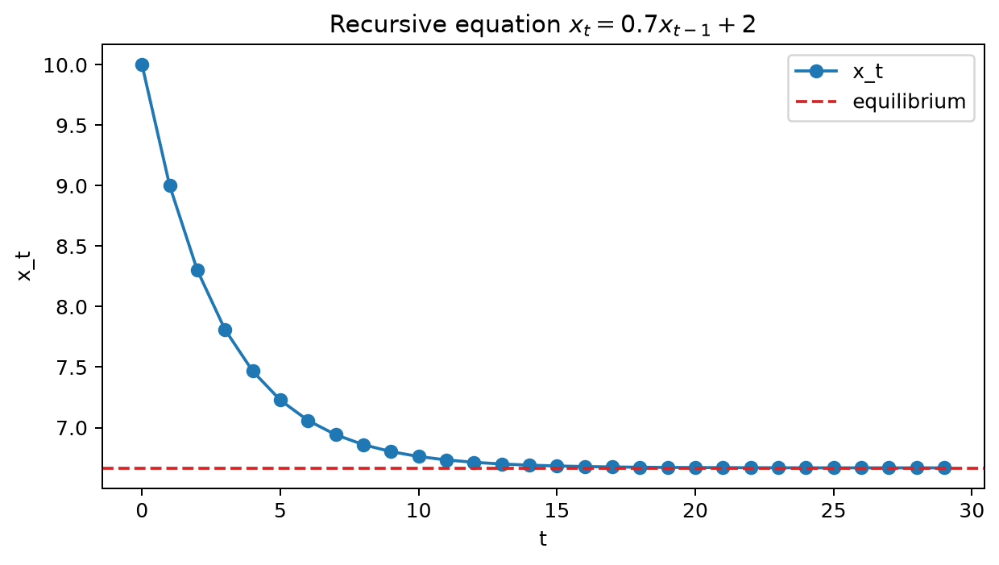
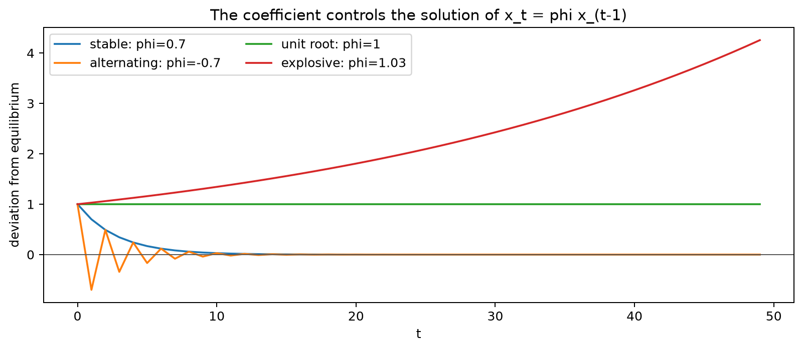

# Difference Equation

## Worked calculation: a stable recursion

Take

$$
x_t=0.7x_{t-1}+2,\qquad x_0=10.
$$

Substitution gives

$$
x_1=0.7(10)+2=9,\qquad
x_2=0.7(9)+2=8.3.
$$

The equilibrium level $x^\star$ solves $x^\star=0.7x^\star+2$, so

$$
x^\star=\frac{2}{1-0.7}=6.\overline{6}.
$$

Subtracting the equilibrium from both sides gives

$$
x_t-x^\star=0.7(x_{t-1}-x^\star),
$$

and therefore

$$
x_t=x^\star+0.7^t(x_0-x^\star).
$$

Because $|0.7|<1$, the effect of the starting value shrinks over time. If the coefficient had absolute value greater than 1, the same recursion would amplify deviations instead.

A **difference equation**, also called a recurrence relation, defines each term of a sequence from one or more earlier terms. An explicit formula such as $a_n=3n+2$ gives $a_n$ directly. A difference equation instead describes how the sequence evolves from its previous values.

For example,

$$
a_n=5a_{n-1}-6a_{n-2}
$$

is a second-order difference equation because $a_n$ depends on the two preceding terms.

### Solving Difference Equations

For a homogeneous linear difference equation with constant coefficients, we often try a solution of the form

$$
a_n=\lambda^n.
$$

The substitution converts the recurrence into a polynomial equation for $\lambda$. The roots of that polynomial determine the basic patterns that can appear in the sequence.

For

$$
a_n=5a_{n-1}-6a_{n-2},
$$

substitute $a_n=\lambda^n$:

$$
\lambda^n=5\lambda^{n-1}-6\lambda^{n-2}.
$$

Dividing by $\lambda^{n-2}$ gives the **characteristic equation**

$$
\lambda^2-5\lambda+6=0.
$$

Its roots are

$$
\lambda=2,\qquad \lambda=3.
$$

Because the roots are distinct, the general solution is

$$
a_n=c_1 2^n+c_2 3^n,
$$

where $c_1$ and $c_2$ are determined by the initial conditions.

### Example: Solving with Initial Conditions

Suppose $a_0=4$ and $a_1=10$. Substituting $n=0$ gives

$$
a_0=c_1+c_2=4,
$$

and substituting $n=1$ gives

$$
a_1=2c_1+3c_2=10.
$$

Thus,

$$
\begin{aligned}
c_1+c_2&=4,\\
2c_1+3c_2&=10.
\end{aligned}
$$

Solving the system yields

$$
c_1=2,\qquad c_2=2.
$$

The sequence therefore has the explicit form

$$
a_n=2\cdot2^n+2\cdot3^n.
$$

This example shows the usual progression: derive the characteristic roots first, then use the initial observations to determine the coefficients.

### Higher-Order Difference Equations

A $k$th-order homogeneous linear difference equation can be written as

$$
a_n=\beta_1a_{n-1}+\beta_2a_{n-2}+\dots+\beta_ka_{n-k}.
$$

Its characteristic equation is

$$
\lambda^k-\beta_1\lambda^{k-1}-\dots-\beta_k=0.
$$

If the $k$ roots $\lambda_1,\lambda_2,\dots,\lambda_k$ are distinct, the general solution is

$$
a_n=c_1\lambda_1^n+c_2\lambda_2^n+\dots+c_k\lambda_k^n.
$$

The constants are determined by the initial conditions. Repeated roots require additional polynomial factors in $n$, while complex roots lead naturally to oscillating terms. These root patterns are important in time-series models because they determine whether responses decay, oscillate, or grow.

### Example: Fibonacci Sequence

Consider the Fibonacci-type recurrence

$$
a_n=a_{n-1}+a_{n-2}
$$

with initial conditions $a_0=2$ and $a_1=3$. Its characteristic equation is

$$
\lambda^2-\lambda-1=0,
$$

with roots

$$
\lambda_1=\frac{1-\sqrt5}{2},\qquad
\lambda_2=\frac{1+\sqrt5}{2}.
$$

The general solution is therefore

$$
a_n=c_1\left(\frac{1-\sqrt5}{2}\right)^n+c_2\left(\frac{1+\sqrt5}{2}\right)^n.
$$

The initial conditions imply

$$
c_1+c_2=2
$$

and

$$
c_1\left(\frac{1-\sqrt5}{2}\right)+c_2\left(\frac{1+\sqrt5}{2}\right)=3.
$$

Solving gives

$$
c_1=1-\frac{2}{\sqrt5},\qquad
c_2=1+\frac{2}{\sqrt5}.
$$

Equivalently, because this sequence is the ordinary Fibonacci sequence shifted by three indices,

$$
a_n=\frac{1}{\sqrt5}\left[\left(\frac{1+\sqrt5}{2}\right)^{n+3}-\left(\frac{1-\sqrt5}{2}\right)^{n+3}\right].
$$

The recurrence, its characteristic roots, and the closed-form expression all describe the same sequence from different viewpoints.

### Relation to Differential Equations

Linear difference equations play a role in discrete time that is analogous to linear differential equations in continuous time. For example, a $k$th-order linear ordinary differential equation can be written as

$$
y^{(k)}=\beta_1y^{(k-1)}+\dots+\beta_ky.
$$

Trying a solution of the form $y(t)=e^{\lambda t}$ produces a characteristic polynomial. Its roots determine the exponential components of the continuous-time solution, just as powers of characteristic roots determine the solution of a difference equation.

The analogy is useful, but the stability conditions are different: discrete-time roots are interpreted relative to the unit circle, whereas continuous-time stability is determined by the real parts of the corresponding exponential rates.

## Student guide: read a recursion through its roots

For a homogeneous AR(2)-style recursion

$$
x_t=\phi_1x_{t-1}+\phi_2x_{t-2},
$$

try a solution $x_t=r^t$. Substitution gives

$$
r^2-\phi_1r-\phi_2=0.
$$

The roots determine whether deviations decay, oscillate, or grow. If both roots have modulus below 1, the homogeneous part decays. Repeated or complex roots can produce slowly decaying or oscillating responses even when the recursion is stable.

### Numerical first-order example

For

$$
x_t=0.7x_{t-1}+2,\qquad x_0=10,
$$

the equilibrium is $x^\star=2/(1-0.7)=6.\overline6$. The first values are

$$
x_1=9,\qquad x_2=8.3,\qquad x_3=7.81.
$$

The deviation from equilibrium is multiplied by $0.7$ at each step:

$$
x_t-x^\star=0.7^t(x_0-x^\star).
$$

The same algebra explains why an AR coefficient near 1 produces persistent responses and why a coefficient with absolute value above 1 is unstable.

### Forced recursions and shocks

With shocks,

$$
x_t=c+\phi x_{t-1}+\varepsilon_t,
$$

the solution combines three pieces: a transient determined by the initial condition, a long-run equilibrium when one exists, and a weighted sum of past shocks.

For $|\phi|<1$, after the initial transient has decayed,

$$
x_t=\frac{c}{1-\phi}+\sum_{j=0}^{\infty}\phi^j\varepsilon_{t-j}.
$$

Difference equations therefore connect directly to moving-average representations and forecast uncertainty: the same powers of $\phi$ that govern stability also determine how quickly the effect of a shock fades.

The figure contrasts decaying and expanding paths, making the root-based stability condition visible in the time domain.
