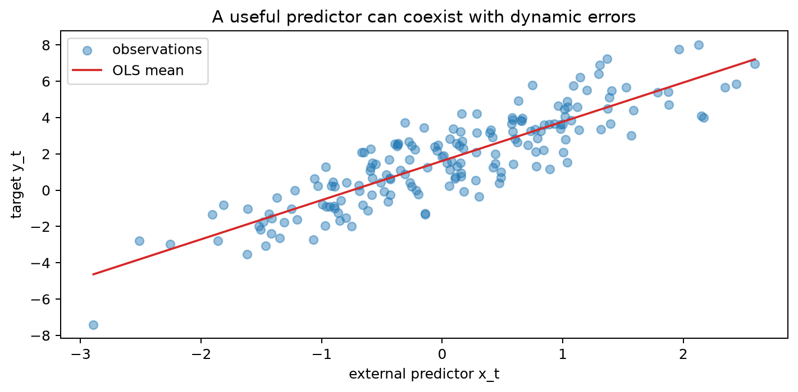
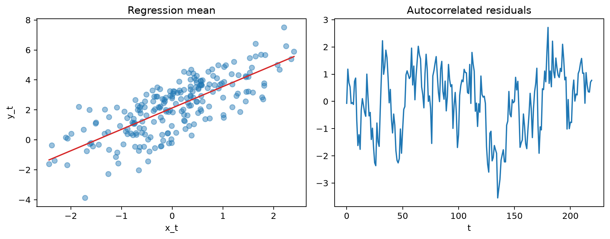
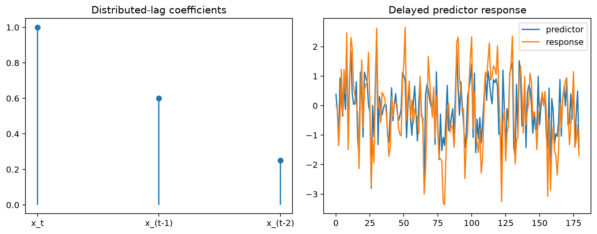
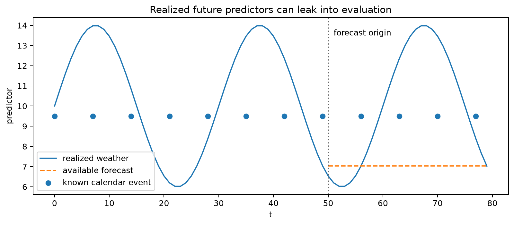
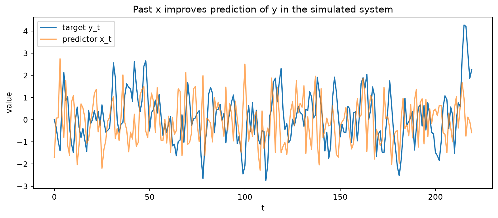
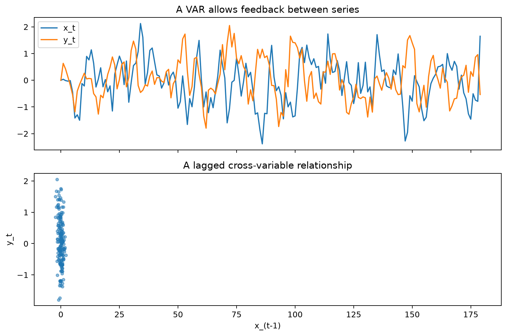
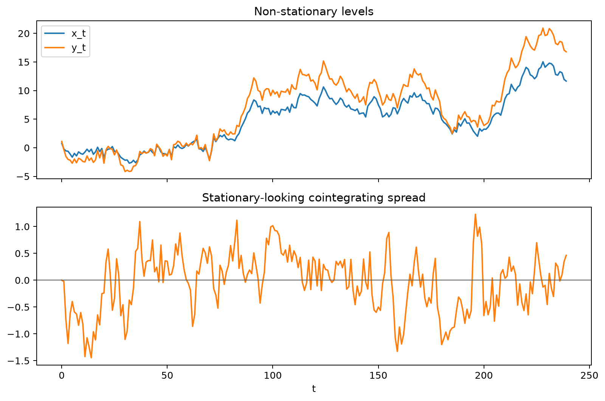
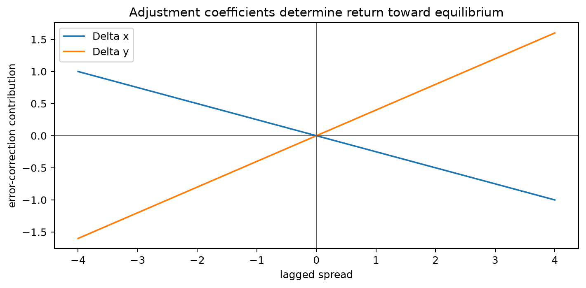
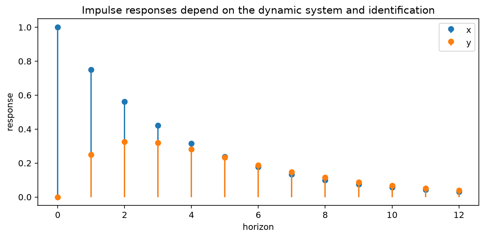

# Dynamic Regression

## Worked calculation: an external predictor and a lag

Suppose

$$
y_t=2+1.5x_t+n_t.
$$

For $x_t=4$ and $n_t=0.3$, the observed value is

$$
y_t=2+1.5(4)+0.3=8.3.
$$

If the response takes time to react, use a distributed lag such as

$$
y_t=2+1.0x_t+0.5x_{t-1}+n_t.
$$

When $x_t=4$ and $x_{t-1}=2$, the regression mean is

$$
2+4+1=7.
$$

For forecasting, that calculation is valid only if the required predictor values would be available at the forecast origin. A realized future temperature, exchange rate, or policy variable may itself need to be forecast.

The figure separates two sources of structure: the regression mean follows an external predictor, while serial dependence remains in the errors around that mean. Dynamic regression models both pieces rather than forcing the predictor to explain all temporal dependence.

Dynamic regression combines explanatory variables with time-series structure. It is useful when the target depends on external predictors but an ordinary regression leaves autocorrelated residuals.

A basic model is

$$
y_t=\beta_0+\beta_1x_{1,t}+\cdots+\beta_kx_{k,t}+n_t,
$$

where the error process $n_t$ follows an ARMA or ARIMA model. If $n_t$ follows ARMA($p,q$),

$$
\phi(B)n_t=\theta(B)\varepsilon_t.
$$

Under suitable exogeneity assumptions, ignoring residual autocorrelation need not bias the regression coefficients, but it can invalidate ordinary independent-error standard errors and leave forecastable structure unused.

The residual plot shows why the error model matters. A regression can track the predictor-driven mean while still leaving runs of positive and negative residuals that an ARMA component can model.

## Lagged Predictors

A distributed-lag model may include current and past predictor values:

$$
y_t=\beta_0+\beta_0^{(x)}x_t+\beta_1^{(x)}x_{t-1}+\cdots+\beta_r^{(x)}x_{t-r}+n_t.
$$

Use lagged predictors when the domain suggests a delayed response. Avoid adding many adjacent lags mechanically, because nearby predictor values are often strongly correlated and can make individual lag coefficients unstable.

The figure illustrates how one change in $x_t$ can influence the response across several later periods. The lag coefficients describe the shape and duration of that response.

## Future Predictor Availability

Future predictor values must be known or forecast separately. Calendar variables and scheduled promotions may be available in advance; future weather and macroeconomic quantities usually are not. Evaluating a model with realized future predictors that would not have been available creates information leakage.

The visual distinguishes predictors that are known at the forecast origin from those that must themselves be forecast. This distinction determines whether a reported forecast is operationally reproducible.

The label **ARIMAX** is used inconsistently across software. Inspect the exact model equation, especially how differencing, intercepts, and exogenous variables are handled, rather than relying on the name alone.

A useful predictor is not automatically causal. Temporal ordering can support forecasting, but it does not by itself identify the effect of an intervention.

A practical workflow is to align timestamps, define what will be known at forecast time, fit the regression mean, inspect residual dependence, add dynamic error structure when justified, diagnose the combined model, and backtest the complete procedure.

See [regression with ARMA errors](regression_with_arma_errors.md) and the companion [notebook](../../notebooks/time_series/dynamic_regression.ipynb).

## Student guide: separate the mean, the errors, and the information set

Dynamic regression is easiest to understand as three linked questions:

1. What variables explain the conditional mean of $y_t$?
2. What serial structure remains in the regression error?
3. Which predictor values will actually be available when a forecast is issued?

Treating these as one question leads to common mistakes. A strong contemporaneous regression relationship does not guarantee white residuals, and a predictor that is useful when its future values are known may be unusable in a real forecast.

### A complete model equation

A regression with ARMA errors can be written

$$
y_t=\beta^\top x_t+n_t,
$$

with

$$
\phi(B)n_t=\theta(B)\varepsilon_t.
$$

For example, with one predictor and AR(1) errors,

$$
y_t=\beta_0+\beta_1x_t+n_t,
\qquad
n_t=\phi n_{t-1}+\varepsilon_t.
$$

If $\beta_0=2$, $\beta_1=1.5$, $x_t=4$, and $n_t=0.3$, then the regression mean is

$$
2+1.5(4)=8,
$$

and the realized observation is

$$
y_t=8.3.
$$

The regression mean and the observed value are different objects. The dynamic error model explains why nearby observations can depart from that mean in a related way.

### Why OLS residual checks matter

Suppose ordinary least squares produces residuals with lag-1 autocorrelation $0.75$. Even if the slope estimate is consistent under strict exogeneity, the usual independent-error standard error is not the correct measure of uncertainty, and the residual process contains information that can improve forecasts.

Use three complementary residual views:

- residuals over time, for trend, breaks, and changing variance;
- residual ACF/PACF, for remaining serial dependence;
- squared residuals, for conditional variance dependence.

An error model is useful only if it improves the complete forecast experiment. A dynamic error term that lowers AIC but fails at future-like forecast origins is not automatically preferable.

### Distributed lags

An external effect may be delayed:

$$
y_t=\beta_0+\beta_0^{(x)}x_t+\beta_1^{(x)}x_{t-1}+\cdots+\beta_r^{(x)}x_{t-r}+n_t.
$$

For

$$
y_t=2+1.0x_t+0.5x_{t-1}+n_t,
$$

with $x_t=4$, $x_{t-1}=2$, and $n_t=0.3$, the regression mean is

$$
2+1(4)+0.5(2)=7,
$$

and the observation is $7.3$.

The sum of lag coefficients, $1.5$ here, can be interpreted as a cumulative response only under additional assumptions about the predictor path and model stability. When many correlated lags are plausible, domain timing, regularization, polynomial distributed lags, or transfer-function models can provide more stable descriptions.

### Exogenous predictors and future availability

Create an explicit availability table before fitting:

| predictor | value at $t$ known? | value at $t+1$ known? | treatment |
|---|---|---|---|
| day-of-week | yes | yes | include directly |
| scheduled promotion | yes if schedule is fixed | usually yes | include with a documented schedule |
| weather | observed through $t$ | no | forecast weather or omit |
| policy rate | depends on release timing | often no | use a real-time vintage or forecast |

If a dynamic regression is evaluated with realized future weather, the result measures performance conditional on perfect future weather information. That can be useful for diagnosis, but it is not the same as an operational forecast.

When $x_{t+h}$ must be forecast, uncertainty in the predictor forecast should also contribute to uncertainty in $y_{t+h}$. Plugging in a single future predictor path generally understates total forecast uncertainty.

### Transformations and alignment

Before fitting:

1. align timestamps and sampling frequencies;
2. inspect release delays and revisions;
3. decide whether levels, differences, growth rates, or logs match the scientific question;
4. verify that transformations preserve the intended information timing;
5. document missing-value treatment.

A one-period shift can turn a valid lagged predictor into a leaked future value. A small timestamp table is often the safest way to verify the convention.

### Estimation choices

For a mean equation with serially correlated errors, common approaches include maximum likelihood for regression with ARIMA errors, generalized least squares under a specified covariance model, two-step regression followed by residual modeling, and state-space estimation when missing values or time-varying latent effects matter.

The two-step residual approach is useful for teaching and initialization, but it need not produce the same estimates or uncertainty as joint maximum likelihood. Check how the software handles intercepts, differencing, missing observations, and exogenous variables.

### Interpretation and causality

A regression coefficient describes a conditional association within the specified model. It is not automatically causal. Confounding, reverse feedback, common trends, omitted variables, measurement timing, and interventions can all change the interpretation.

Granger predictability asks whether past values of one series improve prediction of another after conditioning on the included information. It is a predictive concept, not a guarantee that intervening on the predictor would change the target.

The figure illustrates the predictive question: does adding the past of one series improve forecasts beyond the target's own history and other included variables?

Feedback between several endogenous series requires a multivariate model rather than a single-equation dynamic regression.

The VAR figure shows reciprocal lagged dependence, where each series can respond to the history of the others. This is different from treating one predictor as externally determined.

Related multivariate models also handle shared stochastic trends and dynamic responses to system-wide shocks.

A cointegrating spread can remain stable even when the component series are individually non-stationary.

The VECM figure shows how deviations from a long-run equilibrium can feed into subsequent changes.

An impulse-response plot traces the model-implied effect of a specified system shock over future periods. Its interpretation depends on the multivariate identification assumptions, not only on temporal ordering.

### A complete workflow

1. Define the forecast target and forecast origin.
2. Draw the target and each predictor on the same time axis.
3. Decide which future predictor values are known, scheduled, or forecast.
4. Choose transformations and lags from timing and subject-matter reasoning.
5. Fit the mean equation.
6. Inspect residual ACF, PACF, variance, and breaks.
7. Add dynamic error structure only where it addresses a diagnosed problem.
8. Recheck residuals and parameter stability.
9. Backtest the entire predictor-plus-target procedure.
10. Report coefficient interpretation separately from forecasting performance.

### Visual companions

The figures are placed with the modeling decisions they support: residual dynamics beside ARMA errors, distributed lags beside delayed effects, predictor availability beside forecast information, and the multivariate figures beside the distinction between external predictors and jointly endogenous systems.
