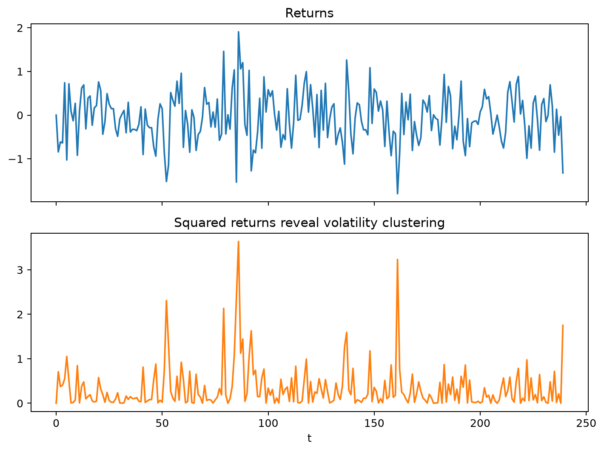
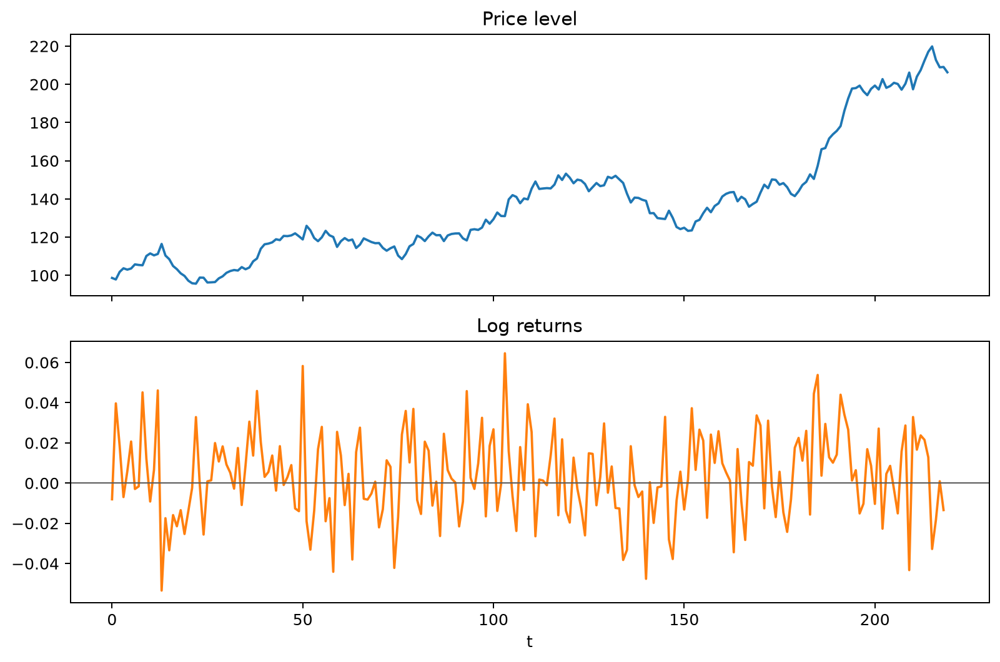
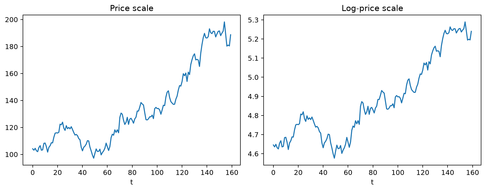
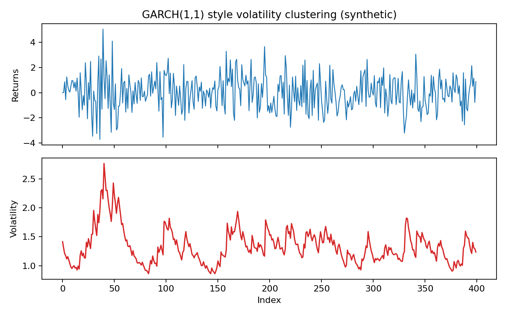
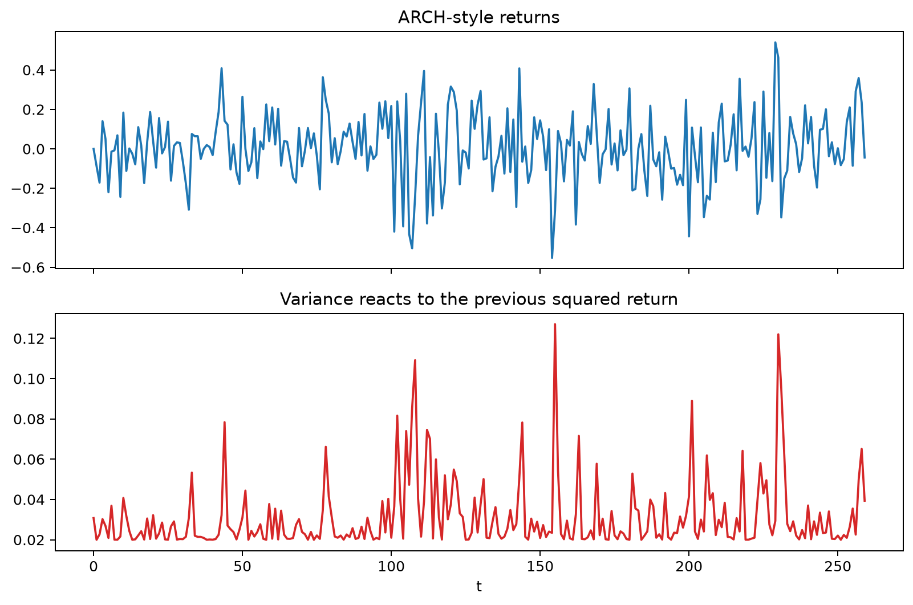
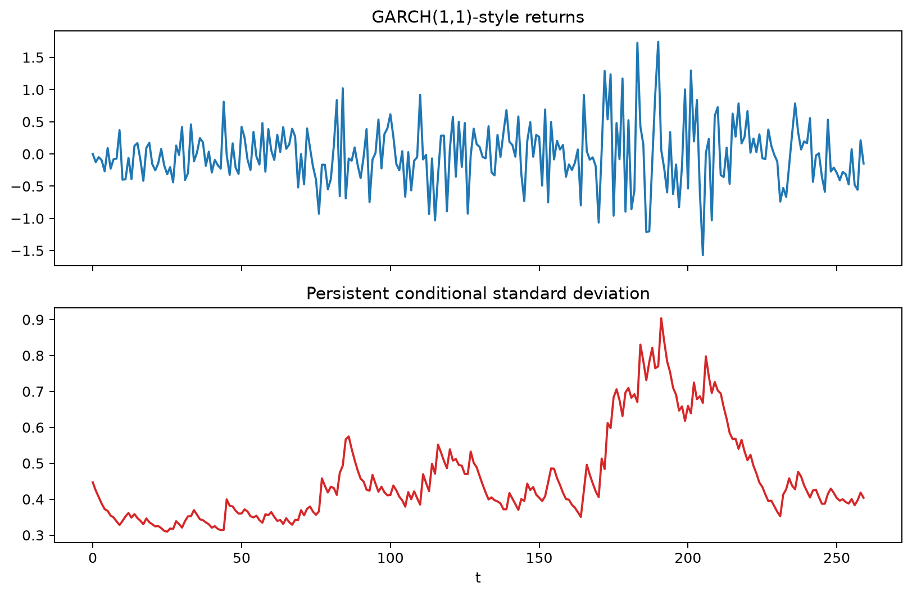
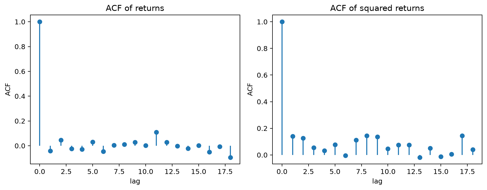
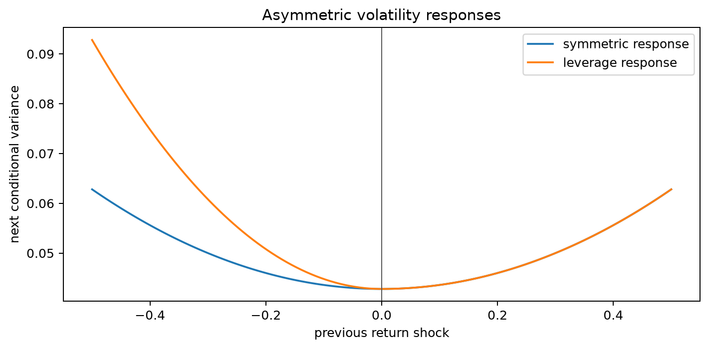
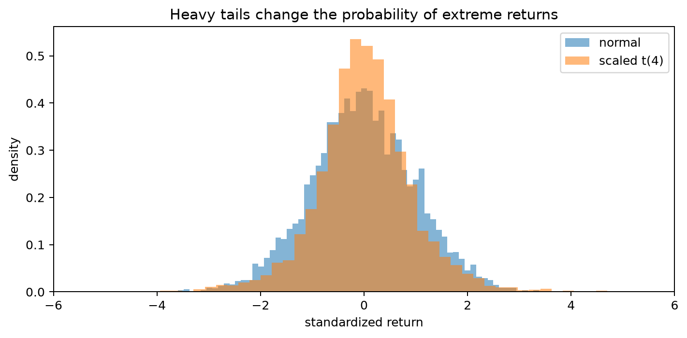
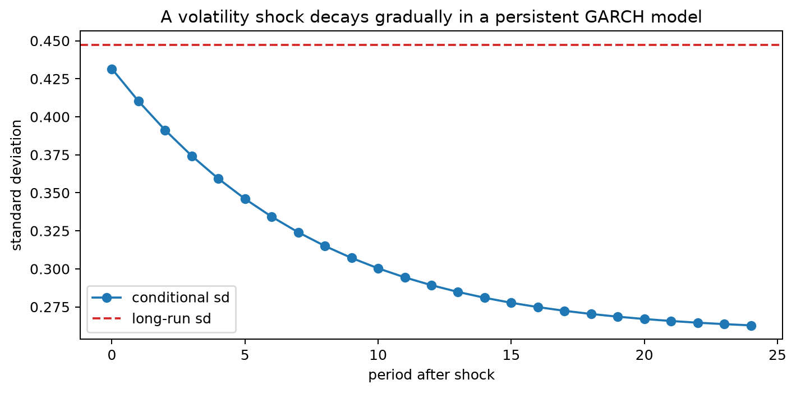

# Financial Time Series Models

Financial time series often separate naturally into a price level, a return process, and a time-varying scale of uncertainty. Returns may show little predictable movement in their conditional mean while their magnitude clusters over time, producing periods of calm and periods of elevated volatility.

Models such as ARCH and GARCH focus on that conditional variance rather than only on the expected return. A coherent financial model therefore distinguishes the mean, the variance dynamics, and the innovation distribution, because each contributes differently to interval forecasts, tail risk, and the persistence of market shocks.

## Worked calculation: returns and conditional variance

If a price rises from $P_{t-1}=100$ to $P_t=102$, the log return is

$$
r_t=\log(102)-\log(100)=\log(1.02)\approx0.01980.
$$

For a GARCH-style variance recursion with $\alpha_0=0.01$, $\alpha_1=0.10$, $\beta_1=0.85$, previous return $r_{t-1}=0.2$, and previous variance $h_{t-1}=0.04$,

$$
h_t=0.01+0.10(0.2^2)+0.85(0.04)=0.048.
$$

The conditional standard deviation is

$$
\sqrt{0.048}\approx0.219.
$$

The squared previous return contributes the immediate shock effect, while the previous variance carries persistence forward. This is why raw returns can have little autocorrelation even when squared returns remain strongly dependent.

The figure shows the defining visual feature of many financial return series: quiet periods and volatile periods cluster rather than appearing at a constant scale.

Financial time series such as prices, returns, and exchange rates often depart from simple stationary Gaussian assumptions. Common features include heavy tails, asymmetry, volatility clustering, and serial dependence in variance even when the conditional mean has little predictable structure.

### Log Returns

If $P_t$ is a positive price, the **log return** is

$$
r_t=\log(P_t)-\log(P_{t-1})
=\log\left(\frac{P_t}{P_{t-1}}\right).
$$

Working with returns rather than price levels often produces a series whose mean is more stable and whose scale is easier to compare over time. That transformation does not guarantee stationarity, independence, or normality.

The figure contrasts a persistent price level with its one-period returns. The price path can drift for long periods, while returns fluctuate around a much more stable level and are therefore the more natural target for many short-horizon financial models.

For $P_{t-1}=100$ and $P_t=102$,

$$
r_t=\log(1.02)\approx0.01980.
$$

The simple return is

$$
\frac{102}{100}-1=0.02.
$$

For small changes,

$$
\log(1+r)\approx r,
$$

so simple and log returns are numerically close. Log returns also add across time:

$$
\log\left(\frac{P_{t+h}}{P_t}\right)=\sum_{j=1}^{h}r_{t+j}.
$$

The price/log-price figure illustrates how the logarithm compresses multiplicative growth. A log transformation changes scale and can make proportional movements easier to interpret, but it does not by itself remove stochastic trends.

### ARCH and GARCH

ARCH and GARCH models describe time-varying **conditional variance**. A useful mean-variance decomposition is

$$
r_t=\mu_t+\sqrt{h_t}\,z_t,
\qquad
E(z_t)=0,
\qquad
\mathrm{Var}(z_t)=1.
$$

The conditional mean $\mu_t$ describes expected return given the available information, while $h_t$ describes the variance of the unpredictable component. These two pieces can behave very differently.

An ARCH($p$) model uses recent squared shocks or residuals:

$$
h_t=\alpha_0+\sum_{i=1}^{p}\alpha_i\varepsilon_{t-i}^2.
$$

A GARCH($p,q$) model adds lagged conditional variances:

$$
h_t=\alpha_0
+\sum_{i=1}^{p}\alpha_i\varepsilon_{t-i}^2
+\sum_{j=1}^{q}\beta_jh_{t-j}.
$$

With $\alpha_0>0$ and nonnegative ARCH and GARCH coefficients, the recursion is nonnegative under the standard specification.

### Synthetic Volatility Example

The plot below shows a synthetic return series with volatility clustering together with its conditional volatility.

Large observations tend to occur when the conditional volatility is elevated. The sign of each return remains difficult to predict, but the scale of future fluctuations can be persistent.

These models are widely used when the forecasting target is risk or uncertainty rather than only the conditional mean.

## Student guide: separate the price, return, and volatility questions

Financial time-series modeling is clearer when the problem is separated into layers:

1. choose a price or return representation;
2. specify the conditional mean;
3. specify the conditional variance;
4. choose an innovation distribution;
5. evaluate return, volatility, and risk forecasts with time-respecting backtests.

A model can describe the conditional mean well and still produce poor risk forecasts if its residual variance or tail behavior is misspecified.

### Price levels and log returns

For a positive price $P_t$,

$$
r_t=\log(P_t)-\log(P_{t-1})
=\log\left(\frac{P_t}{P_{t-1}}\right).
$$

Log returns are convenient for aggregation and often remove much of the non-stationary level behavior found in prices. They do not automatically remove structural breaks, changing variance, or serial dependence.

### Conditional mean and variance

Write

$$
r_t=\mu_t+\sqrt{h_t}\,z_t,
\qquad
E(z_t)=0,
\qquad
\mathrm{Var}(z_t)=1.
$$

Even when $\mu_t$ is constant or close to zero, $h_t$ can vary strongly. This separation explains why a return series can look unpredictable in sign while still being predictable in magnitude.

### ARCH calculation

For ARCH(1),

$$
h_t=\alpha_0+\alpha_1\varepsilon_{t-1}^2.
$$

With $\alpha_0=0.02$, $\alpha_1=0.35$, and previous innovation $\varepsilon_{t-1}=0.4$,

$$
h_t=0.02+0.35(0.4^2)=0.076.
$$

The conditional standard deviation is

$$
\sqrt{0.076}\approx0.276.
$$

A large shock raises next-period variance regardless of its sign in this symmetric ARCH model.

The figure shows how isolated large shocks feed into the next variance estimate. Because ARCH uses a finite set of squared shocks, the effect fades as those shocks leave the lag window.

For ARCH(1), the condition $\alpha_1<1$ is required for a finite unconditional variance under the usual assumptions.

### GARCH calculation

GARCH(1,1) adds lagged conditional variance:

$$
h_t=\alpha_0+\alpha_1\varepsilon_{t-1}^2+\beta_1h_{t-1}.
$$

With $\alpha_0=0.01$, $\alpha_1=0.10$, $\beta_1=0.85$, $\varepsilon_{t-1}=0.2$, and $h_{t-1}=0.04$,

$$
h_t=0.01+0.10(0.2^2)+0.85(0.04)=0.048.
$$

The persistence measure is

$$
\alpha_1+\beta_1=0.95.
$$

When this sum is below 1, the usual GARCH(1,1) unconditional variance is

$$
\bar h=\frac{\alpha_0}{1-\alpha_1-\beta_1}
=\frac{0.01}{0.05}=0.2.
$$

A persistence value close to 1 means volatility shocks decay slowly and can affect risk forecasts far into the future.

The figure compares variance paths with different persistence levels. As $\alpha_1+\beta_1$ approaches 1, the response to a volatility shock lasts longer and the process returns more slowly toward its long-run variance.

### Why squared returns matter

A volatility process can have

$$
\mathrm{Corr}(r_t,r_{t-1})\approx0
$$

while

$$
\mathrm{Corr}(r_t^2,r_{t-1}^2)>0.
$$

The sign of a return can therefore be difficult to predict even when its magnitude is persistent.

The return ACF in the figure is comparatively weak, while the squared-return ACF retains visible structure. This is the diagnostic pattern that motivates conditional-variance models.

### Asymmetric volatility

Symmetric ARCH/GARCH models respond to $+x$ and $-x$ shocks in the same way because they use squared innovations. Financial markets can exhibit asymmetric responses, with negative shocks followed by larger volatility increases.

One extension is

$$
h_t=\alpha_0+\alpha\varepsilon_{t-1}^2
+\gamma\mathbf 1(\varepsilon_{t-1}<0)\varepsilon_{t-1}^2
+\beta h_{t-1}.
$$

If $\gamma>0$, a negative innovation of a given magnitude contributes more to the next variance than a positive innovation of the same magnitude.

The leverage-effect figure makes that asymmetry visible by comparing the variance response to positive and negative shocks.

### Innovation distributions

Gaussian innovations make likelihood calculations convenient, but financial returns often have heavier tails than a normal distribution. A Student-$t$ innovation can place more probability on extreme standardized residuals.

The figure emphasizes that matching conditional variance is not enough if the standardized residual distribution still produces more extremes than the assumed normal model. Tail behavior matters directly for interval and risk forecasts.

### Risk forecasts

For a one-step return forecast with conditional mean $\mu_{t+1}$ and standard deviation $\sqrt{h_{t+1}}$, a Gaussian lower quantile at probability $\alpha$ is

$$
q_{\alpha,t+1}=\mu_{t+1}+z_\alpha\sqrt{h_{t+1}}.
$$

Value-at-Risk is a quantile-based risk measure, while expected shortfall averages outcomes beyond the selected tail quantile. Both require an explicit sign convention and out-of-sample calibration checks.

The shock-response figure shows how a single large innovation affects future conditional volatility. The decay rate determines how quickly risk forecasts return toward their long-run level.

### Modeling cautions

Prices are usually non-stationary, while returns may be closer to stationary but can still contain breaks and changing distributions. Trading calendars introduce missing or irregular dates, high-frequency data can contain microstructure effects, and corporate actions must be handled correctly before return calculation.

Backtests can also be biased by revised data, survivorship filtering, or parameters estimated over regimes that differ from the evaluation period. Reproduce the information set that would actually have been available at each forecast origin.

### Workflow

1. Check prices, corporate actions, units, and trading dates.
2. Convert prices to returns when the target concerns relative change.
3. Plot returns, absolute returns, and squared returns.
4. Fit the conditional mean before diagnosing variance dependence.
5. Fit ARCH/GARCH or an asymmetric/heavy-tailed extension when diagnostics justify it.
6. Check standardized residuals and squared standardized residuals.
7. Backtest volatility forecasts and tail quantiles chronologically.
8. Examine stability across market regimes and innovation distributions.
