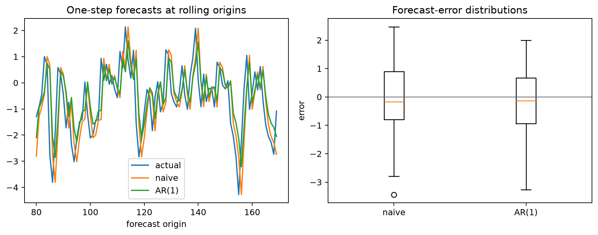
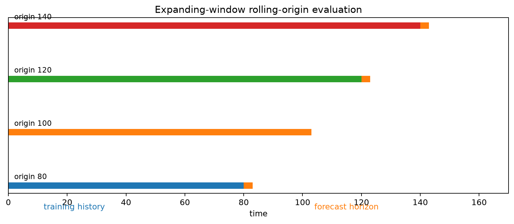
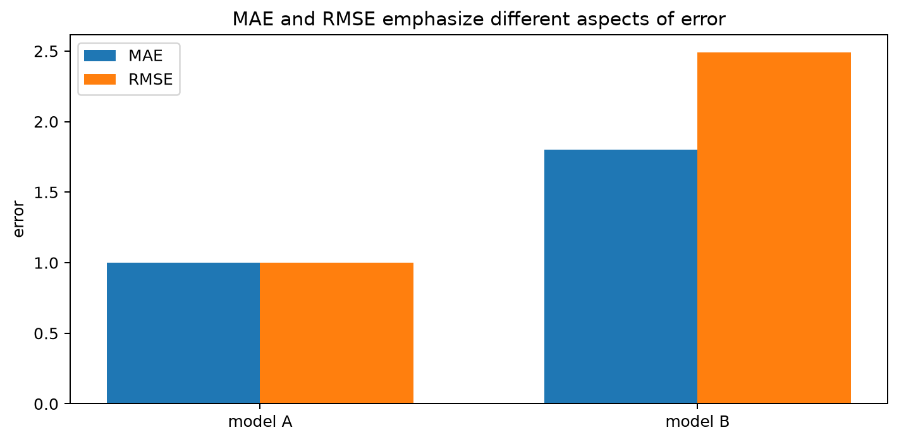
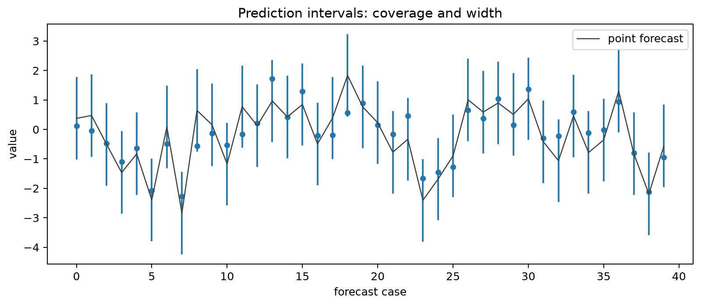
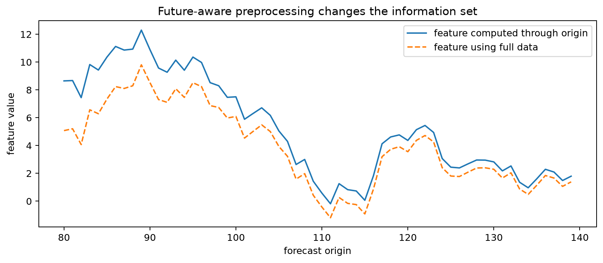
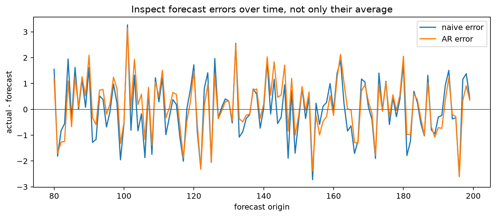

# Forecast Evaluation and Backtesting

## Worked calculation: three errors and one scale

Suppose the actual values are $(10,12,9)$ and forecasts are $(9,11,10)$. The errors $y-\hat y$ are $(1,1,-1)$, so

$$
\operatorname{MAE}=\frac{1+1+1}{3}=1,
\qquad
\operatorname{RMSE}=\sqrt{\frac{1+1+1}{3}}=1.
$$

If the in-sample naive scale is $2$, then

$$
\operatorname{MASE}=\frac{1}{2}=0.5.
$$

The scale must be calculated using only the training portion at each origin. Reusing a scale computed from the full series is a small but real form of leakage. A rolling-origin evaluation repeats this calculation after each training window so that every forecast is made with past information only.

Forecast evaluation asks a different question from in-sample fit: **How well would this procedure have predicted observations that were genuinely in the future at the time of fitting?**

## Preserve Temporal Order

Randomly shuffling observations breaks the information structure of a forecasting problem. A valid evaluation design keeps training observations earlier than validation or test observations. Use validation data for model or hyperparameter selection and reserve the final test period for the last comparison.

## Rolling-Origin Evaluation

A single holdout can be noisy. Rolling-origin evaluation repeats the forecasting experiment at several historical origins. An **expanding window** keeps all available history; a **rolling window** discards older observations and is useful when the process may change.

For horizon $h$, the forecast error at origin $t$ is

$$
e_{t,h}=y_{t+h}-\hat y_{t+h\mid t}.
$$

Report accuracy by horizon when the decision problem distinguishes short- and long-horizon forecasts.

## Baselines First

Useful baselines include naive, seasonal-naive, drift, and historical-mean forecasts. A complicated model that cannot outperform a sensible baseline has not demonstrated forecasting value.

## Point Forecast Metrics

For errors $e_i=y_i-\hat y_i$:

$$
\operatorname{MAE}=\frac{1}{n}\sum |e_i|,
\qquad
\operatorname{RMSE}=\sqrt{\frac{1}{n}\sum e_i^2}.
$$

Mean Absolute Scaled Error compares absolute forecast error with a naive in-sample scale:

$$
\operatorname{MASE}=
\frac{\frac{1}{n}\sum |e_i|}
{\frac{1}{T-m}\sum_{t=m+1}^{T}|y_t-y_{t-m}|}.
$$

MAPE can be useful when values are strictly positive and not near zero, but it is unstable near zero and undefined at zero.

## Prediction Intervals

Evaluate interval forecasts with coverage, width, and calibration by horizon. For probabilistic forecasts, quantile or pinball loss evaluates predicted quantiles directly.

## Leakage

Common sources include full-data normalization, future-aware imputation, rolling features that include the target time, selecting hyperparameters on the final test period, using future exogenous values that would not be known at the forecast origin, and shuffled cross-validation.

Every feature should answer: **Would this value have been available at the forecast origin?**

Information criteria such as AIC/AICc/BIC are useful for in-sample candidate selection, but they are not substitutes for out-of-sample forecast evaluation.

See [`forecast_backtesting.py`](../../scripts/time_series/forecast_backtesting.py) and the companion [forecast-backtesting notebook](../../notebooks/time_series/forecast_backtesting.ipynb).

## Student guide: make the forecast experiment explicit

Forecast evaluation is an experiment that is repeated at historical dates. The central object is not only a fitted model; it is a **forecasting procedure**:

1. how the data are transformed;
2. how features are constructed;
3. how parameters are estimated;
4. how future predictors are obtained;
5. how the forecast is produced;
6. how the error or interval score is recorded.

If any one of these steps uses information from after the forecast origin, the evaluation is optimistic even if the final model formula looks reasonable.

### Information sets and forecast origins

Let $\mathcal F_t$ denote the information available immediately after observing $y_t$. A one-step forecast is a random variable measurable with respect to $\mathcal F_t$:

$$
\hat y_{t+1|t}=E(y_{t+1}\mid\mathcal F_t)
$$

under a squared-error objective. A two-step forecast is

$$
\hat y_{t+2|t}=E(y_{t+2}\mid\mathcal F_t).
$$

The notation matters. A forecast made at time $t$ cannot use $y_{t+1}$ to tune a transformation, estimate a scale, choose a lag order, or fill a missing value.

For a fixed horizon $h$, define the error

$$
e_{t,h}=y_{t+h}-\hat y_{t+h|t}.
$$

The sign convention should be stated because some reports define error as forecast minus actual. MAE and RMSE are unchanged by a sign reversal, but bias and calibration plots are not.

### A concrete expanding-window calculation

Suppose the observed series is

| time | 1 | 2 | 3 | 4 | 5 | 6 | 7 |
|---:|---:|---:|---:|---:|---:|---:|---:|
| $y_t$ | 10 | 12 | 11 | 14 | 13 | 16 | 15 |

Use the naive rule $\hat y_{t+1|t}=y_t$ and evaluate one-step forecasts at origins $t=3,4,5,6$:

| origin $t$ | training values | forecast | actual | error |
|---:|---|---:|---:|---:|
| 3 | 10, 12, 11 | 11 | 14 | 3 |
| 4 | 10, 12, 11, 14 | 14 | 13 | -1 |
| 5 | 10, 12, 11, 14, 13 | 13 | 16 | 3 |
| 6 | 10, 12, 11, 14, 13, 16 | 16 | 15 | -1 |

The four errors are $(3,-1,3,-1)$. Thus

$$
\operatorname{MAE}=\frac{3+1+3+1}{4}=2,
$$

and

$$
\operatorname{RMSE}
=\sqrt{\frac{3^2+(-1)^2+3^2+(-1)^2}{4}}
=\sqrt{5}
\approx2.236.
$$

The error mean is $(3-1+3-1)/4=1$, so the naive forecasts underpredict on average in this short evaluation. A single accuracy number would hide that directional bias.

An expanding window uses every observation that has become available. A rolling window instead uses only the most recent $w$ observations. The latter can be preferable after a structural break because very old observations may describe a different regime.

### Baselines are part of the scientific question

The most useful baseline depends on the data-generating features:

**Naive level**

$$
\hat y_{t+h|t}=y_t.
$$

This is a natural benchmark for a persistent non-seasonal level.

**Seasonal naive**

For period $s$,

$$
\hat y_{t+h|t}=y_{t+h-s\lceil h/s\rceil}.
$$

For monthly data, a forecast for next March may reuse the latest observed March. This is hard to beat when the seasonal pattern is stable.

**Drift**

One common drift forecast extrapolates the average change:

$$
\hat y_{t+h|t}
=y_t+h\frac{y_t-y_1}{t-1}.
$$

**Mean forecast**

For a stable series without meaningful persistence,

$$
\hat y_{t+h|t}=\frac1t\sum_{j=1}^{t}y_j.
$$

The baseline is not a disposable preliminary. If an advanced method cannot improve on it on the same origins, the added complexity has not demonstrated value.

### Point metrics and what they reward

For $n$ evaluation cases:

$$
\operatorname{MAE}=\frac1n\sum_{i=1}^n|e_i|,
\qquad
\operatorname{RMSE}=\sqrt{\frac1n\sum_{i=1}^ne_i^2}.
$$

MAE is in the units of the response and weights all absolute errors linearly. RMSE is also in response units but gives disproportionately more influence to large errors. If a single failure is costly, RMSE may be appropriate; if typical absolute deviation matters, MAE is easier to communicate.

Mean error,

$$
\operatorname{ME}=\frac1n\sum_i e_i,
$$

measures directional bias but can be zero when positive and negative errors cancel. Report it alongside an absolute metric when systematic over- or under-prediction matters.

For a seasonal period $m$, MASE uses a training scale:

$$
Q_m
=\frac1{T-m}\sum_{t=m+1}^{T}|y_t-y_{t-m}|,
\qquad
\operatorname{MASE}=\frac{\frac1n\sum_i|e_i|}{Q_m}.
$$

The scale must be recomputed inside each training window when the evaluation is designed to reproduce real deployment. A MASE below 1 means the method has smaller average absolute error than the corresponding in-sample seasonal-naive change.

MAPE,

$$
\operatorname{MAPE}=\frac{100}{n}\sum_i\left|\frac{e_i}{y_i}\right|,
$$

is undefined when $y_i=0$ and can become arbitrarily large when $y_i$ is close to zero. Symmetric percentage metrics have their own behavior near zero. Metric choice should follow the decision problem rather than convention.

### Interval forecasts

An interval forecast is a pair $(L_{t,h},U_{t,h})$. For nominal coverage $1-\alpha$, the empirical coverage is

$$
\widehat{\operatorname{Coverage}}
=\frac1n\sum_{i=1}^n
\mathbf 1\{L_i\le y_i\le U_i\}.
$$

Coverage alone is insufficient. An interval extending from negative infinity to positive infinity has perfect coverage and no practical value. A useful report includes:

- coverage;
- average width;
- coverage by horizon;
- the frequency and size of misses;
- whether misses occur mainly during high-volatility or changing-regime periods.

For a Gaussian stationary AR(1) with coefficient $\phi$ and innovation variance $\sigma^2$, the $h$-step variance is

$$
\sigma_h^2
=\sigma^2\sum_{j=0}^{h-1}\phi^{2j}
=\sigma^2\frac{1-\phi^{2h}}{1-\phi^2}.
$$

When $|\phi|<1$, this approaches $\sigma^2/(1-\phi^2)$ as the horizon grows. The forecast mean may converge quickly while the uncertainty continues to widen.

### Leakage audit

Ask the same question of every operation: **Could this value have been computed at the forecast origin?**

| Operation | Unsafe version | Safe version |
|---|---|---|
| scaling | fit mean and standard deviation on all rows | fit them inside each training window |
| imputation | interpolate using observations after the gap | use past-only rules or an explicit forecasting model |
| rolling feature | centered rolling mean | trailing rolling mean ending at $t$ |
| feature selection | choose lags using the final test period | choose using training/validation origins |
| external predictor | use realized $x_{t+h}$ | forecast $x_{t+h}$ or use a value known in advance |
| seasonal normalization | estimate seasonal indices from the full sample | estimate indices using data available at each origin |

Leakage can also enter through software defaults, cached preprocessing objects, or a feature table built before the split. Store the timestamp of every feature and inspect one forecast origin by hand.

### Comparing models fairly

Evaluate all candidates on identical origins, horizons, transformations, and target rows. Report a table such as:

| model | MAE $h=1$ | MAE $h=3$ | RMSE $h=1$ | mean error |
|---|---:|---:|---:|---:|
| seasonal naive |  |  |  |  |
| ARIMA |  |  |  |  |
| dynamic regression |  |  |  |  |

Do not rank models using one average if the deployment decision cares about particular horizons. Plot errors over time because a model can have a good overall score and fail during the most important regime.

Statistical tests comparing forecast errors require care because errors across adjacent origins overlap, especially at long horizons. A small metric difference is not automatically a meaningful improvement.

### Reproducible evaluation recipe

1. State the response, sampling interval, horizon, and decision loss.
2. Reserve a final test period before tuning.
3. Choose at least one domain-appropriate baseline.
4. Specify expanding or rolling origins.
5. At each origin, fit preprocessing and the model using past data only.
6. Produce point and interval forecasts.
7. Record errors, interval scores, fit failures, and the available sample.
8. Summarize by horizon and inspect errors over time.
9. Refit the selected procedure on all allowed historical data.
10. Record how the live forecast will obtain future predictors and update itself.

### Visual companions

The topic script [forecasting_evaluation_visualizations.py](../../scripts/time_series/forecasting_evaluation_visualizations.py) generates the following figures:

