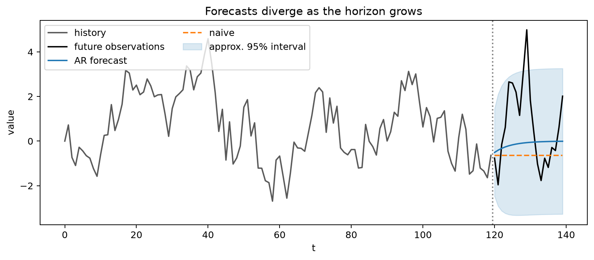
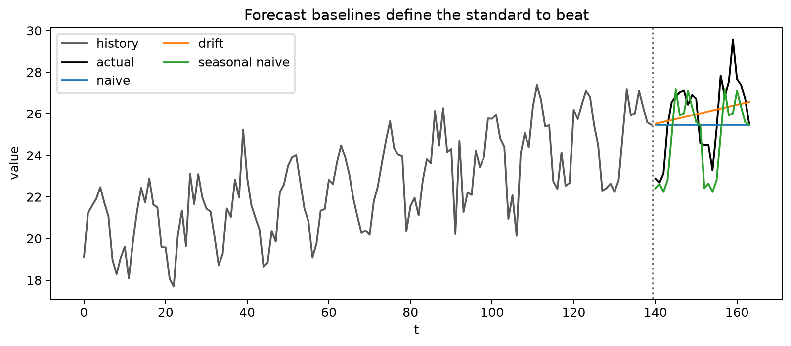
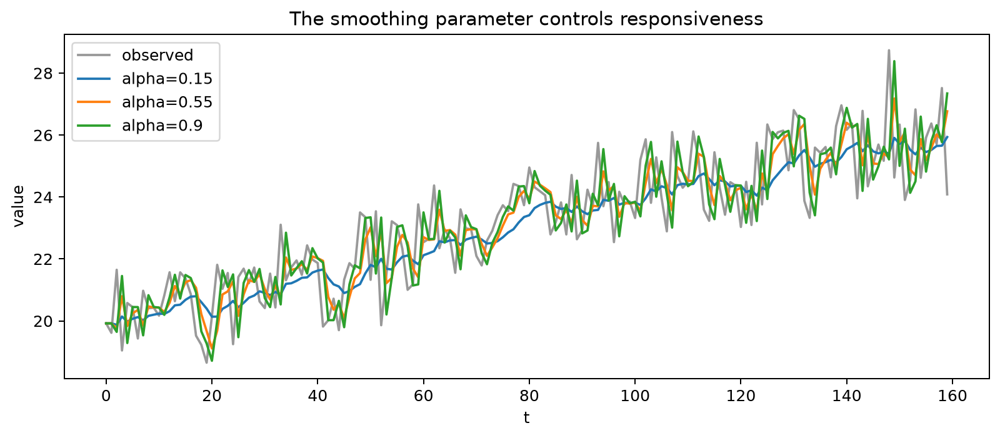
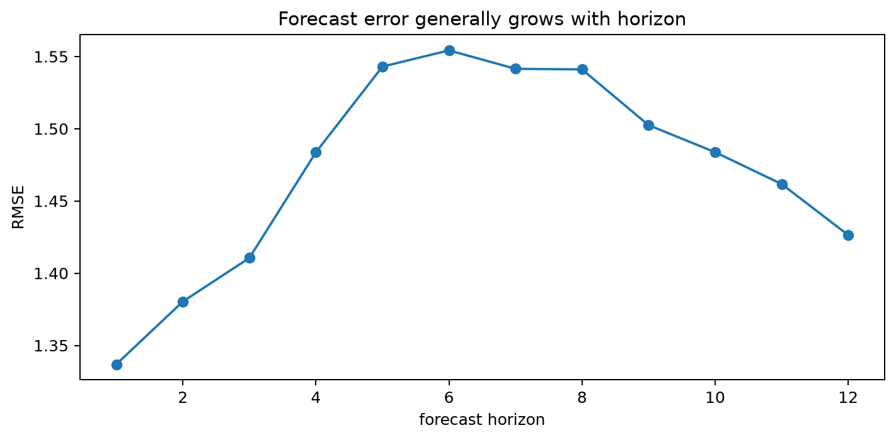

# Forecasting with Time Series

## Worked calculation: a forecast and its uncertainty

For a centered AR(1),

$$
X_t=0.8X_{t-1}+\varepsilon_t,
\qquad
\mathrm{Var}(\varepsilon_t)=1,
$$

if the latest observation is $X_T=5$, then

$$
\hat X_{T+1|T}=0.8(5)=4,
\qquad
\hat X_{T+5|T}=0.8^5(5)=1.6384.
$$

The $h$-step forecast-error variance is

$$
\mathrm{Var}(X_{T+h}-\hat X_{T+h|T})
=\sum_{j=0}^{h-1}0.8^{2j}.
$$

At $h=2$,

$$
\mathrm{Var}(e_{T+2})=1+0.8^2=1.64,
$$

so an approximate Gaussian 95% prediction interval around the two-step forecast uses

$$
3.2\pm1.96\sqrt{1.64}.
$$

The point forecast moves toward the long-run mean, while the uncertainty increases with horizon.



The figure shows both parts of a forecast. The central path gives the conditional mean, while the widening interval reflects uncertainty from future shocks that have not yet been observed.

Time-series forecasting predicts future observations using information available at a specified forecast origin. A forecast is therefore not only a model output; it is a conditional statement tied to a horizon, an information set, and an uncertainty estimate.

### Components of a Time Series

Forecasting methods differ in how they represent trend, seasonality, cycles, and irregular variation. Identifying these structures first helps determine which model class and baseline are appropriate.

**Trend** is a persistent long-run movement in level or slope.


The trend figure shows a systematic change in the level. A level-only forecasting method will lag behind such movement unless a trend component or transformation is included.

**Seasonality** is a pattern that repeats at a fixed period such as day of week, month of year, or quarter.


The repeated spacing of peaks and troughs suggests a seasonal model or seasonal baseline rather than an ordinary non-seasonal trend model.

**Cycles** are oscillations whose duration is not tied to one fixed seasonal period.


Because cycle length can vary, long-range cyclic behavior is usually harder to extrapolate reliably than fixed calendar seasonality.

The **irregular component** is the variation not explained by the chosen systematic structure.


A remainder should be checked rather than assumed to be random. Residual autocorrelation, changing variance, or heavy tails indicate structure that the forecasting model has not yet captured.

### Forecasting Methods

Forecasting methods encode different assumptions about persistence, level, trend, seasonality, and nonlinear dependence. Start with a simple baseline, then add complexity only when it improves future-like predictions or provides necessary probabilistic structure.

#### Naive Forecast

The naive forecast assumes that the latest observed level persists:

$$
\hat y_{t+h|t}=y_t.
$$

For one step ahead this is simply

$$
\hat y_{t+1|t}=y_t.
$$

It is a strong baseline for persistent non-seasonal series and is the optimal conditional-mean forecast for a zero-drift random walk.



The figure compares several simple rules. Naive, seasonal-naive, mean, and drift forecasts correspond to different assumptions about what persists into the future, so the benchmark should match the basic structure of the series.

#### Simple Exponential Smoothing (SES)

**Simple Exponential Smoothing (SES)** is designed for a series with an evolving level but no explicit trend or seasonal component. The level update can be written as

$$
\ell_t=\alpha x_t+(1-\alpha)\ell_{t-1},
\qquad 0<\alpha\le1,
$$

and the level-only forecast is

$$
\hat x_{t+h|t}=\ell_t.
$$

A larger $\alpha$ reacts more strongly to the newest observation, while a smaller $\alpha$ produces a smoother level estimate with longer memory.

Repeated substitution gives

$$
\ell_t
=\alpha x_t
+\alpha(1-\alpha)x_{t-1}
+\alpha(1-\alpha)^2x_{t-2}
+\cdots,
$$

up to the contribution from the initial state. The observation weights decay geometrically.



The figure shows how the smoothed level reacts to new observations. Higher responsiveness follows recent movements more closely but can also chase short-lived noise.

##### Initial Condition

A simple initialization is

$$
\ell_1=x_1.
$$

Another option is to estimate the initial level jointly with $\alpha$ or use an average of early observations. Initialization matters most in short series and when $\alpha$ is small.

##### Forecast Error

The one-step forecast error is

$$
e_t=x_t-\hat x_{t|t-1}.
$$

These errors can be used to choose the smoothing parameter and to diagnose whether a level-only model is adequate.

##### Sum of Squared Errors (SSE)

One fitting criterion is

$$
\mathrm{SSE}(\alpha)=\sum_t(x_t-\hat x_{t|t-1})^2.
$$

A value of $\alpha$ can be selected by minimizing this criterion, although state-space formulations often estimate smoothing parameters and initial states jointly by likelihood.

##### Choosing the Optimal Smoothing Parameter

A value of $\alpha$ close to 1 gives most weight to recent data and adapts quickly. A value close to 0 changes slowly and averages information over a longer effective history.

Choose $\alpha$ from a fitting criterion or temporal validation rather than from visual smoothness alone. A smoother-looking fitted line is not necessarily a better forecast.

##### Recursive Form of SES

The recursive update

$$
\ell_t=\alpha x_t+(1-\alpha)\ell_{t-1}
$$

requires only the previous state and the newest observation. This makes SES computationally efficient and naturally suited to sequential updating.

#### Holt’s Linear Trend Method (Double Exponential Smoothing)

Holt's method adds a trend state to the evolving level. One common additive formulation is

$$
\ell_t=\alpha x_t+(1-\alpha)(\ell_{t-1}+b_{t-1}),
$$

$$
b_t=\beta(\ell_t-\ell_{t-1})+(1-\beta)b_{t-1},
$$

with forecast

$$
\hat x_{t+h|t}=\ell_t+hb_t.
$$

The level state estimates the current baseline, while $b_t$ estimates the local slope. Initial values can be set from the first observations or estimated jointly with the smoothing parameters.

A damped-trend variant can be useful when indefinitely extrapolating the current slope is unrealistic.

#### Holt-Winters Seasonal Method (Triple Exponential Smoothing)

Holt-Winters extends the level and trend states with a seasonal state of period $L$. Additive seasonality is appropriate when seasonal swings are roughly constant in absolute size; multiplicative seasonality is appropriate when they scale with the level.

##### Additive Model

A common additive formulation is

$$
\ell_t
=\alpha(x_t-s_{t-L})
+(1-\alpha)(\ell_{t-1}+b_{t-1}),
$$

$$
b_t
=\beta(\ell_t-\ell_{t-1})
+(1-\beta)b_{t-1},
$$

$$
s_t
=\gamma(x_t-\ell_t)
+(1-\gamma)s_{t-L}.
$$

The $h$-step forecast is

$$
\hat x_{t+h|t}
=\ell_t+hb_t+s_{t+h-L\lceil h/L\rceil}.
$$

The seasonal index selects the most recent state for the corresponding future season.

##### Multiplicative Model

A common multiplicative formulation is

$$
\ell_t
=\alpha\frac{x_t}{s_{t-L}}
+(1-\alpha)(\ell_{t-1}+b_{t-1}),
$$

$$
b_t
=\beta(\ell_t-\ell_{t-1})
+(1-\beta)b_{t-1},
$$

$$
s_t
=\gamma\frac{x_t}{\ell_t}
+(1-\gamma)s_{t-L},
$$

with forecast

$$
\hat x_{t+h|t}
=(\ell_t+hb_t)s_{t+h-L\lceil h/L\rceil}.
$$

For additive seasonality, initial seasonal states are commonly centered to sum to zero. For multiplicative seasonality, they are commonly scaled to average 1. The exact initialization and state equations vary across software and ETS formulations, so reproduce the parameterization when comparing results.

### Linear Prediction for Stationary Series

For a weakly stationary series with mean $\mu$, a linear predictor of $X_{n+h}$ based on $X_n,\ldots,X_1$ can be written as

$$
\hat X_{n+h}
=\mu+\sum_{i=1}^{n}a_i(X_{n+1-i}-\mu).
$$

The coefficient vector solves the covariance system

$$
\Gamma_na=\gamma_n(h),
$$

where $\Gamma_n$ is the Toeplitz covariance matrix of the predictors and $\gamma_n(h)$ is the covariance vector between the target and those predictors.

The corresponding linear-prediction mean squared error is

$$
\mathrm{MSE}
=\gamma(0)-a^\top\gamma_n(h).
$$

For a stationary Gaussian series and one predictor $X_n$,

$$
E(X_{n+h}\mid X_n)
=\mu+\rho(h)(X_n-\mu).
$$

For a centered AR(1), this reduces to

$$
\hat X_{n+h|n}=\phi^hX_n.
$$

Algorithms such as Durbin-Levinson and the innovations algorithm exploit Toeplitz and innovations structure to compute predictors efficiently.

### ARAR Algorithm

The **ARAR algorithm** uses an autoregressive prefilter to shorten strong persistence before fitting a lower-order dynamic model. A typical sequence is to filter the persistent series, fit an AR-type or ARMA-type model on the filtered representation, forecast there, and then invert the filter.

The method is useful as a historical forecasting approach for strongly persistent series. As with any transformation, the inverse step and forecast uncertainty must be carried back to the original scale consistently.

### Machine Learning for Time Series Forecasting

Machine-learning methods can be useful when nonlinear interactions, many predictors, or large collections of related series are available. They are not inherently more accurate than statistical time-series models; performance depends on data volume, signal structure, feature availability, horizon, and the validation design.

The most important adaptation is to preserve the time information. Lag features, rolling summaries, calendar variables, and exogenous predictors must be constructed using only information that would have been available at each forecast origin.

#### Key Challenges in Time Series Forecasting

Machine-learning forecasting must handle temporal dependence, evolving distributions, seasonality and trend, multi-step prediction, and the possibility of leakage through feature construction or preprocessing.

Many generic ML algorithms do not contain a built-in concept of time. The time-series structure enters through the feature design, target construction, recursive/direct forecasting strategy, and chronological evaluation.

#### Supervised Learning Approach for Time Series

A forecasting problem can be converted into supervised rows. To predict $y_t$, features might include

$$
y_{t-1},y_{t-2},\ldots,
$$

along with lagged external variables, calendar indicators, and trailing-window summaries.

##### Data Preparation (Feature Engineering for Time Series)

Useful features include lagged values, trailing-window means or variances, calendar variables, known future events, and external predictors. All rolling features should be trailing or otherwise explicitly past-only in a real-time forecast.

The target horizon must also be explicit. A feature table for one-step forecasting is not automatically valid for forecasting 12 steps ahead.

#### Machine Learning Models for Time Series Forecasting

Tree ensembles, boosting models, support-vector regression, and feed-forward neural networks can all be applied after the forecasting problem has been transformed into a supervised dataset.

A random forest, for example, can learn nonlinear interactions among lagged values and external predictors. It does not natively propagate its own predictions through future time steps, so multi-step forecasts require a direct, recursive, or multi-output strategy.

```python
from sklearn.ensemble import RandomForestRegressor

# 'data' contains a time-ordered target column named 'value'.
data['lag1'] = data['value'].shift(1)
data['lag2'] = data['value'].shift(2)
data = data.dropna()

# Chronological split.
train_size = int(len(data) * 0.8)
train = data.iloc[:train_size]
test = data.iloc[train_size:]

X_train = train[['lag1', 'lag2']]
y_train = train['value']
X_test = test[['lag1', 'lag2']]

rf_model = RandomForestRegressor(n_estimators=100)
rf_model.fit(X_train, y_train)
predictions = rf_model.predict(X_test)
```

The chronological split avoids shuffling future rows into training, but a robust evaluation should usually repeat the experiment over several forecast origins rather than rely on one split.

##### Gradient Boosting Machines (GBM, XGBoost, LightGBM, CatBoost)

Gradient boosting builds trees sequentially so that later trees reduce errors left by earlier ones. It can model nonlinear interactions in structured lag-feature datasets and often performs well when there are many informative covariates.

The flexibility requires tuning and regularization. Tree-based boosting models also extrapolate poorly beyond feature-response patterns represented in the training data, so strong unmodeled trend can be a problem.

```python
import xgboost as xgb

xgb_model = xgb.XGBRegressor(
    n_estimators=100,
    max_depth=3,
    learning_rate=0.1,
)
xgb_model.fit(X_train, y_train)
predictions = xgb_model.predict(X_test)
```

##### Support Vector Machines (SVM)

Support Vector Regression (SVR) can learn nonlinear relationships through kernels such as the radial basis function. It is sensitive to feature scaling and can become computationally expensive as the training sample grows.

```python
from sklearn.svm import SVR

svr_model = SVR(kernel='rbf', C=100, gamma=0.1)
svr_model.fit(X_train, y_train)
predictions = svr_model.predict(X_test)
```

##### Artificial Neural Networks (ANN)

A feed-forward neural network can map lagged and external features to future targets. Its flexibility can capture nonlinear relationships, but it also increases data requirements and overfitting risk.

```python
from sklearn.neural_network import MLPRegressor

mlp_model = MLPRegressor(
    hidden_layer_sizes=(100,),
    activation='relu',
    solver='adam',
    max_iter=1000,
)
mlp_model.fit(X_train, y_train)
predictions = mlp_model.predict(X_test)
```

#### Advanced Neural Network Models for Time Series

Recurrent architectures process sequences directly and maintain an evolving hidden state. They can represent temporal patterns without manually flattening every lag into a separate feature, although sequence length, training stability, and data volume still matter.

##### Recurrent Neural Networks (RNNs)

A simple RNN passes a hidden state from one time step to the next. Standard RNNs can struggle with long dependencies because gradients may vanish or explode.

```python
import tensorflow as tf

model = tf.keras.models.Sequential([
    tf.keras.layers.SimpleRNN(
        50,
        activation='relu',
        input_shape=(n_timesteps, n_features),
    ),
    tf.keras.layers.Dense(1),
])

model.compile(optimizer='adam', loss='mse')
model.fit(X_train, y_train, epochs=50, batch_size=32)
```

##### Long Short-Term Memory (LSTM)

LSTMs introduce gated memory cells that improve gradient flow over longer sequences. They can model nonlinear temporal patterns, but they require careful regularization, scaling, architecture selection, and chronological evaluation.

```python
import tensorflow as tf

X_train_reshaped = X_train.values.reshape(
    (X_train.shape[0], X_train.shape[1], 1)
)
X_test_reshaped = X_test.values.reshape(
    (X_test.shape[0], X_test.shape[1], 1)
)

model = tf.keras.models.Sequential([
    tf.keras.layers.LSTM(
        50,
        activation='relu',
        input_shape=(X_train_reshaped.shape[1], X_train_reshaped.shape[2]),
    ),
    tf.keras.layers.Dense(1),
])

model.compile(optimizer='adam', loss='mse')
model.fit(X_train_reshaped, y_train, epochs=100, batch_size=32)
predictions = model.predict(X_test_reshaped)
```

##### Gated Recurrent Units (GRU)

GRUs use a simpler gating structure than LSTMs and can provide similar performance with fewer parameters in some problems. Neither architecture is universally preferable; the comparison should be made on chronological validation data.

```python
import tensorflow as tf

model = tf.keras.models.Sequential([
    tf.keras.layers.GRU(
        50,
        activation='relu',
        input_shape=(n_timesteps, n_features),
    ),
    tf.keras.layers.Dense(1),
])

model.compile(optimizer='adam', loss='mse')
model.fit(X_train, y_train, epochs=50, batch_size=32)
```

#### Hybrid Models

Hybrid approaches combine models that capture different structures. For example, an ARIMA model can describe linear short-memory dynamics while a nonlinear model is fit to residual structure. Boosting and recurrent models can also be combined, but extra stages increase the risk of leakage and overfitting.

Each stage should be trained inside the same historical information boundary, and the hybrid should be compared with its simpler components on identical forecast origins.

### Comparison of Various Models

The table below summarizes common forecasting families. The descriptions are broad; implementations within each family differ substantially.

| Algorithm Name | Description | Strengths | Limitations | Local vs. global use |
|---|---|---|---|---|
| **ARIMA** | Models a differenced univariate series with AR and MA terms. | Interpretable linear dynamics; strong baseline for many short-memory series. | Requires careful transformation/order selection; structural breaks and nonlinearities can reduce performance. | Usually fit locally to one series, though parameters can be shared in larger frameworks. |
| **Prophet** | Additive regression-style model with trend, seasonal Fourier terms, and optional events/holidays. | Convenient handling of calendar effects and changing trend; interpretable components. | Assumptions may be too rigid for strongly autoregressive or irregular dynamics; still requires validation and tuning. | Commonly local, though repeated fitting across many series is possible. |
| **LSTM** | Gated recurrent neural network for sequential inputs. | Flexible nonlinear sequence representation. | Data- and compute-intensive; many tuning choices; can overfit small datasets. | Can be local or global. |
| **Holt-Winters Method** | Exponential smoothing with level, trend, and seasonal states. | Simple recursive updates; effective for stable trend and seasonal patterns. | Fixed seasonal structure and trend extrapolation can fail after regime changes. | Usually local. |
| **SARIMA** | ARIMA with seasonal AR, MA, and differencing terms. | Explicit seasonal lag structure; interpretable linear model. | Order selection can be difficult; multiple seasonalities require extensions. | Usually local. |
| **Exponential Smoothing / ETS** | State-space family with level, trend, seasonal, and error choices. | Fast, interpretable, and strong for many structured univariate series. | Limited when important nonlinear/exogenous relationships are omitted. | Usually local. |
| **Random Forest** | Ensemble of decision trees applied to lag and external features. | Nonlinear interactions; little distributional structure required. | Poor extrapolation; multi-step forecasting requires an explicit strategy; feature construction can leak future information. | Can be local or global. |
| **XGBoost / GBM** | Sequential boosted trees applied to engineered features. | Strong predictive performance on structured covariate-rich data; regularization available. | Tuning and feature engineering matter; poor extrapolation beyond learned tree partitions. | Can be local or global. |

No row is universally best. The relevant comparison is performance, calibration, complexity, and interpretability on the deployment-like forecast experiment.

### Model Evaluation

Forecast accuracy must be evaluated out of sample with temporal order preserved. Point-forecast metrics summarize different loss functions:

| Metric | Formula | Interpretation |
|---|---|---|
| **MAE** | $\mathrm{MAE}=\frac{1}{n}\sum_{t=1}^{n}|y_t-\hat y_t|$ | Average absolute error in the response units. |
| **MSE** | $\mathrm{MSE}=\frac{1}{n}\sum_{t=1}^{n}(y_t-\hat y_t)^2$ | Squared-error loss; gives large misses more influence. |
| **RMSE** | $\mathrm{RMSE}=\sqrt{\frac{1}{n}\sum_{t=1}^{n}(y_t-\hat y_t)^2}$ | Square-root of MSE, returned to response units. |
| **MAPE** | $\mathrm{MAPE}=\frac{100}{n}\sum_{t=1}^{n}\left|\frac{y_t-\hat y_t}{y_t}\right|$ | Percentage error; undefined at zero and unstable near zero. |
| **sMAPE** | $\mathrm{sMAPE}=\frac{100}{n}\sum_{t=1}^{n}\frac{|y_t-\hat y_t|}{(|y_t|+|\hat y_t|)/2}$ | Symmetric scaling, but still problematic when both actual and forecast are near zero. |

AIC and BIC are not forecast-error metrics. They compare likelihood-based candidate models fitted to the same response data:

$$
\mathrm{AIC}=2k-2\log L,
$$

$$
\mathrm{BIC}=k\log n-2\log L.
$$

Residual tests such as Ljung-Box are diagnostics rather than accuracy scores. They assess whether a fitted model has left linear autocorrelation unexplained.



The horizon plot shows why a single average metric can be misleading. A method that is strongest one step ahead may lose its advantage at longer horizons, so evaluation should match the operational forecast horizon.

## Student guide: construct, communicate, and test a forecast

A forecast is a conditional statement. Under squared-error loss,

$$
\hat y_{T+h|T}=E(y_{T+h}\mid\mathcal F_T).
$$

The conditioning set $\mathcal F_T$ is as important as the model family. A forecast that uses a realized future predictor answers a different question from one that uses only information available in deployment.

### Baselines first

For a level series, the naive forecast is

$$
\hat y_{T+h|T}=y_T.
$$

For seasonal period $s$, the seasonal-naive rule reuses the latest observation from the same season. A drift forecast extrapolates the historical average change. Report at least one appropriate baseline before presenting ARIMA, state-space, or machine-learning results.

### Simple exponential smoothing

For a roughly level series,

$$
\ell_t=\alpha y_t+(1-\alpha)\ell_{t-1},
\qquad
\hat y_{t+h|t}=\ell_t.
$$

If $\ell_{t-1}=100$, $y_t=110$, and $\alpha=0.3$,

$$
\ell_t=0.3(110)+0.7(100)=103.
$$

Under the level-only model, the forecast is 103 for every future horizon. Increasing $\alpha$ makes the level respond faster to recent observations but can also make it more sensitive to noise.

### Holt trend and seasonal extensions

Holt's linear trend keeps a level and slope:

$$
\ell_t=\alpha y_t+(1-\alpha)(\ell_{t-1}+b_{t-1}),
$$

$$
b_t=\beta(\ell_t-\ell_{t-1})+(1-\beta)b_{t-1},
$$

with

$$
\hat y_{t+h|t}=\ell_t+hb_t.
$$

Holt-Winters adds a seasonal state. The additive version keeps seasonal amplitude in the response units; the multiplicative version lets it scale with the level.

### AR forecast example

For

$$
y_t=0.8y_{t-1}+\varepsilon_t,
\qquad y_T=5,
$$

the one-step and five-step forecasts are

$$
\hat y_{T+1|T}=4,
\qquad
\hat y_{T+5|T}=0.8^5(5)=1.6384.
$$

With innovation variance 1, the two-step forecast-error variance is

$$
1+0.8^2=1.64.
$$

An approximate 95% Gaussian interval around the two-step mean $3.2$ is

$$
3.2\pm1.96\sqrt{1.64}.
$$

The point forecast shrinks toward the mean while uncertainty increases.

### Forecast transformations

If a model forecasts $\log y_t$, then

$$
\exp(E[\log y_t\mid\mathcal F_T])
$$

is generally not the conditional mean of $y_t$. Jensen's inequality gives

$$
E[\exp(Z)]\ne\exp(E[Z]).
$$

Under a lognormal assumption, exponentiating the log-scale conditional mean gives the median on the original scale. A mean forecast requires an appropriate bias adjustment. State whether reported point forecasts and intervals target the mean, median, or another functional.

### Forecast combination

Two forecasts can be combined as

$$
\hat y=w\hat y^{(1)}+(1-w)\hat y^{(2)}.
$$

A combination can improve accuracy when the component errors contain complementary information. Choose the weight using training or validation origins, not the final test period.

### Forecast uncertainty

Forecast uncertainty can come from future shocks, parameter estimation, future predictor values, transformation bias, model uncertainty, and regime changes. Classical model intervals may include only a subset of these sources.


The widening intervals reinforce the distinction between point prediction and uncertainty. Evaluate empirical coverage and width on temporal backtests, and state which uncertainty sources the interval construction includes.

### Communication

A useful forecast report includes:

1. forecast origin and timestamp;
2. horizon and units;
3. point forecast and target functional;
4. interval level and construction;
5. baseline comparison;
6. recent error history;
7. known future events or predictor assumptions;
8. limitations and update schedule.
