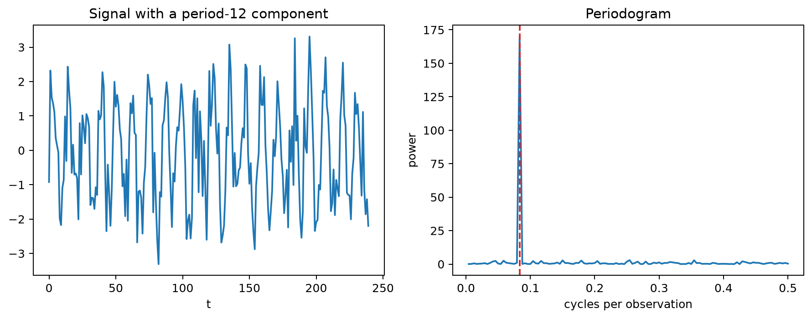
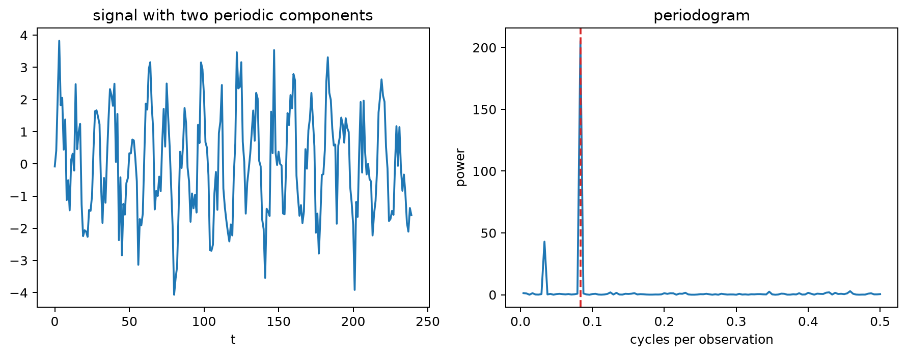
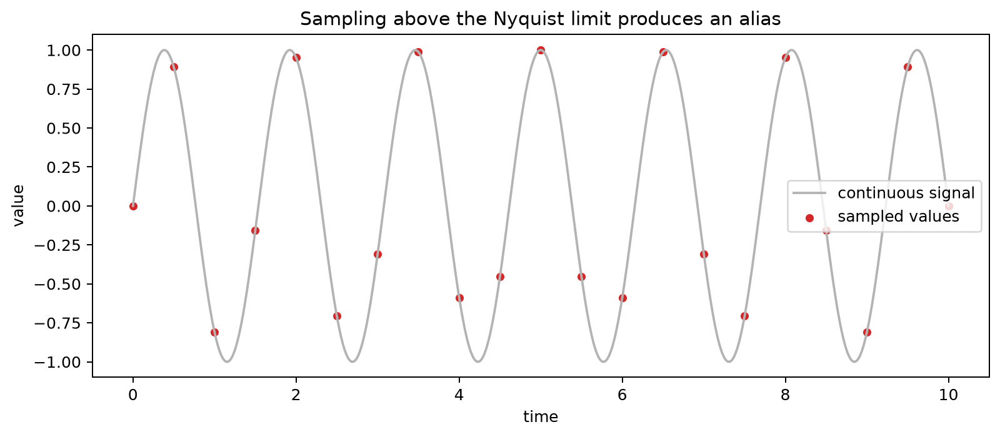
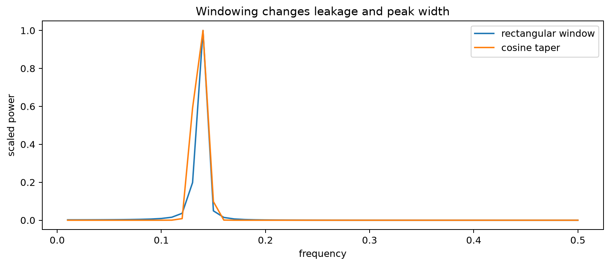
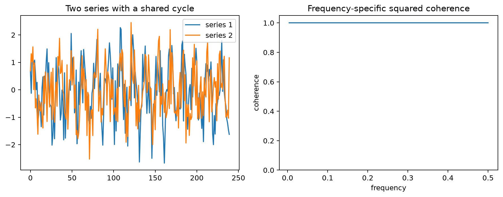

# Frequency-Domain Analysis

## Worked calculation: frequency, period, and resolution

For a seasonal signal that repeats every 12 observations,

$$
f=\frac{1}{12}\approx0.08333
\quad\text{cycles per observation}.
$$

With $N=240$ observations, the Fourier frequency spacing is

$$
\Delta f=\frac{1}{N}=0.004167,
$$

so the period-12 component lies exactly at Fourier bin

$$
k=Nf=\frac{240}{12}=20.
$$

The Nyquist frequency is $0.5$ cycles per observation. Frequencies above that limit cannot be distinguished from lower-frequency aliases at this sampling rate.

The periodogram peak should therefore be translated back into a period before interpretation. A peak near $0.0833$ means "about 12 observations per cycle," not "frequency 12."

The figure connects the repeated pattern in the time domain to a concentrated peak in the frequency domain. The horizontal location of the peak gives the cycle frequency, while its inverse gives the period in observations.

Time-domain methods describe dependence through lags. Frequency-domain methods describe how variation is distributed across cycles of different frequencies. These are complementary views of the same second-order structure for a stationary process.

A sinusoidal component can be written as

$$
x_t=A\cos(2\pi ft+\phi),
$$

with period

$$
P=\frac{1}{f}.
$$

A frequency of $1/12$ cycles per month therefore corresponds to a 12-month cycle.

## Fourier Transform and Periodogram

For observations $x_0,\ldots,x_{N-1}$, the discrete Fourier transform is

$$
X_k=\sum_{t=0}^{N-1}x_te^{-i2\pi kt/N}.
$$

A **periodogram** summarizes the squared magnitude of these Fourier components across frequency. For a weakly stationary process, the theoretical spectral density is the Fourier transform of the autocovariance function, so the ACF and spectrum encode the same second-order information in different coordinates.

One common periodogram scaling is proportional to

$$
I(f_k)=\frac{1}{N}|X_k|^2.
$$

Exact normalizations vary across software and depend on whether a one-sided or two-sided spectrum and physical sampling units are used.

The periodogram figure shows how dominant cycle lengths appear as peaks. Because a raw periodogram is noisy, interpretation should focus on stable structure rather than treating every local maximum as a distinct physical cycle.

## Nyquist Frequency and Aliasing

With one observation per sampling interval, the highest uniquely distinguishable frequency is the Nyquist frequency,

$$
f_N=\frac{1}{2}
$$

cycle per interval. A higher-frequency signal can produce exactly the same sampled values as a lower-frequency signal, a phenomenon called **aliasing**.

The figure demonstrates why the sampling rate must be known before assigning a physical interpretation to a spectral peak. Once a frequency has aliased into the observed band, the sampled data alone cannot recover the original higher frequency.

## Spectral Leakage

A finite observation window rarely contains an exact integer number of cycles. Truncating the signal at the sample boundaries then spreads power into neighboring Fourier frequencies. This is **spectral leakage**.

Tapering or windowing can reduce leakage by softening the sample edges, but it also broadens peaks. The tradeoff is therefore not simply "windowed is better": lower side lobes come at the cost of reduced frequency resolution.

The figure shows the same underlying frequency under different window treatments. The narrower peak from a rectangular window can have stronger side lobes, while a taper suppresses those side lobes but spreads energy across a wider main peak.

Strong trend also concentrates power near frequency zero. If the goal is to study cycles around a trend, detrending can be appropriate. Differencing may also suppress low-frequency variation, but it changes the frequency response of the series and should be chosen for a modeling reason rather than merely to improve the appearance of a spectrum.

For two stationary series, cross-spectral methods examine shared variation by frequency. **Coherence** is a frequency-specific measure of linear association, but high coherence does not establish direction or causality.

The frequency-relationship figure illustrates how two series can share a strong cycle even when their time-domain relationship is difficult to see directly.

A practical workflow is to establish the sampling interval, inspect trend and stationarity, compute a periodogram or smoothed spectrum, translate peaks into periods, and interpret them with aliasing, leakage, and multiple-search concerns in mind.

## Student guide: read a spectrum as a decomposition of variation

Frequency analysis answers a different question from lag-based analysis:

> At which cycle lengths is the series variable, and are those cycle lengths shared by another series?

The answer depends on the sampling rate, record length, trend treatment, windowing, and the stationarity assumptions behind the spectrum.

### From period to frequency

If a pattern repeats every $P$ sampling intervals, its frequency is

$$
f=\frac{1}{P}.
$$

For a 12-month cycle,

$$
f=\frac{1}{12}=0.08333
\quad\text{cycles per month}.
$$

If observations arrive every 15 minutes, the same numerical frequency is initially expressed in cycles per 15-minute interval. Convert to cycles per hour, day, or another physical unit only after recording the sampling interval.

The Nyquist frequency is half the sampling rate. With one observation per unit interval it is $0.5$ cycles per observation. A signal at $0.65$ cycles per observation is therefore observed as a lower-frequency alias.

### DFT and frequency resolution

For $N$ observations, the nonnegative Fourier frequencies are

$$
f_k=\frac{k}{N},
\qquad
k=0,\ldots,\left\lfloor\frac{N}{2}\right\rfloor.
$$

The spacing is $1/N$. With $N=240$,

$$
\Delta f=\frac{1}{240}=0.004167.
$$

A period-12 component has $f=1/12$ and lies at

$$
k=Nf=240\left(\frac{1}{12}\right)=20.
$$

Longer records provide finer Fourier spacing, but a longer sample does not automatically justify a stationary spectrum if the underlying process changes over time.

### Periodogram scaling

Let $\tilde x_t=x_t-\bar x$. Its DFT is

$$
X_k=\sum_{t=0}^{N-1}\tilde x_te^{-2\pi i kt/N}.
$$

A common periodogram form is

$$
I(f_k)=\frac{1}{N}|X_k|^2.
$$

The constant factor varies by convention, so check the normalization before comparing absolute spectral values across software or sampling rates.

A raw periodogram has high variance. A prominent peak can reflect a genuine cycle, leakage from a nearby strong component, low-frequency trend, a transient event, or repeated searching over many frequencies.

### Trend and low-frequency power

A deterministic trend changes slowly and therefore contributes strong low-frequency power. If the scientific question concerns cycles around a trend, write

$$
x_t=m_t+r_t
$$

and analyze the remainder $r_t$ after estimating an appropriate trend $m_t$.

Differencing is another transformation:

$$
\nabla x_t=x_t-x_{t-1}.
$$

It suppresses low frequencies but also changes the spectral shape by weighting frequencies differently. Choose the transformation because it matches the model or question, not simply because it produces a cleaner plot.

### Spectral leakage and windows

A finite sample is the product of an underlying process and an observation window. A rectangular window has abrupt boundaries, so a sinusoid that does not complete an integer number of cycles spills power into neighboring Fourier bins.

A taper such as a Hann window reduces side lobes but broadens the central peak. Window choice is therefore a resolution-versus-leakage tradeoff. Report the window and detrending settings whenever spectra are compared.

### Cross-spectrum and coherence

For two series $x_t$ and $y_t$, a cross-periodogram is based on

$$
I_{xy}(f)=X(f)\overline{Y(f)}.
$$

A smoothed squared coherence has the form

$$
C_{xy}^2(f)=\frac{|S_{xy}(f)|^2}{S_{xx}(f)S_{yy}(f)}.
$$

Values near 1 indicate strong linear association at that frequency. They do not establish direction, timing, or causality; a shared seasonal driver can produce high coherence in both series.

### A numerical periodogram example

Let

$$
x_t=1.8\sin\left(\frac{2\pi t}{12}\right)
+0.8\sin\left(\frac{2\pi t}{30}\right)
+\varepsilon_t.
$$

The first component has period 12 and the second period 30. With moderate noise, the periodogram should show peaks near

$$
\frac{1}{12}\approx0.0833
\quad\text{and}\quad
\frac{1}{30}\approx0.0333.
$$

The larger sinusoidal amplitude tends to contribute more spectral power, but in a short noisy sample the observed peak ordering can vary. Check whether the main peaks remain stable under reasonable windows, segment choices, or repeated samples.

### Practical interpretation checklist

Before treating a spectral peak as substantive evidence:

1. verify the sampling interval and Nyquist frequency;
2. inspect the raw series and any trend or changing variance;
3. record detrending, differencing, and window settings;
4. convert the peak frequency into a period;
5. check whether the peak is near a boundary, alias, or harmonic;
6. compare adjacent time windows if stationarity is doubtful;
7. compare with an appropriate noise or domain baseline;
8. account for the number of frequencies examined;
9. avoid causal claims based on coherence alone.

### Visual companions

The periodogram, leakage, aliasing, and cross-frequency figures are placed beside the concepts they illustrate above. Together they show the progression from identifying a frequency, to understanding the limits imposed by finite samples and sampling rate, to comparing frequency-specific structure across series.

The related state-space material is covered in the [state-space chapter](state_space_models.md), and the [state-space/frequency notebook](../../notebooks/time_series/state_space_and_frequency.ipynb) provides an additional worked environment.
