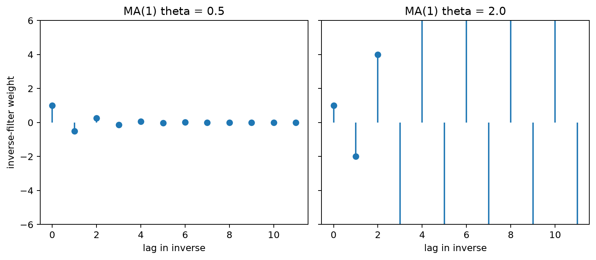

# Invertibility in Time Series Models

Invertibility is the condition that lets a moving-average or ARMA model recover its unobserved innovations from the observed series in a stable way. It turns the shock representation of the model into a usable past-based filter whose coefficients decay rather than grow without bound.

The condition also resolves an identification problem: different MA parameter values can generate the same second-order behavior. Requiring the roots of the MA polynomial to lie outside the unit circle selects a canonical representation that is stable for estimation, residual analysis, and forecasting.

## Worked calculation: two MA(1) inverse filters

For an MA(1),

$$
X_t=(1+\theta B)\varepsilon_t.
$$

If $\theta=0.5$, the inverse is

$$
\varepsilon_t=(1-0.5B+0.25B^2-0.125B^3+\cdots)X_t.
$$

The weights shrink, so the inverse representation is stable. If $\theta=2$, the first inverse weights are $1,-2,4,-8,\ldots$ and grow in magnitude. Because reciprocal MA parameters can generate the same autocorrelation structure after rescaling the innovation variance, the usual invertibility convention selects the representation with $|\theta|<1$.

In time-series modeling, **invertibility** means that the innovation sequence can be recovered as a stable function of the observed series and its past values. The concept is especially important for moving average models, whose equations are written in terms of unobserved current and lagged shocks.

### Intuition Behind Invertibility

An MA model maps innovations into observations. Invertibility asks whether this mapping can be reversed using current and past observations with coefficients that decay sufficiently fast.

This matters for two related reasons. First, it gives a stable way to infer innovations from observed data. Second, it selects a canonical parameterization when different MA coefficient sets imply the same second-order behavior. Without an invertibility convention, the observable autocovariances may not identify a unique MA representation.

### Mathematical Definition of Invertibility

A process $\{X_t\}$ is invertible if its innovation $Z_t$ can be written as a convergent linear filter of present and past observations:

$$
Z_t=\sum_{k=0}^{\infty}\pi_kX_{t-k}.
$$

A common sufficient stability condition is absolute summability,

$$
\sum_{k=0}^{\infty}|\pi_k|<\infty.
$$

The exact convergence condition can be stated in several related ways, but the practical idea is the same: increasingly old observations should receive diminishing weight when reconstructing the current innovation.

### Why is Invertibility Important?

Invertibility provides a unique, stable representation of an MA process under the usual root convention. It makes the recovered innovations usable for residual diagnostics and recursive forecasting, and it avoids interpreting observationally equivalent coefficient sets as different models.

A non-invertible MA specification can still be written and numerically fitted, but it is not the canonical representation and can create identification and optimization problems. Software therefore commonly reports the invertible equivalent whenever one exists.

Invertibility also gives an infinite autoregressive representation of the innovation filter, which connects MA models to AR-style recursions.

### General Conditions for Invertibility

For an MA($q$),

$$
X_t=Z_t+\theta_1Z_{t-1}+\theta_2Z_{t-2}+\dots+\theta_qZ_{t-q},
$$

define the MA polynomial

$$
\theta(z)=1+\theta_1z+\theta_2z^2+\dots+\theta_qz^q.
$$

The process is invertible under the standard convention when every root of

$$
\theta(z)=0
$$

lies outside the unit circle. This root condition, rather than a separate bound on each individual coefficient, is the general criterion for MA($q$) models.

### Example: MA(1) Process

Consider

$$
X_t=Z_t+\beta Z_{t-1},
$$

where $Z_t$ is white noise with mean 0 and variance $\sigma_Z^2$.

#### Inversion Using Backward Substitution

Rearrange the model as

$$
Z_t=X_t-\beta Z_{t-1}.
$$

Substitute the same relation for $Z_{t-1}$:

$$
Z_t=X_t-\beta(X_{t-1}-\beta Z_{t-2})
=X_t-\beta X_{t-1}+\beta^2Z_{t-2}.
$$

Repeating the substitution gives

$$
Z_t=X_t-\beta X_{t-1}+\beta^2X_{t-2}-\beta^3X_{t-3}+\dots.
$$

Equivalently,

$$
Z_t=\sum_{k=0}^{\infty}(-\beta)^kX_{t-k}.
$$

The coefficients decay geometrically when $|\beta|<1$, so the inverse filter is stable under that condition.

#### Inversion Using the Backward Shift Operator

Write the MA(1) as

$$
X_t=(1+\beta B)Z_t.
$$

Formally inverting the operator gives

$$
Z_t=(1+\beta B)^{-1}X_t.
$$

For $|\beta|<1$, the geometric expansion is

$$
(1+\beta B)^{-1}
=1-\beta B+\beta^2B^2-\beta^3B^3+\dots.
$$

Therefore,

$$
Z_t=X_t-\beta X_{t-1}+\beta^2X_{t-2}-\beta^3X_{t-3}+\dots,
$$

which is the same inverse obtained by backward substitution. The operator form makes clear that invertibility is a property of the MA polynomial.

### Example: MA(2) Process

Consider

$$
X_t=Z_t+\theta_1Z_{t-1}+\theta_2Z_{t-2}.
$$

The MA polynomial is

$$
1+\theta_1z+\theta_2z^2.
$$

For $\theta_1=0.5$ and $\theta_2=0.3$,

$$
1+0.5z+0.3z^2=0.
$$

The roots are

$$
z=\frac{-0.5\pm\sqrt{0.25-1.2}}{0.6}
=\frac{-0.5\pm i\sqrt{0.95}}{0.6}.
$$

They are complex conjugates. Because their product is $1/0.3$, each root has modulus

$$
|z|=\sqrt{\frac{1}{0.3}}\approx1.826>1.
$$

Both roots therefore lie outside the unit circle, so this MA(2) specification is invertible.

This example also shows why individual coefficient bounds are not the correct general test: invertibility depends on the roots of the full polynomial.

### Convergence of the Series in MA Models

The inverse representation is useful only if truncating it after many lags gives a progressively better approximation to the innovation. In an invertible model, the inverse-filter coefficients decay, so increasingly distant observations contribute less.

#### Understanding Mean-Square Convergence

For the MA(1),

$$
Z_t=X_t-\beta X_{t-1}+\beta^2X_{t-2}-\beta^3X_{t-3}+\dots.
$$

Mean-square convergence means that finite truncations of this series approach $Z_t$ in expected squared error. When the inverse coefficients decay geometrically, the contribution from the omitted tail becomes negligible.

#### Condition for Convergence: $|\beta|<1$

For MA(1), the inverse coefficients are powers of $-\beta$. Thus:

- if $|\beta|<1$, the weights decay and the standard past-based inverse is stable;
- if $|\beta|=1$, the weights do not decay;
- if $|\beta|>1$, the weights grow in the direct geometric expansion.

Therefore the standard MA(1) invertibility condition is

$$
|\beta|<1.
$$

This condition is equivalent to requiring the zero $z=-1/\beta$ of $1+\beta z$ to lie outside the unit circle.

#### Generalization to Higher-Order MA Models

For

$$
X_t=Z_t+\theta_1Z_{t-1}+\dots+\theta_qZ_{t-q},
$$

the same idea applies, but the coefficients of the inverse filter are determined by the roots of

$$
1+\theta_1z+\dots+\theta_qz^q=0.
$$

The model is invertible when all of these roots lie outside the unit circle. It is not necessary, and is not sufficient in general, to require every $|\theta_j|<1$ separately.

#### Example: MA(1) Process

For

$$
X_t=Z_t+\beta Z_{t-1},
$$

the inverse is

$$
Z_t=X_t-\beta X_{t-1}+\beta^2X_{t-2}-\beta^3X_{t-3}+\dots.
$$

With $|\beta|<1$, the weights decay as the lag increases. The recovered innovation can therefore be approximated using a sufficiently long but finite history of observed values.

The figure below visualizes this contrast between decaying and expanding inverse-filter weights.

## Student guide: why roots and inverse filters matter

Invertibility asks whether unobserved innovations can be represented as a stable function of observed values. It is also the convention that chooses a canonical representation when more than one MA parameterization produces the same covariance structure.

### MA(1) calculation

With

$$
y_t=(1+\theta B)\varepsilon_t,
$$

the formal inverse is

$$
\varepsilon_t
=(1+\theta B)^{-1}y_t
=\left(1-\theta B+\theta^2B^2-\theta^3B^3+\cdots\right)y_t.
$$

For $\theta=0.5$, the first weights are

$$
1,\ -0.5,\ 0.25,\ -0.125.
$$

They decay geometrically. For $\theta=2$, the corresponding direct expansion starts

$$
1,\ -2,\ 4,\ -8,
$$

and grows instead. The second representation is therefore not the stable past-based inverse.

### Root condition

The MA polynomial is

$$
\theta(B)=1+\theta B.
$$

Its zero is $B=-1/\theta$. Invertibility requires

$$
\left|-\frac{1}{\theta}\right|>1
\quad\Longleftrightarrow\quad
|\theta|<1.
$$

For higher-order MA models, every zero of the MA polynomial must lie outside the unit circle.

### Why equivalent models appear

For an MA(1),

$$
\gamma(0)=\sigma^2(1+\theta^2),
\qquad
\gamma(1)=\sigma^2\theta.
$$

Replacing $\theta$ by $1/\theta$ and rescaling the innovation variance appropriately can preserve the same autocorrelation. Second-order observations alone therefore cannot choose between the two parameterizations. Invertibility supplies the convention that selects the representation with a decaying inverse filter.

### Practical implications

Check fitted MA roots rather than looking only at the raw coefficient values. Be cautious near unit-circle roots, where the inverse decays slowly and numerical estimation can become unstable. Use innovations from the canonical invertible representation for residual diagnostics and forecasting, and do not interpret reciprocal non-invertible coefficients as evidence for a different physical shock mechanism when they describe the same observed second-order behavior.
