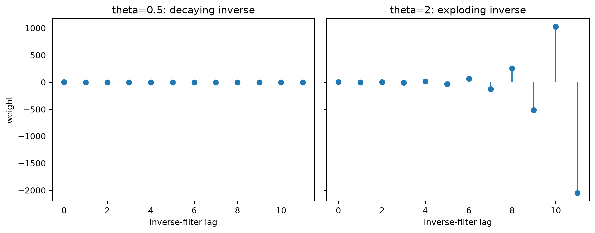

# Moving Average (MA) Models

## Worked calculation: an MA(1)

Let

$$
X_t=\varepsilon_t+0.5\varepsilon_{t-1},
\qquad
\mathrm{Var}(\varepsilon_t)=1.
$$

Because the shocks are uncorrelated,

$$
\gamma(0)=1+0.5^2=1.25,
\qquad
\gamma(1)=0.5,
\qquad
\gamma(h)=0\quad(h>1).
$$

Consequently,

$$
\rho(1)=\frac{0.5}{1.25}=0.4.
$$

The theoretical ACF of this MA(1) cuts off after lag 1. In a finite sample, later sample autocorrelations will usually not be exactly zero.

Moving Average (MA) models are a class of univariate time-series models in which the current value is a finite linear combination of current and past innovations. Unlike autoregressive models, they do not use past observed values directly in the model equation.

The name can be confusing: an MA($q$) stochastic model is not the same object as a rolling moving-average smoother. The distinction is made explicit later in the chapter.

### Overview of Moving Average Models

An MA model represents short-lived shock effects. A new innovation can affect the current observation and the next few observations, but in an MA($q$) process its direct effect disappears after $q$ lags.

This finite shock duration explains the characteristic ACF cutoff of an MA model. It does not mean that the observed series is obtained by smoothing its own past values.

### Mathematical Definition of MA Models

A **moving average model of order $q$**, MA($q$), can be written as

$$
Y_t=\mu+\varepsilon_t+\theta_1\varepsilon_{t-1}+\theta_2\varepsilon_{t-2}+\dots+\theta_q\varepsilon_{t-q}.
$$

Equivalently, with $\theta_0=1$,

$$
Y_t=\mu+\sum_{i=0}^{q}\theta_i\varepsilon_{t-i}.
$$

Here:

- $Y_t$ is the observation at time $t$;
- $\mu$ is the mean of the process under this parameterization;
- $\varepsilon_t$ is a white-noise innovation with mean zero and constant variance $\sigma^2$;
- $\theta_i$ is the coefficient on the innovation from lag $i$;
- $q$ is the largest innovation lag included directly in the model.

Weak white noise is sufficient for the covariance calculations below. Likelihood-based estimation often adds stronger distributional assumptions, such as independent Gaussian innovations.

### Examples of MA Models

#### First-Order Moving Average Model (MA(1))

An MA(1) includes the current innovation and one lagged innovation:

$$
Y_t=\mu+\varepsilon_t+\theta_1\varepsilon_{t-1}.
$$

A shock at time $t$ therefore affects $Y_t$ and $Y_{t+1}$ directly, but not $Y_{t+2}$ or later observations.

#### Second-Order Moving Average Model (MA(2))

An MA(2) includes two lagged innovations:

$$
Y_t=\mu+\varepsilon_t+\theta_1\varepsilon_{t-1}+\theta_2\varepsilon_{t-2}.
$$

A shock can affect three consecutive observations: the current one and the next two.

#### General MA($q$) Model

The general form is

$$
Y_t=\mu+\varepsilon_t+\theta_1\varepsilon_{t-1}+\dots+\theta_q\varepsilon_{t-q}.
$$

The coefficients determine the magnitude and sign of the finite shock response.

### Properties of MA Models

A finite-order MA process is weakly stationary when the innovations have constant mean and variance. Its mean and variance are constant, and its autocovariance depends only on the lag.

#### Theoretical Properties of MA(1) Model

For

$$
Y_t=\mu+\varepsilon_t+\theta_1\varepsilon_{t-1},
$$

with innovation variance $\sigma^2$,

$$
E(Y_t)=\mu,
$$

and

$$
\mathrm{Var}(Y_t)=\sigma^2(1+\theta_1^2).
$$

At lag 1,

$$
\rho_1=\frac{\theta_1}{1+\theta_1^2},
$$

while for $|h|\ge2$,

$$
\rho_h=0.
$$

The cutoff after lag 1 is a population property. Sample ACF values at later lags fluctuate around zero because they are estimated from a finite dataset.

#### Autocorrelation Function (ACF) in MA Models

For an MA($q$), the theoretical autocovariance is exactly zero for $|h|>q$. Lags at or below $q$ can be nonzero, although particular coefficient combinations can make some of them vanish as well.

Typical identification patterns are therefore:

- MA(1): the ACF can be nonzero at lag 1 and is zero after lag 1;
- MA(2): the ACF can be nonzero through lag 2 and is zero after lag 2;
- MA($q$): the ACF cuts off after lag $q$.

The PACF usually tails off rather than cutting off sharply. These are ideal population patterns and should be treated as heuristics in finite samples.

The figure shows the mechanism behind the cutoff: a single innovation has a finite sequence of direct effects and then disappears from the model equation.

### Identifying the Order $q$ of an MA Model

The ACF provides a useful first clue about the order, but order selection should combine visual identification with fitted-model diagnostics.

#### Step-by-Step Process for Model Selection

A practical sequence is:

1. plot the ACF and look for a plausible cutoff;
2. use uncertainty bands, such as the rough white-noise reference $\pm1.96/\sqrt n$, as screening guidance rather than an exact order rule;
3. fit a small set of candidate MA orders;
4. compare information criteria using the same response data and likelihood convention;
5. inspect residual autocorrelation and out-of-sample forecasts.

AIC and BIC are

$$
\mathrm{AIC}=-2\ln(L)+2k,
$$

and

$$
\mathrm{BIC}=-2\ln(L)+k\ln(n),
$$

where $L$ is the maximized likelihood, $k$ is the number of estimated parameters under the chosen convention, and $n$ is the sample size. Lower values are preferred within a comparable candidate set.

#### Example: Selecting an MA(2) Model

Suppose the sample ACF has notable spikes at lags 1 and 2 and no clear signal at later lags. That pattern suggests including MA(2) among the candidates.

If the fitted models give

| Model | AIC | BIC |
|---|---:|---:|
| MA(1) | 200 | 205 |
| MA(2) | 190 | 195 |
| MA(3) | 192 | 200 |

then both criteria favor MA(2) among these three models. The remaining step is to verify that its residuals no longer contain systematic dependence and that its forecasts are competitive.

### Example: Moving Average (MA) Model

Consider

$$
Y_t=\mu+w_t+\theta_1w_{t-1},
$$

with

- $\mu=10$,
- $\theta_1=0.5$,
- $w_t$ independent normal with mean 0 and variance 1.

The model is

$$
Y_t=10+w_t+0.5w_{t-1}.
$$

#### Defining the MA(1) Model

The value 10 is the process mean. The current observation moves around that mean because of the current shock and half of the previous shock. The lagged shock is not directly observed, which is one reason MA estimation differs from ordinary regression on observed lags.

#### Theoretical Autocorrelation Function (ACF) of MA(1)

For $\theta_1=0.5$,

$$
\rho_1=\frac{0.5}{1+0.5^2}=\frac{0.5}{1.25}=0.4,
$$

and

$$
\rho_h=0\quad\text{for }|h|\ge2.
$$

The first-lag spike represents the shared innovation between adjacent observations. Higher-lag population correlations are zero because observations more than one period apart share no innovation in an MA(1). A sample plot will show small nonzero values at later lags because of sampling variation.

### Simple Moving Average (SMA)

A **simple moving average (SMA)** is a smoother, not an MA($q$) stochastic model. It takes the arithmetic mean of the most recent $k$ observed values:

$$
\mathrm{SMA}_t=\frac{1}{k}\sum_{i=0}^{k-1}y_{t-i}.
$$

The smoother reduces short-term variation by averaging observations in a fixed window. Unlike an MA($q$) model, it is computed directly from observed values and does not introduce latent innovations as model components.

### Exponential Moving Average (EMA)

An **exponential moving average (EMA)** is another smoothing rule. It updates a level recursively:

$$
\mathrm{EMA}_t=\alpha y_t+(1-\alpha)\mathrm{EMA}_{t-1},
$$

where $0<\alpha<1$. Larger values of $\alpha$ place more weight on the newest observation and make the smoother respond more quickly to recent changes.

Again, this is conceptually different from an MA($q$) stochastic model: an EMA is a deterministic transformation of observed data once $\alpha$ and the initial value are fixed.

### Example: Stock Price Analysis

SMA and EMA curves are often plotted with price series as descriptive technical indicators. Their role is to summarize recent levels at different degrees of responsiveness; they do not, by themselves, provide a probabilistic model for future prices.

#### SMA Analysis

For a 20-day SMA,

$$
\mathrm{SMA}_t=\frac{P_t+P_{t-1}+\cdots+P_{t-19}}{20}.
$$

The window smooths day-to-day fluctuations, but it also introduces lag because every observation receives equal weight until it leaves the window.

#### EMA Analysis

A commonly used EMA smoothing factor for a nominal span $N$ is

$$
\alpha=\frac{2}{N+1}.
$$

The recursion is

$$
\mathrm{EMA}_t=\alpha P_t+(1-\alpha)\mathrm{EMA}_{t-1}.
$$

Because recent prices receive more weight, the EMA generally reacts faster than an equal-window SMA.

#### Trend Identification

Practitioners sometimes interpret crossings or divergence between SMA and EMA curves as descriptive signals of changing momentum. Such rules depend on the chosen windows and should not be treated as guaranteed forecasts. Both curves are functions of past and current prices, so their usefulness must be evaluated against an explicit benchmark and out-of-sample data.

The figure shows the raw price path together with a 20-day SMA and EMA. The SMA is smoother and typically slower to react, while the EMA follows recent movements more closely. These curves illustrate smoothing behavior, not the innovation structure of an MA($q$) model.

## Student guide: shock responses and identification

An MA($q$) model describes the current value as a finite weighted sum of current and past innovations:

$$
y_t=\mu+\varepsilon_t+\theta_1\varepsilon_{t-1}+\cdots+\theta_q\varepsilon_{t-q}.
$$

The innovations are new shocks, not observed lagged values. This is the central difference between MA models and regression-style AR estimation.

### MA(1) numerical moments

Let

$$
y_t=\varepsilon_t+0.5\varepsilon_{t-1},
\qquad
\mathrm{Var}(\varepsilon_t)=1.
$$

Then

$$
\gamma(0)=1+0.5^2=1.25,
\qquad
\gamma(1)=0.5,
\qquad
\gamma(h)=0\quad(h>1).
$$

Therefore,

$$
\rho(1)=\frac{0.5}{1.25}=0.4.
$$

If a single shock $\varepsilon_t=2$ arrives and all other recent shocks are zero, its effect is 2 at time $t$, 1 at time $t+1$, and zero at $t+2$. The finite duration is the source of the theoretical ACF cutoff.

### MA(2) response

For

$$
y_t=\varepsilon_t+0.7\varepsilon_{t-1}-0.35\varepsilon_{t-2},
$$

a shock of size 1 produces responses

$$
1,\quad0.7,\quad-0.35,\quad0,\ldots
$$

The response can change sign before ending. The theoretical ACF is zero beyond lag 2, although a finite-sample estimate will generally show small later values.

### Estimation

Because past innovations such as $\varepsilon_{t-1}$ are unobserved, ordinary least squares on observed lagged values does not solve the MA estimation problem. Common approaches include innovations algorithms, conditional likelihood, exact Gaussian likelihood, state-space recursions, and methods that construct starting values for the latent innovations.

The treatment of initial innovations can matter in short series, so record the estimation method and software convention when reproducing fitted parameters.

### Invertibility and equivalence

Different MA coefficient values can generate the same second-order autocovariance structure. Invertibility selects a unique representation whose inverse filter is stable. For an MA(1) written as

$$
(1+\theta B)\varepsilon_t,
$$

the usual invertibility condition is $|\theta|<1$.

The figure illustrates why invertibility matters for identification: the observable covariance pattern can correspond to more than one coefficient representation unless a root convention is imposed.

### MA versus moving-average smoother

Keep these three objects distinct:

| object | what is combined |
|---|---|
| MA($q$) model | current and past unobserved innovations |
| rolling moving average | observed values in a fixed window |
| exponential smoother | observed values through a recursive level update |

A rolling mean or EMA can be calculated directly from the data. An MA model requires inference about the latent innovation sequence.

### Visual companions

The shock-duration and invertibility figures above connect the two central properties of MA models: finite shock effects explain the ACF cutoff, while invertibility makes the parameterization identifiable.

The AR/MA identification figure at the start of the chapter places this cutoff beside the contrasting autoregressive pattern, where the ACF typically tails off rather than ending after a fixed lag.
