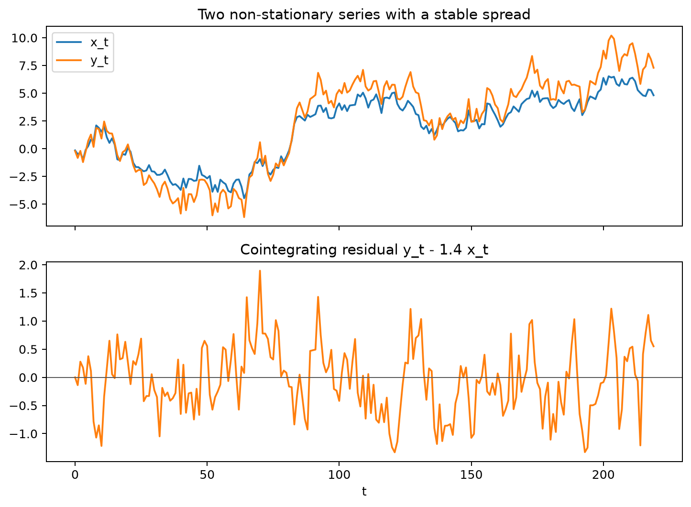

# Multivariate Time Series

Multivariate time-series models describe several evolving variables jointly so that cross-lag feedback, shared shocks, and predictive relationships can be represented within one system. They are useful when separate univariate models would ignore information carried by the histories of related series.

Short-run interactions are commonly modeled with VARs, while cointegration and VECMs preserve stable long-run relationships among non-stationary levels. Granger predictability and impulse responses add useful interpretations, but they remain conditional on the chosen information set and, for structural shocks, on explicit identification assumptions.

## Worked calculation: a cointegrating spread

Let $x_t=10$ and suppose the long-run relation is

$$
y_t=1.4x_t+u_t.
$$

If the current deviation is $u_t=0.5$, then

$$
y_t=1.4(10)+0.5=14.5.
$$

The levels can wander while the spread

$$
y_t-1.4x_t=u_t
$$

remains stable. Differencing both series would model short-run changes but would discard this level relationship. A VECM keeps both:

$$
\Delta y_t=\alpha\left(y_{t-1}-1.4x_{t-1}\right)
+\text{short-run terms}+\varepsilon_t.
$$

The sign and size of $\alpha$ describe how this equation responds after the system moves away from the long-run relation.

The figure shows two non-stationary levels moving together while their spread remains bounded. Cointegration is about this stable combination, not about the individual levels being stationary.

Multivariate time-series methods model several variables jointly so that feedback, shared shocks, cross-predictability, and long-run relationships can be represented within one system.

## Vector Autoregression

For a $k$-dimensional vector $y_t$, a VAR($p$) model is

$$
y_t=c+A_1y_{t-1}+\cdots+A_py_{t-p}+\varepsilon_t.
$$

Every variable can depend on lagged values of every variable in the system. This flexibility is useful when the variables interact, but the number of coefficients grows quickly, so lag order and system size must remain parsimonious.

The figure illustrates the defining VAR idea: lagged values can feed across equations in both directions. A joint system is appropriate when neither series is naturally treated as fully external to the other.

Lag order can be compared with AIC, BIC, or HQIC, but residual diagnostics, stability, and forecast performance should also be checked.

## Granger Predictability

Variable $x$ **Granger-predicts** $y$ when past values of $x$ improve prediction of $y$ after conditioning on the other included past information. The historical term "Granger-causes" is common, but the result is about incremental predictive content rather than intervention or structural causality.

The visual compares prediction with and without the additional lagged series. The relevant question is whether including the history of $x$ improves the conditional forecast of $y$ beyond the information already in the model.

Impulse-response functions trace how shocks propagate through a VAR. Their interpretation depends on how contemporaneous innovations are identified; orthogonalized responses can depend on variable ordering.

The impulse-response figure connects a one-time identified shock to its model-implied effects across future horizons. Those responses are not uniquely structural until the shock-identification assumptions are specified.

## Nonstationarity and Cointegration

Independent random walks can produce spurious regression in levels. If integrated variables are not cointegrated, a model in differences is often more appropriate. If they are cointegrated, differencing alone removes the long-run equilibrium relation.

Two or more $I(1)$ variables are cointegrated when a nontrivial linear combination is stationary. A cointegrated VAR can be written as a vector error-correction model (VECM):

$$
\Delta y_t
=\Pi y_{t-1}
+\Gamma_1\Delta y_{t-1}
+\cdots
+\Gamma_{p-1}\Delta y_{t-p+1}
+\varepsilon_t.
$$

When

$$
\Pi=\alpha\beta^\top,
$$

the columns of $\beta$ describe cointegrating relations and $\alpha$ describes how each equation adjusts to deviations from those relations.

The spread figure shows the stationary combination that is preserved by the VECM rather than discarded through differencing.

The adjustment figure shows how disequilibrium at one time point can feed into later changes. The direction of adjustment depends on both the definition of the spread and the signs of the loading coefficients.

A practical workflow is to inspect transformations and stationarity, decide among a levels VAR, differenced VAR, or VECM, choose a parsimonious lag order, fit and diagnose the system, and evaluate forecasts with rolling or expanding origins.

## Student guide: model the system before interpreting individual equations

Multivariate analysis is useful when variables can affect one another, share shocks, or move together in the long run. It also creates more opportunities for overfitting and interpretation errors. Begin with the data-generating and forecasting question, then decide whether a joint model adds information beyond separate univariate forecasts.

### VAR(1) mechanics with numbers

Let

$$
y_t=
\begin{bmatrix}
x_t\\
z_t
\end{bmatrix},
\qquad
 y_t=
\begin{bmatrix}
0.5&0.2\\
-0.1&0.4
\end{bmatrix}y_{t-1}+\varepsilon_t.
$$

If $y_{t-1}=(10,5)^\top$ and $\varepsilon_t=(0.3,-0.2)^\top$, the conditional mean is

$$
\hat y_t=
\begin{bmatrix}
0.5(10)+0.2(5)\\
-0.1(10)+0.4(5)
\end{bmatrix}
=
\begin{bmatrix}
6\\
1
\end{bmatrix},
$$

and the realized value is $(6.3,0.8)^\top$. Each equation uses lagged information from both variables. With $k$ variables and $p$ lags, the lag-coefficient count grows approximately as $k^2p$, before deterministic terms and covariance parameters are included.

### Stability

Write the VAR in lag-polynomial form:

$$
A(B)y_t=\varepsilon_t,
\qquad
A(B)=I-A_1B-\cdots-A_pB^p.
$$

Stability requires

$$
\det A(z)\ne0
\quad\text{for }|z|\le1.
$$

For a VAR(1), this is equivalent to requiring the eigenvalues of $A_1$ to lie inside the unit circle. If the largest eigenvalue modulus is close to 1, shocks decay slowly and long-horizon forecasts can be highly uncertain.

Do not infer stability from a fitted plot alone. Inspect the model roots or eigenvalues and verify that the stationarity assumption matches the variables being modeled.

### Lag-order selection

Candidate lag orders can be compared with information criteria such as

$$
\mathrm{AIC}=-2\ell+2k,
\qquad
\mathrm{BIC}=-2\ell+k\log n.
$$

Here $k$ is the number of estimated parameters under the software's convention. In a multivariate system that count rises quickly, so AIC can favor substantially larger systems than BIC.

Use information criteria to narrow the candidate set, then inspect residual cross-correlation, stability, parameter plausibility, and forecast performance. The lag range should also reflect the sampling frequency and relevant response horizon.

### Granger predictability

In a bivariate system, a restricted equation might be

$$
y_t=a+\phi y_{t-1}+u_t,
$$

while an unrestricted equation adds a lag of $x$:

$$
y_t=a+\phi y_{t-1}+\gamma x_{t-1}+v_t.
$$

If including lagged $x$ materially improves prediction and the relevant restrictions such as $\gamma=0$ are rejected, the past of $x$ contains incremental predictive information for $y$ within the specified information set.

That conclusion is not automatically causal. Omitted variables, common shocks, feedback, and measurement timing can all create predictive precedence without identifying the effect of an intervention.

### Impulse responses

A stable VAR has a moving-average representation of the form

$$
y_t=\mu+\sum_{h=0}^{\infty}\Psi_h\varepsilon_{t-h}.
$$

An impulse-response plot traces one column of $\Psi_h$ over future horizons. At horizon 0 the response is contemporaneous; later responses incorporate the feedback structure of the full system.

Reduced-form innovations can be correlated across equations, so a separate identification scheme is needed before an innovation can be interpreted as a distinct structural shock. Common approaches include recursive orderings, sign restrictions, external instruments, and structural models. Report the identifying assumptions and test sensitivity when they are contestable.

### Spurious regression and cointegration

Two unrelated random walks can both display persistent trends. A regression of one level on the other may then produce a high $R^2$ and apparently significant slope even when their innovations are independent.

If $x_t$ and $y_t$ are both $I(1)$ but

$$
u_t=y_t-\beta x_t
$$

is stationary, the variables are cointegrated. For $x_t=10$ and $y_t=1.4x_t+0.5$, the spread is $0.5$. The levels can move widely while their deviation from the long-run relation remains stable.

If integrated variables are not cointegrated, a VAR in differences may be appropriate. If they are cointegrated, differencing alone discards information that a VECM retains.

### VECM interpretation

A VECM can be written

$$
\Delta y_t
=\Pi y_{t-1}
+\sum_{j=1}^{p-1}\Gamma_j\Delta y_{t-j}
+\varepsilon_t.
$$

When $\Pi=\alpha\beta^\top$:

- $\beta^\top y_{t-1}$ contains the stationary long-run relations;
- $\alpha$ contains the speed and direction of adjustment;
- $\Gamma_j$ describes short-run lag dynamics.

For a scalar disequilibrium value of 2, if two loading coefficients are $-0.25$ and $0.40$, their error-correction contributions are $-0.5$ and $0.8$ before short-run terms and new shocks are added. The signs must be interpreted together with the exact definition of the cointegrating relation.

### Deterministic terms and transformations

Decide explicitly whether the system includes an intercept in levels, a trend, seasonal deterministic terms, or deterministic terms inside the cointegrating relation. These choices affect cointegration-rank tests and the estimated long-run relationship.

Treating a deterministic trend as stochastic integration, or omitting a needed deterministic term, can change the model conclusion substantially.

### System workflow

1. Align all series, units, and release dates.
2. Plot levels and relevant transformations.
3. Inspect breaks and missing observations.
4. Assess integration and cointegration.
5. Choose a small candidate lag range.
6. Fit a levels VAR, differenced VAR, or VECM as justified.
7. Check stability and residual cross-dependence.
8. Use Granger tests and impulse responses only with assumptions stated.
9. Backtest joint forecasts using temporal origins.
10. Compare the system against separate univariate baselines.
