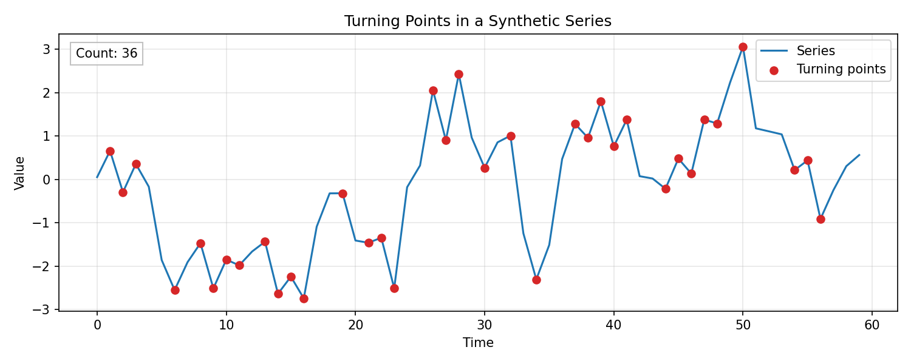
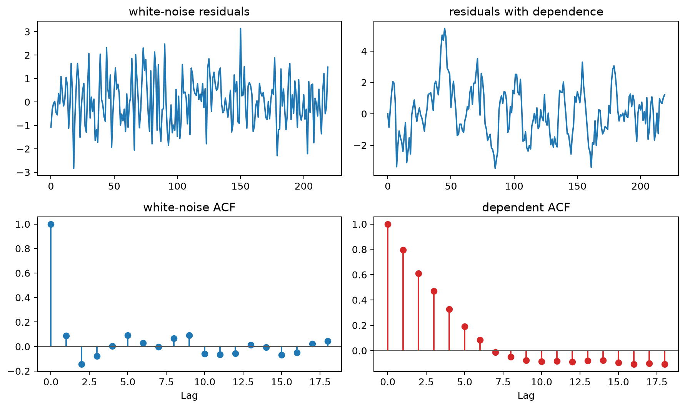

# Randomness and Trend Tests

Randomness tests look for specific kinds of structure that should not appear under a stated null model. In time-series work, they are most useful as diagnostics: one test may target linear autocorrelation, another unusual turning-point behavior, another monotone trend, and another dependence in squared residuals.

No finite set of tests can prove that a series is truly random. Their role is to identify particular departures from an assumed noise process and to be interpreted alongside plots, model assumptions, residual behavior, and out-of-sample forecasting evidence.

## Worked calculation: counting turning points

For the short sequence

$$
1,\ 3,\ 2,\ 4,\ 3,
$$

the interior observations at positions 2, 3, and 4 are turning points: the sequence goes up then down at 3, down then up at 2, and up then down at 4. Thus the count is 3. A turning-point test compares the observed count with the distribution expected under a continuous IID null; it is not a general test of every possible dependence pattern.

For a fitted model, the more important question is whether residuals still contain predictable structure. A residual ACF, a Ljung-Box test, and a plot of squared residuals address different kinds of remaining dependence and should be interpreted together.

The figure marks local peaks and troughs directly. A sequence with unusually few turning points tends to move persistently in one direction, while unusually many turning points indicate excessive alternation.

When a series looks noisy, diagnostics can still test whether particular forms of structure remain. No single procedure proves that a series is "random"; each test defines a specific null hypothesis and is sensitive to particular alternatives.

### Ljung-Box Q Test (Independence)

The **Ljung-Box** test checks whether a collection of autocorrelations is jointly zero:

$$
Q=n(n+2)\sum_{k=1}^{m}\frac{\hat r_k^2}{n-k},
$$

where $\hat r_k$ is the sample autocorrelation at lag $k$ and $m$ is the maximum lag included in the test.

For a raw IID series, the reference distribution is commonly approximated by $\chi^2_m$. When the test is applied to residuals from a fitted ARMA model, the degrees of freedom are often reduced to reflect estimated AR and MA parameters, although the exact adjustment depends on the setting and implementation.

A rejection means that at least some of the tested linear autocorrelations are inconsistent with the null. It does not identify which new model should be fitted.

### McLeod-Li Test (Squared Series)

The **McLeod-Li** test applies a Ljung-Box-type statistic to squared observations or squared residuals:

$$
Q_{\mathrm{ML}}=n(n+2)\sum_{k=1}^{m}\frac{\hat r_{k,\mathrm{sq}}^2}{n-k}.
$$

Autocorrelation in the squared series indicates dependence in the magnitude of fluctuations even when the original residuals have little linear autocorrelation. This pattern is consistent with conditional heteroskedasticity and motivates checking models such as ARCH or GARCH, but the test alone does not establish a specific variance model.

The figure places mean-dependence and variance-dependence diagnostics side by side. Residual autocorrelation points to structure left in the conditional mean, while autocorrelation in squared residuals points to time-varying conditional variance.

### Turning Point Test (IID vs. Not IID)

A **turning point** occurs at an interior time $t$ when the series changes direction:

$$
(x_{t-1}<x_t>x_{t+1})
\quad\text{or}\quad
(x_{t-1}>x_t<x_{t+1}).
$$

Let $T$ be the number of turning points in a series of length $n$. For a continuous IID sequence,

$$
E(T)=\frac{2(n-2)}{3},
\qquad
\mathrm{Var}(T)=\frac{16n-29}{90}.
$$

A standardized statistic

$$
\frac{T-E(T)}{\sqrt{\mathrm{Var}(T)}}
$$

can be compared with a normal approximation for sufficiently large $n$. Ties require a stated convention because the standard reference distribution assumes a continuous distribution.

The worked example and figure above show exactly what is being counted.

### Difference-Sign Test (Randomness)

Successive differences are

$$
d_t=x_t-x_{t-1},
\qquad t=2,\ldots,n.
$$

For nonzero differences, define

$$
s_t=\mathrm{sign}(d_t)\in\{-1,+1\}.
$$

A change of sign between adjacent differences occurs when

$$
s_t\ne s_{t-1}.
$$

With no ties, this event is exactly a turning point of the original series. Therefore the count

$$
C=\sum_{t=3}^{n}I(s_t\ne s_{t-1})
$$

has the same continuous-IID reference moments as the turning-point count:

$$
E(C)=\frac{2(n-2)}{3},
\qquad
\mathrm{Var}(C)=\frac{16n-29}{90}.
$$

The signs of successive differences are not independent under an IID level series because adjacent differences share an observation. Treating them as independent fair coin flips would give the wrong reference distribution for this particular statistic.

### Rank Test (Detecting Trend)

A rank-based trend test looks for monotone association between time and the observed values without requiring a normal marginal distribution.

If there are no ties, replace the observations by ranks $r_t$ and compute Spearman's rank correlation between time and rank:

$$
\rho_s=1-\frac{6\sum_{t=1}^{n}(r_t-t)^2}{n(n^2-1)}.
$$

Values far from zero indicate strong monotone association. Rank methods reduce sensitivity to the magnitude of extreme observations, but they do not distinguish a smooth trend from every other form of structural change. Ties require the usual rank-correlation adjustments.

Because several diagnostics are often applied to the same series, isolated p-values should not be interpreted as independent discoveries. Use the tests as targeted checks and relate them to plots, model assumptions, and forecast performance.

## Student guide: randomness is a collection of null hypotheses

There is no single test that proves a time series is random. Different diagnostics ask different questions:

- are values linearly dependent across selected lags?
- are there too many or too few turning points?
- is there a monotone trend?
- are squared residuals dependent?
- is a unit-root or stationarity null compatible with the data?

Choose the diagnostic to match the model failure that matters.

### Turning points

For

$$
1,\ 3,\ 2,\ 4,\ 3,
$$

the interior observations at positions 2, 3, and 4 are local turning points, so $T=3$. Too few turning points can indicate persistence or trend; too many can indicate alternation or negative dependence. The test does not identify the mechanism responsible for the departure.

### Runs

Convert observations to signs relative to a reference level, often the median. A run is a maximal sequence of identical signs. For

$$
++--+--,
$$

there are four runs: $++$, $--$, $+$, and $--$. Too few runs suggest clustering, while too many suggest alternation. Because the transformation discards magnitude information, use a runs test as a simple ordering diagnostic rather than a complete dependence analysis.

### Ljung-Box residual test

The Ljung-Box statistic through lag $m$ is

$$
Q(m)=n(n+2)\sum_{h=1}^{m}\frac{\hat\rho(h)^2}{n-h}.
$$

The null is that the tested autocorrelations are jointly zero. When applied to fitted-model residuals, account for parameter estimation using an appropriate degrees-of-freedom convention. A small p-value, such as $0.002$, is evidence that serial structure remains at one or more tested lags, but it does not identify the correct replacement model.

### Trend tests and breaks

A monotone trend test can be useful when a linear trend is not justified, but a smooth trend and a structural break can look similar in a short record. Plot the series, rolling summaries, and residuals around any suspected change before attributing a rejection to one particular mechanism.

### Multiple diagnostics

If ten independent tests were each run at level $0.05$, the probability of at least one false rejection would be

$$
1-(1-0.05)^{10}\approx0.401.
$$

Time-series diagnostics are usually dependent, so this is not an exact family-wise error probability for a real analysis. It simply illustrates why a collection of p-values should be interpreted as related evidence rather than as independent findings.

### A practical diagnostic sequence

1. Inspect the raw series and timestamp structure.
2. Model or remove known trend and seasonality when appropriate.
3. Inspect the residual ACF and Ljung-Box results.
4. Inspect squared residuals for variance dependence.
5. Use turning-point or runs tests as complementary ordering checks.
6. Investigate breaks, outliers, and changes in variance.
7. Validate the resulting model with temporal forecast evaluation.
