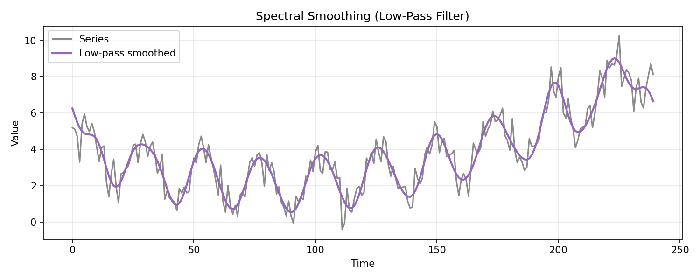
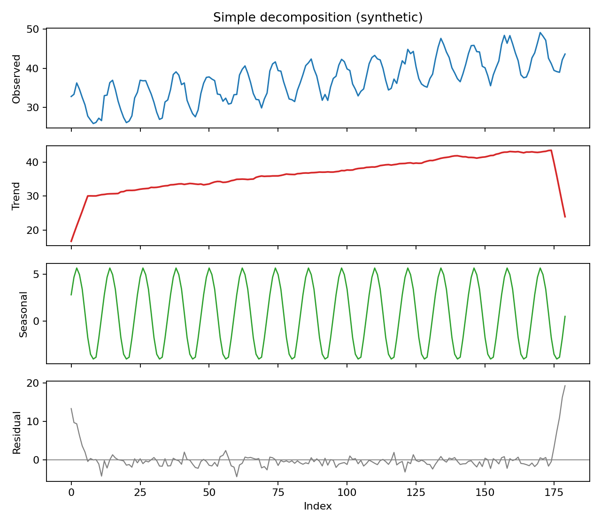
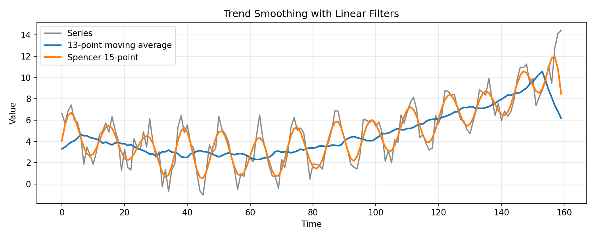
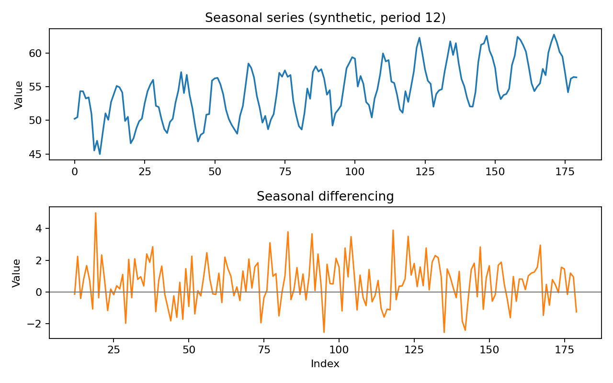

# Seasonality and Trends

Trend and seasonality are systematic forms of time structure that operate on different scales. A trend is a persistent long-run movement in level or slope, while seasonality is a pattern that repeats at a fixed and known period such as day of week, month of year, or quarter.

Decomposition, smoothing, differencing, SARIMA, and exponential-smoothing models handle these structures in different ways. The useful choice depends on whether the pattern is deterministic, evolving, stochastic, or multiplicative, and should be validated on future-like data rather than selected only because it makes a plot look cleaner.

## Worked calculation: an additive seasonal effect

Suppose a quarterly series is

$$
y_t=50+2t+s_t+\varepsilon_t,
\qquad
s_t=(-3,1,4,-2),
$$

with the seasonal pattern repeated every four observations. At $t=5$, the trend part is

$$
50+2(5)=60,
$$

and the first seasonal position contributes $-3$, so the deterministic value is 57 before the noise term.

The seasonal indices satisfy

$$
-3+1+4-2=0,
$$

which is the usual normalization for an additive decomposition. If the size of the seasonal swing grows with the level, a log transformation or multiplicative representation may be more appropriate.

The seasonal-differencing figure below shows another way to remove a repeating component: compare each observation with the same position in the previous cycle.

The figure distinguishes ordinary changes from seasonal changes. Ordinary differencing compares adjacent observations, while seasonal differencing compares observations separated by the seasonal period.

**Seasonality** and **trend** describe systematic structure at different time scales. A trend is a persistent long-run movement in the level. Seasonality is a pattern tied to a fixed and known period, such as hour of day, day of week, or month of year. Cycles can also occur, but unlike seasonality their duration is not fixed.

Random or irregular variation is what remains after the modeled systematic components have been removed. The goal is not to eliminate every fluctuation, but to represent the repeatable structure in a way that supports interpretation and forecasting.

### Seasonality

**Seasonality** is a pattern that repeats at a regular interval. Common causes include weather, holidays, work schedules, school calendars, billing cycles, and institutional deadlines.

#### Characteristics of Seasonality

- **Periodicity:** the pattern repeats at a fixed interval, such as every 24 hours, 7 days, 12 months, or 4 quarters.
- **Additive seasonality:** the seasonal effect is roughly constant in absolute size as the level changes.
- **Multiplicative seasonality:** the seasonal effect changes approximately in proportion to the level.
- **Stability:** a useful seasonal representation assumes that at least part of the pattern is repeatable, although its amplitude or shape may evolve.
- **External drivers:** holidays, weather, trading calendars, and other recurring mechanisms can create seasonal structure that may be modeled directly rather than only through lag dependence.

#### Examples of Seasonal Patterns

Electricity consumption can have daily peaks, retail activity can vary systematically by weekday, tourism can follow annual weather cycles, and administrative processes can generate recurring month- or quarter-end effects.

The figure shows repeated fluctuations around a broader level. The regular spacing of similar peaks and troughs is what distinguishes seasonality from an irregular cycle.

#### Decomposing Seasonality

A decomposition separates a series into interpretable components. In an additive decomposition,

$$
X_t=T_t+S_t+R_t,
$$

where $T_t$ is the trend, $S_t$ is the seasonal component, and $R_t$ is the remainder.

A multiplicative decomposition is often written conceptually as

$$
X_t=T_tS_tR_t.
$$

When the seasonal amplitude and residual variation grow with the level, taking logs can turn a multiplicative relationship into an additive one:

$$
\log X_t=\log T_t+\log S_t+\log R_t.
$$

The figure shows the practical distinction: additive seasonal swings remain similar in absolute size, while multiplicative swings widen as the level rises.

##### Decomposition Methods

**Moving average method.** A centered moving average spanning one seasonal period can estimate a slowly varying trend. For an odd period $d=2q+1$,

$$
\hat m_t=\frac{1}{d}\sum_{j=-q}^{q}X_{t+j}.
$$

For an even period $d=2q$, a centered average can be written with half-weighted endpoints:

$$
\hat m_t=
\frac{0.5X_{t-q}+\sum_{j=-q+1}^{q-1}X_{t+j}+0.5X_{t+q}}{d}.
$$

These are linear filters of the form

$$
\hat m_t=\sum_j a_jX_{t-j}.
$$

The weights determine which frequencies are preserved or attenuated. Centered smoothers are useful for historical decomposition, but because they use future observations relative to $t$, they are not directly available as real-time forecasting features at the sample boundary.

The Spencer 15-point moving average is one historical example of a symmetric smoother:

$$
\frac{1}{320}[-3,-6,-5,3,21,46,67,74,67,46,21,3,-5,-6,-3].
$$

It was designed to preserve low-order polynomial trends while smoothing higher-frequency variation.

**Seasonal-Trend decomposition using Loess (STL).** STL estimates trend and seasonal components using locally weighted regression. Standard STL is additive. For a series whose seasonal amplitude grows with level, a log or Box-Cox transformation is commonly applied before STL so that the transformed seasonality is closer to additive. Robust STL options can reduce the influence of outliers on the estimated components.

**Additive versus multiplicative decomposition.** Choose the representation by examining how seasonal amplitude changes with the level and by considering the data-generating mechanism. A transformation can often make an otherwise multiplicative pattern easier to model additively.

**Additional trend smoothing options.** Recursive exponential smoothers, polynomial regression, splines, and low-pass filters provide alternative trend estimates. They impose different assumptions about smoothness, boundary behavior, and real-time availability.

**Spectral smoothing.** A low-pass filter suppresses high-frequency Fourier components and retains slower variation. With a discrete transform written schematically as

$$
X(\omega)=\sum_{t=0}^{n-1}X_te^{-i2\pi\omega t},
$$

one can attenuate or remove frequencies above a chosen cutoff and transform back to the time domain.

The spectral-smoothing example shows that trend estimation can be viewed as a frequency-selection problem. The cutoff controls how much short-run variation is treated as noise rather than trend.

#### Practical Decomposition Workflow

When trend and seasonality are both present, a classical additive workflow is:

1. estimate the trend with a smoother spanning the seasonal cycle;
2. subtract the trend to expose seasonal effects;
3. estimate seasonal indices by averaging detrended values within each season;
4. normalize and remove the seasonal component;
5. inspect the remainder and, if needed, refine the trend estimate.

The decomposition figure shows the intended progression from the observed series to trend, seasonality, and remainder. A useful decomposition leaves the remainder without obvious structure that should have been assigned to the other components.

This second decomposition view emphasizes that the components should add back to the observed series under an additive model. The seasonal pattern is interpreted relative to the estimated trend rather than as an isolated plot.

##### Classical Estimation (Trend + Seasonal)

Let $d$ be the seasonal period and $\hat m_t$ a centered trend estimate. For additive seasonality, define the detrended values

$$
Y_t=X_t-\hat m_t.
$$

For seasonal position $k$, average the available detrended observations:

$$
w_k=\text{average of }\{Y_{k+jd}\},
\qquad k=1,\ldots,d.
$$

Normalize the seasonal indices so they sum to zero:

$$
\hat s_k=w_k-\frac{1}{d}\sum_{i=1}^{d}w_i.
$$

For multiplicative decomposition, ratios $X_t/\hat m_t$ can be averaged by season and normalized to have mean 1.

The filter comparison demonstrates that trend estimates depend on the smoothing rule. A smoother that reacts quickly preserves more local movement, while a broader filter produces a smoother trend but can blur turning points and worsen boundary effects.

#### Differencing as an Alternative

Differencing does not estimate a trend or seasonal component explicitly. Instead, it changes the target so that selected forms of persistence cancel algebraically.

An ordinary first difference is

$$
\nabla X_t=X_t-X_{t-1}=(1-B)X_t.
$$

A seasonal difference with period $s$ is

$$
\nabla_sX_t=X_t-X_{t-s}=(1-B^s)X_t.
$$

Combined differencing is

$$
(1-B)(1-B^s)X_t.
$$

For a deterministic polynomial trend of degree $k$, applying $k$ ordinary differences reduces it to a constant; one more difference removes that constant. In stochastic time-series modeling, however, differencing order should be chosen according to the integration structure and diagnostics rather than by mechanically increasing the order until the plot looks flat.

Higher-order differences are defined recursively:

$$
\nabla^kX_t=\nabla(\nabla^{k-1}X_t),
\qquad
\nabla^0X_t=X_t.
$$

For an additive decomposition

$$
X_t=m_t+s_t+Y_t
$$

with exactly repeating seasonal component $s_t=s_{t-s}$,

$$
\nabla_sX_t=(m_t-m_{t-s})+(Y_t-Y_{t-s}).
$$

The seasonal component cancels, while trend changes and differenced remainder remain.

The figure shows the before-and-after effect of seasonal differencing. Repeated seasonal level shifts are reduced, but the transformation can leave ordinary trend or induce additional short-run dependence.

This companion view compares differencing orders and reinforces the main caution: use the smallest combination that makes the remaining process suitable for the intended model.

### Trends

A **trend** is a systematic long-run movement in the level of a series. It can be represented deterministically, such as a linear function of time, or stochastically, such as the accumulated shocks of a random walk.

An upward or downward path in one realization does not by itself identify which mechanism is present. That distinction matters because a deterministic trend can be extrapolated and detrended, while a stochastic trend has permanently accumulating uncertainty.

The figure provides visual examples of different long-run directions. The next step is to determine whether the apparent trend is stable, deterministic, stochastic, or interrupted by breaks.

#### Identifying Trends

Visual inspection is the starting point, but a slow ACF decay can result from a deterministic trend, unit root, seasonal structure, or break. Trend tests such as Mann-Kendall can detect monotone association under their assumptions, while unit-root and stationarity tests address different null hypotheses.

Use plots, domain knowledge, transformations, repeated forecast behavior, and formal tests together rather than treating any single diagnostic as definitive.

#### Detrending Methods

Detrending changes the representation so that the remaining series can be modeled more simply. Different methods remove different structures.

##### Differencing

First-order differencing is

$$
Y_t=X_t-X_{t-1}.
$$

For a deterministic linear trend $X_t=a+bt+u_t$, differencing removes the level and leaves the constant trend increment $b$ plus differenced noise. For a random walk, first differencing removes the stochastic accumulation and recovers the innovations. These are different mechanisms even if the transformed plots look similar.

Second-order differencing is

$$
Y_t=X_t-2X_{t-1}+X_{t-2}.
$$

It removes the constant first difference of a deterministic linear trend and can reduce higher-order polynomial behavior. In stochastic models, repeated differencing can over-difference the series and introduce unnecessary negative autocorrelation, so higher orders should be justified carefully.

##### Transformation

A log transformation is

$$
Y_t=\log X_t,
$$

for positive $X_t$. It compresses large values and can stabilize variance when fluctuations scale with the level. It can also turn multiplicative growth and seasonality into additive structure. A log transform does not, by itself, remove a unit root or deterministic time trend.

##### Regression Modeling

A deterministic linear trend can be modeled as

$$
X_t=\beta_0+\beta_1t+\varepsilon_t.
$$

The detrended series is the residual around the fitted line. A quadratic trend uses

$$
X_t=\beta_0+\beta_1t+\beta_2t^2+\varepsilon_t.
$$

Higher-order polynomials can fit flexible curves but extrapolate poorly and can become unstable near the boundaries. Use the simplest trend form that matches the mechanism and validation evidence.

#### Visualization of Trends

A level plot reveals the overall movement, while a detrended plot shows what remains after the specified trend has been removed. The comparison is meaningful only when the fitted trend is introduced explicitly and the residual is interpreted relative to that model.

### Modeling Seasonality and Trends

Forecasting models incorporate trend and seasonality in different ways. The appropriate representation depends on whether the components are deterministic, evolving, stochastic, or better described through dependence at seasonal lags.

#### Seasonal ARIMA (SARIMA)

SARIMA combines ordinary and seasonal differencing with AR and MA terms:

$$
\Phi_P(B^s)\phi_p(B)(1-B^s)^D(1-B)^dX_t
=\Theta_Q(B^s)\theta_q(B)\varepsilon_t.
$$

Here $p,d,q$ describe the non-seasonal component; $P,D,Q$ describe the seasonal component; and $s$ is the seasonal period. Seasonal differencing targets repeating stochastic level structure, while seasonal AR and MA terms model dependence that remains at seasonal lags.

#### Exponential Smoothing State Space Models (ETS)

ETS models represent evolving level, trend, and seasonal states with recursive update equations. An additive observation structure can be thought of schematically as

$$
X_t=L_t+T_t+S_t+\varepsilon_t,
$$

while multiplicative variants allow the size of errors or seasonal effects to scale with the level. Exact ETS equations depend on the selected error, trend, seasonal, and damping components; the model is more than a static decomposition identity.

#### Seasonal Decomposition of Time Series (STL) Forecasting

STL decomposes a transformed or untransformed series additively as

$$
X_t=T_t+S_t+R_t.
$$

Forecasting after STL requires separate assumptions for extending the trend and seasonal components. The remainder is usually modeled or forecast around zero rather than projected as an independently persistent component by default.

The following synthetic series contains a rising trend, repeated seasonality, and random noise:

Its visible structure motivates decomposition before forecasting.

The decomposed panels separate the upward trend, repeating seasonal pattern, and remainder. The remainder should be inspected for leftover autocorrelation, changing variance, or outliers rather than assumed to be random simply because it is labeled "residual."

## Student guide: choose the seasonal representation before fitting

Seasonality can be represented through deterministic seasonal indicators, Fourier terms, seasonal differencing, seasonal AR or MA terms, a seasonal state in an exponential-smoothing or state-space model, or a seasonal-naive forecast.

These choices answer different questions. A seasonal index describes a repeating conditional mean pattern, while a seasonal AR term describes dependence after the mean structure has been accounted for.

### Additive versus multiplicative numbers

Suppose the trend level is 100. An additive seasonal effect of $+10$ gives

$$
100+10=110.
$$

A multiplicative seasonal factor of $1.10$ also gives

$$
100(1.10)=110.
$$

At level 200, however,

$$
\text{additive}=200+10=210,
\qquad
\text{multiplicative}=200(1.10)=220.
$$

If seasonal amplitude grows proportionally with level, a log transformation can make the relationship additive:

$$
\log(T_tS_t)=\log T_t+\log S_t.
$$

### Seasonal differencing

For monthly observations,

$$
\nabla_{12}y_t=y_t-y_{t-12}.
$$

If last year's January value is 92 and this year's January value is 100, the seasonal change is 8. Seasonal differencing removes an exactly repeating seasonal level, but it does not guarantee that ordinary trend, changing variance, holiday effects, or other structure has been handled.

Combined differencing is

$$
(1-B)(1-B^{12})y_t
=y_t-y_{t-1}-y_{t-12}+y_{t-13}.
$$

Each difference reduces the usable sample and can introduce moving-average dependence. Use the smallest order that leaves a defensible residual process.

### Seasonal indices

For an additive decomposition, seasonal indices are commonly normalized so that

$$
\sum_{j=1}^{s}\hat S_j=0.
$$

For a multiplicative decomposition, factors are often normalized to have mean 1:

$$
\frac{1}{s}\sum_{j=1}^{s}\hat S_j=1.
$$

These are identification conventions that determine how the overall level is divided between trend and seasonal components. Applied consistently, they do not change the reconstructed fitted series.

### Trend smoothing and boundary effects

A centered moving average uses observations on both sides of time $t$. That is appropriate for historical decomposition but unavailable at the end of a live series. A trailing smoother uses only current and past observations but has different lag and phase behavior.

Software may shorten the output, pad boundaries, reflect data, or use asymmetric filters near the ends. Inspect those choices before interpreting the first and last seasonal cycles.

### Seasonal validation

Use seasonal forecast origins and a seasonal-naive benchmark. For period-12 data, report errors at horizons such as 1, 3, 6, and 12. A model can perform well one month ahead and poorly one year ahead because the seasonal extrapolation mechanism differs by horizon.

The seasonal-naive figure provides the benchmark that any more elaborate seasonal model should beat on future-like data. Repeating the most recent value from the same season is simple, but it can be difficult to improve upon when the seasonal pattern is stable.
