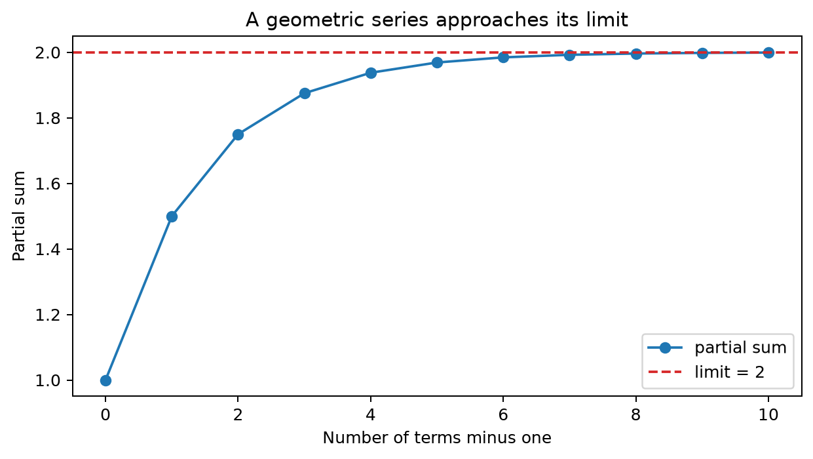

# Sequences and Series

## Worked calculation: a geometric series

Consider the terms

$$
1,\quad0.5,\quad0.5^2,\quad0.5^3,\ldots
$$

The partial sum through the fourth power is

$$
S_4=1+0.5+0.25+0.125+0.0625=1.9375.
$$

The infinite sum is

$$
\sum_{j=0}^{\infty}0.5^j=\frac{1}{1-0.5}=2.
$$

So the omitted tail after $S_4$ is

$$
2-1.9375=0.0625.
$$

This is why a stable linear time-series representation can be approximated by finitely many terms: when the weights decay geometrically, the discarded tail has a known bound.

The figure shows the partial sums approaching 2. Each added term improves the approximation, but the size of the improvement shrinks because the geometric weights decay.

### Sequences

A **sequence** is an ordered list of numbers, formally a function that maps an index such as a natural number $n$ to a value $a_n$:

$$
a_1,a_2,a_3,\dots,a_n,\dots
$$

A sequence **converges** to $a$ if its terms become arbitrarily close to $a$ as $n$ increases:

$$
\lim_{n\to\infty}a_n=a.
$$

Equivalently, for every $\epsilon>0$, there is an index $N$ such that

$$
|a_n-a|<\epsilon
$$

for all $n>N$. If no finite limit satisfies this condition, the sequence diverges.

#### Examples of Sequences

A convergent example is

$$
a_n=\frac{n}{n+2}.
$$

Its first terms are

$$
\frac13,\frac24,\frac35,\dots,
$$

and

$$
\lim_{n\to\infty}\frac{n}{n+2}=1.
$$

By contrast,

$$
a_n=4^n
$$

grows without bound, so it diverges. The sequence

$$
a_n=n+1
$$

also diverges because its terms increase indefinitely.

Another convergent example is

$$
a_n=\frac{1}{n^3},
$$

for which

$$
\lim_{n\to\infty}\frac{1}{n^3}=0.
$$

These examples concern the behavior of the individual terms. A series asks a different question: what happens when the terms are accumulated?

### Partial Sums

For a sequence $\{a_n\}$, the **partial sum** of the first $n$ terms is

$$
s_n=a_1+a_2+\dots+a_n.
$$

Thus,

$$
s_1=a_1,
\qquad
s_2=a_1+a_2,
\qquad
s_3=a_1+a_2+a_3,
$$

and so on. Infinite-series convergence is defined through the behavior of this sequence of partial sums.

### Series

A **series** is the formal sum of the terms of a sequence. If the partial sums converge to a finite limit $s$, then

$$
\sum_{k=1}^{\infty}a_k
=\lim_{n\to\infty}s_n
=s.
$$

If the partial sums do not approach a finite limit, the series diverges. Therefore, a term sequence approaching zero is necessary for series convergence but is not sufficient; the harmonic series later in the chapter is the standard counterexample.

### Geometric Series and Rational Functions

A geometric series has the form

$$
\sum_{k=0}^{\infty}r^k.
$$

When $|r|<1$,

$$
\sum_{k=0}^{\infty}r^k=\frac{1}{1-r}.
$$

Equivalently,

$$
\frac{1}{1-x}=\sum_{k=0}^{\infty}x^k,
\qquad |x|<1.
$$

This identity is especially useful in time-series analysis because inverse lag polynomials can often be expanded as geometric or power series. The convergence condition determines whether the resulting infinite-lag representation is stable.

### Examples of Convergent Series

A geometric series with ratio $1/3$ is

$$
\sum_{k=0}^{\infty}\frac{1}{3^k}
=\frac{1}{1-1/3}
=\frac32.
$$

A **p-series** is

$$
\sum_{k=1}^{\infty}\frac{1}{k^p}.
$$

It converges for $p>1$. In particular,

$$
\sum_{k=1}^{\infty}\frac{1}{k^2}=\frac{\pi^2}{6}.
$$

An alternating series changes sign from term to term. The alternating harmonic series,

$$
\sum_{k=1}^{\infty}\frac{(-1)^{k+1}}{k},
$$

converges to

$$
\ln 2.
$$

These examples illustrate different reasons for convergence: geometric decay, sufficiently fast polynomial decay, and cancellation in an alternating sequence.

### Examples of Divergent Series

A geometric series with ratio larger than 1 in magnitude diverges. For example,

$$
\sum_{k=1}^{\infty}4^k=4+16+64+\dots
$$

has partial sums that grow without bound.

An arithmetic-term series such as

$$
\sum_{k=1}^{\infty}(2k+3)=5+7+9+\dots
$$

also diverges because the terms themselves do not approach zero.

The harmonic series

$$
\sum_{k=1}^{\infty}\frac{1}{k}
=1+\frac12+\frac13+\dots
$$

is more subtle. Its terms do approach zero, but the partial sums still grow without bound. This is why checking $a_n\to0$ is only a necessary condition for convergence.

### Absolute Convergence

A series is **absolutely convergent** if

$$
\sum_{k=1}^{\infty}|a_k|
$$

converges. Absolute convergence implies ordinary convergence. The converse is not always true: the alternating harmonic series converges, but the corresponding series of absolute values is the divergent harmonic series.

Absolute summability is particularly useful for linear filters because it gives a strong form of stability and makes many rearrangements and expectation calculations straightforward.

### Convergence Tests

Different series have different structures, so no single convergence test is best in every case. The tests below give common ways to compare the tail behavior of a series with a known benchmark.

**Integral test.** Suppose $f(x)$ is positive, continuous, and decreasing for $x\ge1$, with $f(n)=a_n$. Then

$$
\sum_{n=1}^{\infty}a_n
$$

and

$$
\int_1^{\infty}f(x)\,dx
$$

converge or diverge together. For example, $\sum 1/n^2$ converges because

$$
\int_1^{\infty}\frac{1}{x^2}\,dx=1.
$$

**Comparison test.** If

$$
0\le a_n\le b_n
$$

and $\sum b_n$ converges, then $\sum a_n$ also converges. For example,

$$
\frac{1}{n^3+2}<\frac{1}{n^3},
$$

and $\sum1/n^3$ is a convergent p-series, so

$$
\sum_{n=1}^{\infty}\frac{1}{n^3+2}
$$

converges.

**Limit comparison test.** For positive-term series, if

$$
\lim_{n\to\infty}\frac{a_n}{b_n}=c,
\qquad 0<c<\infty,
$$

then $\sum a_n$ and $\sum b_n$ have the same convergence behavior. For

$$
a_n=\frac{n^2+1}{n^4+3},
\qquad
b_n=\frac{1}{n^2},
$$

we have

$$
\lim_{n\to\infty}
\frac{\frac{n^2+1}{n^4+3}}{\frac1{n^2}}
=
\lim_{n\to\infty}\frac{n^4+n^2}{n^4+3}
=1.
$$

Because $\sum1/n^2$ converges, so does the original series.

**Alternating series test.** For an alternating series

$$
\sum(-1)^na_n,
$$

if $a_n\ge0$ decreases eventually and $a_n\to0$, then the series converges. The alternating harmonic series satisfies these conditions.

**Ratio test.** Let

$$
L=\lim_{n\to\infty}\left|\frac{a_{n+1}}{a_n}\right|.
$$

If $L<1$, the series converges absolutely; if $L>1$, it diverges; if $L=1$, the test is inconclusive. For

$$
a_n=\frac{n!}{n^n},
$$

$$
\frac{a_{n+1}}{a_n}
=\left(\frac{n}{n+1}\right)^n,
$$

so

$$
L=e^{-1}<1.
$$

Therefore the series converges.

**Root test.** Let

$$
L=\limsup_{n\to\infty}|a_n|^{1/n}.
$$

If $L<1$, the series converges absolutely; if $L>1$, it diverges. For

$$
a_n=\left(\frac34\right)^n,
$$

$$
L=\frac34<1,
$$

so the geometric series converges.

### Mean-Square Convergence

For random variables, convergence can be defined through expected squared error. A sequence $X_n$ converges to $X$ in **mean square** if

$$
E[(X_n-X)^2]\to0
\quad\text{as }n\to\infty.
$$

This notion is important for stochastic processes because infinite linear representations are often interpreted as limits of finite random sums.

#### Inverting the MA(1) Model

Consider

$$
X_t=Z_t+\beta Z_{t-1},
$$

where $Z_t$ is white noise with mean zero and variance $\sigma_Z^2$. Rearranging and repeatedly substituting gives

$$
Z_t=\sum_{k=0}^{\infty}(-\beta)^kX_{t-k}.
$$

This inverse representation is stable when the geometric coefficients decay, which for MA(1) means

$$
|\beta|<1.
$$

#### Autocovariance Function of the MA(1) Process

The autocovariance function is

$$
\gamma(k)=
\begin{cases}
(1+\beta^2)\sigma_Z^2, & k=0,\\
\beta\sigma_Z^2, & |k|=1,\\
0, & |k|>1.
\end{cases}
$$

The finite covariance range reflects the finite shock duration of the MA(1): observations more than one period apart share no common innovation.

#### Series Convergence in Mean-Square Sense

Consider the partial inverse

$$
S_n=\sum_{k=0}^{n}(-\beta)^kX_{t-k}.
$$

Repeated substitution gives the exact decomposition

$$
Z_t
=S_n+(-\beta)^{n+1}Z_{t-n-1}.
$$

Therefore the truncation error is

$$
Z_t-S_n=(-\beta)^{n+1}Z_{t-n-1},
$$

and its mean square is

$$
E[(Z_t-S_n)^2]
=\beta^{2(n+1)}\sigma_Z^2.
$$

#### Condition for Convergence

Mean-square convergence requires

$$
\beta^{2(n+1)}\sigma_Z^2\to0,
$$

which occurs exactly when

$$
|\beta|<1.
$$

Thus the same condition that makes the inverse weights decay also makes the finite truncations converge to the innovation in mean square.

#### Invertibility Condition

The MA polynomial is

$$
\beta(B)=1+\beta B.
$$

Its zero is

$$
B=-\frac{1}{\beta}.
$$

Requiring that zero to lie outside the unit circle gives

$$
\left|-\frac{1}{\beta}\right|>1
\quad\Longleftrightarrow\quad
|\beta|<1.
$$

Invertibility therefore links a polynomial root condition, geometric-series convergence, and stable recovery of the innovations.

## Student guide: why convergence appears in time-series filters

Infinite series appear whenever a stable dynamic model is rewritten as a weighted history of shocks or observations. The geometric identity

$$
\sum_{j=0}^{\infty}r^j=\frac{1}{1-r},
\qquad |r|<1,
$$

is the simplest example.

With $r=0.5$,

$$
S_4=1+0.5+0.25+0.125+0.0625=1.9375,
\qquad
S_\infty=2.
$$

The omitted tail is

$$
\sum_{j=5}^{\infty}0.5^j
=\frac{0.5^5}{1-0.5}=0.0625.
$$

For a linear process

$$
X_t=\sum_{j=0}^{\infty}\psi_j\varepsilon_{t-j},
$$

square summability,

$$
\sum_{j=0}^{\infty}\psi_j^2<\infty,
$$

ensures a finite second moment when the shocks are uncorrelated with finite variance. If $\psi_j=0.5^j$, then

$$
\sum_{j=0}^{\infty}0.25^j
=\frac{1}{0.75}
=\frac43.
$$

Thus, if $\mathrm{Var}(\varepsilon_t)=\sigma^2$,

$$
\mathrm{Var}(X_t)=\frac43\sigma^2.
$$

This calculation connects numerical series convergence directly to the variance of a stochastic linear filter.

### Numerical stability

Finite computations truncate infinite representations. For a geometric series with $|r|<1$, the absolute tail after retaining terms through $m$ satisfies

$$
\left|\sum_{j=m+1}^{\infty}r^j\right|
=\frac{|r|^{m+1}}{|1-r|}
$$

for positive $r$, and is bounded by

$$
\frac{|r|^{m+1}}{1-|r|}
$$

in general.

When $r=0.99$, truncation error decays far more slowly than when $r=0.5$. This is the numerical counterpart of persistence in a near-unit-root time-series model: a formally convergent representation can still require a long history before finite approximations become accurate.
