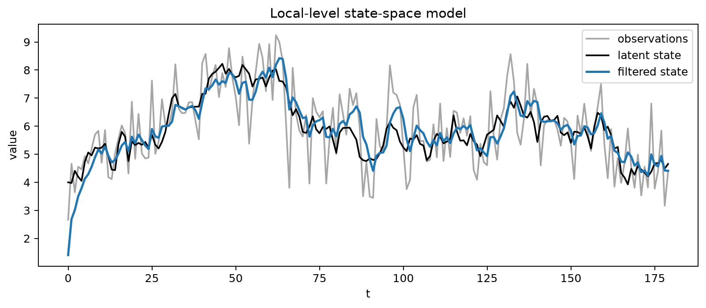
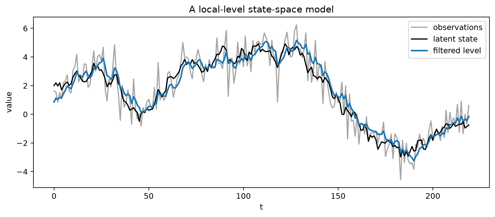
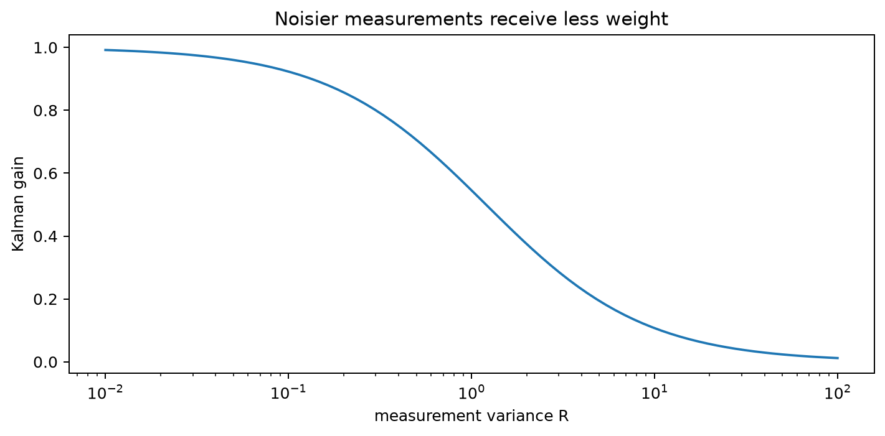
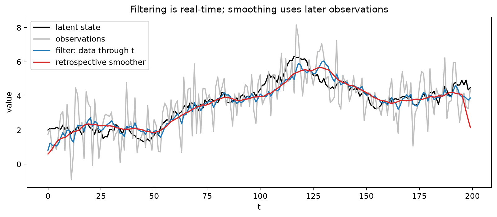
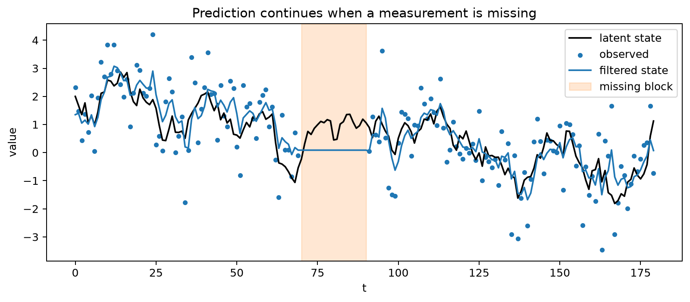

# State-Space Models and the Kalman Filter

## Worked calculation: one local-level Kalman update

Suppose the predicted level is $a_{t|t-1}=10$, its predicted variance is $P_{t|t-1}=1.25$, and the observation is $y_t=12$ with measurement variance $R=1$. The innovation is

$$
v_t=12-10=2,
\qquad
F_t=1.25+1=2.25.
$$

The Kalman gain is

$$
K_t=\frac{1.25}{2.25}=0.5556.
$$

The updated estimate and variance are

$$
a_{t|t}=10+0.5556(2)=11.1112,
\qquad
P_{t|t}=(1-0.5556)(1.25)\approx0.5555.
$$

The estimate moves partway toward the observation because both the prior state estimate and the measurement are uncertain. A larger measurement variance would reduce the gain and make the filter rely more heavily on the prior prediction.

The figure shows the role of the latent state: the observed series is noisy, while the filter updates an estimate of the underlying level as each new observation arrives.

State-space models distinguish an unobserved **state** from noisy observations. They provide a common framework for latent trends, seasonal components, regression effects, missing observations, and other dynamic structures.

A linear Gaussian state-space model can be written as

$$
\alpha_t=T_t\alpha_{t-1}+R_t\eta_t,
$$

$$
y_t=Z_t\alpha_t+d_t+\varepsilon_t.
$$

The first equation describes how the latent state evolves. The second describes how that state produces the observation. The matrices can vary with time, although many familiar models use constant matrices.

## Local-Level Model

A simple state-space model is

$$
\mu_t=\mu_{t-1}+\eta_t,
\qquad
y_t=\mu_t+\varepsilon_t.
$$

The latent level $\mu_t$ follows a random walk, while the observed value contains additional measurement noise. Separating these two sources of variation lets the model distinguish movement in the underlying signal from noise in the observation.

The local-level figure shows the observed series together with the filtered latent level. The filter follows sustained changes in the signal while avoiding a full reaction to every noisy observation.

## Kalman Filter

For the scalar local-level model, the prediction step is

$$
a_{t|t-1}=a_{t-1|t-1},
\qquad
P_{t|t-1}=P_{t-1|t-1}+Q,
$$

where $Q$ is the state-innovation variance.

The observation produces the innovation

$$
v_t=y_t-a_{t|t-1},
$$

with innovation variance

$$
F_t=P_{t|t-1}+R,
$$

where $R$ is the measurement-error variance in this scalar notation. The Kalman gain is

$$
K_t=\frac{P_{t|t-1}}{F_t},
$$

and the update is

$$
a_{t|t}=a_{t|t-1}+K_tv_t,
\qquad
P_{t|t}=(1-K_t)P_{t|t-1}.
$$

The gain figure makes the weighting rule explicit: precise measurements receive more weight, while noisy measurements move the state estimate less.

**Filtering** estimates the current state using observations available through the current time. **Forecasting** propagates that filtered state into the future. **Smoothing** revises historical states using later observations as well, so a smoothed state is a retrospective estimate rather than a real-time forecast.

The figure shows why the distinction matters. The smoothed path can use future observations to revise a past state and will often appear cleaner than the real-time filtered path. Using it to evaluate a real-time procedure would leak future information.

When an observation is missing, the state can still be propagated through the transition equation without a measurement update. Many ARIMA and exponential-smoothing models also admit state-space representations, allowing likelihood estimation, missing-data handling, filtering, smoothing, and forecasting to be treated within one framework.

## Student guide: prediction, update, and uncertainty

State-space notation separates the quantities that are observed from the dynamic process being inferred. This is especially useful when the signal is noisy, data are missing, or the dynamics are more naturally expressed through latent levels, slopes, seasonal states, or time-varying coefficients.

### General linear Gaussian form

Write

$$
\alpha_t=T_t\alpha_{t-1}+R_t\eta_t,
\qquad
y_t=Z_t\alpha_t+d_t+\varepsilon_t,
$$

with

$$
\eta_t\sim N(0,Q_t),
\qquad
\varepsilon_t\sim N(0,H_t).
$$

Here $R_t$ is a loading matrix for state disturbances, while $H_t$ is the observation-noise covariance. This general notation should not be confused with the scalar symbol $R$ used above for a measurement variance.

The state $\alpha_t$ can contain several quantities. For a local linear trend, for example,

$$
\alpha_t=
\begin{bmatrix}
\ell_t\\
b_t
\end{bmatrix}
$$

can store level and slope. A seasonal model can store a vector of seasonal states, and a dynamic regression can include time-varying coefficients or an ARMA error state.

### The scalar local-level update

For

$$
\mu_t=\mu_{t-1}+\eta_t,
\qquad
y_t=\mu_t+\varepsilon_t,
$$

suppose $a_{t|t-1}=10$, $P_{t|t-1}=1.25$, $y_t=12$, and $R=1$. Then

$$
v_t=y_t-a_{t|t-1}=2,
$$

$$
F_t=P_{t|t-1}+R=2.25,
$$

and

$$
K_t=\frac{1.25}{2.25}=0.5556.
$$

The state update is

$$
a_{t|t}=10+0.5556(2)=11.1112,
$$

while the posterior variance is

$$
P_{t|t}=(1-0.5556)(1.25)\approx0.5555.
$$

The innovation is the part of the observation that was not predicted. The gain determines how strongly that new information changes the state estimate.

### How the variance ratio changes the gain

For the scalar local-level update,

$$
K_t=\frac{P_{t|t-1}}{P_{t|t-1}+R}.
$$

If $R$ is small, the measurement is precise and $K_t$ approaches 1. If $R$ is large, the measurement is noisy and $K_t$ approaches 0. A larger process variance $Q$ increases future prediction uncertainty $P_{t|t-1}$ and therefore tends to make the filter react more strongly to new observations.

For a prior level of 10 and an observation of 12:

| $P_{t|t-1}$ | $R$ | gain | updated level |
|---:|---:|---:|---:|
| 1.25 | 1 | 0.556 | 11.111 |
| 1.25 | 4 | 0.238 | 10.476 |
| 4 | 1 | 0.800 | 11.600 |

The update is therefore a variance-weighted compromise between the model prediction and the new measurement.

### Filtering, smoothing, and forecasting

Filtering targets

$$
p(\alpha_t\mid y_1,\ldots,y_t).
$$

It is a real-time estimate because it uses only information available through time $t$.

Smoothing targets

$$
p(\alpha_t\mid y_1,\ldots,y_T),
\qquad T>t.
$$

It uses later observations to revise a past state. This is useful for historical decomposition and signal extraction, but it is not available in real time.

Forecasting propagates the filtered state forward. In a time-varying system,

$$
a_{t+h|t}=T_{t+h}\cdots T_{t+1}a_{t|t}.
$$

Forecast uncertainty accumulates state disturbances and, for future observations, measurement uncertainty. A performance evaluation that uses smoothed states at past forecast origins has used future information unless that retrospective procedure is explicitly the target.

### Missing observations

If $y_t$ is missing, there is no measurement innovation to use, so the update is skipped:

$$
a_{t|t}=a_{t|t-1},
\qquad
P_{t|t}=P_{t|t-1}.
$$

The next transition still proceeds:

$$
a_{t+1|t}=T_{t+1}a_{t|t},
$$

$$
P_{t+1|t}=T_{t+1}P_{t|t}T_{t+1}^{\top}
+R_{t+1}Q_{t+1}R_{t+1}^{\top}.
$$

The figure shows that the filter does not fabricate missing measurements. It propagates the state using the transition model, while uncertainty grows until new observations provide another update.

### Innovations and likelihood

Under Gaussian disturbances, the one-step innovation $v_t$ has variance $F_t$. In the scalar case, its log-likelihood contribution is

$$
\ell_t
=-\frac12\left[
\log(2\pi)+\log(F_t)+\frac{v_t^2}{F_t}
\right].
$$

Summing these contributions over time gives a likelihood that can be optimized over unknown variances, transition parameters, and regression coefficients.

Standardized innovations

$$
\tilde v_t=\frac{v_t}{\sqrt{F_t}}
$$

provide a natural diagnostic. Under an adequate model, they should have approximately constant variance and little serial dependence.

### Relation to familiar models

Many familiar time-series models have state-space forms:

- a local level is closely related to simple exponential smoothing;
- a local level plus slope is related to Holt-style trend smoothing;
- ARIMA models can be represented with a finite-dimensional state;
- seasonal behavior can be encoded through seasonal states;
- missing observations can be handled without discarding the surrounding series.

Equivalent model labels do not guarantee numerically identical results. Initialization, parameter estimation, deterministic terms, and likelihood conventions can all affect fitted states and forecasts.

### Diagnostics and limitations

After fitting, inspect standardized innovations, their ACF, squared innovations, outliers, missingness patterns, parameter stability, and temporal forecast errors.

A Gaussian state-space model can produce a smooth-looking latent path even when the data contain heavy tails, nonlinear dynamics, or structural breaks. A smoother improves the estimate under the assumed model; it does not repair a misspecified model.

### Visual companions

The local-level, Kalman-gain, missing-observation, and filtering-versus-smoothing figures are integrated with the corresponding explanations above. Together they show the full state-space cycle: predict a latent state, update it with a noisy observation when available, propagate uncertainty, and distinguish real-time filtering from retrospective smoothing.

The related frequency-domain material is covered in the [frequency-domain chapter](frequency_domain_analysis.md), and the [state-space/frequency notebook](../../notebooks/time_series/state_space_and_frequency.ipynb) provides an additional worked environment.
