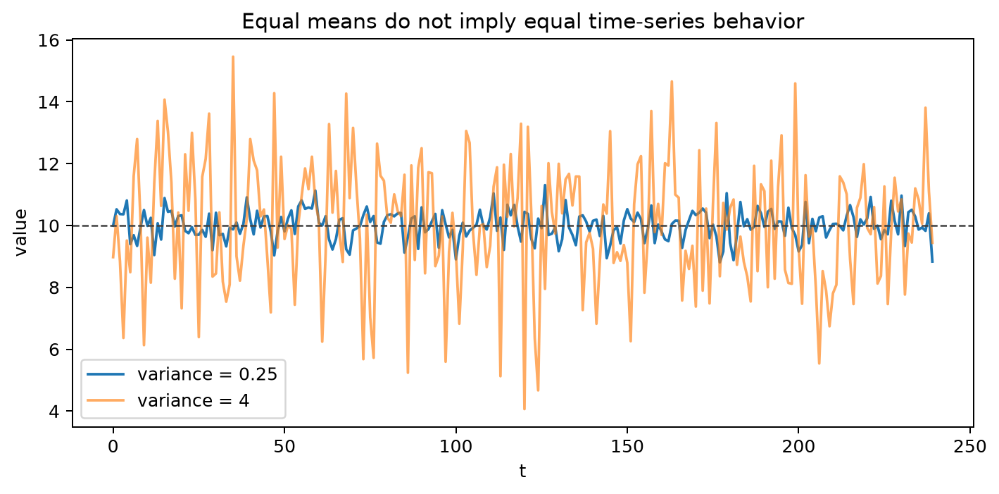
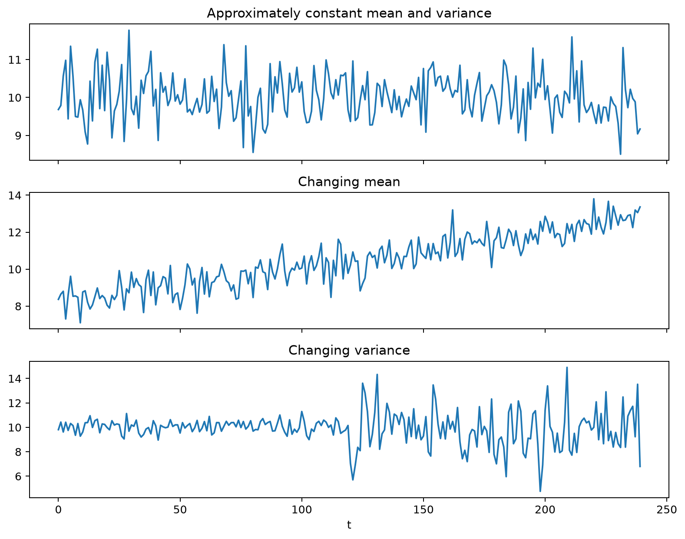

# Statistical Moments and Time Series

## Worked calculation: mean, variance, and lag covariance

For the four observations

$$
2,\quad 4,\quad 4,\quad 6,
$$

the sample mean is

$$
\bar x=\frac{2+4+4+6}{4}=4.
$$

The population-style variance is

$$
\frac{(-2)^2+0^2+0^2+2^2}{4}=2,
$$

while the unbiased sample variance divides by $4-1$ and is $8/3\approx2.667$. The distinction matters when estimating a population moment from a short series.

For lag 1, the paired centered products are

$$
(-2)(0)+(0)(0)+(0)(2)=0.
$$

Thus this tiny sample has lag-1 covariance zero, even though zero sample covariance does not prove independence. With a time series, moments are indexed by the lag as well as by the variable, so a changing mean or variance can make one overall summary misleading.

Understanding the behavior of time series data is crucial across various fields such as finance, economics, and engineering. Statistical moments, especially the mean and standard deviation, are essential tools in summarizing and analyzing time series data. This section explores how these statistical moments help characterize time series, provides examples, and highlights the differences between time series data and independent random observations.

### Introduction to Statistical Moments in Time Series

Statistical moments are used to summarize and describe the key characteristics of random variables. When applied to time series data, these moments can change over time, revealing important insights about the dynamics of the process.

* Using the *mean* (First Moment) as a summary measure provides a clear reference point for the central location of the data, whereas neglecting it can make comparisons across datasets inconsistent; for example, knowing the average daily temperature helps compare climates between two cities.
* Calculating the *standard deviation* (Second Moment) reveals how much individual data points deviate from the mean, while omitting it can hide the true variability of the dataset; for instance, two factories might have the same average production output, but one could have far greater fluctuations in daily output than the other.

While these two moments are fundamental, time series data often exhibit more complex behaviors, where both the mean and/or variance change over time. This makes the analysis of time series more intricate compared to simple datasets.

### Examples of Time Series with Varying Statistical Moments

To better understand how statistical moments evolve over time, let's examine two specific cases: one where the mean changes, and another where the standard deviation varies.

#### Time Series with a Varying Mean

* In this example, the **mean** of the time series steadily increases over time.
* The **standard deviation** remains relatively constant, with data points oscillating around the increasing mean.
* This scenario is commonly seen in situations where there is an upward trend, such as in economic growth, where the central value (average) increases but the variability of the data stays stable.

#### Time Series with a Varying Standard Deviation

**Figure 2: Time Series Exhibiting a Varying Standard Deviation**

* Here, the **mean** stays constant over the time series.
* However, the **standard deviation** fluctuates significantly, indicating that the variability or dispersion of the data changes over time.
* This pattern is typical in volatile environments, such as financial markets, where periods of high volatility alternate with times of stability.

### Time Series vs. Independent Random Variables

A key distinction arises when comparing time series data to a collection of independent random observations. The question is:

**How does a time series differ from a set of independent random observations of a variable that has a known mean and standard deviation?**

To explore this difference, consider the following visualization.

* The top subplot shows a time series plotted over time.
* The bottom subplot displays a normal distribution that fits the discrete data points from the time series, overlaid with a continuous best-fit distribution.
* While the data points of the time series can be described using a statistical distribution like the normal distribution, there's an important distinction in their behavior.
* In a time series, each data point $x(t)$ is not independent; it depends on the previous value $x(t-1)$. This relationship introduces autocorrelation, meaning the data points are correlated with each other over time.
* If you randomly sample from the fitted distribution, it will not replicate the behavior of the time series. This is because the autocorrelation, or the dependency between consecutive points, cannot be captured by independent random sampling.

### Implications for Modeling and Analysis

Recognizing the dependence structure in time series data is critical for accurate modeling and forecasting. Traditional statistical techniques, which assume that data points are independent, may fail to identify important patterns in time series data, leading to incorrect or misleading results.

* When past values are used to predict the next value, an *autoregressive model* can identify recurring patterns and trends, whereas omitting this approach may cause forecasts to ignore momentum in the data; for example, predicting stock prices without past price information often yields less accurate short-term projections.
* If predictions are instead based on past errors rather than past values, a *moving average model* can help smooth random fluctuations, while skipping it can lead to forecasts being overly sensitive to sudden noise; for instance, weather temperature forecasts can be improved by smoothing daily measurement errors.
* By integrating both past values and past errors, a *hybrid ARMA model* can capture relationships that neither component alone could model effectively, whereas avoiding this combination might miss interactions between trends and noise; for example, sales forecasts often improve when both seasonal patterns and past prediction inaccuracies are considered.

## Student guide: moments have a time index

For a cross-sectional sample, one mean and one variance may summarize the marginal distribution. For a time series, the relevant quantities include:

$$
\mu_t=E(X_t),
\qquad
\gamma_t(0)=\operatorname{Var}(X_t),
\qquad
\gamma_t(h)=\operatorname{Cov}(X_t,X_{t-h}).
$$

Under weak stationarity, $\mu_t$ and $\gamma_t(0)$ do not depend on $t$, and $\gamma_t(h)$ depends only on the lag $h$. A changing mean or variance makes a single overall summary potentially misleading.

### Numerical moment calculation

For $(2,4,4,6)$:

$$
\bar x=4,
\qquad
\hat\sigma_n^2=\frac{(-2)^2+0^2+0^2+2^2}{4}=2.
$$

The unbiased sample variance is

$$
s^2=\frac{8}{3}\approx2.667.
$$

At lag 1, the centered products are $0$, $0$, and $0$ for this ordering, so the lag-1 sample covariance is zero. This small example shows why a single zero covariance is weak evidence about the process.

For the sequence $(1,2,4,3)$, the centered values are $(-1.5,-0.5,1.5,0.5)$ and the lag-1 covariance using denominator $n$ is $0.1875$. The order of observations matters even when the multiset of values is unchanged.

### Cross-moments and dependence

For two series $X_t$ and $Y_t$, the lagged cross-covariance is

$$
\gamma_{XY}(h)=\operatorname{Cov}(X_t,Y_{t-h}).
$$

It can reveal lead-lag relationships, but it is sensitive to trend, scale, and common seasonal effects. Detrend or difference only when the question supports it, and interpret a cross-correlation peak in the context of predictor availability.

### Rolling moments

A rolling mean and variance are descriptive:

$$
\hat\mu_t^{(w)}=\frac1w\sum_{j=0}^{w-1}x_{t-j},
\qquad
\hat v_t^{(w)}
=\frac1{w-1}\sum_{j=0}^{w-1}(x_{t-j}-\hat\mu_t^{(w)})^2.
$$

They trade temporal resolution against sampling noise. Use the same window only for a clearly defined comparison; changing $w$ can make a trend appear or disappear.

### Moments do not identify a distribution

Two series can have the same mean and variance but different tails, skewness, autocorrelation, conditional variance, and structural breaks. Conversely, a time series can have a stable marginal histogram while its dependence changes. Plot moments over time and inspect dependence separately.

### Visual companion

Run [foundations_visualizations.py](../../scripts/time_series/foundations_visualizations.py):

