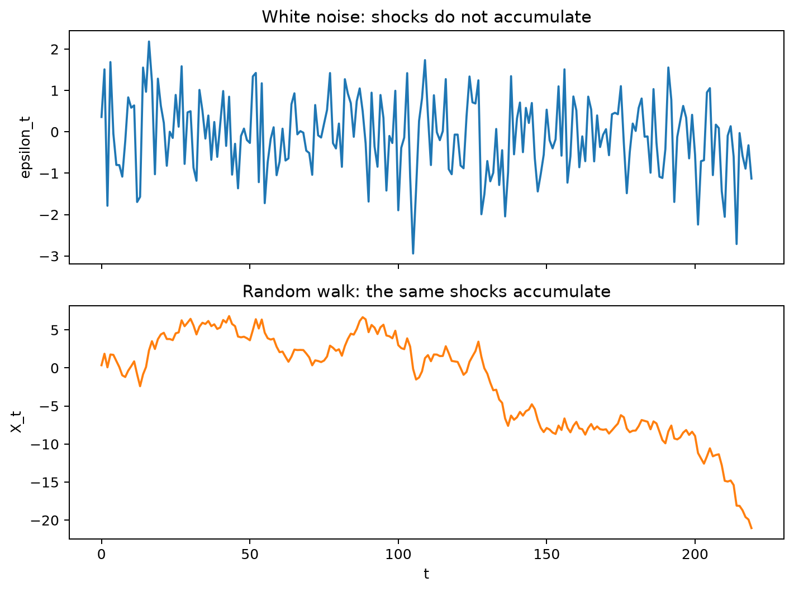

# Stochastic Processes and White Noise

## Worked calculation: shocks versus accumulated shocks

Let $\varepsilon_t$ be independent with mean 0 and variance 1. It is white noise because

$$
\operatorname{Cov}(\varepsilon_t,\varepsilon_{t-h})=0\quad(h\ne0).
$$

Now define a random walk by $X_t=X_{t-1}+\varepsilon_t$ with fixed $X_0$. After 100 steps,

$$
X_{100}=X_0+\sum_{j=1}^{100}\varepsilon_j,
\qquad
\operatorname{Var}(X_{100})=100.
$$

The individual shocks have constant variance, but their accumulated sum does not. This is the simplest calculation showing why white-noise increments do not make the random walk stationary.

The figure uses one fixed random seed and is generated by [time_series_student_visualizations.py](../../scripts/time_series/time_series_student_visualizations.py).

A time series is one observed path from an underlying **stochastic process**: a family of random variables indexed by time,

$$
\{X_t : t \in T\}.
$$

For a fixed time $t$, $X_t$ is a random variable. After observation, its realized value is written $x_t$. The sequence $x_1,\ldots,x_n$ is one **sample path** or realization of the process.

## Innovations

Many time-series models are written as a predictable component plus a new shock:

$$
X_t = m_t + \varepsilon_t.
$$

The term $m_t$ summarizes information available before time $t$, while $\varepsilon_t$ is the new information arriving at time $t$. In ARMA-type models these shocks are often called **innovations**.

## Student guide: random variables, paths, and innovations

The notation $X_t$ and $x_t$ keeps two ideas separate:

- $X_t$ is a random variable before the observation is made;
- $x_t$ is the realized value in one sample path.

A stochastic process is a collection of random variables indexed by time. A dataset gives one path, not every possible path. The model describes a distribution over paths and uses the observed path to infer the mechanism and future uncertainty.

### Filtrations and predictable information

Let $\mathcal F_t$ contain the observations and predictors available through time $t$. A one-step innovation is the unpredictable part of the next observation:

$$
\varepsilon_{t+1}=X_{t+1}-E(X_{t+1}\mid\mathcal F_t).
$$

It has conditional mean zero:

$$
E(\varepsilon_{t+1}\mid\mathcal F_t)=0.
$$

This is stronger and more targeted than merely checking an unconditional sample autocorrelation. A process can have zero linear autocorrelation while its conditional variance depends on the past.

### White noise conditions

Weak white noise requires

$$
E(\varepsilon_t)=0,\qquad
\operatorname{Var}(\varepsilon_t)=\sigma^2,\qquad
\gamma(h)=0\quad(h\ne0).
$$

There are several meanings in practice:

| term | additional property |
|---|---|
| weak white noise | constant mean/variance and zero autocovariances |
| independent white noise | observations independent across time |
| Gaussian white noise | usually independent normal observations |
| martingale difference | conditional mean zero given the past |

Do not replace one definition with another without stating the assumption.

### A dependence counterexample

Let $Z_t$ be independent and symmetric around zero, and define

$$
X_t=Z_tZ_{t-1}.
$$

For many symmetric choices, $X_t$ has zero linear correlation with $X_{t-1}$ while the products share $Z_t$ and can remain nonlinearly dependent. This illustrates why an ACF close to zero does not prove independence.

### White noise and random walk

If $\varepsilon_t$ has variance $\sigma^2$ and

$$
X_t=X_0+\sum_{j=1}^{t}\varepsilon_j,
$$

then

$$
\operatorname{Var}(X_t\mid X_0)=t\sigma^2.
$$

With $\sigma^2=4$, the conditional variance after 25 steps is $100$. The increments remain white noise, but the level becomes more uncertain with time.

### Residual use

White-noise residuals are a target for the conditional mean model. If residuals retain autocorrelation, a predictable mean component remains. If residual squares retain autocorrelation, a variance model may be needed. If residuals have heavy tails, Gaussian intervals may be too narrow.

White-noise diagnostics are evidence, not proof. A finite sample can look white by chance, and a test has limited power against nonlinear or time-varying alternatives.

## White Noise

A weak white-noise process $\{\varepsilon_t\}$ satisfies

$$
E[\varepsilon_t] = 0,
\qquad
\operatorname{Var}(\varepsilon_t)=\sigma^2,
\qquad
\operatorname{Cov}(\varepsilon_t,\varepsilon_{t-h})=0 \quad (h\ne 0).
$$

Weak white noise has zero mean, constant variance, and no linear serial correlation. It is not automatically independent: uncorrelated random variables can still be dependent. **Independent white noise** adds independence across time; **Gaussian white noise** usually means independent normal innovations with constant variance.

A fitted time-series model should explain the systematic temporal structure in the data, so its residuals should resemble white noise. White-noise residuals do not prove that a model is correct: variance changes, heavy tails, structural breaks, or nonlinear dependence can still remain.

## White Noise vs Random Walk

White noise is stationary, while a random walk accumulates white-noise shocks:

$$
X_t = X_{t-1} + \varepsilon_t
= X_0 + \sum_{j=1}^{t}\varepsilon_j.
$$

Its variance grows with time, so the random walk is not weakly stationary even though its increments are white noise.

## Martingale Differences

If $\mathcal{F}_{t-1}$ represents information available before time $t$, a martingale difference satisfies

$$
E[\varepsilon_t \mid \mathcal{F}_{t-1}] = 0.
$$

This rules out predictable conditional-mean structure, while weak white noise only rules out linear autocorrelation.

The companion script [`white_noise.py`](../../scripts/time_series/white_noise.py) demonstrates white-noise behavior. Continue with [stationarity](stationarity.md), [autocovariance](autocovariance_function.md), and [autocorrelation](autocorrelation_function.md).
