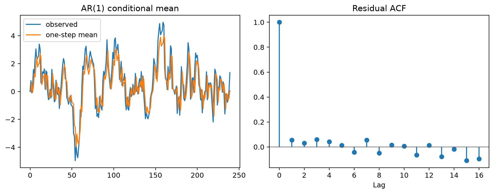
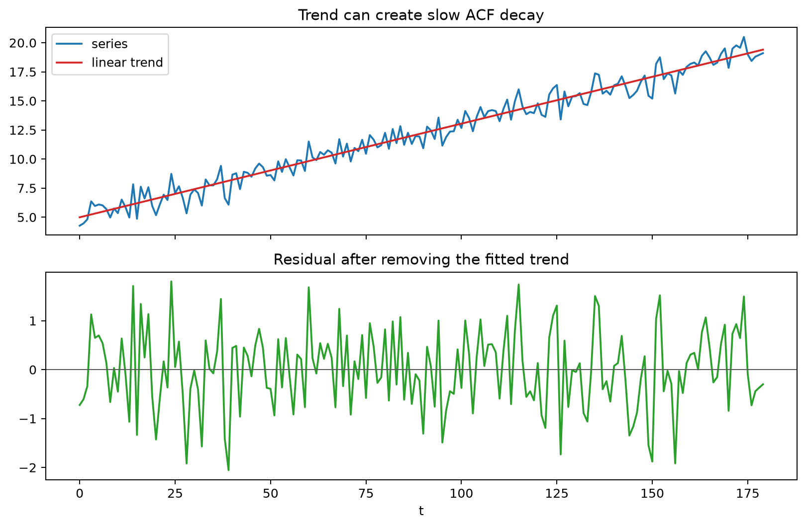
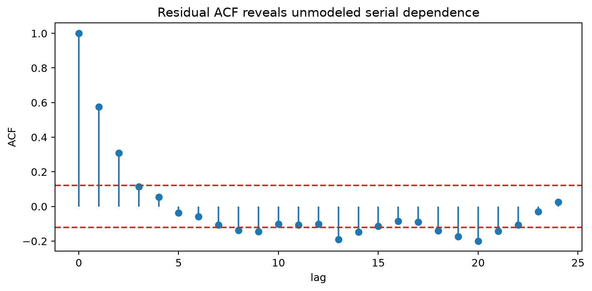
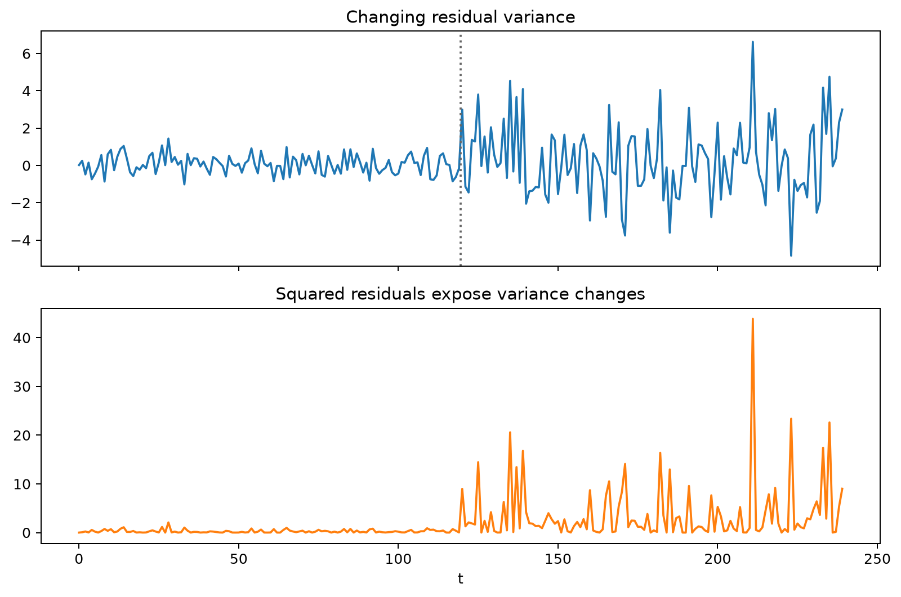
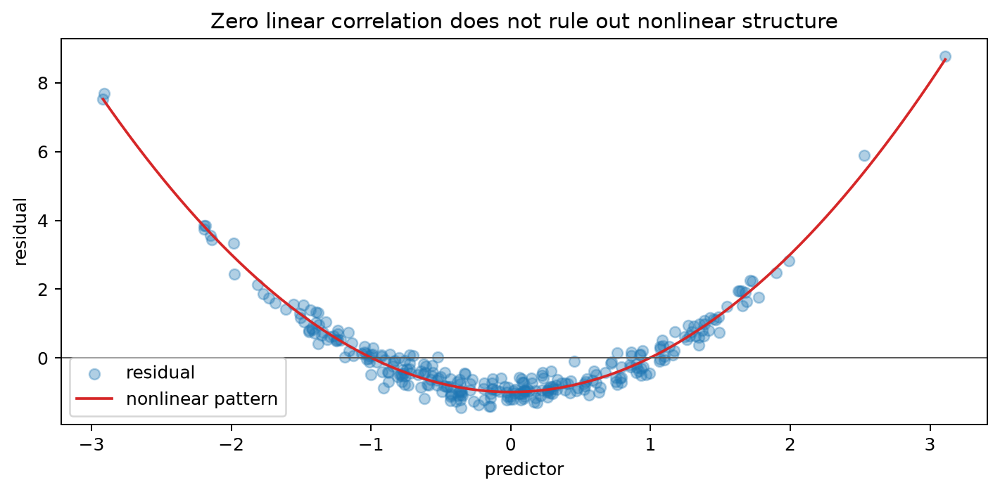
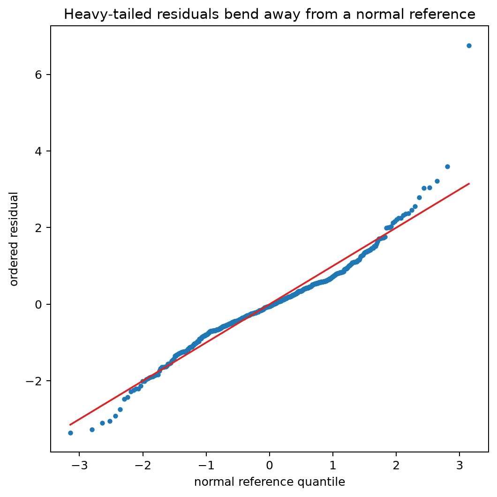
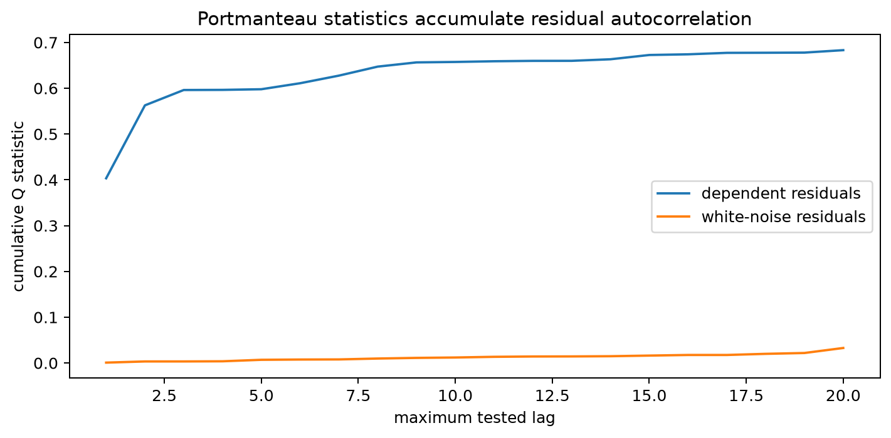
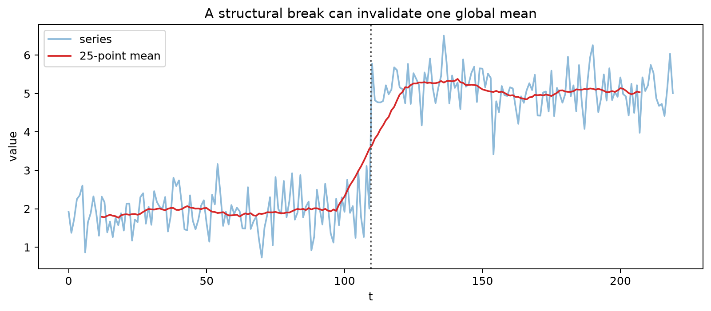
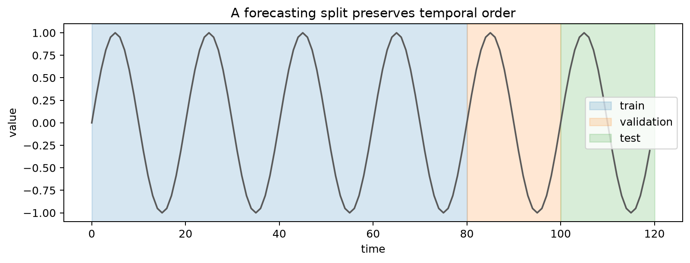

# Time Series Modeling

## Worked calculation: fit, complexity, and diagnostics

Suppose two likelihood-based candidates have the following summaries:

| Model | log-likelihood | number of parameters |
|---|---:|---:|
| A | $-100$ | 3 |
| B | $-96$ | 6 |

Using $\operatorname{AIC}=-2\ell+2k$, their AIC values are

$$
\operatorname{AIC}_A=200+6=206,
\qquad
\operatorname{AIC}_B=192+12=204.
$$

Model B wins this narrow in-sample comparison, but it should not be accepted automatically. If B leaves a residual lag-12 spike while A has approximately white-noise residuals, A may be the more useful forecasting model. Compare candidates on the same observations, inspect residuals, and use temporal backtesting before treating a small information-criterion difference as meaningful.

Time series modeling combines model specification, parameter estimation, model selection, and diagnostics. The aim is not simply to minimize in-sample error, but to find a parsimonious model whose residuals behave approximately like white noise and whose forecasts generalize to future observations.

### Model Fitting

For autoregressive models, ordinary or conditional least squares can often be used because the lagged observations are observed. For MA and ARMA models, the innovations are unobserved, so estimation is typically performed with maximum likelihood or related numerical methods.

### Worked Example: Fitting an AR(2) Model

Consider the AR(2) model

$$
Y_t = \beta_0 + \beta_1 Y_{t-1} + \beta_2 Y_{t-2} + \varepsilon_t.
$$

To keep the example identifiable, use a short synthetic series that does not make the lag columns perfectly collinear:

| $t$ | $Y_t$ |
|---:|---:|
| 1 | 1.0 |
| 2 | 2.0 |
| 3 | 1.5 |
| 4 | 3.0 |
| 5 | 2.5 |
| 6 | 4.0 |

Using observations $t=3,\dots,6$ gives

$$
\mathbf y =
\begin{bmatrix}
1.5\\
3.0\\
2.5\\
4.0
\end{bmatrix},
\qquad
\mathbf X =
\begin{bmatrix}
1 & 2.0 & 1.0\\
1 & 1.5 & 2.0\\
1 & 3.0 & 1.5\\
1 & 2.5 & 3.0
\end{bmatrix}.
$$

The least-squares estimator is

$$
\hat{\boldsymbol\beta}
=
(\mathbf X^\top\mathbf X)^{-1}\mathbf X^\top\mathbf y,
$$

provided $\mathbf X$ has full column rank. For this dataset,

$$
\mathbf X^\top\mathbf X
=
\begin{bmatrix}
4 & 9 & 7.5\\
9 & 21.5 & 17\\
7.5 & 17 & 16.25
\end{bmatrix},
$$

and

$$
\mathbf X^\top\mathbf y
=
\begin{bmatrix}
11\\
25\\
23.25
\end{bmatrix}.
$$

Solving the normal equations gives approximately

$$
\hat\beta_0 = 0.328,\qquad
\hat\beta_1 = 0.080,\qquad
\hat\beta_2 = 1.195.
$$

so the fitted conditional-mean equation is approximately

$$
\hat Y_t = 0.328 + 0.080Y_{t-1} + 1.195Y_{t-2}.
$$

This small example is only meant to demonstrate the mechanics of regression-style estimation for an AR model. In real time-series work, the next steps matter as much as the coefficient calculation: check stationarity assumptions, inspect residual autocorrelation, compare plausible model orders, and evaluate forecasts out of sample.

### Why the Previous Toy Dataset Was Problematic

If the observations increase by a constant amount, adjacent lag columns can become linearly dependent once an intercept is included. In that case $\mathbf X^\top\mathbf X$ is singular, so the inverse in the ordinary least-squares formula does not exist and the coefficients are not uniquely identified. Always check that the design matrix has full column rank before presenting an inverse-based calculation.

### Fitting MA and ARMA Models

An MA(2) model has the form

$$
Y_t = \mu + \varepsilon_t + \theta_1\varepsilon_{t-1}+\theta_2\varepsilon_{t-2}.
$$

Unlike the AR case, the lagged innovations are not observed. Treating them as if they were ordinary regressors is therefore not valid. Practical estimation generally uses maximum likelihood, innovations algorithms, or state-space methods implemented by statistical software. Methods such as Hannan-Rissanen can also provide useful starting estimates for ARMA models.

### Comparison of Common Models

| Model | Main idea | Typical use | Important assumptions / cautions |
|---|---|---|---|
| **AR($p$)** | Current value depends on past values | Short-memory stationary dependence | Usually modeled as stationary after any required transformation/differencing |
| **MA($q$)** | Current value depends on current/past innovations | Short-lived shock effects | Innovations are unobserved; invertibility is important for identification |
| **ARMA($p,q$)** | Combines AR and MA terms | Stationary linear series | Requires parsimonious order selection and residual diagnostics |
| **ARIMA($p,d,q$)** | ARMA after differencing | Integrated/non-stationary series | Avoid unnecessary differencing; diagnose the differenced model |
| **SARIMA** | ARIMA plus seasonal AR/MA/differencing | Regular seasonal structure | Seasonal period and seasonal differencing must be chosen carefully |
| **SES / Holt / Holt-Winters / ETS** | Recursive level/trend/seasonal smoothing | Forecasting level, trend, and seasonal patterns | Different ETS structures imply different error/trend/seasonal behavior |
| **VAR** | Several series depend on their joint lags | Multivariate linear dynamics | Stationarity/cointegration and lag-order choices matter; predictive precedence is not automatically causal |
| **ARCH/GARCH** | Conditional variance evolves over time | Volatility clustering | Models the variance dynamics, often after specifying a conditional mean model |

### A Practical Identification and Validation Workflow

1. **Explore the series.** Plot the data and identify trend, seasonality, outliers, missing values, structural breaks, and changing variance.
2. **Assess stationarity.** Use plots, ACF behavior, and tests such as ADF/KPSS as supporting evidence rather than relying on a single test.
3. **Transform when needed.** Apply variance-stabilizing transformations, detrending, ordinary differencing, or seasonal differencing when justified.
4. **Propose candidate orders.** Use ACF/PACF patterns together with domain knowledge; do not treat cutoff heuristics as infallible rules.
5. **Estimate parameters.** Use an estimation method appropriate to the model class.
6. **Compare parsimonious candidates.** AIC, AICc, and BIC are useful for comparing likelihood-based models fit to the same response data.
7. **Diagnose residuals.** Inspect residual plots and residual ACF/PACF and use tests such as Ljung-Box. Remaining serial dependence indicates model inadequacy.
8. **Evaluate forecasts temporally.** Preserve time order with a holdout period, expanding-window evaluation, or rolling-origin evaluation. Randomly shuffled cross-validation is generally inappropriate for forecasting because it leaks future information into model training.

### ARMA Identification and Estimation Checklist

For a stationary series, a common ARMA workflow is:

1. Choose candidate orders $p$ and $q$ using ACF/PACF patterns and domain knowledge.
2. Decide whether a mean/intercept term is appropriate and center the series when useful.
3. Estimate AR/MA coefficients with an appropriate numerical method.
4. Estimate the innovation variance $\sigma^2$.
5. Compare candidate models using diagnostics and information criteria.
6. Check that residuals do not retain material serial dependence.

For pure AR models, Yule-Walker or Burg estimates can be useful. Innovations algorithms are useful for MA structure, while Hannan-Rissanen can provide starting estimates for ARMA models before likelihood optimization.

### Order Selection with AICc

The **Akaike Information Criterion with correction (AICc)** adjusts AIC for finite samples. One common form is

$$
\operatorname{AICc}
=
\operatorname{AIC}
+
\frac{2k(k+1)}{n-k-1},
$$

where $k$ is the number of estimated parameters used in the likelihood and $n$ is the effective sample size. Lower values indicate a better tradeoff between fit and complexity among models fitted to comparable data. Parameter-count conventions vary by implementation, so the software documentation should be checked when reproducing exact AICc values.

### Parameter Redundancy

An over-parameterized ARMA model can sometimes represent a simpler process if its AR and MA polynomials share common factors. Such cancellations make parameters redundant and can cause identification problems. Prefer reduced representations without common AR/MA factors.

### Model Selection Is Not Only About Fit

A more complex model can always reduce some in-sample error, but that does not guarantee better forecasting. Prefer the simplest model that captures the important dependence structure, passes residual diagnostics reasonably well, and performs competitively on future or pseudo-future observations.

### Connections to Other Notes

- See **[stationarity.md](stationarity.md)** before interpreting AR/MA/ARIMA models.
- See **[autocorrelation_function.md](autocorrelation_function.md)** for ACF/PACF-based identification.
- See **[autoregressive_models.md](autoregressive_models.md)** and **[moving_average_models.md](moving_average_models.md)** for model-specific properties.
- See **[arima_models.md](arima_models.md)** for differencing and seasonal ARIMA models.
- See **[randomness_tests.md](randomness_tests.md)** for residual checks.
- See **[forecasting.md](forecasting.md)** for forecast construction and evaluation metrics.

## Student guide: an end-to-end modeling record

A time-series model is a set of assumptions about:

1. the conditional mean;
2. the dependence across time;
3. the distribution of new shocks;
4. the behavior of variance;
5. the information available for prediction.

Write these assumptions down before comparing software output. A model summary with many coefficients does not tell a reader which observations were used, how missing values were handled, or whether the residuals are adequate.

### Start with the target and the index

Record:

- the response variable and its units;
- the timestamp and sampling interval;
- whether timestamps are regular;
- the forecast horizon;
- the difference between an observation date and a release date;
- the deployment decision the forecast supports.

For example, a monthly sales forecast issued on the last day of March may use March sales, but a forecast issued on March 10 may only have partial March information. The index is part of the information set.

### Explore before fitting

Inspect:

1. the level series;
2. a log or variance-stabilized version;
3. first and seasonal differences;
4. rolling mean and variance;
5. missingness and outliers;
6. ACF and PACF;
7. known calendar effects;
8. possible structural breaks.

An ACF that decays slowly may reflect a unit root, deterministic trend, seasonal pattern, or a break. It is not a diagnosis by itself.

### Estimation mechanics

For an AR($p$), the conditional mean can be estimated with regression because lagged observations are observed:

$$
y_t=c+\phi_1y_{t-1}+\cdots+\phi_py_{t-p}+\varepsilon_t.
$$

For an MA($q$), lagged innovations are unobserved:

$$
y_t=\mu+\varepsilon_t+\theta_1\varepsilon_{t-1}
\cdots+\theta_q\varepsilon_{t-q}.
$$

The innovations must be inferred recursively or through a state-space representation. Treating them as ordinary known regressors changes the problem.

Likelihood-based estimation uses the innovations and their variances. The Gaussian log-likelihood is a sum of contributions of the form

$$
-\frac12\left[\log(2\pi)+\log(F_t)+\frac{v_t^2}{F_t}\right].
$$

Initial conditions and diffuse treatment can affect exact values in short samples, so compare models fit under consistent conventions.

### Numerical order selection

Suppose a model has log-likelihood $\ell=-100$ and $k=3$ estimated parameters:

$$
\operatorname{AIC}= -2(-100)+2(3)=206.
$$

If a larger model has $\ell=-96$ and $k=6$:

$$
\operatorname{AIC}= -2(-96)+2(6)=204.
$$

The larger model is preferred by AIC in this comparison, but the difference is not a proof of forecasting improvement. BIC applies a stronger penalty:

$$
\operatorname{BIC}=-2\ell+k\log n.
$$

Use AICc when the effective sample is not large relative to the parameter count, and compare only models fitted to comparable observations and likelihoods.

### Residuals as a model check

Let $\hat\varepsilon_t=y_t-\hat y_{t|t-1}$ be one-step residuals. A useful residual sequence should have:

- approximately zero mean;
- no important ACF spikes;
- stable variance;
- no obvious trend or break;
- no systematic dependence on fitted values or predictors.

For residual autocorrelation, inspect

$$
\hat\rho(h)
=\frac{\sum_{t=h+1}^{T}
(\hat\varepsilon_t-\bar\varepsilon)
(\hat\varepsilon_{t-h}-\bar\varepsilon)}
{\sum_{t=1}^{T}(\hat\varepsilon_t-\bar\varepsilon)^2}.
$$

The Ljung-Box statistic through lag $m$ is

$$
Q(m)=T(T+2)\sum_{h=1}^{m}\frac{\hat\rho(h)^2}{T-h}.
$$

It tests a joint null of no autocorrelation through the selected lags, subject to approximation and parameter-estimation caveats. A small p-value says the residuals retain dependence; it does not say whether to add an AR term, seasonal term, predictor, or break indicator.

### Residual variance and distribution

A residual ACF near zero does not guarantee independent residuals. Plot $\hat\varepsilon_t^2$ and its ACF to detect conditional heteroskedasticity. Heavy tails can make Gaussian intervals too narrow even when the conditional mean is adequate.

If residuals are non-normal but the forecast objective is squared error, a Gaussian mean model may still forecast well. If tail probabilities or risk decisions matter, use a distribution and interval method appropriate to that objective.

### Structural breaks

A single stable parameter set can average over multiple regimes. After a break, residuals may show:

- a level shift;
- a change in persistence;
- a variance jump;
- a change in seasonal amplitude.

Possible responses include a break indicator, separate regime model, rolling estimation window, state-space parameters, or a documented reset. Do not automatically remove unusual observations: a real event may be the phenomenon to forecast.

### A model comparison table

Keep an auditable record:

| candidate | transformation | parameters | AIC | residual ACF | backtest MAE | notes |
|---|---|---:|---:|---|---:|---|
| naive | none | 0 | — | — |  | baseline |
| AR(1) | none | 2 |  |  |  |  |
| ARIMA | first difference |  |  |  |  |  |
| seasonal model | seasonal difference |  |  |  |  |  |

The chosen model should be the simplest candidate that captures the important structure and performs acceptably on future-like data. A lower in-sample criterion with poor residuals is a warning, not a victory.

### Visual companions

Run [diagnostics_visualizations.py](../../scripts/time_series/diagnostics_visualizations.py):

