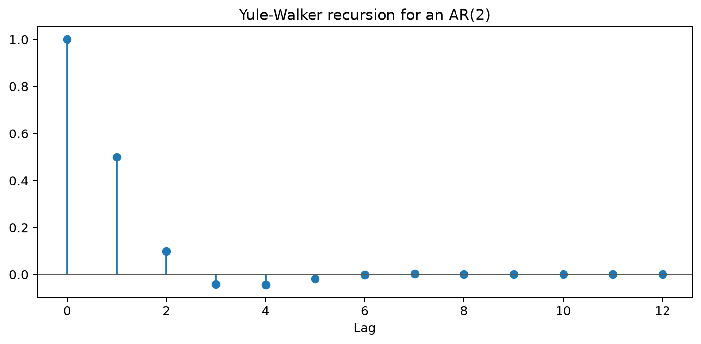

# Yule-Walker Equations

## Worked calculation: AR(2) autocorrelations

For an AR(2) with $\phi_1=0.6$ and $\phi_2=-0.2$, the first two Yule-Walker equations give

$$
\rho_1=\phi_1+\phi_2\rho_1
\quad\Longrightarrow\quad
\rho_1=\frac{0.6}{1-(-0.2)}=0.5,
$$

and

$$
\rho_2=\phi_1\rho_1+\phi_2
=0.6(0.5)-0.2=0.1.
$$

For later lags, use the recursion

$$
\rho_h=0.6\rho_{h-1}-0.2\rho_{h-2}.
$$

For example, $\rho_3=0.6(0.1)-0.2(0.5)=-0.04$. The equations turn AR coefficients into moment restrictions that can be checked against a sample ACF.

The **Yule-Walker equations** are a set of linear relationships that tie the **autocovariances/autocorrelations** of a *stationary* **autoregressive (AR $p$) process** to its parameters. They are the work-horse for parameter estimation, diagnostic checking, and theoretical analysis of AR models.

### Definition

First recall the *AR $p$* model itself

$$
\boxed{%
X_t = \phi_1 X_{t-1} + \phi_2 X_{t-2} + \dots + \phi_p X_{t-p} + Z_t,
\qquad 
Z_t \stackrel{\text{i.i.d.}}{\sim} \text{WN}\bigl(0,\sigma_Z^{2}\bigr)}
$$

where $Z_t$ is white noise.

Define the autocovariance function (ACVF) and autocorrelation function (ACF) by

$$
\gamma(k)=\mathrm{Cov}(X_t,X_{t-k}),\quad
\rho(k)=\frac{\gamma(k)}{\gamma(0)},\quad
k\in\mathbb{Z}
$$

**Yule-Walker system (covariance form, including variance equation)**

$$
\boxed{%
\gamma(k)=\sum_{j=1}^{p}\phi_j \gamma(k-j)}, 
\qquad k=1,2,\dots ,p
$$

$$
\boxed{%
\gamma(0)=\sum_{j=1}^{p}\phi_j \gamma(j)+\sigma_Z^{2}} \tag{\(*\)}
$$

Dividing every equation (except $\*$) by $\gamma(0)$ converts them to *autocorrelation form* —the version most frequently quoted:

$$
\boxed{%
\rho(k)=\sum_{j=1}^{p}\phi_j \rho(k-j)},
\qquad k=1,2,\dots ,p.
$$

Because $\rho(0)=1$, each equation involves only *observable* autocorrelations on the left and right sides.

### Deriving the Yule-Walker Equations

#### Assumptions

1. **Second-order stationarity** – mean and variance are constant; $\gamma(k)$ depends only on $k$.
2. **White-noise innovations** – $E[Z_t]=0,\quad \mathrm{Var}(Z_t)=\sigma_Z^2.$, and $Z_t$ is uncorrelated with $\{X_{t-k}\}_{k\ge1}$.

#### Derivation Steps

I. **Multiply by a lagged value.**

For a fixed $k\in\{1, 2, \ldots, p\}$,

$$X_t X_{t-k} = \sum_{j=1}^{p} \phi_j X_{t-j} X_{t-k} + Z_t X_{t-k}$$

II. **Take expectations.**

Using stationarity,

$$
E[X_t X_{t-k}]
= \sum_{j=1}^p \phi_j\,E[X_{t-j} X_{t-k}] + E[Z_t X_{t-k}]
$$

Because $Z_t$ is uncorrelated with past $X$’s, the final expectation vanishes for $k\ge1$.

III. **Replace expectations with autocovariances.**

$$\gamma(k)=\sum_{j=1}^{p}\phi_j \gamma(k-j), 
\qquad k=1, 2, \ldots, p$$

For $k=0$ the expectation $E[Z_tX_t]=\sigma_Z^{2}$ is non-zero, yielding equation $*$ above.

IV. **Normalize to autocorrelations.**

Divide by $\gamma(0)$ (the variance) whenever $\gamma(0)\neq0$ to obtain the autocorrelation version.

Matrix view (same equations in compact form):

Let

$$r = 
\begin{pmatrix}
\rho(1)\\
\rho(2)\\
\vdots\\
\rho(p)
\end{pmatrix}$$

known from the data.

Let

$$
R 
= \bigl[\rho(|i-j|)\bigr]_{i,j=1}^p
= \begin{pmatrix}
\rho(0)&\rho(1)&\cdots&\rho(p-1)\\
\rho(1)&\rho(0)&\cdots&\rho(p-2)\\
\vdots&\vdots&\vdots&\vdots\\
\rho(p-1)&\rho(p-2)&\cdots&\rho(0)
\end{pmatrix}$$

the Toeplitz matrix.

Finally, let

$$\phi = 
\begin{pmatrix}
\phi_1\\
\phi_2\\
\vdots\\
\phi_p
\end{pmatrix}$$

Then the Yule–Walker equations read

$$R,\phi = r$$

Solving this Toeplitz system (e.g. by Levinson–Durbin recursion) delivers the **Yule-Walker estimates** 

$$\hat{\phi}_j$$ 

and 

$$
\hat\sigma_Z^2 = \gamma(0) - \sum_{j=1}^p \hat\phi_j \gamma(j)
$$

### Example: Yule-Walker Equations for an AR(2) Process

We want to illustrate how the Yule-Walker equations connect an AR(2) model’s parameters to its (theoretical) autocovariance and autocorrelation functions.  Concretely, we will

1. **Check stationarity** of the given coefficient pair $(\phi\_1,\phi\_2)$ by inspecting the roots of $1-\phi\_1z-\phi\_2z^2=0$.
2. **Derive the first two Yule-Walker equations** and solve for $\gamma(1)$ and $\gamma(2)$.
3. **Convert to autocorrelations** $\rho(1)$ and $\rho(2)$ and comment on whether the results are admissible.
4. **Solve the homogeneous recurrence** $\rho(k)=\phi\_1\rho(k-1)+\phi\_2\rho(k-2)$ to obtain the closed-form $\rho(k)$.
5. **Contrast a non-stationary versus a stationary parameter set** so the difference is visible at a glance.

Input data — numbers we will plug in:

| Symbol            | Description             | Non-stationary run                                                         | Stationary check |
| ----------------- | ----------------------- | -------------------------------------------------------------------------- | ---------------- |
| $\phi\_1$       | AR coefficient on lag 1 | $3$                                                                      | $0.3$          |
| $\phi\_2$       | AR coefficient on lag 2 | $2$                                                                      | $0.2$          |
| $\sigma\_Z^{2}$ | Innovation variance     | kept symbolic (you can set $\sigma\_Z^{2}=1$ without loss of generality) | same             |

*Everything beyond this point uses these inputs unless stated otherwise.*

> **Warning on stationarity.**
> For an AR(2) model the coefficients must satisfy $1-\phi_1 z-\phi_2 z^{2}=0$ having both roots $|z|>1$ to be *stationary*.
> With $\phi_1=3,\phi_2=2$ **one root lies inside the unit circle**, so the model is *non-stationary* and its theoretical autocorrelation function (ACF) does not exist in the usual sense.
> We nevertheless go through the algebra to illustrate the mechanics of the Yule-Walker equations; the arithmetic is still correct even though the result is not a valid ACF.

#### Write down the model

$$
\boxed{%
X_t = 3X_{t-1} + 2X_{t-2} + Z_t}, 
\qquad 
Z_t\stackrel{\text{i.i.d.}}{\sim}\text{WN}\bigl(0,\sigma_Z^{2}\bigr).
$$

#### Derive the Yule-Walker equations

**(k = 1)**

$$
\boxed{%
\gamma(1)=3\gamma(0)+2\gamma(1)}
\quad\Longrightarrow\quad
(1-2)\gamma(1)=3\gamma(0)
\quad\Longrightarrow\quad
\boxed{\gamma(1)=-3\gamma(0)}.
$$

**(k = 2)**

$$
\boxed{%
\gamma(2)=3\gamma(1)+2\gamma(0)}
\quad\Longrightarrow\quad
\gamma(2)=3(-3\gamma(0))+2\gamma(0)
= -9\gamma(0)+2\gamma(0)
= \boxed{-7\gamma(0)}.
$$

#### Convert to autocorrelations

$$
\boxed{\rho(1)=\dfrac{\gamma(1)}{\gamma(0)}=-3},
\qquad
\boxed{\rho(2)=\dfrac{\gamma(2)}{\gamma(0)}=-7}.
$$

Because $|\rho(1)|>1$ (and similarly for $\rho(2)$), this confirms the earlier warning: the parameter pair $(3,2)$ produces a non-stationary AR(2) and hence impossible ACF values.

#### Solve the homogeneous difference equation

The Yule-Walker recursion for an AR(2) can be written as

$$
\boxed{\rho(k)=3\rho(k-1)+2\rho(k-2)}, \qquad k\ge2.
$$

Assume a solution $\rho(k)=\lambda^{k}$. Substituting gives

$$
\lambda^{2}=3\lambda+2
\quad\Longrightarrow\quad
\boxed{\lambda^{2}-3\lambda-2=0}.
$$

Solving the quadratic,

$$
\boxed{\lambda_{1,2}= \dfrac{3\pm\sqrt{17}}{2}}
\quad\bigl(\lambda_{1}\approx3.5616,\lambda_{2}\approx-0.5616\bigr).
$$

Hence the general form is

$$
\boxed{\rho(k)=c_{1}\lambda_{1}^{k}+c_{2}\lambda_{2}^{k}}.
$$

#### Determine $c_{1}$ and $c_{2}$

Using $\rho(0)=1$:

$$
\boxed{c_{1}+c_{2}=1}.
$$

Using the previously derived $\rho(1)=-3$:

$$
\boxed{c_{1}\lambda_{1}+c_{2}\lambda_{2}=-3}.
$$

Solving the two-equation system gives

$$
\boxed{%
c_{1}= \frac{-3-\lambda_{2}}{\lambda_{1}-\lambda_{2}},
\qquad
c_{2}=1-c_{1}
}.
$$

(Substituting numerical values, $c_{1}\approx-0.592,c_{2}\approx1.592$.)

Although these constants satisfy the recursion, the resulting $\rho(k)$ diverges because $|\lambda_{1}|>1$; again, the process is not stationary.

#### Quick check: a stationary alternative

For comparison, if we instead chose $\phi_1=0.3,\phi_2=0.2$ (both roots outside the unit circle), the same steps would yield

$$
\rho(1)=\frac{0.3}{1-0.2}=0.375,
\qquad
\rho(2)=0.3\rho(1)+0.2=0.3125,
$$

and the characteristic roots would both have magnitude $<1$, giving a decaying, admissible ACF.

#### Matrix form 

Vector of autocorrelations

$$
\mathbf{r}=
\begin{bmatrix}
\rho(1)\\\rho(2)\\\vdots\\\rho(p)
\end{bmatrix}, 
\qquad
\text{Toeplitz matrix }
R=
\begin{bmatrix}
1 & \rho(1) & \rho(2) & \dots & \rho(p-1)\\
\rho(1) & 1 & \rho(1) & \dots & \rho(p-2)\\
\vdots & \vdots & \vdots & \ddots & \vdots\\
\rho(p-1) & \rho(p-2) & \rho(p-3) & \dots & 1
\end{bmatrix}.
$$

$$
\boxed{R\boldsymbol{\phi}= \mathbf{r}},
\qquad
\boxed{\boldsymbol{\phi}=R^{-1}\mathbf{r}}.
$$

## Student guide: solve the equations and check the result

For a zero-mean stationary AR($p$), the autocovariances satisfy

$$
\gamma(k)=\phi_1\gamma(k-1)+\cdots+\phi_p\gamma(k-p)
\quad(k\ge p),
$$

with boundary equations for the first $p$ lags. Dividing by $\gamma(0)$ gives equations for autocorrelations.

### AR(2) by hand

For $\phi_1=0.6$ and $\phi_2=-0.2$:

$$
\rho_1=\phi_1+\phi_2\rho_1,
$$

so

$$
\rho_1=\frac{0.6}{1.2}=0.5.
$$

The next equation is

$$
\rho_2=\phi_1\rho_1+\phi_2
=0.6(0.5)-0.2=0.1.
$$

For lag 3:

$$
\rho_3=0.6(0.1)-0.2(0.5)=-0.04.
$$

The recursion then continues. A sample ACF will not equal these values exactly, but the pattern should be compatible with the fitted AR coefficients.

### Matrix form

For AR(2), define

$$
R=
\begin{bmatrix}
1&\rho_1\\
\rho_1&1
\end{bmatrix},
\qquad
r=
\begin{bmatrix}
\rho_1\\
\rho_2
\end{bmatrix}.
$$

Then the coefficient vector solves

$$
R
\begin{bmatrix}\phi_1\\\phi_2\end{bmatrix}
=
\begin{bmatrix}\rho_1\\\rho_2\end{bmatrix}.
$$

Using estimated autocorrelations makes the solution sensitive to sample noise and to the selected order. A high order can make $R$ ill-conditioned.

### Innovation variance

After estimating $\boldsymbol\phi$, the innovation variance can be related to the zero-lag variance:

$$
\sigma_\varepsilon^2
=\gamma(0)\left(1-\sum_{j=1}^p\phi_j\rho_j\right).
$$

For an AR(1) with $\phi=0.7$ and $\gamma(0)=1/(1-0.7^2)=1.9608$:

$$
\sigma_\varepsilon^2
=1.9608(1-0.7^2)=1.
$$

This recovers the innovation variance used in the simulation.

### When not to use Yule-Walker blindly

Yule-Walker equations assume a stationary AR structure. They are not a solution for:

- an untransformed random walk;
- an MA model with unobserved shocks;
- a series with a strong deterministic trend;
- a system with time-varying coefficients;
- a series whose covariance is dominated by a break.

Use them as a transparent estimator or starting value, then compare with likelihood estimates and residual diagnostics.

