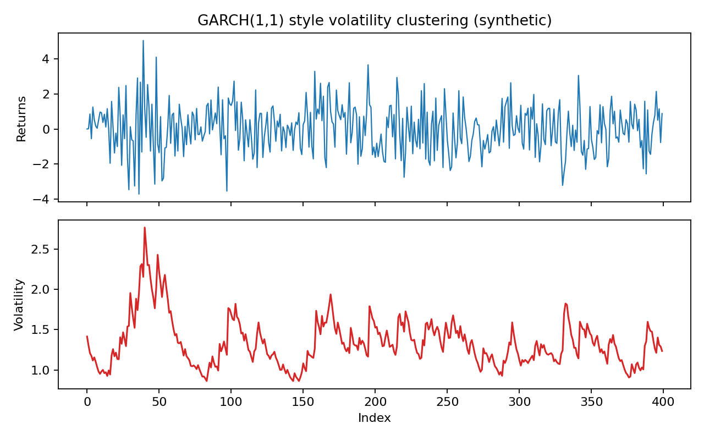

# Financial Time Series Models

Financial series (prices, returns, exchange rates) often look very different from the classical stationary Gaussian assumptions. Common features include:

- **Heavy tails** (extreme events occur more often than normal theory predicts).
- **Asymmetry** (returns can be skewed).
- **Volatility clustering** (large moves tend to follow large moves).
- **Serial dependence in variance**, even when raw returns have weak autocorrelation.

### Log Returns

If $P_t$ is the price at time $t$, the **log return** is:

$$
Z_t = \log(P_t) - \log(P_{t-1})
$$

Working with returns instead of prices often produces a more stable series for modeling.

### ARCH and GARCH

ARCH-type models describe changing variance over time by making variance depend on past shocks.

**ARCH($p$):**

$$
Z_t = \sqrt{h_t} \, \epsilon_t, \quad \epsilon_t \sim IID\,N(0,1)
$$

$$
h_t = \alpha_0 + \sum_{i=1}^{p} \alpha_i Z_{t-i}^2
$$

**GARCH($p, q$):**

$$
h_t = \alpha_0 + \sum_{i=1}^{p} \alpha_i Z_{t-i}^2 + \sum_{j=1}^{q} \beta_j h_{t-j}
$$

with $\alpha_0 > 0$ and $\alpha_i, \beta_j \ge 0$.

### Synthetic Volatility Example

The plot below shows a synthetic series with volatility clustering and the corresponding conditional volatility.

These models are foundational for risk management, option pricing, and measuring time-varying uncertainty in financial markets.
