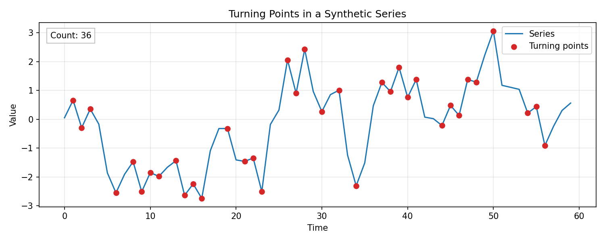

# Randomness and Trend Tests

When a series looks noisy, it is still useful to check whether the noise is **random** or whether weak structure (trend or dependence) is present. The tests below are lightweight diagnostics for an IID or weak-dependence null.

### Ljung-Box Q Test (Independence)

The **Ljung-Box** test checks whether a collection of autocorrelations is jointly zero:

$$
Q = n(n + 2) \sum_{k=1}^{m} \frac{\hat{r}_k^2}{n - k}
$$

where $\hat{r}_k$ is the sample autocorrelation at lag $k$, and $m$ is the maximum lag. Under the IID null, $Q$ is approximately $\chi^2_m$ (or $\chi^2_{m - p - q}$ when testing model residuals).

### McLeod-Li Test (Squared Series)

The **McLeod-Li** test applies the Ljung-Box statistic to **squared** data (or squared residuals) to detect conditional heteroskedasticity:

$$
Q_{\text{ML}} = n(n + 2) \sum_{k=1}^{m} \frac{\hat{r}_{k, \text{sq}}^2}{n - k}
$$

Significant autocorrelation in the squared series indicates volatility clustering and suggests ARCH/GARCH effects.

### Turning Point Test (IID vs. Not IID)

A **turning point** occurs at time $t$ if the series changes direction:

$$
(x_{t-1} < x_t > x_{t+1}) \quad \text{or} \quad (x_{t-1} > x_t < x_{t+1})
$$

Let $T$ be the number of turning points in a series of length $n$. For a continuous IID sequence:

$$
E[T] = \frac{2(n - 2)}{3}, \quad \text{Var}(T) = \frac{16n - 29}{90}
$$

A standardized score $(T - E[T]) / \sqrt{\text{Var}(T)}$ can be compared to a normal reference.

Turning points marked on a synthetic series:

### Difference-Sign Test (Randomness)

This test looks at the signs of successive differences:

$$
d_t = x_t - x_{t-1}, \quad t = 2, \ldots, n
$$

Let $s_t = \text{sign}(d_t) \in \{-1, +1\}$. Under a randomness assumption with a continuous distribution, the signs are approximately independent and equally likely.

One common version counts **sign changes** between adjacent differences:

$$
C = \sum_{t=3}^{n} I(s_t \neq s_{t-1})
$$

For $m = n - 1$ signs, there are $m - 1$ possible changes. Under the null:

- $E[C] \approx (n - 2) / 2$
- $\text{Var}(C) \approx (n - 2) / 4$

Large deviations from the expected number of sign changes suggest non-random structure (e.g., trend or negative dependence).

### Rank Test (Detecting Trend)

The rank test checks for a monotonic trend without assuming normality.

1. Replace the series values with their ranks $r_t$.
2. Compute **Spearman's rank correlation** between time $t$ and rank $r_t$:

$$
\rho_s = 1 - \frac{6 \sum_{t=1}^{n} (r_t - t)^2}{n(n^2 - 1)}
$$

If $\rho_s$ is far from zero, the series likely has a monotone trend. This test is robust to outliers and does not require a parametric model.

Because multiple tests are often applied together, the probability of at least one false positive increases. Treat these as screening tools and follow up with model-based diagnostics (ACF/PACF, unit root tests, or regression diagnostics).
