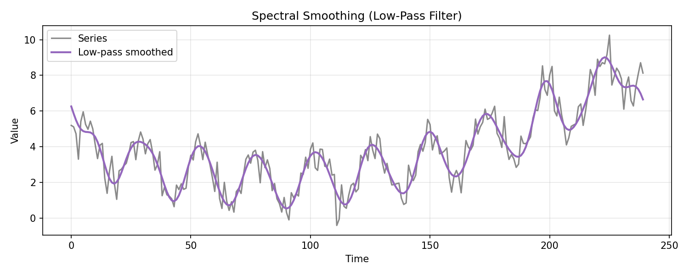
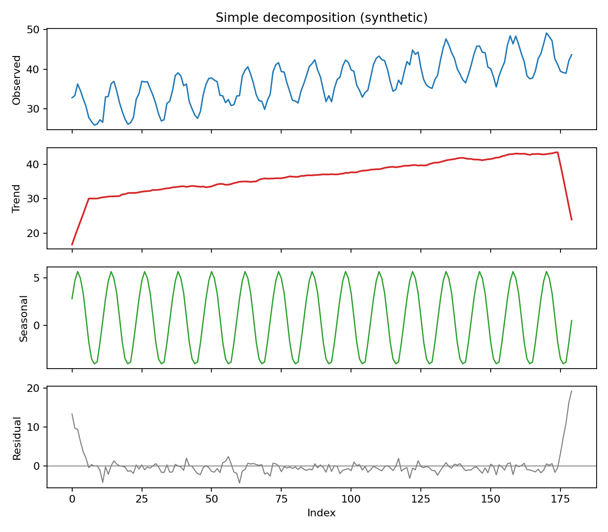
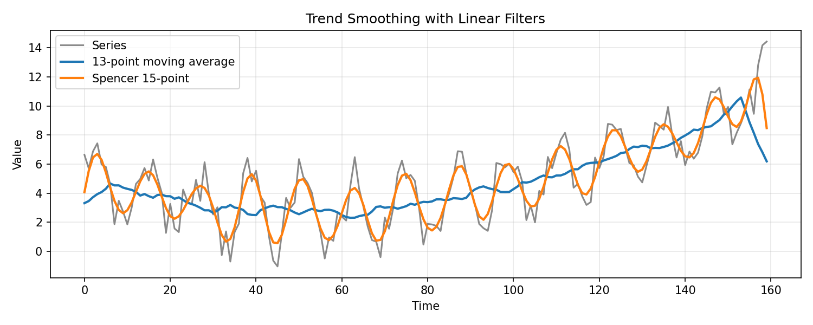
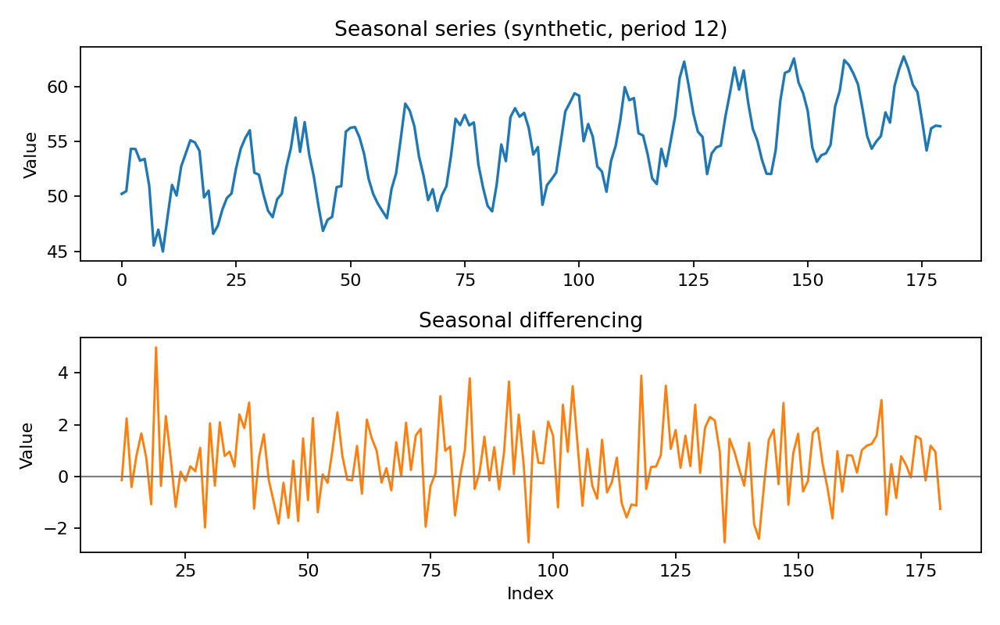

# Seasonality and Trends

**Seasonality** and **trends** are fundamental components in time series data that significantly impact analysis and forecasting. Understanding and correctly modeling these elements are useful for accurate predictions and effective time series modeling.

- Identifying **seasonality** is useful for adjusting forecasting models to account for predictable fluctuations.
- A time series can display **cyclical** patterns, which are longer-term fluctuations occurring over variable periods, often influenced by economic or environmental factors.
- Distinguishing between **cyclical** and seasonal patterns is necessary, as cycles lack fixed periodicity and are harder to model.
- **Randomness** represents unpredictable variations in a time series caused by noise, anomalies, or irregular external factors.
- **Trends** show long-term upward or downward movements in a time series, often reflecting broader changes such as technological advances or societal shifts.

### Seasonality

**Seasonality** refers to periodic fluctuations that repeat at regular intervals over time. These patterns are often driven by seasonal factors such as weather, holidays, or economic cycles.

#### Characteristics of Seasonality

- **Periodicity** means that seasonal patterns repeat at regular, fixed intervals, such as every day, week, month, or year. For example, daily energy usage often peaks in the evening, and retail sales rise every December.
- **Additive seasonality** occurs when the seasonal effect stays the same regardless of the data’s overall level. For instance, an ice cream shop might see an additional 100 sales every summer weekend, no matter how high or low the regular sales are.
- **Multiplicative seasonality** happens when the seasonal effect depends on the data’s level. For example, if a store’s summer sales are 20% higher than its regular sales, the increase will be larger when the baseline sales are higher.
- **Consistency** is a hallmark of seasonality. Seasonal patterns remain predictable over time, such as heating bills consistently peaking during winter months.
- **Influence of external factors** can affect seasonality. Events like holidays, weather, or school terms often create repeating patterns in data.

#### Examples of Seasonal Patterns

- Daily patterns, such as **electricity consumption**, often peak during specific times of day, like morning and evening hours.
- Weekly trends are seen in **retail sales**, which typically increase on weekends due to higher consumer activity.
- Monthly or quarterly patterns include **ice cream sales**, which tend to rise during the summer months in response to warmer weather.
- Annual cycles are observed in **tax filings**, which spike every April in many countries due to tax deadlines.

#### Decomposing Seasonality

To analyze and remove seasonality, a time series can be decomposed into three main components:

- The **trend component ($T_t$)** captures the long-term progression of the time series, representing its overall direction.
- The **seasonal component ($S_t$)** represents the repeating short-term patterns or cycles in the data, often tied to calendar-based events.
- The **residual component ($R_t$)** accounts for the irregular or random fluctuations not explained by the trend or seasonality.

Mathematically, for an additive model:

$$X_t = T_t + S_t + R_t$$

For a multiplicative model:

$$X_t = T_t \times S_t \times R_t$$

If seasonal or random fluctuations increase with the level of the series, apply a variance-stabilizing transform (often a log or Box-Cox transform) before decomposition.

##### Decomposition Methods

**I. Moving Average Method**

- The method estimates trends by smoothing data to reduce short-term fluctuations.
- A centered moving average is calculated using a window size matching the seasonal period.
- The trend component is obtained by averaging values within the defined window for each time point.
- The seasonal component is derived by subtracting the trend from the original data at each time point.
- Adjustments may be necessary if the series exhibits multiplicative seasonality by first log-transforming the data.

For an odd seasonal period $d = 2q + 1$:

$$
\hat{m}_t = \frac{1}{d} \sum_{j=-q}^{q} X_{t+j}
$$

For an even seasonal period $d = 2q$ (half-weight the endpoints):

$$
\hat{m}_t = \frac{0.5 X_{t-q} + \sum_{j=-q+1}^{q-1} X_{t+j} + 0.5 X_{t+q}}{d}
$$

These are examples of **linear filters**:

$$
\hat{m}_t = \sum_{j=-\infty}^{\infty} a_j X_{t-j}
$$

with weights $a_j$ that act as a low-pass filter, removing high-frequency noise while preserving slow trend movement.

**Spencer 15-point moving average** (passes polynomials up to degree 3 without distortion):

$$
\frac{1}{320}[-3, -6, -5, 3, 21, 46, 67, 74, 67, 46, 21, 3, -5, -6, -3]
$$

**II. Seasonal Decomposition of Time Series by Loess (STL)**

- STL is a method for decomposing time series data into trend, seasonal, and residual components.
- The technique uses local regression (loess) to estimate components over a flexible range of data points.
- It can handle additive or multiplicative seasonality depending on the problem context.
- The method is robust to outliers, reducing their impact on the estimated components.
- STL is effective for identifying and modeling complex and non-constant seasonal patterns.

**III. Additive vs. Multiplicative Decomposition**

- Additive decomposition assumes the series is composed of components added together: $X_t = T_t + S_t + R_t$.
- Multiplicative decomposition assumes components combine through multiplication: $X_t = T_t \times S_t \times R_t$.
- Choosing between models depends on the nature of the series, typically determined by visual inspection or transformations.

**IV. Additional Trend Smoothing Options**

- **Exponential smoothing**: $\hat{m}_t = \alpha X_t + (1 - \alpha) \hat{m}_{t-1}$, which downweights older observations.
- **Spectral (Fourier) smoothing**: remove high-frequency components in the Fourier domain to retain only low-frequency trend behavior.
- **Polynomial regression**: fit $m_t$ with a polynomial in $t$ (linear, quadratic, or higher) using least squares.

**V. Spectral Smoothing (Low-Pass Filtering)**

Spectral smoothing applies a **low-pass filter** by removing high-frequency components in the Fourier domain:

$$
X(\omega) = \sum_{t=0}^{n-1} X_t e^{-i 2\pi \omega t}
$$

Set $X(\omega) = 0$ for frequencies $|\omega| > \omega_c$, then invert the transform to recover a smoothed series. This keeps only slow oscillations and trend components.

Synthetic example of spectral smoothing:

#### Practical Decomposition Workflow

When both trend and seasonality are present, a common workflow is:

1. **Estimate the trend** using a moving average that spans one seasonal period.  
2. **Remove the trend** to isolate seasonal effects.  
3. **Estimate seasonal indices** by averaging detrended values by season.  
4. **Deseasonalize** by subtracting (additive) or dividing (multiplicative) the seasonal component.  
5. **Re-estimate the trend** from the deseasonalized series to refine the components.  

Synthetic example of a simple decomposition:

##### Classical Estimation (Trend + Seasonal)

Let $d$ be the seasonal period. First estimate the trend using a centered moving average (formulas above). For additive seasonality, compute the detrended series:

$$
Y_t = X_t - \hat{m}_t
$$

Estimate seasonal indices by averaging detrended values for each season:

$$
w_k = \text{average of } \\{ Y_{k + jd} \\}, \quad k = 1, \ldots, d
$$

Normalize the seasonal indices so they sum to zero:

$$
\hat{s}_k = w_k - \frac{1}{d} \sum_{i=1}^{d} w_i
$$

For multiplicative seasonality, use ratios $X_t / \hat{m}_t$ and normalize to have average 1.

Synthetic example of trend smoothing with two filters:

#### Differencing as an Alternative

Differencing removes trend and seasonal components without explicitly estimating them.

- **First differences** remove linear trend: $\nabla X_t = X_t - X_{t-1}$  
- **Seasonal differences** remove periodic effects: $\nabla_s X_t = X_t - X_{t-s}$  
- **Combined differencing** can remove both: $\nabla \nabla_s X_t$  

Operator notation:

$$
\nabla X_t = (1 - B)X_t, \quad B X_t = X_{t-1}, \quad B^j X_t = X_{t-j}
$$

Higher-order differences are defined recursively:

$$
\nabla^k X_t = \nabla(\nabla^{k-1} X_t), \quad \nabla^0 X_t = X_t
$$

Applying $\nabla^k$ to a polynomial trend of degree $k$ yields a constant. In practice, the required differencing order is usually small (often 1 or 2).

For a classical decomposition $X_t = m_t + s_t + Y_t$, a seasonal difference yields:

$$
\nabla_s X_t = (m_t - m_{t-s}) + (Y_t - Y_{t-s})
$$

and an additional nonseasonal difference can remove the remaining trend term.

Synthetic example of seasonal differencing:

### Trends

**Trend** refers to the long-term movement or direction in the time series data. Trends can be:

- **Upward trend** refers to a general increase in the time series values over time, indicating growth or improvement.  
- **Downward trend** represents a general decrease in the time series values over time, indicating decline or reduction.  
- **Stationary trend** occurs when there is no significant long-term movement in the series, and it fluctuates around a constant mean.

#### Identifying Trends

- **Visual inspection** involves plotting the time series data to observe the overall direction, such as upward, downward, or stationary trends.  
- **Statistical tests**, such as the Mann-Kendall trend test, are applied to formally detect the presence of trends in the time series.  
- **Autocorrelation function (ACF)** analysis shows a slow decay in autocorrelation, which suggests non-stationarity caused by the presence of a trend.  

#### Detrending Methods

Detrending involves removing trends from time series data to better analyze underlying patterns, such as seasonality or noise. Here are the key methods:

##### Differencing

Differencing removes trends by calculating the changes between consecutive data points. This highlights deviations from one observation to the next, helping to stabilize the mean of a time series.

I. **First-order Differencing**:

Measures the difference between consecutive observations:

$$Y_t = X_t - X_{t-1}$$

Removes linear trends. If the original data increases or decreases consistently over time, first-order differencing helps create a stationary series.

II. **Second-order Differencing**:

Calculates the difference of differences (applies differencing twice):

$$Y_t = (X_t - X_{t-1}) - (X_{t-1} - X_{t-2}) = X_t - 2X_{t-1} + X_{t-2}$$

Useful for removing more complex trends (e.g., quadratic trends). It is applied when first-order differencing isn’t sufficient to achieve stationarity.

##### Transformation

Transformations stabilize variance and make data more linear, especially when the data exhibits exponential growth or multiplicative trends.

I. **Logarithmic Transformation**:

Replaces each data point with its logarithm:

$$Y_t = \log(X_t)$$

- Reduces the impact of large values, making trends more linear and addressing heteroscedasticity (variance changing over time).
- Effective for datasets with exponential trends or data that grows multiplicatively.

##### Regression Modeling

Regression modeling involves fitting a mathematical function to the data to represent trends explicitly. The residuals (differences between observed values and the fitted trend) represent the detrended series.

I. **Linear Trend Model**:

Fits a straight line to the data:

$$X_t = \beta_0 + \beta_1 t + \epsilon_t$$

Models data with a simple linear trend. The coefficients ($\beta_0$, $\beta_1$) represent the intercept and slope of the trend, while $\epsilon_t$ captures the deviations (residuals).

II. **Nonlinear Trend Model**:

Fits a curve (e.g., quadratic or higher-order polynomial) to the data:

$$X_t = \beta_0 + \beta_1 t + \beta_2 t^2 + \epsilon_t$$

Captures more complex trends, such as accelerating or decelerating growth. Nonlinear models are used when trends cannot be approximated well by a straight line.

#### Visualization of Trends

- **Time series plot** provides a visual representation of the overall direction of the data over time, helping to identify trends and patterns.  
- **Detrended series plot** illustrates the data after the trend component is removed, making it easier to observe other elements such as seasonality or residual noise.

### Modeling Seasonality and Trends

**Modeling seasonality and trends** is critical for accurate forecasting by explicitly separating these components for analysis.

#### Seasonal ARIMA (SARIMA)

- **SARIMA models** extend ARIMA by incorporating seasonal terms to handle periodic patterns.
- The **SARIMA model equation** is given as:  

$$\Phi_P(B^s) \phi_p(B) (1 - B^s)^D (1 - B)^d X_t = \Theta_Q(B^s) \theta_q(B) \epsilon_t$$

- $\phi_p(B)$ represents the **non-seasonal AR polynomial** of order $p$.
- $\theta_q(B)$ represents the **non-seasonal MA polynomial** of order $q$.
- $\Phi_P(B^s)$ represents the **seasonal AR polynomial** of order $P$.
- $\Theta_Q(B^s)$ represents the **seasonal MA polynomial** of order $Q$.
- $D$ is the **seasonal differencing order** to account for periodic patterns.
- $d$ is the **non-seasonal differencing order** to address overall trends.
- $s$ is the **seasonal period**, such as 12 for monthly data with yearly seasonality.

#### Exponential Smoothing State Space Models (ETS)

- **ETS models** use weighted averages to smooth time series data, accounting for trends and seasonality.
- The **level component** ($L_t$) represents the baseline value of the series.
- The **trend component** ($T_t$) captures the direction and magnitude of changes over time.
- The **seasonal component** ($S_t$) accounts for recurring patterns within the data.

**Additive ETS models** apply when seasonal variations are constant, expressed as:  

$$X_t = L_t + T_t + S_t + \epsilon_t$$

**Multiplicative ETS models** apply when seasonal variations scale with the level, expressed as:  

$$X_t = L_t \cdot T_t \cdot S_t \cdot \epsilon_t$$

#### Seasonal Decomposition of Time Series (STL) Forecasting

- **STL decomposition** splits a series into **trend ($T_t$)**, **seasonal ($S_t$)**, and **residual ($R_t$)** components.
- The **decomposition step** isolates each component to allow for independent modeling.
- **Forecasting each component separately** ensures flexibility in handling non-linear trends and complex seasonality.
- The final forecast is obtained by **recombining components** as:  

$$\hat{X}_t = \hat{T}_t + \hat{S}_t + \hat{R}_t \quad \text{(additive)} \quad \text{or} \quad \hat{X}_t = \hat{T}_t \cdot \hat{S}_t \cdot \hat{R}_t \quad \text{(multiplicative)}$$

##### Example

To illustrate STL decomposition, we'll generate a synthetic time series dataset that exhibits clear seasonal patterns, trends, and some random noise. We'll then apply STL decomposition to this data and visualize the components.

This plot shows the original synthetic time series data, combining seasonal, trend, and noise components.

The original data exhibits an upward trend with clear seasonal fluctuations and some random noise. This visualization helps in understanding the overall structure and patterns in the time series.

By performing STL decomposition, we can separately analyze the trend, seasonal, and residual components, providing insights into the underlying structure of the time series data. This technique is particularly useful for identifying patterns and making more accurate forecasts.

**Seasonal Component**:

- The plot description shows the **seasonal fluctuations** in the data, which repeat annually.
- It shows **repeating yearly pattern**, demonstrating the synthetic seasonal effect added to the data, and shows how the values fluctuate within each year.

**Trend Component**:

- The plot description represents the **long-term progression** of the data over the entire period.
- It reveals a clear **upward trajectory**, indicating a consistent increase in the data over time, which aligns with the linear trend added to the synthetic data.

**Residual Component**:

- The plot description displays the residuals, showing the **remaining variations** in the data after removing the trend and seasonal components.
- The residual component reflects **random noise**. Ideally, it shows no discernible pattern, suggesting that the trend and seasonality have been effectively removed, with residuals randomly distributed around zero, confirming that the decomposition has captured the main patterns in the data.
